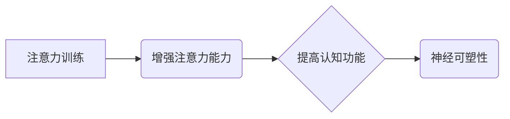

                 

## 1. 背景介绍

在当今信息爆炸的时代，注意力已成为至关重要的认知能力。我们每天都被来自各种渠道的信息轰炸，如何有效地集中注意力，过滤无关信息，并专注于重要任务，直接关系到我们的学习效率、工作成果以及生活质量。然而，现代社会节奏快，压力大，人们的注意力持续时间越来越短，注意力缺陷问题日益突出。

注意力训练旨在通过特定的练习和方法，增强大脑的注意力能力，提高专注力、记忆力、执行功能等认知能力。近年来，注意力训练的研究和应用蓬勃发展，越来越多的证据表明，注意力训练可以有效改善注意力缺陷，提升认知功能，甚至改变大脑结构和功能。

## 2. 核心概念与联系

### 2.1 注意力机制

注意力机制是神经网络中模拟人类注意力机制的关键技术。它允许模型在处理信息时，对某些信息给予更多的关注，而忽略其他信息，从而提高信息处理效率和准确性。

### 2.2 神经可塑性

神经可塑性是指大脑神经元连接和功能在学习和经验中不断变化的能力。注意力训练通过改变大脑神经元连接和活动模式，从而增强注意力能力和认知功能。

**注意力训练与大脑增强关系图**



## 3. 核心算法原理 & 具体操作步骤

### 3.1 算法原理概述

注意力训练算法通常基于深度学习模型，例如循环神经网络（RNN）或卷积神经网络（CNN）。这些模型通过训练，学习识别和提取注意力相关的特征，并根据这些特征调整模型的注意力权重，从而实现对信息的有效关注。

### 3.2 算法步骤详解

1. **数据收集和预处理:** 收集注意力训练数据，例如文本、图像、音频等，并进行预处理，例如文本分词、图像裁剪等。
2. **模型构建:** 选择合适的深度学习模型，例如RNN或CNN，并根据任务需求进行调整。
3. **模型训练:** 使用训练数据训练模型，通过反向传播算法优化模型参数，使模型能够有效地识别和提取注意力相关的特征。
4. **模型评估:** 使用测试数据评估模型的性能，例如准确率、召回率等。
5. **模型部署:** 将训练好的模型部署到实际应用场景中，例如注意力训练应用程序、认知增强设备等。

### 3.3 算法优缺点

**优点:**

* **高精度:** 深度学习模型能够学习到复杂的注意力模式，实现高精度的注意力训练。
* **可扩展性:** 深度学习模型可以处理大规模的数据，并可以扩展到不同的应用场景。
* **自动化:** 训练和部署深度学习模型可以自动化，降低人工成本。

**缺点:**

* **数据依赖:** 深度学习模型需要大量的训练数据，否则性能会下降。
* **计算资源:** 训练深度学习模型需要大量的计算资源，例如GPU。
* **黑盒效应:** 深度学习模型的内部工作机制难以理解，难以解释模型的决策结果。

### 3.4 算法应用领域

注意力训练算法在以下领域有广泛的应用:

* **教育:** 提高学生的注意力和学习效率。
* **医疗:** 治疗注意力缺陷多动障碍（ADHD）等注意力问题。
* **游戏:** 增强游戏玩家的反应速度和决策能力。
* **人机交互:** 提高人机交互的自然性和流畅度。

## 4. 数学模型和公式 & 详细讲解 & 举例说明

### 4.1 数学模型构建

注意力机制通常使用一个注意力权重来表示模型对不同输入元素的关注程度。注意力权重可以由一个可学习的参数矩阵计算得到。

假设输入序列为 $X = \{x_1, x_2, ..., x_n\}$，输出序列为 $Y = \{y_1, y_2, ..., y_m\}$，则注意力权重 $a_{ij}$ 表示模型对输入元素 $x_i$ 对输出元素 $y_j$ 的关注程度。

### 4.2 公式推导过程

注意力权重 $a_{ij}$ 可以通过以下公式计算得到：

$$a_{ij} = \frac{exp(e_{ij})}{\sum_{k=1}^{n} exp(e_{ik})}$$

其中， $e_{ij}$ 是一个标量值，表示模型对输入元素 $x_i$ 对输出元素 $y_j$ 的相关性。

相关性 $e_{ij}$ 可以通过以下公式计算得到：

$$e_{ij} = f(x_i, y_j)$$

其中， $f$ 是一个函数，例如点积或多层感知机，用于计算输入元素 $x_i$ 和输出元素 $y_j$ 的相关性。

### 4.3 案例分析与讲解

例如，在机器翻译任务中，注意力机制可以帮助模型关注源语言句子中与目标语言句子相关的重要词语，从而提高翻译的准确性。

## 5. 项目实践：代码实例和详细解释说明

### 5.1 开发环境搭建

* Python 3.6+
* TensorFlow 或 PyTorch 深度学习框架
* Jupyter Notebook 或 VS Code 代码编辑器

### 5.2 源代码详细实现

```python
import tensorflow as tf

# 定义注意力机制
def attention_layer(inputs, attention_weights):
  # 使用注意力权重对输入进行加权求和
  context_vector = tf.matmul(attention_weights, inputs)
  return context_vector

# 定义模型
class AttentionModel(tf.keras.Model):
  def __init__(self, input_dim, hidden_dim, output_dim):
    super(AttentionModel, self).__init__()
    self.embedding = tf.keras.layers.Embedding(input_dim, hidden_dim)
    self.lstm = tf.keras.layers.LSTM(hidden_dim)
    self.attention = attention_layer
    self.dense = tf.keras.layers.Dense(output_dim)

  def call(self, inputs):
    # 将输入嵌入到隐藏空间
    embedded_inputs = self.embedding(inputs)
    # 使用 LSTM 处理嵌入后的输入
    lstm_outputs = self.lstm(embedded_inputs)
    # 使用注意力机制计算上下文向量
    context_vector = self.attention(lstm_outputs, attention_weights)
    # 将上下文向量输入到全连接层
    outputs = self.dense(context_vector)
    return outputs

# 实例化模型
model = AttentionModel(input_dim=10000, hidden_dim=128, output_dim=5)

# 训练模型
model.compile(optimizer='adam', loss='categorical_crossentropy', metrics=['accuracy'])
model.fit(x_train, y_train, epochs=10)

```

### 5.3 代码解读与分析

* 代码首先定义了一个注意力层，该层使用注意力权重对输入进行加权求和。
* 然后定义了一个注意力模型，该模型包含嵌入层、LSTM层、注意力层和全连接层。
* 模型训练使用 Adam 优化器，交叉熵损失函数和准确率指标。

### 5.4 运行结果展示

训练完成后，可以将模型应用于实际任务中，例如文本分类、机器翻译等。

## 6. 实际应用场景

### 6.1 教育领域

注意力训练应用程序可以帮助学生提高专注力，增强学习效率。例如，一些应用程序可以提供专注力训练游戏，帮助学生练习集中注意力，提高抗干扰能力。

### 6.2 医疗领域

注意力训练可以用于治疗注意力缺陷多动障碍（ADHD）等注意力问题。通过特定的注意力训练程序，可以帮助患者改善注意力、记忆力和执行功能。

### 6.3 游戏领域

注意力训练可以增强游戏玩家的反应速度和决策能力。一些游戏设计会融入注意力训练元素，例如需要玩家快速识别目标物体或做出快速反应的挑战，从而提高玩家的注意力和反应能力。

### 6.4 未来应用展望

注意力训练技术在未来将有更广泛的应用，例如：

* **个性化学习:** 根据学生的注意力特点，提供个性化的学习方案。
* **远程医疗:** 通过远程注意力训练，帮助患者改善注意力问题。
* **增强现实:** 在增强现实场景中，注意力训练可以帮助用户更好地与虚拟环境交互。

## 7. 工具和资源推荐

### 7.1 学习资源推荐

* **书籍:**
    * 《深度学习》
    * 《注意力机制》
* **在线课程:**
    * Coursera: 深度学习
    * Udacity: 自然语言处理

### 7.2 开发工具推荐

* **TensorFlow:** 开源深度学习框架
* **PyTorch:** 开源深度学习框架
* **Jupyter Notebook:** 代码编辑器和交互式笔记本

### 7.3 相关论文推荐

* **Attention Is All You Need:** https://arxiv.org/abs/1706.03762
* **BERT: Pre-training of Deep Bidirectional Transformers for Language Understanding:** https://arxiv.org/abs/1810.04805

## 8. 总结：未来发展趋势与挑战

### 8.1 研究成果总结

注意力训练技术取得了显著的进展，有效地提高了注意力能力和认知功能。

### 8.2 未来发展趋势

* **更精准的注意力训练:** 开发更精准的注意力训练算法，针对不同个体和不同任务的需求进行个性化训练。
* **跨模态注意力训练:** 将注意力机制应用于多模态数据，例如文本、图像、音频等，实现跨模态的注意力训练。
* **脑机接口与注意力训练:** 将脑机接口技术与注意力训练相结合，实现对大脑活动的可视化和控制，从而更有效地训练注意力。

### 8.3 面临的挑战

* **数据获取和标注:** 高质量的注意力训练数据难以获取和标注，这限制了算法的训练和性能提升。
* **模型解释性和可信度:** 深度学习模型的内部工作机制难以理解，这降低了模型的解释性和可信度。
* **伦理和安全问题:** 注意力训练技术可能被滥用，例如用于操控用户行为或窃取个人信息，因此需要关注伦理和安全问题。

### 8.4 研究展望

未来，注意力训练技术将继续发展，并应用于更广泛的领域，为人们的生活和工作带来更多便利和益处。


## 9. 附录：常见问题与解答

### 9.1  注意力训练真的有效吗？

越来越多的研究表明，注意力训练可以有效改善注意力缺陷，提升认知功能。

### 9.2 注意力训练需要多长时间才能看到效果？

注意力训练的效果因人而异，一般需要持续练习一段时间才能看到明显的效果。

### 9.3 注意力训练适合所有人吗？

注意力训练可以帮助大多数人提高注意力能力，但对于一些特定人群，例如患有严重注意力缺陷障碍的人，可能需要专业的医疗指导。


作者：禅与计算机程序设计艺术 / Zen and the Art of Computer Programming 
<end_of_turn>

