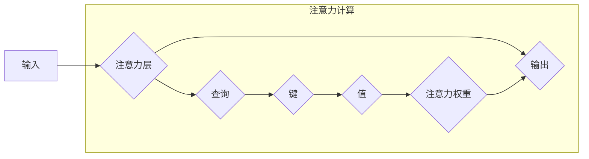

                 

## 1. 背景介绍

在当今信息爆炸的时代，我们被来自各个方向的刺激所包围。手机、电脑、社交媒体无时无刻不在提醒我们，注意力也被不断地分割和分散。这种持续的注意力缺失，不仅影响了我们的工作效率和学习效果，更会导致焦虑、抑郁、情绪波动等心理健康问题。

越来越多的研究表明，注意力是认知功能的核心，它与我们的情绪、思维、行为和整体幸福感息息相关。提高注意力能力，可以帮助我们更好地应对压力，提升情绪稳定性，增强自我控制力，最终实现心理健康和幸福感。

## 2. 核心概念与联系

### 2.1 注意力训练与认知疗法

注意力训练和认知疗法都是旨在改善心理健康和幸福感的有效方法。

* **注意力训练**是指通过一系列练习和训练，增强个体对特定刺激的关注能力，提高专注力、集中力、抗干扰能力等。
* **认知疗法**则侧重于改变负面思维模式和认知偏差，帮助个体更好地理解和应对情绪问题，从而改善心理健康状态。

两者看似不同，但实际上存在着密切的联系。注意力训练可以增强个体对自身情绪和想法的觉察能力，为认知疗法的实施提供基础。而认知疗法可以帮助个体识别和改变导致注意力分散的负面思维模式，从而提高注意力训练的效果。

### 2.2 注意力机制与神经网络

从神经科学的角度来看，注意力是一个复杂的神经过程，涉及到大脑多个区域的协同工作。

* **前额叶皮层**负责计划、决策和执行控制，在调节注意力方面起着关键作用。
* **顶叶皮层**参与空间感知和注意力定向。
* **后顶叶皮层**处理视觉信息，与视觉注意力的形成有关。

注意力机制在深度学习领域也得到了广泛应用。

**注意力机制原理图**



注意力机制可以学习到输入数据中哪些部分与目标任务更相关，并对这些部分给予更高的关注权重，从而提高模型的性能。

## 3. 核心算法原理 & 具体操作步骤

### 3.1 算法原理概述

注意力机制的核心思想是通过学习一个注意力权重来分配不同输入元素的关注度。

注意力权重可以看作是对每个输入元素的重要性的一种度量，权重越高，表示该元素对目标任务越重要，模型会给予它更多的关注。

### 3.2 算法步骤详解

1. **计算注意力权重:**

   使用查询向量、键向量和值向量来计算每个输入元素的注意力权重。

   查询向量通常是模型当前状态的表示，键向量和值向量则来自输入数据。

   注意力权重通常通过一个注意力函数计算，例如Scaled Dot-Product Attention。

2. **加权求和:**

   将注意力权重与值向量相乘，然后对结果进行求和，得到一个加权后的输出向量。

   这个加权后的输出向量包含了输入数据中所有元素的信息，但重点关注了那些具有较高注意力权重的元素。

3. **输出:**

   将加权后的输出向量作为模型的输出，用于后续的预测或决策。

### 3.3 算法优缺点

**优点:**

* 可以学习到输入数据中哪些部分与目标任务更相关，提高模型的性能。
* 可以处理长序列数据，例如文本和音频。
* 可以解释模型的决策过程，提高模型的可解释性。

**缺点:**

* 计算复杂度较高，训练时间较长。
* 需要大量的训练数据才能达到最佳效果。

### 3.4 算法应用领域

注意力机制在自然语言处理、计算机视觉、语音识别等领域得到了广泛应用。

* **机器翻译:** 使用注意力机制可以更好地理解源语言和目标语言之间的语义关系，提高翻译质量。
* **文本摘要:** 使用注意力机制可以识别文本中最关键的信息，生成更准确的摘要。
* **图像识别:** 使用注意力机制可以关注图像中最相关的区域，提高识别准确率。

## 4. 数学模型和公式 & 详细讲解 & 举例说明

### 4.1 数学模型构建

注意力机制的数学模型可以概括为以下公式：

$$
\text{Attention}(Q, K, V) = \text{softmax}\left(\frac{Q K^T}{\sqrt{d_k}}\right) V
$$

其中：

* $Q$：查询向量
* $K$：键向量
* $V$：值向量
* $d_k$：键向量的维度
* $\text{softmax}$：softmax函数，用于将注意力权重归一化到[0, 1]之间。

### 4.2 公式推导过程

注意力权重计算公式的推导过程如下：

1. 计算查询向量 $Q$ 和键向量 $K$ 的点积：

$$
QK^T
$$

2. 对点积结果进行缩放，以防止梯度爆炸：

$$
\frac{QK^T}{\sqrt{d_k}}
$$

3. 应用softmax函数对缩放后的结果进行归一化，得到注意力权重：

$$
\text{softmax}\left(\frac{QK^T}{\sqrt{d_k}}\right)
$$

4. 将注意力权重与值向量 $V$ 相乘，并对结果进行求和，得到加权后的输出向量：

$$
\text{Attention}(Q, K, V) = \text{softmax}\left(\frac{QK^T}{\sqrt{d_k}}\right) V
$$

### 4.3 案例分析与讲解

假设我们有一个句子 "The cat sat on the mat"，我们想使用注意力机制来识别句子中与单词 "sat" 最相关的单词。

我们可以将每个单词作为键向量和值向量，并将 "sat" 作为查询向量。

然后，我们可以使用上述公式计算每个单词的注意力权重，并观察权重最高的单词。

在大多数情况下，权重最高的单词应该是 "cat"，因为 "cat" 是 "sat" 的主语，与 "sat" 的语义关系最为密切。

## 5. 项目实践：代码实例和详细解释说明

### 5.1 开发环境搭建

为了实现注意力机制，我们可以使用 Python 和 TensorFlow 或 PyTorch 等深度学习框架。

需要安装 Python、TensorFlow 或 PyTorch 以及相关的库，例如 NumPy 和 Matplotlib。

### 5.2 源代码详细实现

以下是一个使用 TensorFlow 实现简单注意力机制的代码示例：

```python
import tensorflow as tf

# 定义查询向量、键向量和值向量
query = tf.constant([[1, 2, 3]])
key = tf.constant([[4, 5, 6], [7, 8, 9]])
value = tf.constant([[10, 11, 12], [13, 14, 15]])

# 计算注意力权重
attention_weights = tf.matmul(query, key, transpose_b=True) / tf.math.sqrt(key.shape[-1])
attention_weights = tf.nn.softmax(attention_weights, axis=-1)

# 加权求和
output = tf.matmul(attention_weights, value)

# 打印输出
print(output)
```

### 5.3 代码解读与分析

这段代码首先定义了查询向量、键向量和值向量。

然后，它计算了注意力权重，并使用 softmax 函数将其归一化到 [0, 1] 之间。

最后，它将注意力权重与值向量相乘，并对结果进行求和，得到加权后的输出向量。

### 5.4 运行结果展示

运行这段代码后，会输出一个加权后的输出向量，该向量包含了输入数据中所有元素的信息，但重点关注了与查询向量 "sat" 最相关的元素。

## 6. 实际应用场景

### 6.1  注意力训练与认知疗法结合

注意力训练和认知疗法可以相互补充，共同改善心理健康和幸福感。

例如，可以通过冥想、正念练习等注意力训练方法，帮助个体提高对自身情绪和想法的觉察能力，为认知疗法的实施提供基础。

认知疗法可以帮助个体识别和改变导致注意力分散的负面思维模式，从而提高注意力训练的效果。

### 6.2  注意力训练应用于教育

注意力训练可以帮助学生提高学习效率和成绩。

例如，可以通过游戏化学习、番茄工作法等方法，帮助学生增强专注力、集中力、抗干扰能力等。

### 6.3  注意力训练应用于工作

注意力训练可以帮助职场人士提高工作效率和创造力。

例如，可以通过番茄工作法、深度工作法等方法，帮助职场人士专注于重要任务，减少分心和拖延。

### 6.4  未来应用展望

随着人工智能技术的不断发展，注意力机制将在更多领域得到应用。

例如，可以用于个性化教育、精准医疗、智能客服等领域。

## 7. 工具和资源推荐

### 7.1 学习资源推荐

* **书籍:**

    * 《深度学习》
    * 《Attention Is All You Need》
    * 《深度学习与自然语言处理》

* **在线课程:**

    * Coursera: 深度学习
    * Udacity: 自然语言处理
    * fast.ai: 深度学习

### 7.2 开发工具推荐

* **TensorFlow:** 开源深度学习框架
* **PyTorch:** 开源深度学习框架
* **Keras:** 高级深度学习 API

### 7.3 相关论文推荐

* 《Attention Is All You Need》
* 《BERT: Pre-training of Deep Bidirectional Transformers for Language Understanding》
* 《Transformer-XL: Attentive Language Models Beyond a Fixed-Length Context》

## 8. 总结：未来发展趋势与挑战

### 8.1 研究成果总结

注意力机制在近年来取得了显著的进展，并在自然语言处理、计算机视觉等领域取得了突破性成果。

### 8.2 未来发展趋势

未来，注意力机制的研究将朝着以下几个方向发展：

* **更有效的注意力机制:** 研究更有效的注意力机制，提高模型的性能和效率。
* **跨模态注意力机制:** 研究跨模态注意力机制，能够处理不同模态的数据，例如文本、图像、音频等。
* **可解释性注意力机制:** 研究可解释性注意力机制，能够解释模型的决策过程，提高模型的可理解性和可信任性。

### 8.3 面临的挑战

注意力机制也面临着一些挑战：

* **计算复杂度:** 传统的注意力机制计算复杂度较高，难以应用于大规模数据。
* **参数量:** 某些注意力机制模型参数量较大，需要大量的计算资源进行训练。
* **可解释性:** 某些注意力机制模型的决策过程难以解释，难以理解模型是如何工作的。

### 8.4 研究展望

尽管面临着挑战，但注意力机制仍然是一个非常有前景的研究方向。

未来，随着人工智能技术的不断发展，注意力机制将发挥越来越重要的作用，并在更多领域得到应用。

## 9. 附录：常见问题与解答

### 9.1 什么是注意力机制？

注意力机制是一种模仿人类注意力机制的机器学习技术，它能够帮助模型专注于输入数据中与目标任务最相关的部分。

### 9.2 注意力机制的应用场景有哪些？

注意力机制在自然语言处理、计算机视觉、语音识别等领域得到了广泛应用。

### 9.3 注意力机制的优缺点是什么？

注意力机制的优点是能够学习到输入数据中哪些部分与目标任务最相关，提高模型的性能。

缺点是计算复杂度较高，需要大量的训练数据才能达到最佳效果。


作者：禅与计算机程序设计艺术 / Zen and the Art of Computer Programming 
<end_of_turn>

