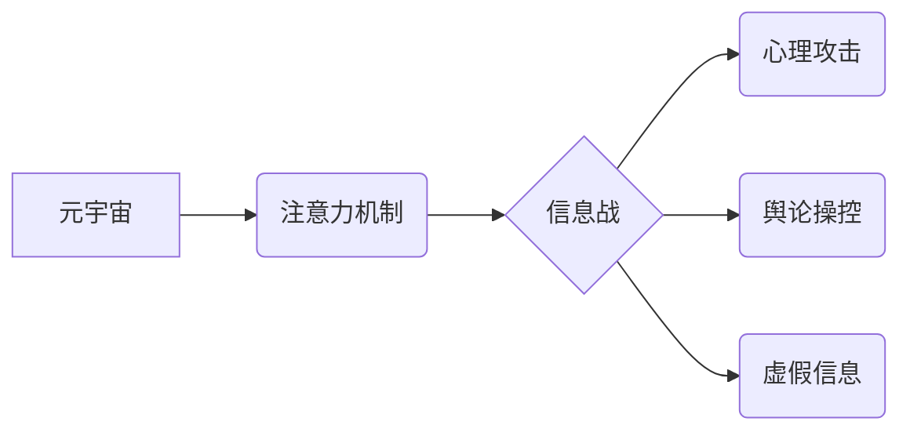

                 

## 注意力黑客：元宇宙时代的信息战

> 关键词：元宇宙、注意力、信息战、深度学习、神经网络、可解释性、伦理

## 1. 背景介绍

元宇宙概念的兴起，标志着人类进入一个全新的数字世界。这个虚拟世界将融合现实世界中的社交、娱乐、工作等多种场景，并通过沉浸式体验、虚拟身份和虚拟经济等特性，为用户提供前所未有的互动和体验。然而，元宇宙的魅力之下，潜藏着巨大的信息安全和伦理挑战。

注意力，作为人类认知的核心能力，在元宇宙中显得尤为重要。用户在元宇宙中需要集中注意力才能有效地参与互动、获取信息和完成任务。然而，元宇宙环境中充斥着各种信息和刺激，容易导致用户注意力分散，甚至被恶意操控。

信息战，即利用信息手段进行心理、舆论和政治斗争，在元宇宙时代将更加复杂和隐蔽。攻击者可以利用元宇宙的沉浸式体验和虚拟身份，制造虚假信息、操控用户情绪，甚至进行心理攻击。

## 2. 核心概念与联系

### 2.1 元宇宙

元宇宙是一个由虚拟现实、增强现实和互联网技术融合而成的虚拟世界，其特点包括：

* **沉浸式体验:** 通过VR/AR技术，用户可以身临其境地体验虚拟世界。
* **虚拟身份:** 用户在元宇宙中拥有虚拟身份，可以自由地创建和定制自己的形象和属性。
* **虚拟经济:** 元宇宙拥有自己的经济体系，用户可以通过虚拟货币进行交易和消费。
* **持久性:** 元宇宙是一个持续运行的虚拟世界，用户可以随时随地进入和退出。
* **去中心化:** 元宇宙的开发和运营由多个参与者共同完成，而不是由单一实体控制。

### 2.2 注意力机制

注意力机制是深度学习领域的重要发展，它能够帮助模型学习到输入数据中最重要的信息，从而提高模型的性能。注意力机制的核心思想是，在处理输入数据时，模型会根据数据的不同重要性分配不同的权重，从而对重要信息进行重点关注。

### 2.3 信息战

信息战是指利用信息手段进行心理、舆论和政治斗争。在元宇宙时代，信息战将更加复杂和隐蔽，攻击者可以利用元宇宙的沉浸式体验和虚拟身份，制造虚假信息、操控用户情绪，甚至进行心理攻击。

**核心概念关系图:**



## 3. 核心算法原理 & 具体操作步骤

### 3.1 算法原理概述

注意力机制的核心算法原理是通过一个注意力权重来分配输入数据的不同重要性。注意力权重可以是通过学习得到的，也可以是人为指定的。

### 3.2 算法步骤详解

1. **输入数据:** 将输入数据（例如文本、图像）转换为模型可以理解的格式。
2. **编码器:** 使用编码器网络将输入数据编码成一个固定长度的向量表示。
3. **注意力计算:** 计算每个输入数据元素与输出向量的注意力权重。
4. **加权求和:** 将注意力权重与编码器输出向量相乘，并求和得到最终的输出向量。
5. **解码器:** 使用解码器网络将输出向量解码成最终的输出结果（例如文本、图像）。

### 3.3 算法优缺点

**优点:**

* 可以学习到输入数据中最重要的信息，提高模型的性能。
* 可以处理长序列数据，例如文本和音频。
* 可以解释模型的决策过程，提高模型的可解释性。

**缺点:**

* 计算复杂度较高，训练时间较长。
* 需要大量的训练数据才能达到最佳性能。
* 容易受到噪声数据的影响。

### 3.4 算法应用领域

注意力机制在自然语言处理、计算机视觉、语音识别等领域都有广泛的应用。例如，在机器翻译中，注意力机制可以帮助模型更好地理解句子结构和语义关系，从而提高翻译质量。在图像识别中，注意力机制可以帮助模型关注图像中最重要的区域，从而提高识别准确率。

## 4. 数学模型和公式 & 详细讲解 & 举例说明

### 4.1 数学模型构建

注意力机制的数学模型可以表示为以下公式：

$$
\text{Attention}(Q, K, V) = \text{softmax}\left(\frac{Q K^T}{\sqrt{d_k}}\right) V
$$

其中：

* $Q$：查询向量
* $K$：键向量
* $V$：值向量
* $d_k$：键向量的维度
* $\text{softmax}$：softmax函数，用于将注意力权重归一化

### 4.2 公式推导过程

注意力机制的公式推导过程可以分为以下几个步骤：

1. 计算查询向量 $Q$ 与键向量 $K$ 的点积，即 $QK^T$。
2. 将点积结果除以 $\sqrt{d_k}$，以规范化向量长度。
3. 应用 softmax 函数对点积结果进行归一化，得到注意力权重矩阵。
4. 将注意力权重矩阵与值向量 $V$ 相乘，得到最终的输出向量。

### 4.3 案例分析与讲解

假设我们有一个句子 "The cat sat on the mat"，我们想要使用注意力机制来计算每个单词对句子整体含义的贡献。

1. 将句子中的每个单词编码成一个向量表示，作为查询向量 $Q$、键向量 $K$ 和值向量 $V$。
2. 计算每个单词的注意力权重，即每个单词对句子整体含义的贡献度。
3. 将注意力权重与每个单词的向量表示相乘，得到最终的句子表示。

通过分析注意力权重，我们可以发现哪些单词对句子含义更重要，例如 "cat" 和 "sat" 可能会获得更高的注意力权重。

## 5. 项目实践：代码实例和详细解释说明

### 5.1 开发环境搭建

为了实现注意力机制，我们可以使用 Python 语言和 TensorFlow 或 PyTorch 深度学习框架。

### 5.2 源代码详细实现

```python
import tensorflow as tf

# 定义注意力机制层
class AttentionLayer(tf.keras.layers.Layer):
    def __init__(self, units):
        super(AttentionLayer, self).__init__()
        self.Wq = tf.keras.layers.Dense(units)
        self.Wk = tf.keras.layers.Dense(units)
        self.Wv = tf.keras.layers.Dense(units)
        self.fc = tf.keras.layers.Dense(units)

    def call(self, inputs):
        Q = self.Wq(inputs)
        K = self.Wk(inputs)
        V = self.Wv(inputs)
        attention_weights = tf.matmul(Q, K, transpose_b=True) / tf.math.sqrt(tf.cast(tf.shape(Q)[-1], tf.float32))
        attention_weights = tf.nn.softmax(attention_weights, axis=-1)
        output = tf.matmul(attention_weights, V)
        return output

# 实例化注意力机制层
attention_layer = AttentionLayer(units=128)

# 输入数据
inputs = tf.random.normal(shape=(1, 10, 512))

# 通过注意力机制层进行处理
outputs = attention_layer(inputs)

# 打印输出结果
print(outputs.shape)
```

### 5.3 代码解读与分析

这段代码定义了一个注意力机制层，并使用 TensorFlow 库实现了注意力机制的计算过程。

* `AttentionLayer` 类定义了注意力机制层的结构，包括查询向量、键向量、值向量和注意力权重计算过程。
* `call` 方法实现了注意力机制层的计算过程，包括计算注意力权重和加权求和。
* `tf.matmul` 函数用于计算矩阵乘法。
* `tf.math.sqrt` 函数用于计算平方根。
* `tf.nn.softmax` 函数用于计算 softmax 函数。

### 5.4 运行结果展示

运行这段代码后，会输出注意力机制层的输出结果，其形状为 `(1, 10, 128)`。

## 6. 实际应用场景

### 6.1 元宇宙信息战

在元宇宙中，攻击者可以利用注意力机制来操控用户的注意力，从而进行信息战。例如，攻击者可以设计出吸引用户的虚拟内容，引导用户关注特定的信息，从而影响用户的决策和行为。

### 6.2 元宇宙广告投放

注意力机制也可以应用于元宇宙广告投放，帮助广告商更精准地投放广告，提高广告效果。例如，广告商可以利用用户的注意力数据，选择最有可能吸引用户的广告内容和投放时间。

### 6.3 元宇宙教育

注意力机制还可以应用于元宇宙教育，帮助教师更好地了解学生的学习情况，并提供个性化的学习体验。例如，教师可以利用学生的注意力数据，识别学生哪些内容需要重点关注，并提供相应的学习资源。

### 6.4 未来应用展望

随着元宇宙的发展，注意力机制将在元宇宙中发挥越来越重要的作用。未来，注意力机制可能会应用于元宇宙中的更多领域，例如元宇宙游戏、元宇宙医疗、元宇宙社交等。

## 7. 工具和资源推荐

### 7.1 学习资源推荐

* **书籍:**
    * 《深度学习》 by Ian Goodfellow, Yoshua Bengio, and Aaron Courville
    * 《Attention Is All You Need》 by Vaswani et al.
* **在线课程:**
    * Coursera: Deep Learning Specialization
    * Udacity: Deep Learning Nanodegree

### 7.2 开发工具推荐

* **TensorFlow:** https://www.tensorflow.org/
* **PyTorch:** https://pytorch.org/

### 7.3 相关论文推荐

* **Attention Is All You Need:** https://arxiv.org/abs/1706.03762
* **BERT: Pre-training of Deep Bidirectional Transformers for Language Understanding:** https://arxiv.org/abs/1810.04805

## 8. 总结：未来发展趋势与挑战

### 8.1 研究成果总结

注意力机制是深度学习领域的重要发展，它能够帮助模型学习到输入数据中最重要的信息，提高模型的性能。注意力机制在元宇宙中具有广泛的应用前景，可以用于信息战、广告投放、教育等领域。

### 8.2 未来发展趋势

未来，注意力机制的研究将朝着以下几个方向发展：

* **更有效的注意力机制:** 研究更有效的注意力机制，提高模型的性能和效率。
* **可解释性更高的注意力机制:** 研究更可解释的注意力机制，帮助人们更好地理解模型的决策过程。
* **跨模态注意力机制:** 研究跨模态注意力机制，能够处理不同模态的数据，例如文本、图像、音频等。

### 8.3 面临的挑战

注意力机制也面临着一些挑战：

* **计算复杂度:** 现有的注意力机制计算复杂度较高，难以应用于大规模数据处理。
* **可解释性:** 现有的注意力机制的可解释性较差，难以解释模型的决策过程。
* **数据依赖性:** 注意力机制需要大量的训练数据才能达到最佳性能。

### 8.4 研究展望

尽管面临着一些挑战，但注意力机制在元宇宙中具有巨大的潜力。未来，随着研究的深入，注意力机制将发挥越来越重要的作用，为元宇宙的发展提供重要的技术支撑。

## 9. 附录：常见问题与解答

### 9.1 什么是注意力机制？

注意力机制是一种机器学习技术，它能够帮助模型学习到输入数据中最重要的信息，提高模型的性能。

### 9.2 注意力机制的应用场景有哪些？

注意力机制在自然语言处理、计算机视觉、语音识别等领域都有广泛的应用。

### 9.3 注意力机制的优缺点是什么？

注意力机制的优点是能够学习到输入数据中最重要的信息，提高模型的性能。缺点是计算复杂度较高，需要大量的训练数据才能达到最佳性能。

### 9.4 如何实现注意力机制？

可以使用 TensorFlow 或 PyTorch 深度学习框架实现注意力机制。

### 9.5 注意力机制的未来发展趋势是什么？

未来，注意力机制的研究将朝着更有效的、更可解释的、跨模态的方向发展。


作者：禅与计算机程序设计艺术 / Zen and the Art of Computer Programming 
<end_of_turn>

