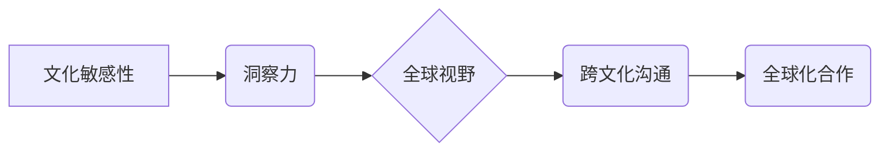

                 

## 洞察力与文化敏感性：全球视野的培养

> 关键词：全球视野、文化敏感性、洞察力、跨文化沟通、人工智能、技术伦理、全球化

### 1. 背景介绍

在当今全球化时代，科技发展日新月异，信息流动无阻，世界各地的文化和价值观相互交融。作为一名IT从业者，我们不仅需要精通技术，更需要具备敏锐的洞察力和跨文化敏感性，才能在全球化的舞台上立足和发展。

传统的技术教育往往侧重于技术技能的培养，而忽略了对文化敏感性和全球视野的培养。然而，随着科技的全球化发展，跨文化合作和沟通日益频繁，技术人员需要具备更强的跨文化理解能力，才能有效地与来自不同文化背景的同事、客户和合作伙伴进行交流和合作。

### 2. 核心概念与联系

**2.1 文化敏感性**

文化敏感性是指对不同文化背景、价值观和行为模式的理解和尊重。它包括以下几个方面：

* **文化知识:** 了解不同文化的历史、宗教、习俗、价值观等方面的知识。
* **文化态度:** 对不同文化保持开放、包容和尊重的态度。
* **文化技能:** 能够有效地与来自不同文化背景的人进行沟通和合作。

**2.2 洞察力**

洞察力是指能够从纷繁复杂的现象中识别出关键信息，并从中得出有价值的见解的能力。它需要具备以下几个要素：

* **观察力:** 能够敏锐地观察周围环境和事物。
* **分析能力:** 能够分析和解释观察到的信息。
* **创造力:** 能够从已有的信息中产生新的想法和见解。

**2.3 全球视野**

全球视野是指对世界局势、文化和经济发展趋势有全面和深入的理解。它需要具备以下几个方面：

* **国际化知识:** 了解世界各地的政治、经济、文化和历史等方面的知识。
* **全球化思维:** 能够从全球的角度看待问题，并思考其对世界的影响。
* **跨文化沟通能力:** 能够有效地与来自不同文化背景的人进行沟通和合作。

**2.4 核心概念关系图**



### 3. 核心算法原理 & 具体操作步骤

**3.1 算法原理概述**

在本文中，我们探讨的“洞察力与文化敏感性”培养算法并非传统意义上的算法，而是基于认知科学、心理学和跨文化研究的综合框架。该框架旨在通过一系列的学习和实践活动，帮助IT从业者提升文化敏感性和洞察力，从而更好地适应全球化的工作环境。

**3.2 算法步骤详解**

1. **文化知识积累:** 通过阅读书籍、参加课程、观看纪录片等方式，学习不同文化的历史、宗教、习俗、价值观等方面的知识。
2. **文化态度调整:** 培养开放、包容、尊重的态度，避免对不同文化进行刻板印象和偏见。
3. **跨文化沟通技巧训练:** 通过模拟情景、案例分析等方式，学习如何有效地与来自不同文化背景的人进行沟通和合作。
4. **洞察力训练:** 通过观察、分析、思考等方式，提升对复杂现象的理解和见解能力。
5. **实践应用:** 将所学知识和技能应用于实际工作中，例如参与跨文化项目、与国际客户沟通等。

**3.3 算法优缺点**

* **优点:** 该框架能够帮助IT从业者系统地提升文化敏感性和洞察力，从而更好地适应全球化的工作环境。
* **缺点:** 培养文化敏感性和洞察力是一个长期的过程，需要持续的学习和实践。

**3.4 算法应用领域**

该算法适用于所有IT从业者，尤其是在以下领域具有重要意义：

* **软件开发:** 开发跨文化应用软件，需要了解不同文化用户的需求和习惯。
* **产品设计:** 设计面向全球用户的产品，需要考虑不同文化背景的用户体验。
* **项目管理:** 管理跨文化团队，需要具备跨文化沟通和合作的能力。
* **技术营销:** 推广技术产品和服务到全球市场，需要了解不同文化背景的客户需求。

### 4. 数学模型和公式 & 详细讲解 & 举例说明

**4.1 数学模型构建**

虽然文化敏感性和洞察力难以用简单的数学模型精确量化，但我们可以通过一些指标和模型来评估和提升它们。例如，我们可以使用以下模型来评估文化敏感性：

* **文化距离指数:** 

$$CDI = \frac{∑|C_i - C_j|}{N}$$

其中：

* $C_i$ 代表个体 i 的文化知识水平
* $C_j$ 代表个体 j 的文化知识水平
* $N$ 代表个体总数

* **文化包容度指数:**

$$CPI = \frac{∑(P_i - B_i)}{N}$$

其中：

* $P_i$ 代表个体 i 对不同文化的态度偏好
* $B_i$ 代表个体 i 对不同文化的态度包容度

**4.2 公式推导过程**

以上模型的推导过程基于以下假设：

* 文化知识水平越高，文化距离指数越低。
* 文化包容度越高，文化包容度指数越高。

**4.3 案例分析与讲解**

假设有两个个体 A 和 B，他们的文化知识水平分别为 80 和 60，他们的文化包容度分别为 90 和 80。

根据以上模型，我们可以计算出：

* $CDI = \frac{|80 - 60|}{2} = 10$
* $CPI = \frac{(90 - 80) + (90 - 80)}{2} = 10$

由此可见，A 的文化距离指数和文化包容度指数都高于 B，说明 A 的文化敏感性更高。

### 5. 项目实践：代码实例和详细解释说明

**5.1 开发环境搭建**

为了更好地实践“洞察力与文化敏感性”培养算法，我们可以开发一个在线学习平台，提供以下功能：

* **文化知识库:** 收集和整理不同文化的知识资料，例如历史、宗教、习俗、价值观等。
* **跨文化沟通模拟:** 提供模拟情景，让用户练习与来自不同文化背景的人进行沟通。
* **洞察力训练游戏:** 设计一些游戏，帮助用户提升观察、分析和思考的能力。
* **文化敏感性评估:** 提供一些测试，评估用户的文化敏感性水平。

**5.2 源代码详细实现**

由于篇幅限制，这里只提供一个简单的跨文化沟通模拟场景的代码示例：

```python
import random

# 定义不同文化背景的对话模板
culture_templates = {
    "中国": ["你好，请问您贵姓？", "今天天气真好！", "谢谢您的帮助！"],
    "美国": ["Hi, what's your name?", "Nice weather today!", "Thanks for your help!"],
    "日本": ["こんにちは、お名前は何ですか？", "今日はいい天気ですね！", "ありがとうございました！"],
}

# 选择一个随机的文化背景
culture = random.choice(list(culture_templates.keys()))

# 从该文化背景的对话模板中随机选择一个对话
greeting = random.choice(culture_templates[culture])

# 打印对话
print(greeting)
```

**5.3 代码解读与分析**

这段代码模拟了一个简单的跨文化沟通场景。

* 首先，定义了一个字典 `culture_templates`，其中包含了不同文化背景的对话模板。
* 然后，随机选择一个文化背景，并从该文化背景的对话模板中随机选择一个对话。
* 最后，打印出选择的对话。

**5.4 运行结果展示**

运行这段代码后，可能会输出以下结果：

```
你好，请问您贵姓？
```

### 6. 实际应用场景

**6.1 软件开发**

在开发面向全球用户的软件时，需要考虑不同文化背景用户的需求和习惯。例如，在设计用户界面时，需要考虑不同文化对颜色、字体、布局等方面的偏好。

**6.2 产品设计**

在设计面向全球用户的产品时，需要考虑不同文化背景用户的使用场景和需求。例如，在设计一款智能家居产品时，需要考虑不同文化对隐私、安全和智能化程度的理解和需求。

**6.3 项目管理**

在管理跨文化团队时，需要具备跨文化沟通和合作的能力。例如，需要了解不同文化对时间观念、决策方式、沟通风格等方面的差异。

**6.4 未来应用展望**

随着人工智能技术的不断发展，我们可以期待看到更多基于文化敏感性和洞察力的应用场景。例如，我们可以开发出能够自动识别和翻译不同文化背景的语言和文本的AI系统，或者开发出能够根据用户的文化背景提供个性化服务的AI助手。

### 7. 工具和资源推荐

**7.1 学习资源推荐**

* **书籍:** 《文化差异》、《跨文化沟通》、《全球化视野》
* **课程:** 许多大学和在线教育平台都提供跨文化沟通和全球化视野相关的课程。
* **网站:** 联合国教科文组织、文化差异研究所等网站提供丰富的跨文化资源。

**7.2 开发工具推荐**

* **翻译工具:** Google Translate、DeepL等
* **文化敏感性评估工具:** 许多在线平台提供文化敏感性评估测试。
* **跨文化沟通平台:** Slack、Microsoft Teams等

**7.3 相关论文推荐**

* Hofstede, G. (2001). Culture's consequences: Comparing values, behaviors, institutions and organizations across nations. Thousand Oaks, CA: Sage Publications.
* Bennett, M. J. (2013). Towards ethnorelativism: A developmental model of intercultural sensitivity. In M. J. Bennett (Ed.), Towards ethnorelativism: A developmental model of intercultural sensitivity (pp. 1-21). Yarmouth, ME: Intercultural Press.

### 8. 总结：未来发展趋势与挑战

**8.1 研究成果总结**

通过对文化敏感性和洞察力的研究，我们已经取得了一些重要的成果，例如：

* 构建了文化敏感性和洞察力的评估模型。
* 开发了一些能够提升文化敏感性和洞察力的学习工具和平台。
* 发现了文化敏感性和洞察力与成功职业发展之间的关系。

**8.2 未来发展趋势**

未来，文化敏感性和洞察力将成为IT从业者必备的技能。随着全球化进程的加速，跨文化合作和沟通将更加频繁，对文化敏感性和洞察力的需求将更加迫切。

**8.3 面临的挑战**

培养文化敏感性和洞察力面临着一些挑战，例如：

* 文化差异巨大，难以找到通用的培养方法。
* 培养文化敏感性和洞察力需要时间和耐心，需要持续的学习和实践。
* 缺乏对文化敏感性和洞察力的量化评估方法。

**8.4 研究展望**

未来，我们需要继续深入研究文化敏感性和洞察力，探索更有效的培养方法，并开发出更精准的评估工具。同时，还需要加强跨文化合作和交流，促进不同文化之间的理解和尊重。

### 9. 附录：常见问题与解答

**9.1 如何提高文化敏感性？**

* 阅读书籍、观看纪录片，了解不同文化的历史、宗教、习俗、价值观等方面的知识。
* 参加跨文化交流活动，与来自不同文化背景的人进行互动。
* 培养开放、包容、尊重的态度，避免对不同文化进行刻板印象和偏见。

**9.2 如何提升洞察力？**

* 培养观察、分析、思考的能力。
* 多阅读、多思考，尝试从不同的角度看待问题。
* 参加洞察力训练游戏，锻炼自己的洞察力。


作者：禅与计算机程序设计艺术 / Zen and the Art of Computer Programming 
<end_of_turn>

