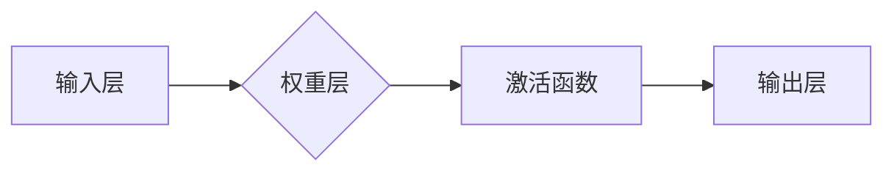

                 

## 深度学习基础：从感知器到深层网络

> 关键词：深度学习、感知器、神经网络、激活函数、反向传播、卷积神经网络、循环神经网络

### 1. 背景介绍

深度学习作为机器学习领域的一颗璀璨明珠，近年来在计算机视觉、自然语言处理、语音识别等领域取得了突破性的进展。其核心在于模仿人类大脑神经网络的结构和功能，通过多层神经元网络进行特征提取和学习，从而实现更复杂的模式识别和决策。

传统的机器学习算法往往需要人工提取特征，而深度学习则能够自动学习特征，这使得其在处理复杂数据时表现更加出色。随着计算能力的提升和海量数据的积累，深度学习迎来了爆发式发展，并逐渐成为人工智能领域的主流技术之一。

### 2. 核心概念与联系

**2.1 感知器**

感知器是深度学习的基础单元，它是一个简单的线性分类器，能够学习将输入数据映射到输出类别。感知器的结构包括输入层、权重层和输出层。输入层接收原始数据，权重层负责对数据进行加权求和，输出层根据加权和的结果进行分类。

**2.2 神经网络**

神经网络是由多个感知器组成的网络结构，通过连接多个感知器，可以实现更复杂的模式识别和学习。神经网络通常分为输入层、隐藏层和输出层。输入层接收原始数据，隐藏层负责对数据进行特征提取，输出层根据提取的特征进行分类或预测。

**2.3 激活函数**

激活函数是神经网络中一个重要的组成部分，它决定了神经元的输出是否被激活。常见的激活函数包括 sigmoid 函数、ReLU 函数和 tanh 函数。激活函数的作用是引入非线性，使得神经网络能够学习更复杂的模式。

**2.4 反向传播算法**

反向传播算法是深度学习中常用的训练算法，它通过计算误差并反向传播到各层神经元，调整神经元的权重，从而使得神经网络的预测结果越来越准确。

**Mermaid 流程图**



### 3. 核心算法原理 & 具体操作步骤

**3.1 算法原理概述**

深度学习的核心算法是反向传播算法，它通过迭代更新神经网络的权重，使得神经网络的预测结果越来越准确。反向传播算法的基本步骤包括：

1. **前向传播:** 将输入数据通过神经网络进行传播，计算输出结果。
2. **误差计算:** 计算输出结果与真实值的误差。
3. **反向传播:** 将误差反向传播到各层神经元，计算每个神经元的梯度。
4. **权重更新:** 根据梯度更新神经网络的权重。

**3.2 算法步骤详解**

1. **初始化:** 随机初始化神经网络的权重。
2. **前向传播:** 将输入数据通过神经网络进行传播，计算输出结果。
3. **损失函数计算:** 计算输出结果与真实值的损失函数值。
4. **反向传播:** 计算损失函数对每个神经元的梯度。
5. **权重更新:** 使用梯度下降算法更新神经网络的权重。
6. **重复步骤2-5:** 迭代执行上述步骤，直到损失函数值达到最小。

**3.3 算法优缺点**

**优点:**

* 能够自动学习特征，无需人工提取。
* 能够处理复杂数据，学习更复杂的模式。
* 在许多领域取得了突破性的进展。

**缺点:**

* 训练时间长，需要大量的计算资源。
* 容易陷入局部最优解。
* 对训练数据的质量要求高。

**3.4 算法应用领域**

深度学习算法广泛应用于以下领域:

* **计算机视觉:** 图像识别、物体检测、图像分割、人脸识别等。
* **自然语言处理:** 文本分类、情感分析、机器翻译、语音识别等。
* **语音合成:** 生成逼真的语音。
* **推荐系统:** 根据用户的历史行为推荐商品或内容。
* **医疗诊断:** 辅助医生诊断疾病。

### 4. 数学模型和公式 & 详细讲解 & 举例说明

**4.1 数学模型构建**

深度学习模型通常由多个神经层组成，每一层包含多个神经元。每个神经元接收来自上一层的输入信号，并通过权重进行加权求和，然后经过激活函数处理，输出到下一层。

**4.2 公式推导过程**

假设一个神经网络包含输入层、隐藏层和输出层，隐藏层包含 $n$ 个神经元。

* **输入层:** $x_1, x_2, ..., x_m$
* **隐藏层:** $h_1, h_2, ..., h_n$
* **输出层:** $y_1, y_2, ..., y_k$

每个隐藏层神经元的输出可以表示为：

$$h_i = f(\sum_{j=1}^{m} w_{ij}x_j + b_i)$$

其中：

* $w_{ij}$ 是连接输入层第 $j$ 个神经元和隐藏层第 $i$ 个神经元的权重。
* $b_i$ 是隐藏层第 $i$ 个神经元的偏置。
* $f$ 是激活函数。

输出层的输出可以表示为：

$$y_k = g(\sum_{i=1}^{n} v_{ki}h_i + c_k)$$

其中：

* $v_{ki}$ 是连接隐藏层第 $i$ 个神经元和输出层第 $k$ 个神经元的权重。
* $c_k$ 是输出层第 $k$ 个神经元的偏置。
* $g$ 是激活函数。

**4.3 案例分析与讲解**

假设我们有一个简单的深度学习模型，用于分类手写数字。模型包含输入层、隐藏层和输出层，隐藏层包含 10 个神经元。

* 输入层接收 784 个像素值，代表手写数字的图像。
* 隐藏层使用 ReLU 激活函数，输出 10 个神经元的激活值。
* 输出层使用 softmax 激活函数，输出 10 个概率值，分别代表手写数字 0 到 9 的概率。

通过训练数据，模型会学习到每个像素值与每个数字的关联性，并调整权重和偏置，使得模型能够准确地识别手写数字。

### 5. 项目实践：代码实例和详细解释说明

**5.1 开发环境搭建**

深度学习开发通常需要使用 Python 语言和相关的深度学习框架，例如 TensorFlow、PyTorch 或 Keras。

**5.2 源代码详细实现**

以下是一个使用 Keras 实现简单的深度学习模型的代码示例：

```python
from keras.models import Sequential
from keras.layers import Dense

# 创建模型
model = Sequential()
model.add(Dense(10, activation='relu', input_shape=(784,)))
model.add(Dense(10, activation='softmax'))

# 编译模型
model.compile(optimizer='adam', loss='categorical_crossentropy', metrics=['accuracy'])

# 训练模型
model.fit(x_train, y_train, epochs=10, batch_size=32)

# 评估模型
loss, accuracy = model.evaluate(x_test, y_test)
print('Loss:', loss)
print('Accuracy:', accuracy)
```

**5.3 代码解读与分析**

* `Sequential()` 创建一个顺序模型，神经层按顺序连接。
* `Dense()` 创建一个全连接层，每个神经元都连接到上一层的每个神经元。
* `activation='relu'` 使用 ReLU 激活函数。
* `input_shape=(784,)` 设置输入层的形状为 784 维。
* `optimizer='adam'` 使用 Adam 优化器。
* `loss='categorical_crossentropy'` 使用交叉熵损失函数。
* `metrics=['accuracy']` 使用准确率作为评估指标。
* `model.fit()` 训练模型。
* `model.evaluate()` 评估模型。

**5.4 运行结果展示**

训练完成后，模型会输出训练和测试的损失值和准确率。

### 6. 实际应用场景

**6.1 计算机视觉**

* **图像识别:** 深度学习模型能够识别图像中的物体、场景和人物。
* **物体检测:** 深度学习模型能够检测图像中物体的位置和类别。
* **图像分割:** 深度学习模型能够将图像分割成不同的区域，例如前景和背景。

**6.2 自然语言处理**

* **文本分类:** 深度学习模型能够将文本分类到不同的类别，例如情感分析、主题分类。
* **机器翻译:** 深度学习模型能够将文本从一种语言翻译成另一种语言。
* **语音识别:** 深度学习模型能够将语音转换为文本。

**6.3 其他领域**

* **推荐系统:** 深度学习模型能够根据用户的历史行为推荐商品或内容。
* **医疗诊断:** 深度学习模型能够辅助医生诊断疾病。
* **金融预测:** 深度学习模型能够预测股票价格、信用风险等。

**6.4 未来应用展望**

深度学习技术还在不断发展，未来将有更多新的应用场景出现，例如：

* **自动驾驶:** 深度学习模型能够帮助汽车感知周围环境，并做出决策。
* **机器人控制:** 深度学习模型能够帮助机器人学习新的任务和技能。
* **个性化教育:** 深度学习模型能够根据学生的学习情况提供个性化的学习内容和建议。

### 7. 工具和资源推荐

**7.1 学习资源推荐**

* **书籍:**
    * 深度学习 (Deep Learning) - Ian Goodfellow, Yoshua Bengio, Aaron Courville
    * 深度学习入门 (Deep Learning with Python) - Francois Chollet
* **在线课程:**
    * Coursera: 深度学习 Specialization
    * Udacity: 深度学习 Nanodegree
    * fast.ai: 深度学习课程

**7.2 开发工具推荐**

* **TensorFlow:** Google 开发的开源深度学习框架。
* **PyTorch:** Facebook 开发的开源深度学习框架。
* **Keras:** 构建和训练深度学习模型的简单易用的 API。

**7.3 相关论文推荐**

* **AlexNet:** ImageNet Classification with Deep Convolutional Neural Networks
* **VGGNet:** Very Deep Convolutional Networks for Large-Scale Image Recognition
* **ResNet:** Deep Residual Learning for Image Recognition

### 8. 总结：未来发展趋势与挑战

**8.1 研究成果总结**

深度学习在过去几年取得了显著的进展，在许多领域取得了突破性的成果。

**8.2 未来发展趋势**

* **模型更深更复杂:** 研究更深层、更复杂的深度学习模型，以提高模型的性能。
* **数据更丰富更多样:** 探索新的数据来源，并开发新的数据增强技术，以提高模型的泛化能力。
* **硬件加速:** 开发新的硬件加速器，以提高深度学习模型的训练速度和效率。
* **解释性更强:** 研究更可解释的深度学习模型，以便更好地理解模型的决策过程。

**8.3 面临的挑战**

* **数据隐私:** 深度学习模型需要大量的训练数据，如何保护数据隐私是一个重要的挑战。
* **模型可解释性:** 深度学习模型的决策过程往往难以理解，如何提高模型的可解释性是一个重要的研究方向。
* **公平性与偏见:** 深度学习模型可能存在公平性问题和偏见问题，如何确保模型的公平性是一个重要的挑战。

**8.4 研究展望**

未来，深度学习技术将继续发展，并应用于更多新的领域。研究人员将继续探索新的算法、模型和应用场景，以推动深度学习技术的发展。

### 9. 附录：常见问题与解答

**9.1 什么是深度学习？**

深度学习是一种机器学习的子领域，它使用多层神经网络来学习数据特征。

**9.2 深度学习有什么优势？**

深度学习能够自动学习特征，无需人工提取，并且能够处理复杂数据，学习更复杂的模式。

**9.3 如何学习深度学习？**

可以通过阅读书籍、在线课程和研究论文学习深度学习。

**9.4 深度学习有哪些应用场景？**

深度学习应用于计算机视觉、自然语言处理、语音识别、推荐系统、医疗诊断等多个领域。


作者：禅与计算机程序设计艺术 / Zen and the Art of Computer Programming<end_of_turn>

