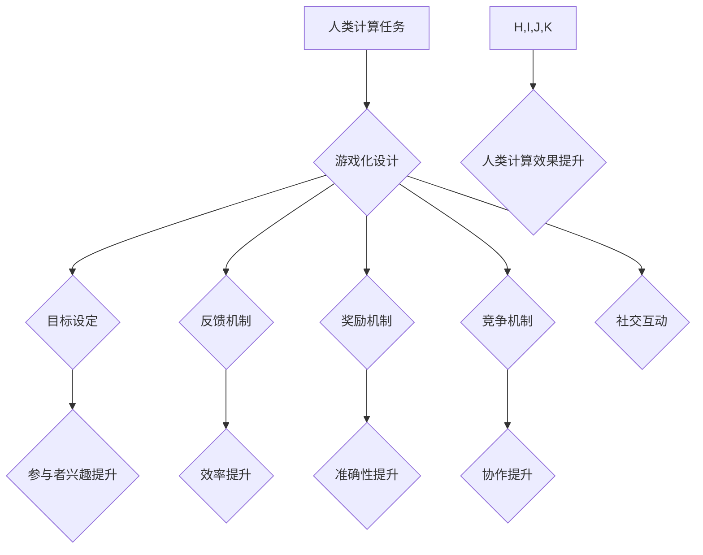

                 

## 游戏化参与：提升人类计算的趣味性

> 关键词：游戏化、人类计算、参与度、趣味性、算法、数学模型、项目实践、应用场景

## 1. 背景介绍

人类计算，即利用人类的智慧和认知能力进行计算，在过去几十年中逐渐成为一个重要的研究领域。随着人工智能技术的快速发展，人类计算与人工智能的结合也越来越受到关注。然而，传统的参与方式往往枯燥乏味，难以激发人们的兴趣和参与热情。如何提升人类计算的趣味性，提高参与度，是当前面临的一个重要挑战。

游戏化参与，即借鉴游戏的设计理念和机制，将游戏元素融入到非游戏场景中，是一种有效的提升参与度和趣味性的方法。游戏化参与可以激发人们的内在动机，增强他们的参与感和成就感，从而提高人类计算的效率和效果。

## 2. 核心概念与联系

### 2.1 游戏化参与的核心概念

游戏化参与的核心概念包括：

* **目标设定:**  明确的、可衡量的目标，引导参与者朝着特定方向努力。
* **反馈机制:** 及时、有效的反馈，让参与者了解自己的表现，并根据反馈进行调整。
* **奖励机制:**  通过奖励来激励参与者，增强他们的参与热情和成就感。
* **竞争机制:**  通过与他人竞争，激发参与者的参与热情和成就感。
* **社交互动:**  鼓励参与者之间进行互动交流，增强他们的归属感和参与感。

### 2.2 游戏化参与与人类计算的联系

游戏化参与可以有效提升人类计算的趣味性，具体体现在以下几个方面：

* **增强参与度:** 游戏化的设计元素可以激发人们的兴趣和好奇心，让他们更愿意参与到人类计算中来。
* **提高效率:**  明确的目标、反馈机制和奖励机制可以帮助参与者更好地理解任务，提高工作效率。
* **增强准确性:**  游戏化的竞争机制可以激励参与者更加认真仔细地完成任务，提高任务的准确性。
* **促进协作:**  社交互动可以促进参与者之间的协作，提高团队合作效率。

**Mermaid 流程图**



## 3. 核心算法原理 & 具体操作步骤

### 3.1 算法原理概述

游戏化参与的核心算法原理是基于行为经济学和心理学的研究，通过设计合理的激励机制和游戏元素，引导参与者完成目标任务。常见的算法包括：

* **积分系统:**  根据参与者的贡献和表现，分配积分，积分可以兑换奖励。
* **等级制度:**  根据积分和完成任务的数量，将参与者划分为不同的等级，等级越高，获得的奖励和特权越多。
* **排行榜:**  展示参与者的排名，激发竞争意识，鼓励参与者不断提升表现。
* **成就系统:**  设置不同的成就目标，参与者完成目标后获得成就感和奖励。

### 3.2 算法步骤详解

1. **目标设定:**  明确人类计算任务的目标，并将其分解成可实现的小目标。
2. **激励机制设计:**  根据任务目标和参与者特点，设计合理的积分系统、等级制度、排行榜等激励机制。
3. **游戏元素融入:**  将游戏元素，如任务提示、进度条、奖励图标等融入到任务界面中，增强趣味性。
4. **反馈机制建立:**  及时反馈参与者的表现，包括积分、等级、排名等信息，帮助他们了解自己的进度和成就。
5. **奖励机制实施:**  根据积分、等级、成就等指标，为参与者提供相应的奖励，如虚拟物品、优惠券、实物奖励等。
6. **数据分析与优化:**  收集参与者的行为数据，分析他们的参与情况和反馈，不断优化游戏化设计，提高参与度和效果。

### 3.3 算法优缺点

**优点:**

* 提升参与度和趣味性
* 提高效率和准确性
* 促进协作和团队合作

**缺点:**

* 设计复杂，需要专业知识
* 可能导致过度竞争和心理压力
* 需要持续维护和更新

### 3.4 算法应用领域

游戏化参与算法广泛应用于以下领域：

* **教育:**  将游戏元素融入到学习内容中，提高学生的学习兴趣和参与度。
* **医疗:**  利用游戏化参与，鼓励患者积极配合治疗，提高治疗效果。
* **商业:**  通过游戏化营销，提高客户的参与度和品牌忠诚度。
* **科学研究:**  利用人类计算平台，通过游戏化参与，收集和分析大规模数据。

## 4. 数学模型和公式 & 详细讲解 & 举例说明

### 4.1 数学模型构建

游戏化参与的数学模型可以基于行为经济学和心理学理论构建，例如：

* **效用函数:**  描述参与者对游戏化参与的预期效用，可以考虑积分、等级、奖励等因素。
* **动机模型:**  描述参与者参与游戏化参与的动机，例如成就动机、竞争动机、社交动机等。
* **学习模型:**  描述参与者通过游戏化参与学习和改进的行为模式。

### 4.2 公式推导过程

例如，我们可以用效用函数来描述参与者对游戏化参与的预期效用：

$$U = f(I, L, R)$$

其中：

* $U$ 是参与者的效用
* $I$ 是参与者的积分
* $L$ 是参与者的等级
* $R$ 是参与者获得的奖励

我们可以根据不同的游戏化设计，设定不同的效用函数，例如：

* **积分驱动型:**  $U = aI + b$
* **等级驱动型:**  $U = cL^2 + d$
* **奖励驱动型:**  $U = eR + f$

其中 $a$, $b$, $c$, $d$, $e$, $f$ 是常数，可以根据实际情况进行调整。

### 4.3 案例分析与讲解

例如，在一个在线学习平台上，我们可以使用积分系统来激励学生学习。学生完成学习任务可以获得积分，积分可以兑换学习资源、证书等奖励。

我们可以设定一个效用函数：

$$U = 0.5I + 0.2R$$

其中 $I$ 是学生的积分，$R$ 是学生获得的奖励。

通过分析这个效用函数，我们可以看到，学生的效用主要取决于积分和奖励。因此，我们可以通过增加积分和奖励的价值，来提高学生的学习兴趣和参与度。

## 5. 项目实践：代码实例和详细解释说明

### 5.1 开发环境搭建

为了演示游戏化参与的实现，我们可以使用 Python 语言和 Flask 框架搭建一个简单的项目。

**依赖:**

* Python 3.x
* Flask

**安装:**

```bash
pip install flask
```

### 5.2 源代码详细实现

```python
from flask import Flask, render_template, request

app = Flask(__name__)

# 用户数据
users = {}

@app.route('/')
def index():
    return render_template('index.html')

@app.route('/submit', methods=['POST'])
def submit():
    username = request.form['username']
    score = int(request.form['score'])

    if username not in users:
        users[username] = {'score': 0, 'level': 1}

    users[username]['score'] += score
    users[username]['level'] = calculate_level(users[username]['score'])

    return render_template('index.html', username=username, score=users[username]['score'], level=users[username]['level'])

def calculate_level(score):
    if score < 100:
        return 1
    elif score < 500:
        return 2
    elif score < 1000:
        return 3
    else:
        return 4

if __name__ == '__main__':
    app.run(debug=True)
```

**index.html:**

```html
<!DOCTYPE html>
<html>
<head>
    <title>游戏化参与</title>
</head>
<body>
    <h1>游戏化参与</h1>
    <form method="POST" action="/submit">
        <label for="username">用户名:</label>
        <input type="text" id="username" name="username"><br><br>
        <label for="score">得分:</label>
        <input type="number" id="score" name="score"><br><br>
        <button type="submit">提交</button>
    </form>

    
        <h2>{{ username }}</h2>
        <p>得分: {{ score }}</p>
        <p>等级: {{ level }}</p>
    
</body>
</html>
```

### 5.3 代码解读与分析

* **用户数据:**  使用字典 `users` 来存储用户的积分和等级信息。
* **路由:**  使用 Flask 的路由机制，定义 `/` 路由用于显示首页，`/submit` 路由用于处理用户提交的得分信息。
* **积分和等级计算:**  `calculate_level` 函数根据用户的积分计算等级。
* **模板渲染:**  使用 Flask 的模板引擎渲染 HTML 页面，并动态显示用户的信息。

### 5.4 运行结果展示

运行上述代码，访问 `http://127.0.0.1:5000/`，即可看到一个简单的游戏化参与页面。用户可以输入用户名和得分，提交后，系统会更新用户的积分和等级，并显示在页面上。

## 6. 实际应用场景

### 6.1 教育领域

* **在线学习平台:**  将游戏化元素融入到在线学习平台中，例如积分系统、等级制度、排行榜等，可以提高学生的学习兴趣和参与度。
* **教育游戏:**  开发基于游戏化的教育游戏，例如模拟经营游戏、策略游戏等，可以帮助学生学习知识和技能，并提高他们的学习效率。

### 6.2 医疗领域

* **康复训练:**  利用游戏化参与，设计康复训练游戏，可以提高患者的参与度和治疗效果。
* **健康管理:**  开发健康管理应用程序，通过游戏化参与，鼓励患者养成健康的生活习惯。

### 6.3 商业领域

* **营销推广:**  利用游戏化营销，例如积分兑换、抽奖活动等，可以提高客户的参与度和品牌忠诚度。
* **员工激励:**  设计游戏化激励机制，例如积分系统、排行榜等，可以提高员工的积极性和工作效率。

### 6.4 未来应用展望

随着人工智能技术的不断发展，游戏化参与将在更多领域得到应用，例如：

* **科学研究:**  利用人类计算平台，通过游戏化参与，收集和分析大规模数据。
* **社会治理:**  利用游戏化参与，提高公民的参与度和社会责任感。

## 7. 工具和资源推荐

### 7.1 学习资源推荐

* **书籍:**
    * 《游戏设计基础》
    * 《行为经济学》
    * 《心理学原理》
* **在线课程:**
    * Coursera: 游戏设计与开发
    * edX: 行为经济学
    * Udemy: 人工智能与机器学习

### 7.2 开发工具推荐

* **Python:**  Python 是一种流行的编程语言，适合开发游戏化参与系统。
* **Flask:**  Flask 是一个轻量级的 Python Web 框架，可以用于开发简单的 Web 应用。
* **Unity:**  Unity 是一个流行的游戏引擎，可以用于开发更复杂的交互式游戏。

### 7.3 相关论文推荐

* **《游戏化参与：提升人类计算的趣味性》**
* **《行为经济学与游戏化设计》**
* **《人工智能与游戏化参与》**

## 8. 总结：未来发展趋势与挑战

### 8.1 研究成果总结

游戏化参与是一种有效的提升人类计算趣味性和参与度的有效方法。通过合理的激励机制和游戏元素设计，可以激发参与者的内在动机，提高他们的效率和准确性。

### 8.2 未来发展趋势

未来，游戏化参与将朝着以下方向发展：

* **更个性化的设计:**  根据用户的不同特点和需求，设计更个性化的游戏化参与方案。
* **更智能化的交互:**  利用人工智能技术，实现更智能化的游戏化交互，例如自动生成任务、个性化奖励等。
* **更广泛的应用:**  游戏化参与将应用于更多领域，例如科学研究、社会治理等。

### 8.3 面临的挑战

游戏化参与也面临一些挑战：

* **设计复杂性:**  设计合理的激励机制和游戏元素需要专业知识和经验。
* **数据安全:**  收集和使用用户数据需要保障数据安全和隐私。
* **伦理问题:**  游戏化参与可能会导致过度竞争和心理压力，需要关注其伦理问题。

### 8.4 研究展望

未来，我们需要继续研究游戏化参与的原理和机制，开发更有效的游戏化设计方案，并解决其面临的挑战，使其更好地服务于人类计算的发展。

## 9. 附录：常见问题与解答

**Q1: 游戏化参与是否适合所有场景？**

**A1:**  游戏化参与并非适用于所有场景，需要根据具体情况进行评估。例如，对于一些需要高度专注和严肃性的任务，游戏化参与可能适得其反。

**Q2: 如何设计有效的激励机制？**

**A2:**  设计有效的激励机制需要考虑用户的动机、目标和价值观。可以参考行为经济学理论，例如效用函数、损失厌恶等。

**Q3: 如何保障用户数据安全？**

**A3:**  收集和使用用户数据需要遵守相关法律法规，并采取相应的安全措施，例如加密、匿名化等。


作者：禅与计算机程序设计艺术 / Zen and the Art of Computer Programming<end_of_turn>

