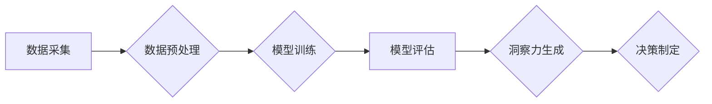

                 

## 理解洞察力的局限：承认不确定性和复杂性

> 关键词：洞察力、不确定性、复杂性、人工智能、机器学习、数据分析、决策、风险管理

### 1. 背景介绍

在数据爆炸的时代，洞察力被视为至关重要的竞争优势。企业和个人都渴望从海量数据中挖掘出有价值的见解，以做出更明智的决策、预测未来趋势和应对挑战。人工智能（AI）和机器学习（ML）技术的快速发展为洞察力的获取提供了强大的工具，但同时也揭示了洞察力的局限性。

传统上，洞察力被视为一种直觉、经验和知识的产物，依赖于人类的分析能力和判断力。然而，随着数据规模和复杂度的不断增长，人类的认知能力逐渐捉襟见肘。AI和ML算法能够处理海量数据，识别复杂的模式和关系，并生成更准确、更全面的洞察。

然而，AI和ML算法本身也存在局限性。它们依赖于训练数据，而训练数据本身可能存在偏差、不完整或不准确。此外，AI和ML算法难以处理开放式问题、模糊概念和主观判断，这些问题往往是人类洞察力的核心所在。

### 2. 核心概念与联系

**2.1 洞察力**

洞察力是指从数据中识别出有价值的模式、趋势和关系，并将其转化为可行动的见解的能力。它需要结合数据分析、逻辑推理、批判性思维和创造力。

**2.2 不确定性**

不确定性是指在面对复杂系统和不完全信息时，无法完全确定未来事件或结果的可能性。在现实世界中，不确定性是普遍存在的，它会影响到数据分析、模型预测和决策制定。

**2.3 复杂性**

复杂性是指系统中相互作用的要素数量众多，并且这些要素之间存在非线性关系，导致系统行为难以预测和理解。复杂系统通常具有自组织、反馈和适应性等特征。

**2.4 AI和ML的局限性**

AI和ML算法虽然能够处理海量数据，但它们仍然存在局限性：

* **数据依赖性:** AI和ML算法依赖于训练数据，而训练数据本身可能存在偏差、不完整或不准确。
* **黑盒问题:** 许多AI和ML算法是“黑盒”模型，这意味着它们的内部工作机制难以理解和解释。
* **泛化能力:** AI和ML算法可能难以泛化到新的数据和场景，因为它们在训练过程中可能过拟合了训练数据。

**2.5 流程图**



### 3. 核心算法原理 & 具体操作步骤

**3.1 算法原理概述**

深度学习算法是一种基于人工神经网络的机器学习算法，能够学习数据中的复杂模式和关系。深度学习算法通常由多层神经网络组成，每层神经网络都包含多个神经元，这些神经元之间通过连接进行信息传递。

**3.2 算法步骤详解**

1. **数据采集:** 收集相关领域的数据，例如文本、图像、音频等。
2. **数据预处理:** 对数据进行清洗、转换和特征提取，使其适合深度学习算法的训练。
3. **模型构建:** 根据任务需求选择合适的深度学习模型架构，例如卷积神经网络（CNN）、循环神经网络（RNN）或变分自编码器（VAE）。
4. **模型训练:** 使用训练数据训练深度学习模型，调整模型参数以最小化预测误差。
5. **模型评估:** 使用测试数据评估模型的性能，例如准确率、召回率和F1-score。
6. **模型部署:** 将训练好的模型部署到实际应用场景中，用于预测、分类或其他任务。

**3.3 算法优缺点**

**优点:**

* 能够学习数据中的复杂模式和关系。
* 性能优于传统机器学习算法。
* 可应用于多种任务，例如图像识别、自然语言处理和语音识别。

**缺点:**

* 训练数据量大，计算资源需求高。
* 模型解释性差，难以理解模型的决策过程。
* 容易过拟合训练数据，泛化能力有限。

**3.4 算法应用领域**

深度学习算法已广泛应用于各个领域，例如：

* **计算机视觉:** 图像识别、物体检测、图像分割、人脸识别。
* **自然语言处理:** 文本分类、情感分析、机器翻译、对话系统。
* **语音识别:** 语音转文本、语音助手、语音搜索。
* **医疗保健:** 疾病诊断、药物发现、医疗影像分析。
* **金融科技:** 风险管理、欺诈检测、投资预测。

### 4. 数学模型和公式 & 详细讲解 & 举例说明

**4.1 数学模型构建**

深度学习算法的核心是神经网络模型。神经网络模型由多个层组成，每层包含多个神经元。神经元之间通过连接进行信息传递，每个连接都有一个权重。

**4.2 公式推导过程**

神经网络模型的训练过程是通过优化模型参数（权重）来最小化预测误差。常用的优化算法包括梯度下降法和动量法。

**梯度下降法:**

$$
\theta = \theta - \alpha \nabla J(\theta)
$$

其中：

* $\theta$ 是模型参数
* $\alpha$ 是学习率
* $\nabla J(\theta)$ 是损失函数 $J(\theta)$ 的梯度

**动量法:**

$$
v_t = \beta v_{t-1} + \alpha \nabla J(\theta)
$$

$$
\theta = \theta - v_t
$$

其中：

* $v_t$ 是动量
* $\beta$ 是动量衰减系数

**4.3 案例分析与讲解**

例如，在图像识别任务中，深度学习模型可以学习图像特征，并将其映射到类别标签。训练过程中，模型会使用训练图像和对应的标签进行训练，并通过梯度下降法优化模型参数，以最小化预测误差。

### 5. 项目实践：代码实例和详细解释说明

**5.1 开发环境搭建**

使用Python语言和深度学习框架TensorFlow或PyTorch搭建开发环境。

**5.2 源代码详细实现**

```python
import tensorflow as tf

# 定义模型架构
model = tf.keras.models.Sequential([
    tf.keras.layers.Conv2D(32, (3, 3), activation='relu', input_shape=(28, 28, 1)),
    tf.keras.layers.MaxPooling2D((2, 2)),
    tf.keras.layers.Conv2D(64, (3, 3), activation='relu'),
    tf.keras.layers.MaxPooling2D((2, 2)),
    tf.keras.layers.Flatten(),
    tf.keras.layers.Dense(10, activation='softmax')
])

# 编译模型
model.compile(optimizer='adam',
              loss='sparse_categorical_crossentropy',
              metrics=['accuracy'])

# 训练模型
model.fit(x_train, y_train, epochs=5)

# 评估模型
loss, accuracy = model.evaluate(x_test, y_test)
print('Test loss:', loss)
print('Test accuracy:', accuracy)
```

**5.3 代码解读与分析**

这段代码定义了一个简单的卷积神经网络模型，用于手写数字识别任务。模型包含两层卷积层、两层最大池化层、一层全连接层和一层softmax输出层。

**5.4 运行结果展示**

训练完成后，模型可以用于预测新的手写数字图像。

### 6. 实际应用场景

**6.1 医疗诊断**

深度学习算法可以用于分析医学影像，例如X光片、CT扫描和MRI扫描，辅助医生诊断疾病。

**6.2 金融风险管理**

深度学习算法可以用于分析金融数据，识别欺诈交易和预测市场风险。

**6.3 个性化推荐**

深度学习算法可以用于分析用户行为数据，提供个性化的产品和服务推荐。

**6.4 未来应用展望**

随着人工智能技术的不断发展，深度学习算法将在更多领域得到应用，例如自动驾驶、机器人技术和药物研发。

### 7. 工具和资源推荐

**7.1 学习资源推荐**

* **书籍:**

    * 深度学习 (Deep Learning) - Ian Goodfellow, Yoshua Bengio, Aaron Courville
    * 深度学习实践 (Deep Learning with Python) - Francois Chollet

* **在线课程:**

    * TensorFlow 官方教程
    * PyTorch 官方教程
    * Coursera 深度学习课程

**7.2 开发工具推荐**

* **TensorFlow:** Google 开发的开源深度学习框架。
* **PyTorch:** Facebook 开发的开源深度学习框架。
* **Keras:** TensorFlow 上的深度学习 API，易于使用。

**7.3 相关论文推荐**

* AlexNet: ImageNet Classification with Deep Convolutional Neural Networks (2012)
* VGGNet: Very Deep Convolutional Networks for Large-Scale Image Recognition (2014)
* ResNet: Deep Residual Learning for Image Recognition (2015)

### 8. 总结：未来发展趋势与挑战

**8.1 研究成果总结**

深度学习算法取得了显著的成果，在图像识别、自然语言处理和语音识别等领域取得了突破性进展。

**8.2 未来发展趋势**

* **模型效率提升:** 研究更轻量级、更高效的深度学习模型。
* **解释性增强:** 开发更易于解释的深度学习模型，提高模型透明度。
* **数据安全与隐私保护:** 研究深度学习算法在数据安全和隐私保护方面的应用。

**8.3 面临的挑战**

* **数据获取和标注:** 深度学习算法需要大量高质量的数据进行训练，数据获取和标注成本高昂。
* **模型可解释性:** 深度学习模型的决策过程难以理解，缺乏可解释性。
* **伦理问题:** 深度学习算法可能存在偏见和歧视，需要关注其伦理问题。

**8.4 研究展望**

未来，深度学习算法将继续发展，并在更多领域发挥重要作用。研究人员将致力于解决深度学习算法面临的挑战，使其更加高效、可解释和安全。

### 9. 附录：常见问题与解答

**9.1 如何选择合适的深度学习模型？**

选择合适的深度学习模型取决于具体的任务需求和数据特点。例如，图像识别任务通常使用卷积神经网络，而文本分类任务通常使用循环神经网络。

**9.2 如何处理深度学习模型的过拟合问题？**

过拟合是指模型在训练数据上表现良好，但在测试数据上表现差。可以采用以下方法来解决过拟合问题：

* 增加训练数据量
* 使用正则化技术，例如L1正则化和L2正则化
* 使用Dropout技术，随机丢弃神经网络中的某些节点
* 使用早停技术，在模型性能开始下降时停止训练

**9.3 如何评估深度学习模型的性能？**

常用的评估指标包括准确率、召回率、F1-score和AUC。选择合适的评估指标取决于具体的任务需求。


作者：禅与计算机程序设计艺术 / Zen and the Art of Computer Programming 
<end_of_turn>

