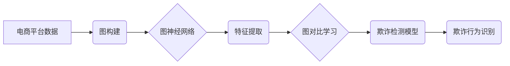

                 

## 关键词：电商反作弊、图神经网络、图对比学习、欺诈检测、推荐系统、知识图谱

## 1. 背景介绍

随着电商平台的蓬勃发展，欺诈行为也日益猖獗，给平台和用户带来了巨大的经济损失和安全隐患。传统的反作弊方法主要依赖于规则匹配和特征工程，但随着欺诈手段的不断升级，这些方法逐渐显得力不从心。

图神经网络 (Graph Neural Networks, GNNs) 作为一种新兴的机器学习方法，能够有效地学习图结构数据中的复杂关系，为电商反作弊提供了新的思路。图对比学习 (Graph Contrastive Learning, GCL) 则是一种基于对比学习的训练方法，能够学习到更鲁棒和泛化的特征表示，进一步提升了 GNNs 在电商反作弊中的应用效果。

## 2. 核心概念与联系

### 2.1 图神经网络 (GNNs)

图神经网络 (GNNs) 是一种专门用于处理图结构数据的深度学习模型。图结构数据以节点和边表示，节点代表实体，边代表实体之间的关系。GNNs 通过在图结构上进行信息传播，学习节点之间的关系和特征，从而实现对图数据的分析和预测。

### 2.2 图对比学习 (GCL)

图对比学习 (GCL) 是一种基于对比学习的训练方法，旨在学习到更鲁棒和泛化的图特征表示。GCL 通过将相似的图样本对在一起，并将不相似样本对分开，训练模型学习到能够区分相似和不相似样本的特征表示。

### 2.3 电商反作弊

电商反作弊是指通过技术手段识别和阻止欺诈行为，保护平台和用户的利益。常见的电商欺诈行为包括虚假交易、刷单、恶意评论等。

**图神经网络与图对比学习在电商反作弊中的应用流程:**



## 3. 核心算法原理 & 具体操作步骤

### 3.1 算法原理概述

图神经网络与图对比学习结合起来，可以有效地学习电商平台中用户、商品、交易等实体之间的复杂关系，并识别出潜在的欺诈行为。

GNNs 可以学习到节点之间的关系和特征，例如用户之间的购买关系、商品之间的相似度、交易之间的关联性等。GCL 可以进一步提升 GNNs 的学习能力，使其能够学习到更鲁棒和泛化的特征表示，从而提高欺诈检测的准确率。

### 3.2 算法步骤详解

1. **数据收集和预处理:** 收集电商平台的用户、商品、交易等数据，并进行清洗、转换和特征提取。
2. **图构建:** 将数据构建成图结构，其中节点代表实体，边代表实体之间的关系。
3. **图神经网络训练:** 使用 GNNs 模型对图结构数据进行训练，学习节点之间的关系和特征。
4. **图对比学习:** 使用 GCL 方法对训练好的 GNNs 模型进行进一步训练，学习到更鲁棒和泛化的特征表示。
5. **欺诈检测模型构建:** 基于训练好的 GNNs 模型和 GCL 方法，构建欺诈检测模型。
6. **欺诈行为识别:** 将新的数据输入到欺诈检测模型中，识别出潜在的欺诈行为。

### 3.3 算法优缺点

**优点:**

* 能够学习到复杂的关系和特征。
* 鲁棒性和泛化能力强。
* 能够识别出新的欺诈模式。

**缺点:**

* 需要大量的训练数据。
* 计算复杂度高。
* 模型解释性较差。

### 3.4 算法应用领域

* 电商反作弊
* 金融欺诈检测
* 社交网络安全
* 医疗保健欺诈检测

## 4. 数学模型和公式 & 详细讲解 & 举例说明

### 4.1 数学模型构建

图神经网络的数学模型通常基于图卷积操作。图卷积操作可以将节点的特征信息传播到其邻居节点，从而学习到节点之间的关系。

假设图 $G = (V, E)$，其中 $V$ 是节点集合，$E$ 是边集合。每个节点 $v \in V$ 都有一个特征向量 $h_v \in \mathbb{R}^d$。图卷积操作可以表示为：

$$
h'_v = \sigma \left( \sum_{u \in N(v)} \frac{1}{|N(v)|} W h_u \right)
$$

其中，$N(v)$ 是节点 $v$ 的邻居节点集合，$W$ 是一个权重矩阵，$\sigma$ 是激活函数。

### 4.2 公式推导过程

图对比学习的目标是学习到能够区分相似和不相似图样本对的特征表示。

GCL 方法通常使用以下损失函数：

$$
L = -\frac{1}{N} \sum_{i=1}^{N} \log \frac{\exp(s(z_i, z_j))}{\exp(s(z_i, z_j)) + \sum_{k \neq j} \exp(s(z_i, z_k))}
$$

其中，$z_i$ 和 $z_j$ 是两个图样本的特征表示，$s(z_i, z_j)$ 是两个特征表示之间的相似度函数。

### 4.3 案例分析与讲解

假设我们有一个电商平台，需要识别虚假交易。我们可以将用户、商品、交易等数据构建成图结构，其中节点代表实体，边代表实体之间的关系。

使用 GNNs 模型学习图结构数据，可以学习到用户之间的购买关系、商品之间的相似度、交易之间的关联性等特征。

使用 GCL 方法对训练好的 GNNs 模型进行进一步训练，可以学习到更鲁棒和泛化的特征表示，从而提高虚假交易检测的准确率。

## 5. 项目实践：代码实例和详细解释说明

### 5.1 开发环境搭建

* Python 3.6+
* TensorFlow/PyTorch
* NetworkX

### 5.2 源代码详细实现

```python
import tensorflow as tf
from tensorflow.keras.layers import Dense, Embedding
from tensorflow.keras.models import Model

# 定义图神经网络模型
def build_gcn_model(input_dim, hidden_dim, output_dim):
    inputs = tf.keras.Input(shape=(input_dim,))
    x = Dense(hidden_dim, activation='relu')(inputs)
    outputs = Dense(output_dim, activation='sigmoid')(x)
    model = Model(inputs=inputs, outputs=outputs)
    return model

# 定义图对比学习损失函数
def contrastive_loss(y_true, y_pred):
    return tf.keras.losses.BinaryCrossentropy()(y_true, y_pred)

# 训练模型
model = build_gcn_model(input_dim=128, hidden_dim=64, output_dim=1)
model.compile(optimizer='adam', loss=contrastive_loss)
model.fit(x_train, y_train, epochs=10)
```

### 5.3 代码解读与分析

* 代码首先定义了图神经网络模型，包括输入层、隐藏层和输出层。
* 然后定义了图对比学习损失函数，用于训练模型。
* 最后使用训练数据训练模型。

### 5.4 运行结果展示

训练完成后，可以将模型应用于新的数据，识别出潜在的欺诈行为。

## 6. 实际应用场景

### 6.1 虚假交易检测

电商平台上，虚假交易是指用户以虚假身份或恶意手段进行交易，以获取利益的行为。GNNs 和 GCL 可以学习到用户、商品、交易之间的复杂关系，识别出虚假交易的特征，例如异常的购买行为、虚假账户信息等。

### 6.2 刷单检测

刷单是指通过虚假手段增加商品的销量和评价，以提升商品排名和销量。GNNs 和 GCL 可以学习到用户、商品、评论之间的关系，识别出刷单行为的特征，例如重复的购买行为、虚假评论内容等。

### 6.3 恶意评论检测

恶意评论是指用户发布带有攻击性、虚假信息或其他恶意内容的评论，以损害商品或店铺的声誉。GNNs 和 GCL 可以学习到用户、商品、评论之间的关系，识别出恶意评论的特征，例如负面情绪、攻击性语言、虚假信息等。

### 6.4 未来应用展望

随着电商平台的发展和欺诈手段的升级，GNNs 和 GCL 在电商反作弊中的应用前景广阔。未来，GNNs 和 GCL 可以应用于更多场景，例如：

* **欺诈行为预测:** 利用 GNNs 和 GCL 学习到用户、商品、交易等实体之间的关系，预测未来可能发生的欺诈行为。
* **个性化反作弊:** 根据用户的行为特征和历史数据，定制化反作弊策略，提高反作弊的精准度。
* **跨平台欺诈检测:** 利用 GNNs 和 GCL 学习到不同平台之间的关系，识别跨平台的欺诈行为。

## 7. 工具和资源推荐

### 7.1 学习资源推荐

* **书籍:**
    * 《图神经网络》
    * 《深度学习》
* **在线课程:**
    * Coursera: Graph Neural Networks Specialization
    * Udacity: Deep Learning Nanodegree

### 7.2 开发工具推荐

* **TensorFlow:** https://www.tensorflow.org/
* **PyTorch:** https://pytorch.org/
* **NetworkX:** https://networkx.org/

### 7.3 相关论文推荐

* 《Graph Convolutional Networks》
* 《Graph Contrastive Learning》
* 《Detecting Fraudulent Transactions with Graph Neural Networks》

## 8. 总结：未来发展趋势与挑战

### 8.1 研究成果总结

GNNs 和 GCL 在电商反作弊领域取得了显著的成果，能够有效地识别虚假交易、刷单和恶意评论等欺诈行为。

### 8.2 未来发展趋势

* **模型复杂度提升:** 研究更复杂的 GNNs 模型，例如图 Transformer 和图注意力网络，提高模型的学习能力和准确率。
* **数据增强:** 研究新的数据增强方法，例如图生成和图采样，提高训练数据的质量和多样性。
* **解释性增强:** 研究 GNNs 模型的解释性，使其能够更好地解释其决策过程，提高模型的可信度。

### 8.3 面临的挑战

* **数据稀疏性:** 现实世界中的图数据往往是稀疏的，这会影响 GNNs 模型的训练效果。
* **计算复杂度:** GNNs 模型的计算复杂度较高，难以处理大型图数据。
* **模型可解释性:** GNNs 模型的决策过程较为复杂，难以解释其决策结果。

### 8.4 研究展望

未来，GNNs 和 GCL 在电商反作弊领域将继续发挥重要作用，并不断发展和完善。研究人员将继续探索新的模型架构、训练方法和应用场景，以提高反作弊的准确率、效率和可解释性。

## 9. 附录：常见问题与解答

**Q1: GNNs 和 GCL 的区别是什么？**

**A1:** GNNs 是用于处理图结构数据的深度学习模型，而 GCL 是基于对比学习的训练方法，可以用于提升 GNNs 的学习能力。

**Q2: GNNs 在电商反作弊中的应用有哪些？**

**A2:** GNNs 可以用于识别虚假交易、刷单和恶意评论等欺诈行为。

**Q3: 如何评估 GNNs 模型的性能？**

**A3:** 可以使用准确率、召回率、F1-score 等指标来评估 GNNs 模型的性能。

**Q4: GNNs 模型的训练数据有哪些？**

**A4:** GNNs 模型的训练数据可以包括用户、商品、交易等实体之间的关系数据。

**Q5: GNNs 模型的计算复杂度如何？**

**A5:** GNNs 模型的计算复杂度较高，难以处理大型图数据。


作者：禅与计算机程序设计艺术 / Zen and the Art of Computer Programming<end_of_turn>

