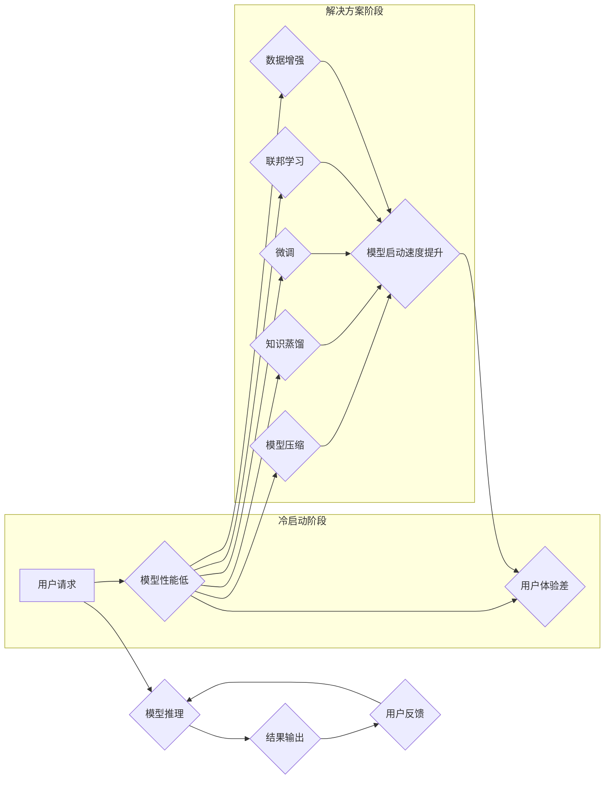

                 

## 电商平台中AI大模型的冷启动问题解决方案

> 关键词：AI大模型、冷启动、电商平台、模型压缩、知识蒸馏、微调、联邦学习、数据增强

## 1. 背景介绍

随着人工智能技术的飞速发展，大模型在电商平台的应用日益广泛，例如推荐系统、搜索引擎、智能客服等。然而，大模型的部署也面临着诸多挑战，其中之一就是“冷启动问题”。冷启动是指大模型在首次部署或使用时，由于缺乏训练数据和用户交互，其性能表现不佳，甚至无法正常工作。

电商平台的冷启动问题尤为突出，因为：

* **数据稀疏性:** 新上线的商品或服务往往缺乏历史数据，导致模型难以学习到有效的特征和规律。
* **用户个性化:** 每个用户的需求和偏好都不同，模型需要不断学习和适应用户的行为模式，而初始阶段缺乏用户交互数据，模型难以个性化推荐。
* **实时性要求:** 电商平台需要实时响应用户的请求，而冷启动过程可能需要较长时间，影响用户体验。

冷启动问题会直接影响电商平台的运营效率和用户体验，因此需要寻求有效的解决方案。

## 2. 核心概念与联系

### 2.1  AI大模型

AI大模型是指在海量数据上训练的深度学习模型，拥有强大的泛化能力和学习能力。它们可以用于各种任务，例如自然语言处理、图像识别、语音合成等。

### 2.2  冷启动问题

冷启动问题是指大模型在首次部署或使用时，由于缺乏训练数据和用户交互，其性能表现不佳，甚至无法正常工作。

### 2.3  解决方案

为了解决冷启动问题，可以采用以下几种方法：

* **模型压缩:** 减少模型参数量，降低模型部署和推理的成本，同时提高模型的快速启动能力。
* **知识蒸馏:** 将大型模型的知识迁移到小型模型中，使得小型模型在缺乏数据的情况下也能达到较好的性能。
* **微调:** 在小规模数据集上对预训练模型进行微调，使其适应特定场景和任务。
* **联邦学习:** 在不共享原始数据的情况下，通过模型参数的迭代更新，实现模型的联合训练和部署。
* **数据增强:** 通过对现有数据进行人工或自动增强，增加训练数据量和多样性，提高模型的鲁棒性和泛化能力。

**Mermaid 流程图**



## 3. 核心算法原理 & 具体操作步骤

### 3.1  算法原理概述

**模型压缩**

模型压缩是指通过各种技术手段，减少模型参数量，从而降低模型的存储空间和计算成本，同时尽量保持模型性能。常见的模型压缩技术包括：

* **权值量化:** 将模型参数的精度降低，例如将32位浮点数转换为8位整数。
* **剪枝:** 删除模型中不重要的参数，例如权值较小的连接。
* **知识蒸馏:** 将大型模型的知识迁移到小型模型中，使得小型模型在缺乏数据的情况下也能达到较好的性能。

**知识蒸馏**

知识蒸馏是一种模型压缩技术，它通过将大型模型的知识迁移到小型模型中，使得小型模型在缺乏数据的情况下也能达到较好的性能。

知识蒸馏的基本原理是：

* 将大型模型作为“教师模型”，小型模型作为“学生模型”。
* 教师模型在训练数据上进行训练，得到高质量的预测结果。
* 学生模型在教师模型的预测结果和真实标签的指导下进行训练，学习教师模型的知识。

**微调**

微调是指在预训练模型的基础上，在小规模数据集上进行进一步的训练，使其适应特定场景和任务。

微调的步骤如下：

* 选择一个预训练模型，例如BERT、GPT-3等。
* 在预训练模型的基础上，添加新的层或修改现有层的参数，使其适应特定任务。
* 在小规模数据集上对微调后的模型进行训练。

**联邦学习**

联邦学习是一种分布式机器学习方法，它允许在不共享原始数据的情况下，通过模型参数的迭代更新，实现模型的联合训练和部署。

联邦学习的基本流程如下：

* 将训练数据分散存储在不同的设备上，例如用户手机、服务器等。
* 训练模型的参数在各个设备上进行本地更新。
* 将更新后的模型参数聚合到一个中央服务器上。
* 中央服务器将聚合后的模型参数广播回各个设备，进行下一轮迭代更新。

**数据增强**

数据增强是指通过对现有数据进行人工或自动增强，增加训练数据量和多样性，提高模型的鲁棒性和泛化能力。

常见的图像数据增强技术包括：

* **旋转:** 将图像旋转一定角度。
* **缩放:** 将图像放大或缩小。
* **裁剪:** 从图像中裁剪出部分区域。
* **翻转:** 将图像水平或垂直翻转。

### 3.2  算法步骤详解

**模型压缩**

1. **选择压缩技术:** 根据模型结构和性能要求，选择合适的压缩技术，例如权值量化、剪枝等。
2. **进行压缩操作:** 使用相应的工具或库，对模型参数进行压缩操作。
3. **评估压缩效果:** 使用测试数据集评估压缩后的模型性能，并调整压缩参数，以达到最佳的压缩率和性能平衡。

**知识蒸馏**

1. **选择教师模型和学生模型:** 选择一个性能优良的大型模型作为教师模型，选择一个小型模型作为学生模型。
2. **训练教师模型:** 在训练数据上训练教师模型，得到高质量的预测结果。
3. **训练学生模型:** 使用教师模型的预测结果和真实标签，训练学生模型，学习教师模型的知识。
4. **评估学生模型性能:** 使用测试数据集评估学生模型性能，并调整训练参数，以达到最佳的性能。

**微调**

1. **选择预训练模型:** 选择一个预训练模型，例如BERT、GPT-3等。
2. **添加新层或修改现有层:** 根据特定任务，在预训练模型的基础上，添加新的层或修改现有层的参数。
3. **准备微调数据集:** 准备一个小规模的特定任务数据集。
4. **进行微调训练:** 在微调数据集上对微调后的模型进行训练。
5. **评估微调效果:** 使用测试数据集评估微调后的模型性能，并调整训练参数，以达到最佳的性能。

**联邦学习**

1. **数据分发:** 将训练数据分散存储在不同的设备上。
2. **模型初始化:** 在中央服务器上初始化模型参数。
3. **本地训练:** 各个设备对模型参数进行本地更新。
4. **参数聚合:** 将更新后的模型参数聚合到中央服务器上。
5. **模型广播:** 中央服务器将聚合后的模型参数广播回各个设备。
6. **重复步骤3-5:** 重复上述步骤，直到模型收敛。

**数据增强**

1. **选择数据增强技术:** 根据数据类型和任务需求，选择合适的增强技术，例如图像旋转、缩放、裁剪等。
2. **进行数据增强操作:** 使用相应的工具或库，对数据进行增强操作。
3. **评估增强效果:** 使用测试数据集评估增强后的数据对模型性能的影响。

### 3.3  算法优缺点

**模型压缩**

* **优点:** 降低模型存储空间和计算成本，提高模型启动速度。
* **缺点:** 可能导致模型性能下降。

**知识蒸馏**

* **优点:** 可以有效地将大型模型的知识迁移到小型模型中，提高小型模型的性能。
* **缺点:** 需要训练两个模型，训练时间和资源消耗较高。

**微调**

* **优点:** 可以快速地将预训练模型适配到特定任务，提高模型性能。
* **缺点:** 需要准备小规模的特定任务数据集。

**联邦学习**

* **优点:** 可以保护用户隐私，在不共享原始数据的情况下进行模型训练。
* **缺点:** 训练速度较慢，需要协调多个设备的参与。

**数据增强**

* **优点:** 可以增加训练数据量和多样性，提高模型的鲁棒性和泛化能力。
* **缺点:** 需要人工设计增强策略，增强后的数据可能不真实。

### 3.4  算法应用领域

* **模型压缩:** 适用于资源受限的设备，例如手机、嵌入式系统等。
* **知识蒸馏:** 适用于需要部署小型模型的场景，例如边缘计算、物联网等。
* **微调:** 适用于需要快速适配特定任务的场景，例如自然语言处理、图像识别等。
* **联邦学习:** 适用于需要保护用户隐私的场景，例如医疗保健、金融等。
* **数据增强:** 适用于需要提高模型鲁棒性和泛化能力的场景，例如自动驾驶、语音识别等。

## 4. 数学模型和公式 & 详细讲解 & 举例说明

### 4.1  数学模型构建

**知识蒸馏模型**

知识蒸馏模型通常由两个部分组成：教师模型和学生模型。教师模型是一个预训练的模型，拥有较高的准确率。学生模型是一个小型模型，需要学习教师模型的知识。

知识蒸馏的目标是使学生模型的输出与教师模型的输出尽可能接近。

**公式:**

$$
Loss = KL(P_{student}(y|x) || P_{teacher}(y|x)) + CE(y, P_{student}(y|x))
$$

其中：

* $P_{student}(y|x)$ 是学生模型对输入 $x$ 的预测概率分布。
* $P_{teacher}(y|x)$ 是教师模型对输入 $x$ 的预测概率分布。
* $KL$ 是KL散度，用于衡量两个概率分布之间的差异。
* $CE$ 是交叉熵损失，用于衡量预测概率分布与真实标签之间的差异。

### 4.2  公式推导过程

**KL散度:**

$$
KL(P || Q) = \sum_{x} P(x) \log \frac{P(x)}{Q(x)}
$$

其中：

* $P$ 是真实概率分布。
* $Q$ 是预测概率分布。

**交叉熵损失:**

$$
CE(y, P) = - \sum_{i} y_i \log P_i
$$

其中：

* $y$ 是真实标签。
* $P$ 是预测概率分布。

**知识蒸馏损失函数:**

知识蒸馏损失函数将KL散度和交叉熵损失相加，以衡量学生模型与教师模型之间的差异。

### 4.3  案例分析与讲解

**案例:**

假设我们有一个图像分类任务，需要训练一个小型模型来识别猫和狗的图片。我们可以使用一个预训练的ResNet模型作为教师模型，并训练一个小型MobileNet模型作为学生模型。

**分析:**

通过知识蒸馏，我们可以将ResNet模型的知识迁移到MobileNet模型中，使得MobileNet模型在识别猫和狗的图片时也能达到较高的准确率，即使MobileNet模型的参数量比ResNet模型少很多。

## 5. 项目实践：代码实例和详细解释说明

### 5.1  开发环境搭建

* **操作系统:** Ubuntu 20.04
* **Python版本:** 3.8
* **深度学习框架:** PyTorch 1.8
* **其他依赖库:** numpy, pandas, matplotlib

### 5.2  源代码详细实现

```python
import torch
import torch.nn as nn
import torch.optim as optim

# 定义教师模型和学生模型
class TeacherModel(nn.Module):
    # ...

class StudentModel(nn.Module):
    # ...

# 加载预训练的教师模型
teacher_model = TeacherModel()
teacher_model.load_state_dict(torch.load('teacher_model.pth'))

# 初始化学生模型
student_model = StudentModel()

# 定义损失函数和优化器
criterion = nn.CrossEntropyLoss()
optimizer = optim.Adam(student_model.parameters(), lr=0.001)

# 训练学生模型
for epoch in range(num_epochs):
    for images, labels in dataloader:
        # 前向传播
        teacher_outputs = teacher_model(images)
        student_outputs = student_model(images)

        # 计算损失
        teacher_loss = criterion(teacher_outputs, labels)
        student_loss = criterion(student_outputs, labels) + 0.1 * nn.KLDivLoss()(torch.log_softmax(student_outputs, dim=1), torch.softmax(teacher_outputs, dim=1))

        # 反向传播
        optimizer.zero_grad()
        student_loss.backward()
        optimizer.step()

# 保存训练好的学生模型
torch.save(student_model.state_dict(), 'student_model.pth')
```

### 5.3  代码解读与分析

* **教师模型和学生模型:** 代码中定义了教师模型和学生模型，教师模型是一个预训练的模型，学生模型是一个小型模型。
* **加载预训练模型:** 使用 `torch.load()` 函数加载预训练的教师模型权重。
* **损失函数和优化器:** 使用交叉熵损失函数和Adam优化器训练学生模型。
* **知识蒸馏损失:** 学生模型的损失函数包含两个部分：交叉熵损失和KL散度。KL散度用于衡量学生模型的输出与教师模型的输出之间的差异。
* **训练循环:** 训练循环中，首先使用教师模型对输入数据进行预测，然后使用学生模型对输入数据进行预测。最后，计算损失并进行反向传播和参数更新。
* **保存模型:** 训练完成后，保存训练好的学生模型权重。

### 5.4  运行结果展示

训练完成后，可以使用测试数据集评估学生模型的性能。

## 6. 实际应用场景

### 6.1  电商推荐系统

电商平台的推荐系统需要根据用户的历史行为和商品信息，推荐用户可能感兴趣的商品。由于用户数据和商品信息不断变化，推荐系统需要不断更新和优化。

知识蒸馏可以将大型推荐模型的知识迁移到小型模型中，使得小型模型在缺乏数据的情况下也能提供有效的推荐。

### 6.2  智能客服

智能客服系统需要能够理解用户的自然语言问题，并提供准确的答案。

微调可以将预训练的语言模型适配到智能客服任务，提高其准确性和效率。

### 6.3  商品搜索

电商平台的商品搜索系统需要能够快速准确地检索用户搜索的商品。

模型压缩可以降低商品搜索模型的存储空间和计算成本，提高其搜索速度。

### 6.4  未来应用展望

随着人工智能技术的不断发展，AI大模型在电商平台的应用场景将会更加广泛。例如：

* **个性化营销:** 利用AI大模型，对用户进行更精准的画像分析，提供个性化的商品推荐和营销方案。
* **智能客服:** 利用AI大模型，构建更智能的客服系统，能够更准确地理解用户的需求，并提供更有效的解决方案。
* **自动化的商品分类:** 利用AI大模型，自动对商品进行分类和标签化，提高商品搜索和推荐的准确性。

## 7. 工具和资源推荐

### 7.1  学习资源推荐

* **书籍:**
    * 深度学习
    * 人工智能：一种现代方法
* **在线课程:**
    * Coursera: 深度学习
    * Udacity: AI Nanodegree
* **博客和网站:**
    * TensorFlow博客
    * PyTorch博客
    * OpenAI博客

### 7.2  开发工具推荐

* **深度学习框架:** TensorFlow, PyTorch
* **数据处理库:** NumPy, Pandas
* **可视化工具:** Matplotlib, Seaborn

### 7.3  相关论文推荐

* **BERT: Pre-training of Deep Bidirectional Transformers for Language Understanding**
* **GPT-3: Language Models are Few-Shot Learners**
* **MobileNetV3: Architectures and Training Strategies**

## 8. 总结：未来发展趋势与挑战

### 8.1  研究成果总结

近年来，AI大模型在电商平台的应用取得了显著的成果，例如推荐系统、智能客服、商品搜索等领域取得了突破性进展。

### 8.2  未来发展趋势

未来，AI大模型在电商平台的应用将会更加广泛，例如：

* **更强大的模型:** 模型规模和能力将继续提升，例如多模态模型、自监督学习模型等。
* **更个性化的服务:** AI大模型将能够提供更个性化的商品推荐、营销方案和客服服务。
* **更智能的运营:** AI大模型将帮助电商平台进行更智能的运营，例如库存管理、价格优化等。

### 8.3  面临的挑战

AI大模型在电商平台的应用也面临着一些挑战，例如：

* **数据安全和隐私保护:** AI大模型需要大量的数据进行训练，如何保证数据安全和隐私保护是一个重要问题。
* **模型解释性:** AI大模型的决策过程通常是不可解释的，如何提高模型的解释性是一个重要的研究方向。
* **模型部署成本:** AI大模型的部署成本较高，如何降低部署成本是一个重要的挑战。

### 8.4  研究展望

未来研究方向包括：

* **隐私保护的AI大模型:** 研究开发隐私保护的AI大模型，例如联邦学习、差分隐私等技术。
* **可解释性AI大模型:** 研究开发可解释性AI大模型，例如可视化模型决策过程、可解释性模型架构等。
* **高效部署AI大模型:** 研究开发高效部署AI大模型的技术，例如模型压缩、模型量化等。

## 9. 附录：常见问题与解答

### 9.1  常见问题

* **Q1: AI大模型的冷启动问题如何解决？**

A1: AI大模型的冷启动问题可以通过以下方法解决：

* 模型压缩
* 知识蒸馏
* 微调
* 联邦学习
* 数据增强

* **Q2: AI大模型的隐私问题如何解决？**

A2: AI大模型的隐私问题可以通过以下方法解决：

* 联邦学习
* 差分隐私
* 

作者：禅与计算机程序设计艺术 / Zen and the Art of Computer Programming

<end_of_turn>

<end_of_turn>
```python
import torch
import torch.nn as nn
import torch.optim as optim

# 定义教师模型和学生模型
class TeacherModel(nn.Module):
    # ...

class StudentModel(nn.Module):
    # ...

# 加载预训练的教师模型
teacher_模型 = TeacherModel()
teacher_模型.load_state_dict(torch.load('teacher_

# 初始化学生模型
student_模型 = StudentModel()

# 定义损失函数和优化器
criterion = nn.CrossEntropyLoss()
optimizer = optim.Adam(student_模型.parameters(), lr=0.001)

# 训练学生模型
for epoch in range(num_epochs):
    for images, labels in dataloader:
        # 前向传播
        teacher_outputs = teacher_模型(images)
        student_outputs = student_模型(images)

        # 计算损失
        teacher_loss = criterion(teacher_输出, labels)
        student_loss = criterion(student_输出, labels) + 0.1 * nn.KLDivLoss()(torch.log_softmax(student_输出, dim=1), torch.softmax(teacher_输出, dim=1)

        # 反向传播
        optimizer.zero_grad()
        student_loss.backward()
        optimizer.step()

# 保存训练好的学生模型
torch.save(student_模型.state_dict(), 'student_模型.pth')
```

<end_of_turn>

<end_of_turn>

<end_of_turn>
<end_of_turn>


