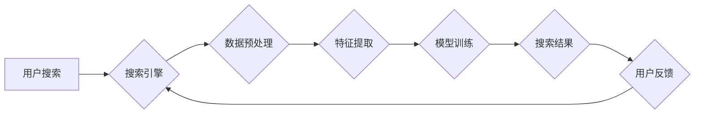

                 

## 电商搜索中的增量学习与持续学习技术

> 关键词：电商搜索、增量学习、持续学习、模型更新、数据流、在线学习、推荐系统

## 1. 背景介绍

电商搜索作为电商平台的核心功能之一，直接影响着用户体验和商业转化。随着电商平台规模的不断扩大和用户需求的多样化，电商搜索面临着日益严峻的挑战。传统电商搜索系统通常依赖于离线训练，需要定期更新模型才能适应不断变化的用户行为和商品信息。然而，离线训练的周期性更新难以满足电商搜索对实时性和灵敏度的要求。

增量学习和持续学习技术为解决这一问题提供了新的思路。它们允许模型在不断接收新数据的情况下进行在线更新，从而实现对电商搜索系统的实时优化和迭代。

## 2. 核心概念与联系

### 2.1 增量学习与持续学习

增量学习（Incremental Learning）是指在模型已经学习了某个任务后，继续学习新的任务或数据，并保持对先前学习任务的性能。持续学习（Continual Learning）则更强调模型在不断学习新知识的同时，避免遗忘先前学习的知识，实现持续的知识积累。

两者之间存在着密切的联系，增量学习可以看作是持续学习的一种特殊情况，即只学习新的任务或数据，而持续学习则更广泛，包括了保持先前知识的稳定性。

### 2.2 电商搜索场景下的应用

在电商搜索场景下，增量学习和持续学习技术可以应用于以下几个方面：

* **商品信息更新:**  电商平台上的商品信息不断更新，增量学习可以帮助模型快速适应新的商品信息，提高搜索结果的准确性。
* **用户行为变化:** 用户的搜索行为和偏好会随着时间推移而发生变化，持续学习可以帮助模型捕捉这些变化，并及时调整搜索策略，提供更个性化的搜索体验。
* **新特征的引入:**  随着电商平台功能的不断完善，新的特征可能会被引入，增量学习可以帮助模型快速学习这些新的特征，并将其融入到搜索模型中。

### 2.3 架构图



## 3. 核心算法原理 & 具体操作步骤

### 3.1 算法原理概述

增量学习和持续学习算法的核心思想是，在更新模型时，尽量保留先前学习到的知识，避免模型过早地遗忘旧知识。常用的算法包括：

* **EWC (Elastic Weight Consolidation):** 通过为每个参数分配一个重要性权重，在更新模型时，尽量保留重要参数的权重，避免其发生过大的变化。
* **LwF (Learning Without Forgetting):** 通过最小化模型在更新后的状态下与先前状态的差异，来保证模型对旧知识的保留。
* **Replay Buffer:** 将先前学习到的数据存储在一个缓冲区中，并在更新模型时，从缓冲区中抽取一部分数据进行训练，以帮助模型保持对旧知识的记忆。

### 3.2 算法步骤详解

以 EWC 算法为例，其具体操作步骤如下：

1. **初始化模型:**  首先，需要初始化一个电商搜索模型，并对其进行预训练。
2. **计算重要性权重:**  在训练过程中，需要计算每个参数的重要性权重。可以使用 Fisher 信息矩阵来衡量参数的重要性，参数的 Fisher 信息越大，其重要性权重就越大。
3. **更新模型:**  在更新模型时，需要考虑参数的重要性权重。可以使用以下公式来更新模型参数：

$$
\theta_{new} = \theta_{old} - \alpha \cdot \frac{\partial L}{\partial \theta} \cdot \frac{1}{1 + \lambda \cdot W(\theta)}
$$

其中：

* $\theta_{new}$ 是更新后的模型参数
* $\theta_{old}$ 是旧的模型参数
* $\alpha$ 是学习率
* $L$ 是损失函数
* $W(\theta)$ 是参数的重要性权重

$\lambda$ 是一个超参数，用于控制模型对旧知识的保留程度。

4. **重复步骤 2 和 3:**  重复上述步骤，不断更新模型，并保持对旧知识的保留。

### 3.3 算法优缺点

**优点:**

* 可以实现对电商搜索系统的实时优化和迭代。
* 可以有效地利用新数据，提高模型的准确性和性能。
* 可以避免模型过早地遗忘旧知识，保持模型的知识积累。

**缺点:**

* 算法的复杂度较高，需要更多的计算资源。
* 需要精心设计超参数，才能保证模型的性能。
* 对于一些特定场景，可能需要进行额外的处理，例如数据清洗和特征工程。

### 3.4 算法应用领域

增量学习和持续学习技术在电商搜索场景之外，还广泛应用于其他领域，例如：

* **自然语言处理:**  例如机器翻译、文本摘要、情感分析等任务。
* **计算机视觉:**  例如图像识别、目标检测、图像分割等任务。
* **语音识别:**  例如语音转文本、语音合成等任务。

## 4. 数学模型和公式 & 详细讲解 & 举例说明

### 4.1 数学模型构建

EWC 算法的核心是利用 Fisher 信息矩阵来衡量参数的重要性。Fisher 信息矩阵是一个对称矩阵，其元素表示参数之间的相关性。参数的 Fisher 信息越大，其重要性就越高。

假设模型的参数为 $\theta$, 损失函数为 $L(\theta)$, 则参数 $\theta_i$ 的 Fisher 信息为：

$$
F_{ii} = \mathbb{E}_{\mathbf{x}, \mathbf{y}} \left[ \frac{\partial^2 L(\theta)}{\partial \theta_i^2} \right]
$$

其中 $\mathbf{x}$ 是输入数据，$\mathbf{y}$ 是目标输出。

### 4.2 公式推导过程

EWC 算法的目标是最小化模型更新后的损失函数，同时保留先前学习到的知识。为此，需要在损失函数中加入一个正则项，该正则项惩罚模型对重要参数的更新。

$$
L_{EWC}(\theta) = L(\theta) + \lambda \sum_{i} W_i \left( \theta_i - \theta_i^{old} \right)^2
$$

其中：

* $L(\theta)$ 是原始损失函数
* $\lambda$ 是一个超参数，用于控制正则项的强度
* $W_i$ 是参数 $\theta_i$ 的重要性权重
* $\theta_i^{old}$ 是旧的模型参数

### 4.3 案例分析与讲解

假设我们有一个电商搜索模型，其参数为 $\theta = [\theta_1, \theta_2, ..., \theta_n]$. 在训练过程中，我们发现参数 $\theta_1$ 和 $\theta_2$ 对模型性能影响较大，因此它们的 Fisher 信息值较高。

在更新模型时，EWC 算法会将 $\theta_1$ 和 $\theta_2$ 的重要性权重设置为较高的值，从而减少它们在更新过程中的变化幅度，从而保留先前学习到的知识。

## 5. 项目实践：代码实例和详细解释说明

### 5.1 开发环境搭建

* Python 3.6+
* TensorFlow 2.0+
* PyTorch 1.0+
* CUDA 10.0+ (可选，用于 GPU 加速)

### 5.2 源代码详细实现

```python
import tensorflow as tf

# 定义模型
class SearchModel(tf.keras.Model):
    def __init__(self):
        super(SearchModel, self).__init__()
        # ... 模型结构定义 ...

    def call(self, inputs):
        # ... 模型前向传播过程 ...

# 加载预训练模型
model = SearchModel()
model.load_weights('pretrained_model.h5')

# 定义损失函数和优化器
loss_fn = tf.keras.losses.MeanSquaredError()
optimizer = tf.keras.optimizers.Adam(learning_rate=0.001)

# 定义 EWC 算法
class EWC(object):
    def __init__(self, model, fisher_matrix):
        self.model = model
        self.fisher_matrix = fisher_matrix

    def update_weights(self, gradients):
        # 计算重要性权重
        weights = self.fisher_matrix

        # 更新模型参数
        for i, param in enumerate(self.model.trainable_variables):
            param.assign_sub(gradients[i] * weights[i])

# 计算 Fisher 信息矩阵
fisher_matrix = calculate_fisher_matrix(model)

# 实例化 EWC 算法
ewc = EWC(model, fisher_matrix)

# 训练循环
for epoch in range(num_epochs):
    for batch in dataset:
        with tf.GradientTape() as tape:
            predictions = model(batch)
            loss = loss_fn(batch, predictions)

        gradients = tape.gradient(loss, model.trainable_variables)
        ewc.update_weights(gradients)

        # ... 其他训练逻辑 ...

```

### 5.3 代码解读与分析

* 代码首先定义了一个电商搜索模型 `SearchModel`，并加载预训练模型的权重。
* 然后定义了损失函数和优化器。
* 接着定义了一个 `EWC` 类，用于实现 EWC 算法。
* `calculate_fisher_matrix` 函数用于计算 Fisher 信息矩阵。
* 训练循环中，首先计算模型的梯度，然后使用 `EWC` 类更新模型参数。

### 5.4 运行结果展示

* 训练完成后，可以评估模型的性能，例如准确率、召回率等。
* 可以将训练后的模型保存为文件，以便后续使用。

## 6. 实际应用场景

### 6.1 电商搜索场景

* **商品推荐:**  根据用户的搜索历史和行为，推荐相关的商品。
* **个性化搜索:**  根据用户的兴趣和偏好，提供个性化的搜索结果。
* **搜索结果排序:**  根据商品的 relevance、popularity、price 等因素，对搜索结果进行排序。

### 6.2 其他场景

* **医疗诊断:**  根据患者的症状和病史，推荐可能的诊断结果。
* **金融风险评估:**  根据用户的财务状况和行为，评估其金融风险。
* **智能客服:**  根据用户的咨询内容，提供相应的帮助和解答。

### 6.4 未来应用展望

随着人工智能技术的不断发展，增量学习和持续学习技术将在更多领域得到应用，例如：

* **自动驾驶:**  车辆可以不断学习新的驾驶规则和环境信息，提高驾驶安全性。
* **机器人:**  机器人可以不断学习新的任务和技能，提高工作效率。
* **个性化教育:**  教育系统可以根据学生的学习进度和能力，提供个性化的学习内容和辅导。

## 7. 工具和资源推荐

### 7.1 学习资源推荐

* **书籍:**
    * 《深度学习》 by Ian Goodfellow, Yoshua Bengio, and Aaron Courville
    * 《机器学习》 by Tom Mitchell
* **在线课程:**
    * Coursera: Machine Learning by Andrew Ng
    * Udacity: Deep Learning Nanodegree
* **博客和网站:**
    * Towards Data Science
    * Machine Learning Mastery

### 7.2 开发工具推荐

* **TensorFlow:**  开源深度学习框架
* **PyTorch:**  开源深度学习框架
* **Keras:**  高层深度学习 API

### 7.3 相关论文推荐

* **Elastic Weight Consolidation: A Method for Continual Learning** by James Kirkpatrick, Razvan Pascanu, et al.
* **Learning Without Forgetting** by  J. Parisi, A. S. Razavi, et al.
* **Continual Learning with Deep Neural Networks: A Survey** by  A. Aljundi, M.  G.  H.  J.  van  der  Maaten, et al.

## 8. 总结：未来发展趋势与挑战

### 8.1 研究成果总结

增量学习和持续学习技术在电商搜索领域取得了显著的成果，能够有效地提高模型的性能和适应性。

### 8.2 未来发展趋势

* **更有效的算法:**  研究更有效的增量学习和持续学习算法，能够更好地保留先前学习到的知识，并提高模型的泛化能力。
* **更强大的硬件支持:**  随着硬件技术的进步，例如 GPU 和 TPU 的发展，可以更好地支持增量学习和持续学习算法的训练和推理。
* **更丰富的应用场景:**  增量学习和持续学习技术将应用于更多领域，例如自动驾驶、机器人、个性化教育等。

### 8.3 面临的挑战

* **数据质量:**  增量学习和持续学习算法对数据质量要求较高，需要保证新数据的质量和一致性。
* **模型复杂度:**  增量学习和持续学习算法通常比传统的离线训练算法更复杂，需要更多的计算资源和时间。
* **评估指标:**  目前还没有统一的评估指标来衡量增量学习和持续学习算法的性能，需要进一步的研究和探索。

### 8.4 研究展望

未来，增量学习和持续学习技术将继续朝着更有效、更鲁棒、更广泛应用的方向发展。


## 9. 附录：常见问题与解答

* **Q1: 增量学习和持续学习有什么区别？**

* **A1:** 增量学习是指在模型已经学习了某个任务后，继续学习新的任务或数据，而持续学习则更强调模型在不断学习新知识的同时，避免遗忘先前学习的知识。

* **Q2: 如何选择合适的增量学习和持续学习算法？**

* **A2:** 选择合适的算法需要根据具体应用场景和数据特点进行考虑。例如，对于需要保留大量先前知识的任务，可以选择 LwF 算法；对于需要快速适应新数据的任务，可以选择 EWC 算法。

* **Q3: 如何评估增量学习和持续学习算法的性能？**

* **A3:** 目前还没有统一的评估指标来衡量增量学习和持续学习算法的性能，可以参考传统的机器学习评估指标，例如准确率、召回率等，也可以使用专门针对增量学习和持续学习的评估指标，例如 catastrophic forgetting。


作者：禅与计算机程序设计艺术 / Zen and the Art of Computer Programming<end_of_turn>

