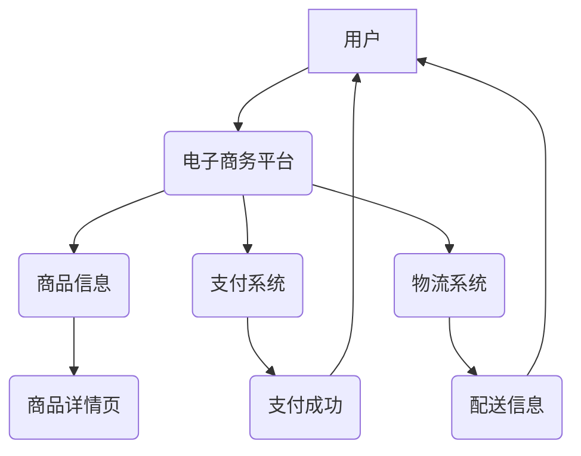

                 

## 电子商务创业：数字时代的零售革命

> 关键词：电子商务、零售革命、云计算、大数据、人工智能、机器学习、移动支付

### 1. 背景介绍

电子商务的兴起标志着零售业的深刻变革，它以其便捷性、高效性和个性化服务，迅速改变了消费者的购物习惯。从传统的实体店到线上平台，零售业的数字化转型正在加速推进，为企业带来了新的机遇和挑战。

**1.1 电子商务的崛起**

互联网技术的飞速发展为电子商务的蓬勃发展提供了坚实的基础。宽带网络、移动互联网、电子支付等技术的成熟，使得消费者能够随时随地在线购物，享受更加便捷的购物体验。

**1.2 零售业的数字化转型**

面对电子商务的冲击，传统零售企业不得不进行数字化转型，以适应新的市场环境。许多企业开始建立线上平台，拓展线上销售渠道，并利用数据分析、人工智能等技术提升运营效率和客户体验。

**1.3 电子商务创业的机遇**

电子商务创业为新兴企业提供了广阔的市场空间。通过创新产品、服务和商业模式，新兴企业能够在电子商务领域占据一席之地。

### 2. 核心概念与联系

电子商务的核心概念包括：

* **电子交易:** 通过网络进行商品、服务或信息交易。
* **电子支付:** 使用电子方式进行支付，例如信用卡、支付宝、微信支付等。
* **电子物流:** 通过网络平台进行商品配送和管理。
* **电子营销:** 利用网络平台进行产品推广和销售。

这些概念相互关联，共同构成了电子商务的生态系统。

**2.1 电子商务架构**



### 3. 核心算法原理 & 具体操作步骤

电子商务平台的运营离不开各种算法的支持，例如推荐算法、搜索算法、价格算法等。

**3.1 算法原理概述**

推荐算法旨在根据用户的历史行为、偏好和兴趣，推荐相关的商品或服务。搜索算法则负责根据用户的搜索关键词，快速准确地返回相关结果。价格算法则根据市场需求、成本、竞争等因素，制定合理的商品价格。

**3.2 算法步骤详解**

推荐算法的具体步骤通常包括：

1. **数据收集:** 收集用户的行为数据，例如浏览历史、购买记录、评价等。
2. **数据预处理:** 对收集到的数据进行清洗、转换和特征提取。
3. **模型训练:** 使用机器学习算法，训练推荐模型。
4. **推荐结果生成:** 根据用户的特征和模型预测，生成推荐结果。

**3.3 算法优缺点**

推荐算法的优点在于能够个性化推荐商品，提升用户体验。缺点在于可能会出现推荐偏差，例如过滤泡和冷启动问题。

**3.4 算法应用领域**

推荐算法广泛应用于电子商务平台、社交媒体、视频网站等领域。

### 4. 数学模型和公式 & 详细讲解 & 举例说明

**4.1 数学模型构建**

推荐算法通常使用协同过滤模型，该模型基于用户的相似度和商品的相似度进行推荐。

**4.2 公式推导过程**

协同过滤模型的评分预测公式如下：

$$
r_{ui} = \mu + b_u + b_i + \epsilon_{ui}
$$

其中：

* $r_{ui}$ 表示用户 $u$ 对商品 $i$ 的评分。
* $\mu$ 表示全局平均评分。
* $b_u$ 表示用户 $u$ 的偏差。
* $b_i$ 表示商品 $i$ 的偏差。
* $\epsilon_{ui}$ 表示评分误差。

**4.3 案例分析与讲解**

假设用户 $A$ 对电影 $X$ 评分为 5，用户 $B$ 对电影 $Y$ 评分为 4，用户 $A$ 和用户 $B$ 的兴趣相似度为 0.8。根据协同过滤模型，我们可以预测用户 $A$ 对电影 $Y$ 的评分。

### 5. 项目实践：代码实例和详细解释说明

**5.1 开发环境搭建**

电子商务平台的开发环境通常包括：

* 操作系统：Linux、Windows 或 macOS
* 编程语言：Python、Java 或 PHP
* 数据库：MySQL、PostgreSQL 或 MongoDB
* Web 服务器：Apache、Nginx 或 IIS

**5.2 源代码详细实现**

以下是一个简单的电子商务平台代码示例，使用 Python 和 Flask 框架实现：

```python
from flask import Flask, render_template

app = Flask(__name__)

@app.route('/')
def index():
    return render_template('index.html')

if __name__ == '__main__':
    app.run(debug=True)
```

**5.3 代码解读与分析**

这段代码定义了一个简单的 Flask 应用，在访问根路径 '/' 时，渲染 index.html 模板。

**5.4 运行结果展示**

运行代码后，访问 http://127.0.0.1:5000/，将会显示 index.html 模板的内容。

### 6. 实际应用场景

电子商务平台广泛应用于各种行业，例如：

* **服装零售:** 线上服装店、品牌旗舰店
* **电子产品零售:** 手机、电脑、家电等
* **食品饮料零售:** 生鲜食品、酒水饮料
* **旅游服务:** 机票、酒店、旅游套餐

**6.4 未来应用展望**

未来，电子商务平台将更加智能化、个性化和体验化。例如：

* **人工智能驱动的个性化推荐:** 更精准地推荐用户感兴趣的商品。
* **虚拟现实和增强现实技术的应用:** 提供更加沉浸式的购物体验。
* **区块链技术的应用:** 加强数据安全和交易透明度。

### 7. 工具和资源推荐

**7.1 学习资源推荐**

* **书籍:** 《电子商务原理与实践》、《电子商务技术》
* **在线课程:** Coursera、edX、Udemy 等平台上的电子商务课程
* **博客和论坛:** 电子商务相关的博客和论坛，例如 Shopify Blog、Magento Community

**7.2 开发工具推荐**

* **电商平台搭建:** Shopify、Magento、WooCommerce
* **前端开发:** HTML、CSS、JavaScript、React、Vue.js
* **后端开发:** Python、Java、PHP、Node.js
* **数据库:** MySQL、PostgreSQL、MongoDB

**7.3 相关论文推荐**

* **电子商务推荐系统:** 《Collaborative Filtering for Recommending Products》
* **电子商务搜索引擎:** 《A Survey of Information Retrieval Models for E-Commerce》
* **电子商务安全:** 《Blockchain Technology for E-Commerce Security》

### 8. 总结：未来发展趋势与挑战

**8.1 研究成果总结**

电子商务创业在数字时代取得了显著的成就，为消费者提供了更加便捷、高效的购物体验。

**8.2 未来发展趋势**

未来，电子商务将更加智能化、个性化和体验化，并与其他技术融合发展，例如人工智能、物联网、区块链等。

**8.3 面临的挑战**

电子商务创业也面临着一些挑战，例如：

* **竞争激烈:** 电子商务市场竞争激烈，新兴企业需要不断创新才能脱颖而出。
* **数据安全:** 电子商务平台需要保障用户数据的安全和隐私。
* **物流配送:** 物流配送成本和效率是电子商务平台运营的重要因素。

**8.4 研究展望**

未来研究方向包括：

* **更精准的推荐算法:** 利用人工智能技术，开发更精准的推荐算法，提升用户体验。
* **更安全的电子商务平台:** 研究新的安全技术，保障用户数据的安全和隐私。
* **更智能的物流配送系统:** 利用物联网和人工智能技术，构建更智能的物流配送系统，降低成本和提高效率。

### 9. 附录：常见问题与解答

**9.1 如何选择合适的电子商务平台？**

选择电子商务平台需要考虑以下因素：

* **平台功能:** 平台是否提供所需的商品管理、订单管理、支付处理等功能。
* **平台费用:** 平台的月租费、交易费等费用是否合理。
* **平台用户群体:** 平台的用户群体是否符合自己的目标客户。
* **平台技术支持:** 平台是否提供完善的技术支持。

**9.2 如何提高电子商务平台的流量？**

提高电子商务平台流量的方法包括：

* **搜索引擎优化 (SEO):** 优化网站内容和结构，提高搜索引擎排名。
* **社交媒体营销:** 利用社交媒体平台推广产品和服务。
* **内容营销:** 创建优质的内容，吸引用户访问网站。
* **付费广告:** 在搜索引擎和社交媒体平台投放广告。


作者：禅与计算机程序设计艺术 / Zen and the Art of Computer Programming 
<end_of_turn>

