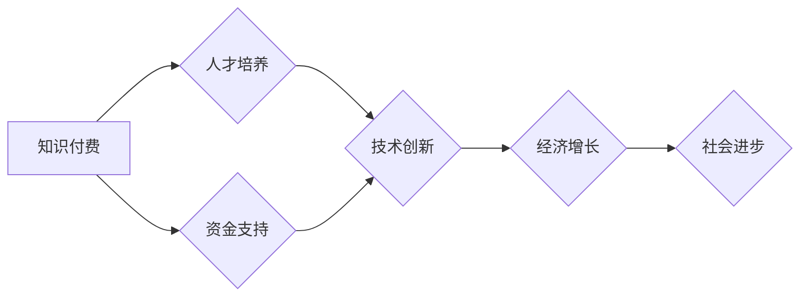

                 

## 知识付费与技术创新的双向促进

> 关键词：知识付费、技术创新、知识共享、在线教育、技术发展、经济增长、人才培养、学习模式

### 1. 背景介绍

在当今数字时代，知识已成为最宝贵的资源，而技术创新则是推动社会进步的引擎。知识付费和技术创新相互交织，共同构成了推动经济发展和社会进步的强大力量。

知识付费是指以知识、技能、经验等为核心内容，通过付费的方式获取和传播知识的行为。近年来，随着互联网技术的快速发展和移动互联网的普及，知识付费市场呈现出爆发式增长。在线课程、付费咨询、知识库订阅等多种知识付费模式层出不穷，为人们提供了便捷高效的学习途径。

技术创新是指利用科学原理和技术手段，创造出新的产品、服务或生产方式的过程。技术创新是推动经济发展和社会进步的根本动力，也是国家竞争力的关键所在。

### 2. 核心概念与联系

#### 2.1 知识付费

知识付费的核心概念是将知识和技能作为商品，通过付费的方式进行交易。它打破了传统知识传播的壁垒，让更多人有机会获取高质量的知识和技能。

#### 2.2 技术创新

技术创新的核心概念是利用科学原理和技术手段，创造出新的产品、服务或生产方式。它推动了社会进步，改善了人们的生活水平。

#### 2.3 双向促进关系

知识付费和技术创新之间存在着密切的双向促进关系：

* **知识付费促进技术创新：** 知识付费为技术创新提供了人才和资金支持。通过付费学习，人们可以掌握更先进的技术知识和技能，为技术创新的发展提供人才保障。同时，知识付费平台也为技术创新项目提供了融资渠道，帮助技术创新项目获得资金支持。

* **技术创新促进知识付费：** 技术创新推动了知识付费模式的创新发展。例如，互联网技术的发展使得在线课程、知识库订阅等知识付费模式得以快速发展。同时，技术创新也提高了知识付费的效率和质量，例如，人工智能技术可以用于个性化推荐和知识评估，提升用户学习体验。

**Mermaid 流程图**



### 3. 核心算法原理 & 具体操作步骤

#### 3.1 算法原理概述

知识付费和技术创新的双向促进关系可以看作是一个复杂的系统，其中涉及到多种算法和模型。例如，推荐算法可以根据用户的学习兴趣和行为数据，推荐相关的知识付费课程；机器学习算法可以用于知识评估和个性化学习路径规划。

#### 3.2 算法步骤详解

* **推荐算法：**

    1. 收集用户数据：包括用户的学习历史、兴趣偏好、行为数据等。
    2. 数据预处理：对收集到的数据进行清洗、转换和特征提取。
    3. 建立推荐模型：根据用户数据，训练推荐模型，例如协同过滤、内容过滤、深度学习等。
    4. 生成推荐结果：根据用户的当前状态和模型预测，生成个性化的知识付费课程推荐。

* **机器学习算法：**

    1. 数据收集和预处理：收集知识付费平台的用户学习数据，并进行清洗、转换和特征提取。
    2. 模型选择：根据任务目标，选择合适的机器学习模型，例如分类、回归、聚类等。
    3. 模型训练：使用训练数据训练机器学习模型，并进行参数调优。
    4. 模型评估：使用测试数据评估模型的性能，并进行调整和优化。

#### 3.3 算法优缺点

* **推荐算法：**

    * **优点：** 可以根据用户的个性化需求，推荐更相关的知识付费课程，提高用户学习体验。
    * **缺点：** 需要大量的用户数据进行训练，容易出现数据偏差和冷启动问题。

* **机器学习算法：**

    * **优点：** 可以自动学习知识付费平台的用户行为模式，并进行智能化决策，例如知识评估、个性化学习路径规划等。
    * **缺点：** 需要专业的机器学习知识和技术，模型训练和部署成本较高。

#### 3.4 算法应用领域

* **推荐系统：** 为用户推荐相关的知识付费课程、书籍、文章等。
* **知识评估：** 自动评估用户的学习成果，并提供个性化的学习建议。
* **个性化学习路径规划：** 根据用户的学习目标和进度，规划个性化的学习路径。
* **内容生成：** 利用机器学习算法生成个性化的学习内容，例如学习笔记、习题解答等。

### 4. 数学模型和公式 & 详细讲解 & 举例说明

#### 4.1 数学模型构建

知识付费和技术创新的双向促进关系可以抽象为一个数学模型，其中涉及到多个变量和参数。例如，我们可以用以下公式来描述知识付费对技术创新的影响：

$$
T = f(K, I, F)
$$

其中：

* $T$ 代表技术创新水平
* $K$ 代表知识付费水平
* $I$ 代表创新投入水平
* $F$ 代表其他影响因素

#### 4.2 公式推导过程

该公式的推导过程需要考虑多个因素，例如知识付费对人才培养、资金支持、技术研发等方面的影响。

* **知识付费对人才培养的影响：** 知识付费可以提高人才的技能水平和知识储备，从而促进技术创新。

* **知识付费对资金支持的影响：** 知识付费平台可以为技术创新项目提供资金支持，帮助项目更快地发展。

* **其他影响因素：** 除了知识付费和创新投入，其他因素，例如政府政策、市场需求、社会文化等，也对技术创新水平有影响。

#### 4.3 案例分析与讲解

例如，我们可以分析某一特定领域的知识付费市场发展对该领域技术创新的影响。通过收集相关数据，我们可以观察知识付费水平、创新投入水平以及该领域的技术创新水平之间的关系。

### 5. 项目实践：代码实例和详细解释说明

#### 5.1 开发环境搭建

为了演示知识付费和技术创新的双向促进关系，我们可以开发一个简单的项目，例如一个基于机器学习的知识推荐系统。

开发环境搭建需要准备以下软件和工具：

* Python 编程语言
* Jupyter Notebook 开发环境
* Scikit-learn 机器学习库
* Pandas 数据处理库
* Matplotlib 数据可视化库

#### 5.2 源代码详细实现

```python
# 导入必要的库
import pandas as pd
from sklearn.model_selection import train_test_split
from sklearn.linear_model import LogisticRegression

# 加载数据
data = pd.read_csv('knowledge_data.csv')

# 数据预处理
X = data[['user_age', 'user_gender', 'user_interest']]
y = data['course_rating']

X_train, X_test, y_train, y_test = train_test_split(X, y, test_size=0.2, random_state=42)

# 训练模型
model = LogisticRegression()
model.fit(X_train, y_train)

# 预测结果
y_pred = model.predict(X_test)

# 评估模型性能
from sklearn.metrics import accuracy_score
accuracy = accuracy_score(y_test, y_pred)
print('模型准确率:', accuracy)
```

#### 5.3 代码解读与分析

这段代码实现了基于机器学习的知识推荐系统。

1. 首先，导入必要的库。
2. 加载知识付费平台的用户数据。
3. 对数据进行预处理，提取特征和标签。
4. 将数据分为训练集和测试集。
5. 训练一个逻辑回归模型。
6. 使用训练好的模型对测试集进行预测。
7. 评估模型的性能，例如准确率。

#### 5.4 运行结果展示

运行这段代码后，会输出模型的准确率。

### 6. 实际应用场景

#### 6.1 在线教育平台

在线教育平台可以利用知识付费和技术创新，提供更个性化、更高效的学习体验。例如，可以利用推荐算法推荐相关的课程，利用机器学习算法进行知识评估和个性化学习路径规划。

#### 6.2 技术社区

技术社区可以利用知识付费和技术创新，促进技术交流和合作。例如，可以建立付费咨询平台，让专家提供技术指导；可以利用人工智能技术，自动生成技术文档和教程。

#### 6.3 企业培训

企业可以利用知识付费和技术创新，提升员工技能水平和工作效率。例如，可以利用在线课程平台提供员工培训，利用虚拟现实技术进行模拟训练。

#### 6.4 未来应用展望

随着人工智能、大数据等技术的不断发展，知识付费和技术创新的双向促进关系将更加密切。未来，我们可以期待看到更多创新应用场景，例如：

* **个性化学习平台：** 基于用户的学习数据和行为模式，提供个性化的学习内容和学习路径。
* **智能化知识库：** 利用人工智能技术，自动生成和更新知识库，并提供智能化知识检索和问答服务。
* **虚拟现实培训：** 利用虚拟现实技术，提供沉浸式的培训体验，提高培训效果。

### 7. 工具和资源推荐

#### 7.1 学习资源推荐

* **在线课程平台：** Coursera、edX、Udemy、Udacity等
* **技术博客和论坛：** Hacker News、Stack Overflow、Medium等
* **开源项目：** GitHub、GitLab等

#### 7.2 开发工具推荐

* **Python 编程语言：** Python官网：https://www.python.org/
* **Jupyter Notebook 开发环境：** Jupyter官网：https://jupyter.org/
* **Scikit-learn 机器学习库：** Scikit-learn官网：https://scikit-learn.org/stable/
* **Pandas 数据处理库：** Pandas官网：https://pandas.pydata.org/
* **Matplotlib 数据可视化库：** Matplotlib官网：https://matplotlib.org/

#### 7.3 相关论文推荐

* **Recommender Systems: A Survey**
* **Deep Learning for Recommender Systems**
* **Knowledge Graphs and Recommender Systems**

### 8. 总结：未来发展趋势与挑战

#### 8.1 研究成果总结

知识付费和技术创新之间存在着密切的双向促进关系。知识付费为技术创新提供了人才和资金支持，而技术创新推动了知识付费模式的创新发展。

#### 8.2 未来发展趋势

未来，知识付费和技术创新将继续相互促进，并推动社会经济发展。

* **个性化学习：** 基于人工智能和大数据技术，将提供更加个性化的学习体验。
* **知识共享：** 知识付费平台将更加注重知识共享，促进知识的传播和应用。
* **技术融合：** 知识付费和技术创新将更加融合，例如，虚拟现实技术将被应用于知识付费领域。

#### 8.3 面临的挑战

知识付费和技术创新也面临着一些挑战：

* **数据安全和隐私保护：** 知识付费平台需要妥善处理用户数据，保障数据安全和隐私。
* **知识质量控制：** 知识付费平台需要加强知识质量控制，确保提供高质量的知识内容。
* **公平性和可持续性：** 知识付费需要兼顾公平性和可持续性，避免形成知识鸿沟。

#### 8.4 研究展望

未来研究方向包括：

* **更精准的知识推荐算法：** 利用人工智能技术，开发更精准的知识推荐算法，提高用户学习体验。
* **更有效的知识评估方法：** 开发更有效的知识评估方法，准确评估用户的学习成果。
* **更公平和可持续的知识付费模式：** 研究更公平和可持续的知识付费模式，促进知识的公平传播和应用。

### 9. 附录：常见问题与解答

#### 9.1 如何选择合适的知识付费课程？

选择知识付费课程时，需要考虑以下因素：

* **课程内容：** 课程内容是否符合自己的学习目标和兴趣？
* **课程质量：** 课程内容是否权威、实用？
* **授课老师：** 授课老师的专业水平和教学经验如何？
* **课程价格：** 课程价格是否合理？

#### 9.2 如何保障知识付费平台的数据安全和隐私保护？

选择正规的知识付费平台，并仔细阅读平台的隐私政策。

#### 9.3 如何评价知识付费的价值？

知识付费的价值取决于课程内容的质量、学习效果和个人收益。

作者：禅与计算机程序设计艺术 / Zen and the Art of Computer Programming


<end_of_turn>

