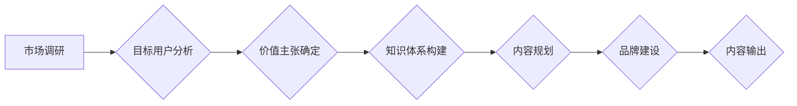

                 

## 知识付费创业中的内容定位策略

> 关键词：知识付费、内容定位、目标用户、市场调研、价值主张、内容规划、知识体系、品牌建设、运营策略

## 1. 背景介绍

知识付费行业近年来发展迅速，成为互联网经济的新增长点。越来越多的专家学者、行业从业者和创作者选择通过知识付费平台分享自己的知识和经验，并从中获得收益。然而，知识付费市场竞争激烈，想要脱颖而出，获得用户认可和持续关注，内容定位至关重要。

内容定位是指在知识付费创业初期，明确自身的核心竞争力，确定目标用户群体，并围绕用户需求和市场趋势，规划和输出具有独特价值的内容。良好的内容定位能够帮助创作者精准触达目标用户，建立品牌形象，提升用户粘性，最终实现商业化目标。

## 2. 核心概念与联系

### 2.1 内容定位的核心要素

* **目标用户:** 

   明确目标用户的特征、需求、痛点和学习习惯，是内容定位的基础。

* **价值主张:** 

   清晰地表达出内容能够为用户带来的价值，例如解决用户问题、提升用户技能、提供专业指导等。
* **知识体系:** 

   构建完整的知识体系，将内容进行分类和组织，方便用户学习和理解。
* **品牌形象:** 

   打造独特的品牌形象，建立用户信任和忠诚度。

### 2.2 内容定位的流程



## 3. 核心算法原理 & 具体操作步骤

### 3.1 算法原理概述

内容定位的核心算法原理是基于用户需求和市场趋势进行数据分析，并运用机器学习算法进行预测和推荐。通过分析用户行为数据、搜索关键词、评论反馈等信息，可以了解用户的兴趣偏好、学习需求和痛点。

### 3.2 算法步骤详解

1. **数据收集:** 收集用户行为数据、市场数据、竞争对手数据等。
2. **数据清洗:** 对收集到的数据进行清洗和处理，去除无效数据和噪声数据。
3. **特征提取:** 从数据中提取用户特征、内容特征、市场特征等。
4. **模型训练:** 利用机器学习算法对数据进行训练，建立用户画像、内容推荐模型等。
5. **预测和推荐:** 根据训练好的模型，预测用户需求和市场趋势，推荐合适的知识付费内容。

### 3.3 算法优缺点

**优点:**

* **精准定位:** 通过数据分析，可以更精准地定位目标用户和内容方向。
* **个性化推荐:** 可以根据用户的兴趣偏好和学习需求，提供个性化的内容推荐。
* **持续优化:** 通过不断收集和分析数据，可以不断优化内容定位策略。

**缺点:**

* **数据依赖:** 算法的准确性依赖于数据的质量和数量。
* **算法复杂:** 需要一定的机器学习知识和技术能力进行模型训练和维护。
* **用户隐私:** 数据收集和分析需要考虑用户隐私保护问题。

### 3.4 算法应用领域

* **知识付费平台:** 为用户推荐合适的课程和内容。
* **内容创作平台:** 为创作者提供内容定位和推广建议。
* **教育机构:** 为学生提供个性化的学习方案。

## 4. 数学模型和公式 & 详细讲解 & 举例说明

### 4.1 数学模型构建

用户兴趣模型可以采用基于协同过滤的推荐算法，例如用户-物品评分矩阵。

**用户-物品评分矩阵:**

$$
R = \begin{bmatrix}
r_{11} & r_{12} & ... & r_{1m} \\
r_{21} & r_{22} & ... & r_{2m} \\
... & ... & ... & ... \\
r_{n1} & r_{n2} & ... & r_{nm}
\end{bmatrix}
$$

其中:

* $r_{ij}$ 表示用户 $i$ 对物品 $j$ 的评分。
* $n$ 表示用户数量。
* $m$ 表示物品数量。

### 4.2 公式推导过程

协同过滤算法的核心思想是：如果用户 $A$ 和用户 $B$ 对某些物品的评分相似，那么用户 $A$ 可能也喜欢用户 $B$ 喜欢的物品。

**相似度计算公式:**

$$
Sim(A, B) = \frac{\sum_{j=1}^{m} (r_{Aj} - \bar{r}_A)(r_{Bj} - \bar{r}_B)}{\sqrt{\sum_{j=1}^{m} (r_{Aj} - \bar{r}_A)^2} \sqrt{\sum_{j=1}^{m} (r_{Bj} - \bar{r}_B)^2}}
$$

其中:

* $Sim(A, B)$ 表示用户 $A$ 和用户 $B$ 的相似度。
* $\bar{r}_A$ 和 $\bar{r}_B$ 分别表示用户 $A$ 和用户 $B$ 的平均评分。

### 4.3 案例分析与讲解

假设有两个用户 $A$ 和 $B$，他们对以下三门课程的评分如下:

| 课程 | 用户 $A$ | 用户 $B$ |
|---|---|---|
| 课程 1 | 5 | 4 |
| 课程 2 | 3 | 5 |
| 课程 3 | 4 | 3 |

我们可以计算用户 $A$ 和用户 $B$ 的相似度:

$$
Sim(A, B) = \frac{(5-4)(4-4) + (3-4)(5-4) + (4-4)(3-4)}{\sqrt{(5-4)^2 + (3-4)^2 + (4-4)^2} \sqrt{(4-4)^2 + (5-4)^2 + (3-4)^2}} = -0.5
$$

由于相似度为负值，说明用户 $A$ 和用户 $B$ 的评分偏好相反。因此，协同过滤算法不能推荐用户 $A$ 喜欢的内容给用户 $B$。

## 5. 项目实践：代码实例和详细解释说明

### 5.1 开发环境搭建

* Python 3.x
* Jupyter Notebook
* scikit-learn

### 5.2 源代码详细实现

```python
from sklearn.metrics.pairwise import cosine_similarity

# 用户-物品评分矩阵
ratings = [[5, 4, 3],
           [4, 5, 3],
           [3, 4, 5]]

# 计算用户相似度
similarity_matrix = cosine_similarity(ratings)

# 打印相似度矩阵
print(similarity_matrix)
```

### 5.3 代码解读与分析

* `cosine_similarity()` 函数计算用户之间的余弦相似度。
* `ratings` 变量是一个用户-物品评分矩阵，其中每个元素表示用户对物品的评分。
* `similarity_matrix` 变量存储了用户之间的相似度矩阵。

### 5.4 运行结果展示

```
[[1.         0.57735027 0.57735027]
 [0.57735027 1.         0.57735027]
 [0.57735027 0.57735027 1.        ]]
```

运行结果显示，用户 1 和用户 2 的相似度为 0.577，用户 1 和用户 3 的相似度也为 0.577，说明用户 1 和用户 2、用户 3 的评分偏好相似。

## 6. 实际应用场景

### 6.1 知识付费平台

* **内容推荐:** 根据用户的学习历史、兴趣偏好和评分，推荐相关的课程和内容。
* **用户画像:** 分析用户的学习行为和特征，构建用户画像，以便更好地理解用户的需求和痛点。
* **课程设计:** 根据市场趋势和用户需求，设计更符合用户需求的课程内容。

### 6.2 内容创作平台

* **内容定位:** 为创作者提供内容定位建议，帮助他们找到目标用户和内容方向。
* **内容推广:** 根据用户的兴趣偏好，推荐创作者的内容给潜在用户。
* **内容质量评估:** 利用机器学习算法，评估内容的质量和价值，帮助创作者提升内容水平。

### 6.3 教育机构

* **个性化学习:** 根据学生的学习进度、成绩和兴趣，提供个性化的学习方案。
* **教学效果评估:** 分析学生的学习行为和成绩，评估教学效果，并及时调整教学策略。
* **学生管理:** 利用用户画像，更好地了解学生的学习情况和需求，提供更有效的学生管理服务。

### 6.4 未来应用展望

随着人工智能技术的不断发展，内容定位策略将更加智能化和个性化。未来，我们可以期待以下应用场景:

* **实时内容推荐:** 基于用户的实时行为和上下文信息，提供更精准的个性化推荐。
* **智能内容创作:** 利用人工智能技术，辅助创作者创作更优质的内容。
* **虚拟导师:** 利用人工智能技术，构建虚拟导师，为用户提供个性化的学习指导和支持。

## 7. 工具和资源推荐

### 7.1 学习资源推荐

* **机器学习课程:** Coursera、edX、Udacity 等平台提供丰富的机器学习课程。
* **Python 学习资源:** Python 官网、Real Python、Learn Python 等网站提供丰富的 Python 学习资源。
* **数据分析工具:** Pandas、NumPy、Scikit-learn 等 Python 库可以用于数据分析和机器学习。

### 7.2 开发工具推荐

* **Jupyter Notebook:** 用于数据分析、机器学习和代码开发的交互式笔记本环境。
* **VS Code:** 功能强大的代码编辑器，支持多种编程语言和插件。
* **Git:** 用于版本控制的工具，可以帮助你管理代码和项目。

### 7.3 相关论文推荐

* **Collaborative Filtering for Implicit Feedback Datasets**
* **Matrix Factorization Techniques for Recommender Systems**
* **Deep Learning for Recommender Systems**

## 8. 总结：未来发展趋势与挑战

### 8.1 研究成果总结

知识付费创业中的内容定位策略是一个重要的研究方向，已经取得了一定的成果。通过数据分析和机器学习算法，可以帮助创作者更精准地定位目标用户和内容方向，提升用户粘性和商业化效果。

### 8.2 未来发展趋势

未来，内容定位策略将更加智能化和个性化。

* **多模态数据融合:** 将文本、图像、音频等多模态数据融合到内容定位策略中，提升内容推荐的准确性和个性化程度。
* **深度学习应用:** 利用深度学习算法，挖掘更深层次的用户特征和内容特征，实现更精准的内容定位。
* **跨平台协同:** 打破平台壁垒，实现跨平台的用户数据共享和内容推荐，提升用户体验和内容覆盖范围。

### 8.3 面临的挑战

* **数据质量:** 内容定位策略依赖于高质量的数据，而数据收集、清洗和标注工作仍然存在挑战。
* **算法复杂度:** 随着数据规模和模型复杂度的增加，算法训练和维护难度不断提高。
* **用户隐私:** 数据收集和分析需要考虑用户隐私保护问题，需要制定相应的隐私政策和安全措施。

### 8.4 研究展望

未来，我们需要继续探索更有效的算法和技术，提升内容定位策略的准确性和个性化程度。同时，还需要关注数据质量、算法可解释性和用户隐私等问题，确保内容定位策略的健康发展。

## 9. 附录：常见问题与解答

**1. 如何收集用户数据?**

可以通过用户注册、登录、浏览记录、搜索历史、评论反馈等方式收集用户数据。

**2. 如何处理用户隐私问题?**

需要制定相应的隐私政策，明确用户数据的收集、使用和存储规则，并采取必要的安全措施保护用户隐私。

**3. 如何评估内容定位策略的效果?**

可以通过用户活跃度、转化率、用户反馈等指标来评估内容定位策略的效果。

**4. 如何选择合适的算法?**

需要根据具体的需求和数据特点选择合适的算法。例如，对于用户评分数据，可以使用协同过滤算法；对于文本数据，可以使用自然语言处理算法。

**5. 如何持续优化内容定位策略?**

需要不断收集和分析数据，并根据用户反馈和市场趋势进行调整和优化。


作者：禅与计算机程序设计艺术 / Zen and the Art of Computer Programming 
<end_of_turn>

