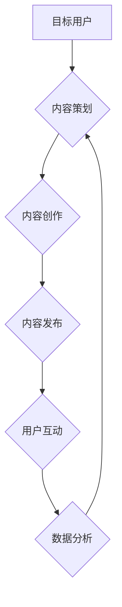

                 

## 知识付费创业中的内容营销策略

> 关键词：知识付费、内容营销、用户运营、社区建设、数据分析

### 1. 背景介绍

知识付费行业近年来发展迅速，从在线课程、付费咨询到会员体系，各种模式层出不穷。然而，在竞争日益激烈的市场环境下，单纯依靠优质内容已经不足以保证知识付费产品的成功。内容营销作为一种重要的营销策略，在知识付费创业中扮演着越来越重要的角色。

### 2. 核心概念与联系

**2.1 内容营销概述**

内容营销是指通过创造和分享有价值、相关且一致的内容来吸引和留住目标受众，最终促成销售转化的一种营销策略。它强调提供价值，而非直接推销产品，旨在建立信任关系，引导用户自然地走向购买决策。

**2.2 内容营销与知识付费的结合**

知识付费的核心是提供有价值的知识和技能，而内容营销则通过内容的传播和互动，将这些知识传递给目标用户，并建立用户粘性。两者结合，可以形成一个良性循环：

* **优质内容吸引用户：** 吸引目标用户关注，建立品牌认知度。
* **用户参与互动：** 通过评论、分享、讨论等方式，提升用户参与度和粘性。
* **建立信任关系：** 通过持续提供价值，建立用户对品牌的信任和忠诚度。
* **引导用户付费：** 在用户建立信任关系的基础上，引导用户购买知识付费产品。

**2.3 内容营销流程图**



### 3. 核心算法原理 & 具体操作步骤

**3.1 算法原理概述**

内容营销的核心算法原理是基于用户行为和数据分析，通过不断优化内容策略和传播渠道，最大化内容的曝光和转化率。

**3.2 算法步骤详解**

1. **用户画像分析:** 
    * 了解目标用户的年龄、性别、职业、兴趣爱好、知识需求等信息。
    * 通过数据分析工具，挖掘用户行为数据，例如阅读习惯、购买偏好、社交行为等。

2. **内容主题策划:** 
    * 根据用户画像分析结果，确定内容主题和方向。
    * 关注用户痛点和需求，提供有价值、解决问题的知识和技能。

3. **内容创作与优化:** 
    * 创作高质量、原创性强的文章、视频、音频等内容。
    * 优化内容结构、标题、关键词等，提高内容的搜索引擎排名和用户阅读体验。

4. **内容传播推广:** 
    * 通过社交媒体、邮件营销、付费广告等渠道，将内容传播给目标用户。
    * 参与行业论坛和社区，与用户互动交流。

5. **数据分析与优化:** 
    * 监控内容的曝光量、阅读量、转化率等数据指标。
    * 分析用户反馈和行为数据，不断优化内容策略和传播渠道。

**3.3 算法优缺点**

* **优点:** 
    * 能够精准地触达目标用户。
    * 通过提供价值，建立用户信任和忠诚度。
    * 能够持续地积累用户和流量。
* **缺点:** 
    * 需要投入大量时间和精力进行内容创作和推广。
    * 数据分析和优化需要专业技能和工具支持。
    * 效果难以短期内显现，需要长期坚持。

**3.4 算法应用领域**

内容营销算法广泛应用于各个行业，例如：

* 教育培训：在线课程、知识付费平台
* 科技互联网：软件开发、技术博客
* 金融投资：理财产品、投资咨询
* 医疗健康：健康知识、医疗服务

### 4. 数学模型和公式 & 详细讲解 & 举例说明

**4.1 数学模型构建**

内容营销效果可以抽象为一个数学模型，其中涉及到用户数量、内容质量、传播渠道、用户参与度等因素。

**4.2 公式推导过程**

假设：

* $U$：目标用户数量
* $C$：内容质量
* $P$：传播渠道
* $I$：用户参与度

则内容营销效果 $E$ 可以表示为：

$$E = f(U, C, P, I)$$

其中 $f$ 为一个复杂的函数，代表着各个因素之间的相互作用关系。

**4.3 案例分析与讲解**

例如，一个知识付费平台想要提高用户转化率，可以根据上述模型进行分析：

* **增加用户数量:** 通过付费广告、社交媒体推广等方式吸引更多目标用户。
* **提升内容质量:** 邀请行业专家创作高质量的课程内容，并定期更新内容，保持用户新鲜感。
* **优化传播渠道:** 分析用户行为数据，选择最有效的传播渠道，例如微信公众号、微博、抖音等。
* **提高用户参与度:** 通过互动问答、直播答疑、用户论坛等方式，鼓励用户参与互动，提升用户粘性。

通过对各个因素的优化，可以提高内容营销效果，最终提升知识付费产品的转化率。

### 5. 项目实践：代码实例和详细解释说明

**5.1 开发环境搭建**

* 操作系统：Windows/macOS/Linux
* 编程语言：Python
* 开发工具：VS Code/PyCharm

**5.2 源代码详细实现**

```python
# 导入必要的库
import pandas as pd
from sklearn.model_selection import train_test_split
from sklearn.linear_model import LogisticRegression

# 加载用户数据
data = pd.read_csv('user_data.csv')

# 选择特征和目标变量
features = ['age', 'gender', 'occupation', 'interest']
target = 'purchase'

# 将数据分割为训练集和测试集
X_train, X_test, y_train, y_test = train_test_split(data[features], data[target], test_size=0.2)

# 创建逻辑回归模型
model = LogisticRegression()

# 训练模型
model.fit(X_train, y_train)

# 预测测试集结果
predictions = model.predict(X_test)

# 评估模型性能
accuracy = model.score(X_test, y_test)
print(f'模型准确率: {accuracy}')
```

**5.3 代码解读与分析**

* 该代码示例展示了如何使用机器学习算法进行用户画像分析和预测用户购买行为。
* 首先，加载用户数据并选择特征和目标变量。
* 然后，将数据分割为训练集和测试集，用于训练和评估模型。
* 使用逻辑回归模型进行训练，并预测测试集结果。
* 最后，评估模型性能，例如准确率。

**5.4 运行结果展示**

运行结果会显示模型的准确率，例如：

```
模型准确率: 0.85
```

这表示模型能够以 85% 的准确率预测用户是否购买知识付费产品。

### 6. 实际应用场景

**6.1 用户画像分析**

通过分析用户行为数据，可以构建用户画像，了解用户的年龄、性别、职业、兴趣爱好、知识需求等信息。

**6.2 内容推荐**

根据用户的兴趣爱好和知识需求，推荐相关的内容，提高用户参与度和转化率。

**6.3 个性化营销**

根据用户的画像信息，进行个性化营销，例如推送定制化的课程推荐、优惠活动等。

**6.4 社区建设**

建立用户社区，鼓励用户互动交流，分享学习经验，提升用户粘性。

**6.5 数据分析与优化**

通过数据分析，了解用户行为和内容表现，不断优化内容策略和传播渠道，提升营销效果。

**6.6 未来应用展望**

随着人工智能技术的不断发展，内容营销将在知识付费创业中发挥更加重要的作用。例如：

* **智能内容创作:** 利用人工智能技术，自动生成个性化内容，例如课程笔记、学习计划等。
* **精准用户匹配:** 利用大数据分析，更加精准地匹配用户和内容，提高内容的有效性。
* **个性化学习路径:** 根据用户的学习进度和需求，自动生成个性化学习路径，提升学习效率。

### 7. 工具和资源推荐

**7.1 学习资源推荐**

* **书籍:**
    * 《内容营销》
    * 《内容是王》
    * 《吸引力营销》
* **网站:**
    * Content Marketing Institute
    * HubSpot
    * Neil Patel

**7.2 开发工具推荐**

* **数据分析工具:**
    * Google Analytics
    * Baidu Analytics
    * Tableau
* **内容创作工具:**
    * WordPress
    * Medium
    * Canva

**7.3 相关论文推荐**

* **内容营销的理论基础和实践应用**
* **人工智能技术在内容营销中的应用**
* **内容营销与用户行为分析**

### 8. 总结：未来发展趋势与挑战

**8.1 研究成果总结**

本文介绍了知识付费创业中的内容营销策略，包括核心概念、算法原理、实践案例、应用场景等。

**8.2 未来发展趋势**

未来，内容营销将更加注重个性化、智能化和数据驱动。

* **个性化内容:** 利用人工智能技术，根据用户的兴趣爱好和知识需求，生成个性化内容。
* **智能内容创作:** 利用人工智能技术，自动生成内容，例如文章、视频、音频等。
* **数据驱动营销:** 利用数据分析，更加精准地了解用户行为和内容表现，优化营销策略。

**8.3 面临的挑战**

* **内容质量:** 随着内容营销的普及，内容质量竞争日益激烈，需要不断提升内容的原创性和价值。
* **用户信任:** 用户对内容营销的信任度逐渐降低，需要通过提供真实、有价值的内容来建立信任关系。
* **数据安全:** 用户数据安全问题日益突出，需要加强数据保护措施。

**8.4 研究展望**

未来，需要进一步研究内容营销的算法模型、数据分析方法和用户行为模式，以更好地服务于知识付费创业。

### 9. 附录：常见问题与解答

**9.1 如何提高内容的曝光量？**

* 优化内容结构和标题，提高搜索引擎排名。
* 通过社交媒体、邮件营销、付费广告等渠道推广内容。
* 参与行业论坛和社区，与用户互动交流。

**9.2 如何提升用户参与度？**

* 鼓励用户评论、分享、点赞等互动行为。
* 通过直播答疑、用户论坛等方式，与用户进行互动交流。
* 提供用户专属福利和活动，增强用户粘性。

**9.3 如何评估内容营销效果？**

* 监控内容的曝光量、阅读量、转化率等数据指标。
* 分析用户反馈和行为数据，了解用户对内容的接受度和满意度。
* 通过A/B测试等方法，比较不同内容策略的效果。


作者：禅与计算机程序设计艺术 / Zen and the Art of Computer Programming 
<end_of_turn>

