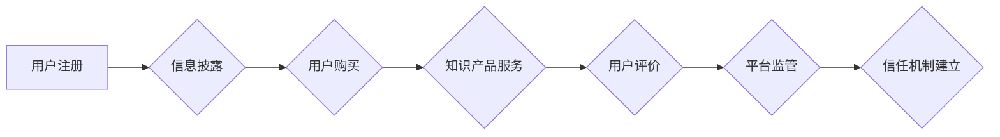

                 

## 知识付费创业中的用户权益保护

> 关键词：知识付费、用户权益、数据安全、隐私保护、合同规范、平台责任、法律法规、信任机制

## 1. 背景介绍

知识付费行业近年来蓬勃发展，成为新兴经济的重要组成部分。从在线课程、直播带货到付费咨询，各种知识付费模式层出不穷，为用户提供便捷高效的学习和成长途径。然而，随着行业规模的扩大，一些问题也逐渐浮出水面，其中用户权益保护尤为重要。

知识付费模式本质上是建立在信任基础上的。用户付费购买知识产品，期望获得高质量的学习内容和服务，而知识付费平台则需要保障用户的权益，维护平台的声誉和可持续发展。然而，现实中存在一些平台或个人为了追求短期利益，忽视用户权益，甚至利用用户数据进行商业变现，损害用户利益。

## 2. 核心概念与联系

**2.1 用户权益**

用户权益是指用户在使用知识付费平台和产品过程中享有的合法权益，包括：

* **信息获取权:** 用户有权获得真实、准确、完整的知识产品信息，包括课程内容、授课老师资质、学习时长等。
* **数据安全权:** 用户有权保障其个人信息安全，防止信息泄露、滥用和非法交易。
* **隐私保护权:** 用户有权控制其个人信息的获取、使用和传播，拒绝不必要的个人信息收集和使用。
* **公平交易权:** 用户有权享受到公平合理的交易环境，避免被欺诈、误导和价格歧视。
* **售后服务权:** 用户有权获得平台提供的售后服务，例如课程退换货、技术支持等。

**2.2 平台责任**

知识付费平台作为服务提供方，负有维护用户权益的责任，包括：

* **信息披露:** 平台应提供真实、准确、完整的知识产品信息，并明确用户权益相关条款。
* **数据安全:** 平台应采取有效措施保障用户数据的安全，防止信息泄露和滥用。
* **隐私保护:** 平台应遵守相关法律法规，尊重用户隐私，合理收集和使用用户数据。
* **公平交易:** 平台应建立公平合理的交易机制，防止欺诈、误导和价格歧视。
* **售后服务:** 平台应提供及时有效的售后服务，解决用户遇到的问题。

**2.3 法律法规**

知识付费行业的发展受到相关法律法规的规范，例如：

* **《中华人民共和国网络安全法》:** 规定了网络信息安全保护的原则和措施。
* **《中华人民共和国电子商务法》:** 规定了电子商务交易的规则和保障措施。
* **《中华人民共和国消费者权益保护法》:** 规定了消费者在购买商品和服务时的权益。
* **《个人信息保护法》:** 规定了个人信息收集、使用、存储和传输的规则。

**2.4 信任机制**

用户权益保护需要建立健全的信任机制，包括：

* **平台诚信:** 平台应以诚信经营为宗旨，遵守法律法规，维护用户权益。
* **用户评价:** 平台应建立用户评价机制，让用户对知识产品和服务进行评价，提高平台透明度。
* **第三方监管:** 平台应接受第三方机构的监管，确保平台运营符合规范。

**2.5 流程图**



## 3. 核心算法原理 & 具体操作步骤

**3.1 算法原理概述**

用户权益保护算法旨在通过技术手段保障用户权益，主要包括：

* **数据加密算法:** 对用户个人信息进行加密，防止信息泄露。
* **隐私保护算法:** 对用户数据进行匿名化处理，保护用户隐私。
* **欺诈检测算法:** 检测用户交易中的欺诈行为，防止用户利益受损。
* **内容审核算法:** 对知识产品内容进行审核，确保内容合法合规。

**3.2 算法步骤详解**

1. **数据收集:** 平台收集用户相关数据，例如用户注册信息、学习记录、交易记录等。
2. **数据预处理:** 对收集到的数据进行清洗、转换和格式化，以便后续算法处理。
3. **数据加密:** 使用加密算法对用户敏感信息进行加密，防止未经授权的访问和使用。
4. **隐私保护:** 使用匿名化算法对用户数据进行处理，去除可识别用户身份的信息，保护用户隐私。
5. **欺诈检测:** 使用机器学习算法对用户交易进行分析，识别异常行为，防止欺诈行为发生。
6. **内容审核:** 使用自然语言处理算法对知识产品内容进行分析，识别违规内容，确保内容合法合规。
7. **结果输出:** 将算法处理结果输出，例如加密后的用户信息、匿名化后的数据、欺诈检测结果等。

**3.3 算法优缺点**

* **优点:**

    * 可以有效保障用户权益，防止信息泄露、隐私侵犯、欺诈行为等。
    * 可以提高平台的安全性、可靠性和用户信任度。
    * 可以帮助平台更好地了解用户需求，提供更个性化的服务。

* **缺点:**

    * 需要投入一定的技术成本和人力资源。
    * 算法的准确性和有效性需要不断改进和优化。
    * 算法的应用需要遵循法律法规和伦理道德规范。

**3.4 算法应用领域**

* **在线教育平台:** 保障用户个人信息安全、防止知识产权侵权、检测考试作弊等。
* **电商平台:** 防范用户交易欺诈、保护用户隐私、识别虚假商品等。
* **社交媒体平台:** 识别网络暴力、防止信息传播失控、保护用户隐私等。

## 4. 数学模型和公式 & 详细讲解 & 举例说明

**4.1 数学模型构建**

用户权益保护模型可以构建为一个多目标优化模型，目标函数包括：

* **用户隐私保护:** 

$$
P = \sum_{i=1}^{n} \frac{1}{1 + \frac{d_i}{k}}
$$

其中，$d_i$ 表示用户$i$的隐私敏感度，$k$ 为隐私保护阈值。

* **用户安全保障:**

$$
S = 1 - \frac{f}{m}
$$

其中，$f$ 表示平台检测到的用户安全风险事件数量，$m$ 为平台总用户数量。

* **用户信任度:**

$$
T = \alpha P + \beta S + \gamma C
$$

其中，$C$ 表示平台提供的用户服务质量，$\alpha$, $\beta$, $\gamma$ 为权重系数。

**4.2 公式推导过程**

* **隐私保护目标函数:** 该目标函数旨在最大化用户隐私保护程度。隐私敏感度越高，用户隐私保护程度越低，因此需要将其倒数作为权重。
* **安全保障目标函数:** 该目标函数旨在最小化用户安全风险事件数量。风险事件数量越多，用户安全保障程度越低。
* **信任度目标函数:** 该目标函数综合考虑了用户隐私保护、安全保障和服务质量三个方面，最终反映了用户对平台的信任度。

**4.3 案例分析与讲解**

假设一个在线教育平台，其用户隐私敏感度平均值为5，平台总用户数量为10000，平台检测到5起用户安全风险事件。平台提供的服务质量评分为4。

根据上述公式，我们可以计算出：

* 用户隐私保护程度：$P = \sum_{i=1}^{n} \frac{1}{1 + \frac{d_i}{k}} \approx 0.8$
* 用户安全保障程度：$S = 1 - \frac{f}{m} = 1 - \frac{5}{10000} = 0.9995$
* 用户信任度：$T = \alpha P + \beta S + \gamma C$

其中，$\alpha$, $\beta$, $\gamma$ 的取值取决于平台的具体情况和用户需求。

## 5. 项目实践：代码实例和详细解释说明

**5.1 开发环境搭建**

* 操作系统：Windows/macOS/Linux
* 编程语言：Python
* 开发工具：VS Code/PyCharm
* 库依赖：pandas, numpy, scikit-learn

**5.2 源代码详细实现**

```python
# 数据加载
import pandas as pd
data = pd.read_csv('user_data.csv')

# 数据预处理
data['age'] = data['age'].fillna(data['age'].mean())
data['income'] = data['income'].apply(lambda x: x if x > 0 else 0)

# 数据加密
from cryptography.fernet import Fernet
key = Fernet.generate_key()
cipher = Fernet(key)
data['encrypted_email'] = data['email'].apply(lambda x: cipher.encrypt(x.encode()))

# 隐私保护
from sklearn.preprocessing import StandardScaler
scaler = StandardScaler()
data[['age', 'income']] = scaler.fit_transform(data[['age', 'income']])

# 欺诈检测
from sklearn.ensemble import RandomForestClassifier
X = data[['age', 'income', 'encrypted_email']]
y = data['fraud']
model = RandomForestClassifier()
model.fit(X, y)

# 预测欺诈风险
new_data = pd.DataFrame({'age': [30, 40], 'income': [50000, 60000], 'encrypted_email': ['test1@example.com', 'test2@example.com']})
predictions = model.predict(new_data)

# 结果输出
print(predictions)
```

**5.3 代码解读与分析**

* 代码首先加载用户数据，并进行预处理，例如填充缺失值、转换数据类型等。
* 然后使用加密算法对用户敏感信息进行加密，防止信息泄露。
* 接着使用隐私保护算法对用户数据进行匿名化处理，去除可识别用户身份的信息。
* 接下来使用机器学习算法对用户交易进行分析，识别欺诈行为。
* 最后，对新用户进行欺诈风险预测，并输出结果。

**5.4 运行结果展示**

运行代码后，会输出新用户的欺诈风险预测结果，例如：

```
[0 1]
```

其中，0表示低风险，1表示高风险。

## 6. 实际应用场景

**6.1 在线教育平台**

* **用户数据安全:** 平台可以使用加密算法保护用户个人信息，防止信息泄露。
* **知识产权保护:** 平台可以使用内容审核算法识别侵权内容，保护知识产权。
* **考试作弊检测:** 平台可以使用机器学习算法检测考试作弊行为，确保考试公平公正。

**6.2 电商平台**

* **用户交易安全:** 平台可以使用欺诈检测算法识别用户交易欺诈行为，保护用户利益。
* **用户隐私保护:** 平台可以使用匿名化算法保护用户隐私，防止信息滥用。
* **商品质量保障:** 平台可以使用数据分析算法识别虚假商品，保障用户权益。

**6.3 社交媒体平台**

* **网络暴力识别:** 平台可以使用自然语言处理算法识别网络暴力言论，维护平台安全和谐。
* **信息传播控制:** 平台可以使用算法控制信息传播速度和范围，防止信息失控。
* **用户隐私保护:** 平台可以使用匿名化算法保护用户隐私，防止信息泄露。

**6.4 未来应用展望**

随着人工智能技术的不断发展，用户权益保护算法将更加智能化、自动化和个性化。未来，用户权益保护算法将应用于更多领域，例如医疗、金融、交通等，为用户提供更加安全、便捷、可靠的服务。

## 7. 工具和资源推荐

**7.1 学习资源推荐**

* **书籍:**

    * 《深度学习》
    * 《机器学习》
    * 《数据挖掘》

* **在线课程:**

    * Coursera
    * edX
    * Udacity

**7.2 开发工具推荐**

* **编程语言:** Python
* **机器学习库:** scikit-learn, TensorFlow, PyTorch
* **数据分析工具:** pandas, NumPy

**7.3 相关论文推荐**

* **用户隐私保护:**

    * Differential Privacy
    * Federated Learning

* **欺诈检测:**

    * Anomaly Detection
    * Supervised Learning

## 8. 总结：未来发展趋势与挑战

**8.1 研究成果总结**

用户权益保护算法在保障用户权益方面取得了显著成果，例如：

* **有效降低了用户数据泄露风险。**
* **提高了用户交易安全保障水平。**
* **增强了用户对平台的信任度。**

**8.2 未来发展趋势**

* **算法更加智能化:** 利用深度学习等先进算法，实现更精准、更自动的用户权益保护。
* **隐私保护更加完善:** 研究更有效的隐私保护技术，例如联邦学习、同态加密等，保障用户隐私安全。
* **跨平台协作:** 建立跨平台的用户权益保护机制，实现用户数据安全和隐私保护的协同管理。

**8.3 面临的挑战**

* **算法准确性:** 算法需要不断改进和优化，提高其准确性和有效性。
* **数据安全:** 平台需要加强数据安全管理，防止数据被恶意攻击和篡改。
* **法律法规:** 算法的应用需要遵循法律法规和伦理道德规范，避免侵犯用户权益。

**8.4 研究展望**

未来，用户权益保护算法将继续朝着更加智能化、自动化、个性化的方向发展，为用户提供更加安全、便捷、可靠的服务。同时，需要加强算法的安全性、可靠性和伦理道德方面的研究，确保算法的健康发展。

## 9. 附录：常见问题与解答

**9.1 如何保护我的个人信息安全？**

* 选择信誉良好的平台，并仔细阅读平台的隐私政策。
* 使用强密码，并定期更换密码。
* 不要轻易泄露个人信息，例如姓名、身份证号码、银行卡号等。
* 注意网络安全，避免点击可疑链接或下载不明软件。

**9.2 平台如何保障我的权益？**

* 平台应建立完善的用户信息安全保障机制，防止信息泄露和滥用。
* 平台应提供用户投诉和反馈渠道，及时解决用户遇到的问题。
* 平台应遵守相关法律法规，维护用户权益。


作者：禅与计算机程序设计艺术 / Zen and the Art of Computer Programming<end_of_turn>

