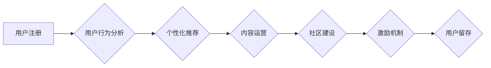

                 

## 知识付费平台的用户留存策略

> 关键词：知识付费、用户留存、用户行为分析、个性化推荐、内容运营、社区建设、激励机制

## 1. 背景介绍

知识付费平台作为新兴的互联网商业模式，近年来发展迅速。用户可以通过付费的方式获取专业知识、技能培训和学习资源。然而，知识付费平台面临着用户留存率低、用户活跃度不高等挑战。用户留存率直接关系到平台的商业可持续性，因此，制定有效的用户留存策略至关重要。

## 2. 核心概念与联系

**2.1 用户留存率**

用户留存率是指在特定时间段内，仍然活跃在平台上的用户比例。它通常用百分比表示，例如，7天留存率是指在用户注册后7天内仍然活跃的用户比例。

**2.2 用户行为分析**

用户行为分析是指通过收集和分析用户在平台上的行为数据，例如访问页面、观看视频、购买课程等，以了解用户兴趣、需求和使用习惯。

**2.3 个性化推荐**

个性化推荐是指根据用户的兴趣、行为和偏好，推荐与其相关的知识付费内容。

**2.4 内容运营**

内容运营是指围绕平台的核心内容，进行策划、创作、发布、推广和维护等一系列活动，以吸引和留住用户。

**2.5 社区建设**

社区建设是指围绕平台的知识付费内容，构建一个用户互动、交流和分享的平台，增强用户粘性。

**2.6 激励机制**

激励机制是指通过奖励、积分、优惠券等方式，鼓励用户持续使用平台，提高用户留存率。

**2.7 用户留存流程图**



## 3. 核心算法原理 & 具体操作步骤

**3.1 算法原理概述**

用户留存算法通常基于机器学习和数据挖掘技术，通过分析用户行为数据，预测用户是否会再次访问平台，并根据预测结果采取相应的策略，提高用户留存率。常见的算法包括：

* **生存分析模型**:  用于分析用户在特定时间段内离开平台的概率。
* **推荐算法**:  根据用户的兴趣和行为，推荐与其相关的知识付费内容，提高用户参与度。
* **聚类算法**:  将用户分为不同的群体，根据群体的特征，制定个性化的留存策略。

**3.2 算法步骤详解**

1. **数据收集**: 收集用户在平台上的行为数据，例如注册时间、登录时间、访问页面、观看视频、购买课程等。
2. **数据预处理**: 对收集到的数据进行清洗、转换和特征工程，例如删除无效数据、转换数据类型、提取用户特征等。
3. **模型训练**: 选择合适的算法模型，并使用预处理后的数据进行模型训练。
4. **模型评估**: 使用测试数据评估模型的性能，例如准确率、召回率、F1-score等。
5. **模型部署**: 将训练好的模型部署到生产环境中，用于预测用户留存概率。
6. **策略制定**: 根据模型预测结果，制定相应的留存策略，例如推送个性化推荐、发送提醒邮件、提供优惠活动等。

**3.3 算法优缺点**

* **优点**: 能够根据用户行为数据，精准预测用户留存概率，制定个性化的留存策略。
* **缺点**: 需要大量的用户行为数据进行训练，模型的准确性依赖于数据质量。

**3.4 算法应用领域**

* **电商平台**: 预测用户购买概率，提高转化率。
* **社交平台**: 预测用户活跃度，提高用户粘性。
* **游戏平台**: 预测用户游戏时长，提高用户留存率。
* **教育平台**: 预测用户学习进度，提供个性化学习建议。

## 4. 数学模型和公式 & 详细讲解 & 举例说明

**4.1 数学模型构建**

用户留存率可以用以下数学模型表示：

$$
L(t) = \frac{N(t)}{N(0)}
$$

其中：

* $L(t)$ 表示在时间 $t$ 时刻的用户留存率。
* $N(t)$ 表示在时间 $t$ 时刻仍然活跃的用户数量。
* $N(0)$ 表示初始的用户数量。

**4.2 公式推导过程**

用户留存率的计算公式是根据用户数量的变化趋势推导出来的。

**4.3 案例分析与讲解**

假设一个知识付费平台在第一天注册了1000个用户，经过一周后，仍然活跃的用户数量为700个。那么，该平台的7天留存率为：

$$
L(7) = \frac{700}{1000} = 0.7
$$

即，7天后，平台的用户留存率为70%。

## 5. 项目实践：代码实例和详细解释说明

**5.1 开发环境搭建**

* Python 3.x
* Jupyter Notebook
* scikit-learn

**5.2 源代码详细实现**

```python
import pandas as pd
from sklearn.linear_model import LogisticRegression

# 加载用户行为数据
data = pd.read_csv('user_behavior.csv')

# 数据预处理
# ...

# 训练模型
model = LogisticRegression()
model.fit(X_train, y_train)

# 预测用户留存概率
predictions = model.predict_proba(X_test)[:, 1]

# ...
```

**5.3 代码解读与分析**

* 使用 pandas 库加载用户行为数据。
* 使用 scikit-learn 库中的 LogisticRegression 模型训练用户留存预测模型。
* 使用训练好的模型预测用户留存概率。

**5.4 运行结果展示**

* 模型的准确率、召回率、F1-score等指标。
* 用户留存概率的分布情况。

## 6. 实际应用场景

**6.1 个性化推荐**

根据用户的学习兴趣和行为数据，推荐与其相关的知识付费课程，提高用户参与度和留存率。

**6.2 内容运营**

根据用户留存数据，分析用户对不同类型的课程的偏好，优化内容运营策略，提高用户体验和留存率。

**6.3 社区建设**

构建用户互动和交流的社区，增强用户粘性，提高用户留存率。

**6.4 未来应用展望**

* 利用人工智能技术，更加精准地预测用户留存概率，制定个性化的留存策略。
* 结合大数据分析，深入挖掘用户行为数据，发现用户留存的潜在因素。
* 利用虚拟现实和增强现实技术，打造更加沉浸式的学习体验，提高用户留存率。

## 7. 工具和资源推荐

**7.1 学习资源推荐**

* **书籍**: 《机器学习实战》、《数据挖掘导论》
* **在线课程**: Coursera、edX、Udacity

**7.2 开发工具推荐**

* **Python**: scikit-learn、pandas、numpy
* **数据可视化工具**: Tableau、Power BI

**7.3 相关论文推荐**

* **用户留存预测**: "A Survey on User Retention Prediction in Mobile Apps"
* **个性化推荐**: "Collaborative Filtering for Recommender Systems"

## 8. 总结：未来发展趋势与挑战

**8.1 研究成果总结**

用户留存策略的研究取得了显著进展，各种算法模型和技术手段不断涌现，为提高知识付费平台的用户留存率提供了有效的方法和工具。

**8.2 未来发展趋势**

* **人工智能技术**: 利用人工智能技术，更加精准地预测用户留存概率，制定个性化的留存策略。
* **大数据分析**: 深入挖掘用户行为数据，发现用户留存的潜在因素，制定更加有效的留存策略。
* **沉浸式体验**: 利用虚拟现实和增强现实技术，打造更加沉浸式的学习体验，提高用户留存率。

**8.3 面临的挑战**

* **数据质量**: 用户行为数据的质量直接影响模型的准确性，需要不断完善数据收集和处理机制。
* **用户隐私**: 用户行为数据涉及用户隐私，需要采取相应的措施保护用户隐私安全。
* **算法解释性**: 一些机器学习算法的解释性较差，难以理解模型的决策过程，需要进一步研究算法的可解释性。

**8.4 研究展望**

未来，用户留存策略的研究将更加注重人工智能技术的应用，以及大数据分析和用户隐私保护等方面的研究。


## 9. 附录：常见问题与解答

**9.1 如何提高用户留存率？**

* 提供优质的知识付费内容。
* 进行个性化推荐。
* 建立用户社区。
* 设置激励机制。
* 优化用户体验。

**9.2 什么是用户留存率？**

用户留存率是指在特定时间段内，仍然活跃在平台上的用户比例。

**9.3 如何计算用户留存率？**

用户留存率 = 在时间 t 时刻仍然活跃的用户数量 / 初始的用户数量

**9.4 如何选择合适的用户留存算法？**

选择合适的算法需要根据平台的具体情况和数据特点进行选择。常见的算法包括生存分析模型、推荐算法和聚类算法。


作者：禅与计算机程序设计艺术 / Zen and the Art of Computer Programming 
<end_of_turn>

