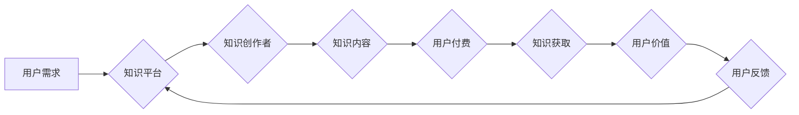

                 

## 知识付费的商业模式与盈利秘诀探究

> 关键词：知识付费、商业模式、盈利秘诀、在线教育、内容创作、用户运营、技术平台

### 1. 背景介绍

在互联网时代，信息爆炸和知识经济的快速发展，知识付费逐渐成为一种重要的商业模式。它打破了传统教育模式的局限，为知识生产者和消费者提供了新的平台和机会。知识付费是指通过付费的方式获取知识、技能和服务的商业模式。它涵盖了广泛的领域，包括在线课程、电子书、付费博客、咨询服务、会员体系等。

知识付费的兴起，得益于以下几个因素：

* **互联网技术的普及:** 互联网技术的快速发展，使得信息传播和知识获取更加便捷高效。
* **知识经济的崛起:** 知识成为重要的生产要素，人们对知识的需求不断增长。
* **个性化学习的需求:** 传统的教育模式难以满足人们个性化的学习需求，知识付费提供了更加灵活和定制化的学习方式。
* **内容创作者的涌现:** 一批优秀的知识创作者涌现，他们拥有丰富的经验和独特的见解，能够为用户提供高质量的知识内容。

### 2. 核心概念与联系

知识付费的核心概念包括：

* **知识产权:** 知识付费的核心是知识产权的保护和利用。知识创作者需要拥有知识产权，才能通过付费的方式获取收益。
* **用户价值:** 知识付费需要为用户提供真实价值，才能获得用户的认可和付费。
* **平台生态:** 知识付费平台需要构建一个完善的生态系统，包括知识创作者、用户、支付系统、运营团队等。

**知识付费商业模式流程图:**



### 3. 核心算法原理 & 具体操作步骤

知识付费平台的运营需要依靠一系列算法来实现用户匹配、内容推荐、付费转化等功能。

#### 3.1  算法原理概述

* **协同过滤算法:** 基于用户的历史行为和相似用户的信息，推荐用户可能感兴趣的知识内容。
* **内容推荐算法:** 基于知识内容的标签、关键词、作者信息等特征，推荐用户可能感兴趣的内容。
* **付费转化算法:** 分析用户的付费行为，预测用户是否会付费，并进行个性化引导。

#### 3.2  算法步骤详解

* **协同过滤算法:**
    1. 收集用户历史行为数据，例如用户浏览过的内容、购买过的课程等。
    2. 计算用户之间的相似度，例如基于物品协同过滤、基于用户协同过滤等方法。
    3. 根据相似用户的行为，推荐用户可能感兴趣的内容。
* **内容推荐算法:**
    1. 对知识内容进行特征提取，例如标签、关键词、作者信息等。
    2. 建立内容之间的相似度模型，例如基于TF-IDF、Word2Vec等方法。
    3. 根据用户历史行为和内容相似度，推荐用户可能感兴趣的内容。
* **付费转化算法:**
    1. 收集用户的付费行为数据，例如用户浏览过的付费内容、加入过购物车等。
    2. 建立用户付费模型，例如Logistic回归、决策树等方法。
    3. 根据用户的行为特征和付费模型预测用户是否会付费。

#### 3.3  算法优缺点

* **协同过滤算法:**
    * 优点: 可以推荐用户可能感兴趣的个性化内容。
    * 缺点: 数据稀疏性问题，新用户和新内容的推荐效果较差。
* **内容推荐算法:**
    * 优点: 可以根据内容特征进行精准推荐。
    * 缺点: 需要大量的标注数据，对内容质量要求较高。
* **付费转化算法:**
    * 优点: 可以提高付费转化率。
    * 缺点: 需要收集大量的用户行为数据，存在隐私安全问题。

#### 3.4  算法应用领域

* **在线教育平台:** 推荐课程、学习资源、导师等。
* **知识付费平台:** 推荐付费内容、会员服务等。
* **电商平台:** 推荐商品、优惠券、促销活动等。
* **社交媒体平台:** 推荐好友、兴趣小组、话题等。

### 4. 数学模型和公式 & 详细讲解 & 举例说明

知识付费平台的运营需要利用数学模型和公式来分析用户行为、预测付费转化率等。

#### 4.1  数学模型构建

* **用户价值模型:**  

$$
Value = f(Content\_Quality, User\_Interest, Learning\_Outcome)
$$

其中:

*  `Value` 代表用户感知到的知识价值。
*  `Content\_Quality` 代表知识内容的质量，例如准确性、实用性、趣味性等。
*  `User\_Interest` 代表用户对知识内容的兴趣程度。
*  `Learning\_Outcome` 代表用户学习知识后获得的成果。

* **付费转化模型:**

$$
Probability\_of\_Payment = g(User\_Value, Price, Payment\_Method)
$$

其中:

*  `Probability\_of\_Payment` 代表用户付费的概率。
*  `User\_Value` 代表用户感知到的知识价值。
*  `Price` 代表知识内容的付费价格。
*  `Payment\_Method` 代表用户选择的支付方式。

#### 4.2  公式推导过程

* **用户价值模型:** 

该模型基于用户对知识内容的感知和体验，将知识价值定义为内容质量、用户兴趣和学习成果的综合函数。

* **付费转化模型:** 

该模型基于用户价值、价格和支付方式等因素，预测用户是否会付费。

#### 4.3  案例分析与讲解

* **案例:** 一家在线教育平台推出了一门编程课程，课程内容质量高，用户兴趣度高，学习成果显著。但课程价格较高，导致付费转化率较低。

* **分析:** 

根据付费转化模型，可以分析用户付费行为受到价格的影响较大。为了提高付费转化率，平台可以采取以下措施:

*  降低课程价格。
*  提供分期付款或优惠活动。
*  提供免费试听课程，让用户体验课程质量。

### 5. 项目实践：代码实例和详细解释说明

以下是一个简单的知识付费平台代码实例，使用Python语言实现用户注册功能。

#### 5.1  开发环境搭建

* Python 3.x
* Flask 框架

#### 5.2  源代码详细实现

```python
from flask import Flask, render_template, request, redirect, url_for

app = Flask(__name__)

# 用户数据存储 (这里使用内存存储，实际应用中应该使用数据库)
users = {}

@app.route('/')
def index():
    return render_template('index.html')

@app.route('/register', methods=['POST'])
def register():
    username = request.form['username']
    password = request.form['password']

    if username in users:
        return '用户名已存在！'
    else:
        users[username] = password
        return '注册成功！'

if __name__ == '__main__':
    app.run(debug=True)
```

#### 5.3  代码解读与分析

*  `Flask` 框架用于构建web应用。
*  `render_template` 函数用于渲染HTML模板。
*  `request` 对象用于获取用户提交的数据。
*  `redirect` 函数用于重定向到其他页面。
*  `url_for` 函数用于生成URL链接。
*  `users` 字典用于存储用户数据。

#### 5.4  运行结果展示

运行代码后，访问 `http://127.0.0.1:5000/`，即可看到注册页面。填写用户名和密码，点击注册按钮，即可完成注册。

### 6. 实际应用场景

知识付费的应用场景非常广泛，包括：

* **在线教育:** 在线课程、直播教学、知识问答等。
* **专业技能培训:** 编程、设计、营销、管理等领域的技能培训。
* **兴趣爱好学习:** 音乐、绘画、写作、摄影等领域的兴趣爱好学习。
* **个人成长发展:** 心理咨询、情绪管理、时间管理等方面的个人成长课程。

#### 6.4  未来应用展望

* **人工智能驱动的个性化学习:** 利用人工智能技术，为用户提供更加个性化的学习路径和内容推荐。
* **沉浸式学习体验:** 利用虚拟现实、增强现实等技术，打造更加沉浸式的学习体验。
* **元宇宙学习环境:** 在元宇宙中构建虚拟学习空间，提供更加互动和丰富的学习体验。

### 7. 工具和资源推荐

#### 7.1  学习资源推荐

* **在线课程平台:** Coursera, edX, Udemy, Khan Academy
* **知识付费平台:**  知乎付费专栏, 腾讯课堂,  网易云课堂
* **技术博客:**  Hacker News, Medium, CSDN

#### 7.2  开发工具推荐

* **Python:**  Flask, Django
* **前端框架:** React, Vue, Angular
* **数据库:** MySQL, PostgreSQL, MongoDB

#### 7.3  相关论文推荐

* **The Economics of Online Education**
* **Recommender Systems: Algorithms and Techniques**
* **Machine Learning for Personalized Education**

### 8. 总结：未来发展趋势与挑战

#### 8.1  研究成果总结

知识付费模式的兴起，为知识生产者和消费者提供了新的机会，推动了知识经济的发展。

#### 8.2  未来发展趋势

* **个性化学习:** 利用人工智能技术，为用户提供更加个性化的学习路径和内容推荐。
* **沉浸式学习体验:** 利用虚拟现实、增强现实等技术，打造更加沉浸式的学习体验。
* **元宇宙学习环境:** 在元宇宙中构建虚拟学习空间，提供更加互动和丰富的学习体验。

#### 8.3  面临的挑战

* **内容质量控制:** 确保知识内容的质量和真实性。
* **用户隐私保护:**  妥善处理用户数据，保护用户隐私安全。
* **商业模式创新:**  探索新的商业模式，提高平台盈利能力。

#### 8.4  研究展望

未来，知识付费平台需要不断创新，提升用户体验，构建更加完善的生态系统，才能更好地服务于知识经济的发展。

### 9. 附录：常见问题与解答

* **Q: 如何选择合适的知识付费平台？**

* **A:**  选择平台时，需要考虑平台的口碑、内容质量、用户评价、收费标准等因素。

* **Q: 如何保护知识产权？**

* **A:**  知识创作者需要注册知识产权，并采取措施防止知识内容被盗用。

* **Q: 如何提高付费转化率？**

* **A:**  可以通过优化内容质量、降低价格、提供优惠活动等方式提高付费转化率。


作者：禅与计算机程序设计艺术 / Zen and the Art of Computer Programming 
<end_of_turn>

