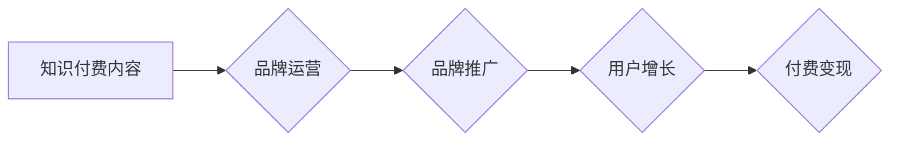

                 

## 知识付费赚钱的品牌品牌运营与品牌推广策略

> 关键词：知识付费、品牌运营、品牌推广、内容营销、社区运营、付费变现、用户增长

### 1. 背景介绍

知识经济时代，知识成为最宝贵的资源。知识付费作为一种新型的商业模式，在近年来迅速发展，成为众多创作者和企业寻求变现的重要途径。 

知识付费的核心在于将个人或组织的专业知识、技能和经验以数字化形式 packaged，并通过线上平台向付费用户提供学习和获取价值的服务。 

从课程、电子书、在线咨询到会员体系、直播带货等，知识付费的模式日益丰富，满足了用户多元化的学习需求。

然而，知识付费市场竞争激烈，想要在众多平台和内容中脱颖而出，建立自己的品牌，并实现持续的盈利，需要深入思考品牌运营和推广策略。

### 2. 核心概念与联系

**2.1 品牌运营**

品牌运营是指围绕品牌核心价值，通过一系列的策略和行动，提升品牌知名度、美誉度和用户粘性，最终实现品牌价值最大化。

**2.2 品牌推广**

品牌推广是指通过各种营销手段，向目标用户传播品牌信息，提升品牌认知度和影响力，引导用户购买和使用品牌产品或服务。

**2.3 知识付费品牌运营与推广的联系**

知识付费品牌运营与推广是相互关联、相互促进的。

品牌运营为知识付费品牌打下坚实的基础，建立品牌形象和用户信任，而品牌推广则帮助知识付费品牌快速触达目标用户，提升品牌知名度和影响力，最终转化为付费用户。

**2.4  Mermaid 流程图**



### 3. 核心算法原理 & 具体操作步骤

**3.1 算法原理概述**

知识付费品牌运营与推广的核心算法原理在于用户画像、内容策略、营销渠道和数据分析。

通过对目标用户的深入分析，了解他们的需求、兴趣和行为习惯，制定精准的内容策略，选择合适的营销渠道，并通过数据分析不断优化策略，才能实现品牌运营和推广的目标。

**3.2 算法步骤详解**

1. **用户画像分析:**

   - 收集用户数据，包括年龄、性别、职业、兴趣爱好、学习习惯等。
   - 利用数据分析工具，对用户数据进行挖掘和分析，构建用户画像。
   - 将用户画像细分，形成不同的用户群体。

2. **内容策略制定:**

   - 根据用户画像，确定目标用户感兴趣的知识领域和学习方式。
   - 制定内容创作计划，包括内容类型、内容主题、内容风格等。
   - 确保内容质量高、价值丰富、能够满足用户需求。

3. **营销渠道选择:**

   - 选择合适的营销渠道，包括社交媒体、搜索引擎、邮件营销、直播平台等。
   - 根据用户画像和内容特点，选择最有效的营销渠道。
   - 制定营销方案，包括推广文案、推广活动、推广预算等。

4. **数据分析和优化:**

   - 跟踪营销效果，收集用户反馈。
   - 利用数据分析工具，分析营销数据，找出问题和改进方向。
   - 根据数据分析结果，不断优化内容策略、营销渠道和推广方案。

**3.3 算法优缺点**

**优点:**

- 数据驱动，能够精准定位目标用户。
- 内容策略和营销方案可根据数据分析结果不断优化。
- 提升品牌知名度和用户粘性。

**缺点:**

- 需要投入大量时间和资源进行数据收集和分析。
- 算法模型需要不断更新和迭代，才能适应市场变化。

**3.4 算法应用领域**

- 知识付费平台
- 在线教育机构
- 内容创作者
- 企业培训

### 4. 数学模型和公式 & 详细讲解 & 举例说明

**4.1 数学模型构建**

知识付费品牌运营与推广可以构建一个数学模型，来预测用户增长和付费转化率。

**用户增长模型:**

$$
U(t) = U_0 * e^{rt}
$$

其中:

- $U(t)$ 是时间 $t$ 时刻的用户数量
- $U_0$ 是初始用户数量
- $r$ 是用户增长率
- $t$ 是时间

**付费转化率模型:**

$$
C(t) = \frac{P(t)}{U(t)}
$$

其中:

- $C(t)$ 是时间 $t$ 时刻的付费转化率
- $P(t)$ 是时间 $t$ 时刻的付费用户数量
- $U(t)$ 是时间 $t$ 时刻的用户数量

**4.2 公式推导过程**

用户增长模型基于指数增长规律，假设用户增长率保持稳定。

付费转化率模型则将付费用户数量与总用户数量相除，得到付费转化率。

**4.3 案例分析与讲解**

假设一个知识付费平台，初始用户数量为 1000 人，用户增长率为 10% per month，则一个月后用户数量为:

$$
U(1) = 1000 * e^{0.1 * 1} = 1105.17
$$

如果一个月内有 100 人付费，则付费转化率为:

$$
C(1) = \frac{100}{1105.17} = 0.0905 \text{ or } 9.05\%
$$

### 5. 项目实践：代码实例和详细解释说明

**5.1 开发环境搭建**

- Python 3.x
- Jupyter Notebook
- Pandas
- Matplotlib

**5.2 源代码详细实现**

```python
import pandas as pd
import matplotlib.pyplot as plt

# 用户增长数据
user_data = pd.DataFrame({
    'month': [1, 2, 3, 4, 5],
    'users': [1000, 1105.17, 1215.70, 1337.27, 1470.99]
})

# 绘制用户增长曲线
plt.plot(user_data['month'], user_data['users'])
plt.xlabel('月份')
plt.ylabel('用户数量')
plt.title('用户增长曲线')
plt.show()

# 付费转化率数据
conversion_data = pd.DataFrame({
    'month': [1, 2, 3, 4, 5],
    'paid_users': [100, 115, 130, 145, 160],
    'total_users': [1105.17, 1215.70, 1337.27, 1470.99, 1604.48]
})

# 计算付费转化率
conversion_data['conversion_rate'] = conversion_data['paid_users'] / conversion_data['total_users']

# 绘制付费转化率曲线
plt.plot(conversion_data['month'], conversion_data['conversion_rate'] * 100)
plt.xlabel('月份')
plt.ylabel('付费转化率 (%)')
plt.title('付费转化率曲线')
plt.show()
```

**5.3 代码解读与分析**

- 代码首先使用 Pandas 库导入用户增长和付费转化率数据。
- 然后使用 Matplotlib 库绘制用户增长曲线和付费转化率曲线。
- 用户增长曲线显示了用户数量随着时间的推移而增长。
- 付费转化率曲线显示了付费用户占总用户比例的变化趋势。

**5.4 运行结果展示**

运行代码后，将生成两个图表：

- 用户增长曲线
- 付费转化率曲线

图表可以直观地展示用户增长和付费转化率的变化趋势，帮助我们了解知识付费品牌的运营状况。

### 6. 实际应用场景

**6.1 在线教育平台**

在线教育平台可以利用知识付费品牌运营和推广策略，吸引更多用户学习，提高付费转化率。

例如，可以根据用户画像，定制不同类型的课程，并通过社交媒体、搜索引擎等渠道进行推广。

**6.2 内容创作者**

内容创作者可以利用知识付费品牌运营和推广策略，将自己的知识和经验转化为收入。

例如，可以建立自己的知识付费平台，或通过其他平台，例如 Patreon、Udemy 等，销售自己的课程和内容。

**6.3 企业培训**

企业可以利用知识付费品牌运营和推广策略，提升员工技能，提高企业竞争力。

例如，可以开发内部培训课程，或通过外部平台，例如 Coursera、edX 等，为员工提供学习机会。

**6.4 未来应用展望**

随着人工智能、大数据等技术的不断发展，知识付费品牌运营和推广将更加智能化、个性化。

例如，可以利用人工智能技术，自动生成个性化的学习推荐，并根据用户的学习行为，动态调整学习内容和进度。

### 7. 工具和资源推荐

**7.1 学习资源推荐**

- 《知识付费的商业模式》
- 《品牌运营实战》
- 《数字营销》

**7.2 开发工具推荐**

- Python
- Jupyter Notebook
- Pandas
- Matplotlib

**7.3 相关论文推荐**

- The Economics of Online Education
- The Impact of Social Media on Brand Awareness and Customer Engagement
- A Framework for Knowledge Management in Organizations

### 8. 总结：未来发展趋势与挑战

**8.1 研究成果总结**

知识付费品牌运营和推广是一个复杂的系统工程，需要综合考虑用户画像、内容策略、营销渠道和数据分析等多个因素。

通过构建数学模型和使用数据分析工具，可以帮助我们更好地理解知识付费品牌的运营规律，并制定更有效的运营策略。

**8.2 未来发展趋势**

未来，知识付费品牌运营和推广将更加智能化、个性化和数据化。

人工智能、大数据等技术的应用将推动知识付费品牌的创新发展。

**8.3 面临的挑战**

知识付费市场竞争激烈，用户需求多元化，品牌运营和推广面临着诸多挑战。

例如，如何精准定位目标用户，如何打造优质的内容，如何提升用户粘性，如何应对市场变化等。

**8.4 研究展望**

未来，我们需要继续深入研究知识付费品牌的运营规律，探索新的运营模式和推广策略，并利用人工智能、大数据等技术，打造更加智能化、个性化和数据化的知识付费品牌。

### 9. 附录：常见问题与解答

**9.1 如何确定目标用户？**

可以通过用户调研、数据分析等方式，了解目标用户的年龄、性别、职业、兴趣爱好、学习习惯等信息，并根据这些信息进行细分。

**9.2 如何打造优质的内容？**

需要根据目标用户的需求，提供有价值、有深度、有实用性的内容，并注重内容的质量和形式。

**9.3 如何提升用户粘性？**

可以通过建立用户社区、提供个性化服务、举办线上线下活动等方式，增强用户与品牌的粘性。


作者：禅与计算机程序设计艺术 / Zen and the Art of Computer Programming 
<end_of_turn>

