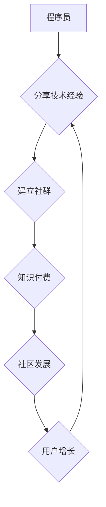

                 

## 知识付费：程序员的社群运营攻略

> 关键词：知识付费、程序员、社群运营、内容创作、社区建设、技术分享、在线教育、商业模式

### 1. 背景介绍

在当今数字化时代，知识已成为最宝贵的资源之一。程序员作为科技发展的重要力量，拥有丰富的技术经验和专业技能。然而，传统的技术分享方式往往局限于线下会议、论坛等平台，难以有效触达更广泛的程序员群体。知识付费模式的兴起为程序员提供了新的机会，让他们能够将自己的知识和经验转化为价值，并通过线上平台与更多人分享。

近年来，知识付费市场蓬勃发展，涵盖了各个领域，其中程序员领域的知识付费也取得了显著的成绩。从在线课程、技术博客到技术社群，程序员们通过多种方式分享知识，并获得了丰厚的回报。

### 2. 核心概念与联系

**2.1 知识付费**

知识付费是指通过付费的方式获取知识和技能，是一种基于知识价值的商业模式。它打破了传统知识传播的壁垒，让知识更加易于获取和传播。

**2.2 社群运营**

社群运营是指围绕特定主题或目标，建立和管理一个线上或线下的社区，并通过各种活动和互动方式，增强社区成员之间的粘性，促进社区发展。

**2.3 程序员社群**

程序员社群是指由程序员组成的线上或线下的社区，他们分享技术经验、交流学习心得、共同解决技术难题。

**2.4 核心概念联系**

知识付费和社群运营相辅相成，两者共同构成了程序员知识分享的生态系统。

* **社群运营为知识付费提供平台和用户群体。** 社群运营可以帮助程序员建立一个活跃的社区，吸引更多程序员加入，并为他们的知识付费产品提供潜在用户。
* **知识付费为社群运营提供动力和价值。** 知识付费可以为社群运营提供经济支持，鼓励程序员持续创作高质量的内容，并提升社群的价值。

**Mermaid 流程图**



### 3. 核心算法原理 & 具体操作步骤

**3.1 算法原理概述**

知识付费的成功离不开有效的算法原理，这些算法可以帮助程序员精准定位目标用户，推荐合适的知识付费产品，并提升用户体验。

* **内容推荐算法:** 基于用户历史行为、兴趣偏好等数据，推荐与用户需求相匹配的知识付费产品。
* **用户画像算法:** 分析用户数据，构建用户画像，以便更好地理解用户的需求和行为模式。
* **社区运营算法:** 分析社区活跃度、用户互动等数据，优化社区运营策略，提升社区粘性。

**3.2 算法步骤详解**

* **数据采集:** 收集用户行为数据、兴趣偏好数据、知识付费产品数据等。
* **数据清洗:** 对收集到的数据进行清洗和处理，去除无效数据和噪声数据。
* **特征提取:** 从数据中提取用户特征、产品特征等，构建数据模型。
* **模型训练:** 使用机器学习算法，训练推荐模型、用户画像模型、社区运营模型等。
* **模型评估:** 对模型进行评估，调整模型参数，提升模型精度。
* **模型部署:** 将训练好的模型部署到线上平台，实现自动化推荐、用户画像、社区运营等功能。

**3.3 算法优缺点**

* **优点:** 能够精准推荐知识付费产品，提升用户体验，提高转化率。
* **缺点:** 需要大量的数据支持，模型训练和维护成本较高。

**3.4 算法应用领域**

* **在线教育平台:** 推荐课程、学习资源。
* **技术博客:** 推荐相关文章、技术文档。
* **技术社群:** 推荐社区活动、技术讨论。

### 4. 数学模型和公式 & 详细讲解 & 举例说明

**4.1 数学模型构建**

知识推荐系统通常使用协同过滤算法，该算法基于用户的历史行为和产品特征，预测用户对产品的兴趣。

**4.2 公式推导过程**

协同过滤算法的核心是计算用户之间和产品之间的相似度。

* **用户相似度:** 使用余弦相似度计算两个用户之间的相似度。

$$
\text{相似度}(u_i, u_j) = \frac{\sum_{k=1}^{n} r_{i,k} \cdot r_{j,k}}{\sqrt{\sum_{k=1}^{n} r_{i,k}^2} \cdot \sqrt{\sum_{k=1}^{n} r_{j,k}^2}}
$$

其中，$u_i$ 和 $u_j$ 是两个用户，$r_{i,k}$ 和 $r_{j,k}$ 是用户 $u_i$ 和 $u_j$ 对产品 $k$ 的评分。

* **产品相似度:** 使用余弦相似度计算两个产品之间的相似度。

$$
\text{相似度}(p_i, p_j) = \frac{\sum_{k=1}^{m} r_{i,k} \cdot r_{j,k}}{\sqrt{\sum_{k=1}^{m} r_{i,k}^2} \cdot \sqrt{\sum_{k=1}^{m} r_{j,k}^2}}
$$

其中，$p_i$ 和 $p_j$ 是两个产品，$r_{i,k}$ 和 $r_{j,k}$ 是用户对产品 $i$ 和 $j$ 的评分。

**4.3 案例分析与讲解**

假设有一个在线教育平台，用户 A 和用户 B 都对编程课程感兴趣，用户 A 对 Python 课程评分很高，用户 B 对 Java 课程评分很高。

* 通过计算用户 A 和用户 B 的相似度，可以发现他们对编程课程的兴趣相似。
* 因此，可以推荐用户 A 学习 Java 课程，推荐用户 B 学习 Python 课程。

### 5. 项目实践：代码实例和详细解释说明

**5.1 开发环境搭建**

* Python 3.x
* Flask 或 Django 框架
* 数据库 (例如 MySQL, PostgreSQL)

**5.2 源代码详细实现**

```python
from flask import Flask, render_template

app = Flask(__name__)

@app.route('/')
def index():
    return render_template('index.html')

if __name__ == '__main__':
    app.run(debug=True)
```

**5.3 代码解读与分析**

* 该代码是一个简单的 Flask 应用，用于搭建一个知识付费平台的首页。
* `render_template('index.html')` 函数渲染 `index.html` 模板文件，该文件包含了平台首页的布局和内容。

**5.4 运行结果展示**

运行该代码后，会在本地服务器上启动一个网站，访问 `http://127.0.0.1:5000/` 可以看到平台首页。

### 6. 实际应用场景

**6.1 在线课程平台**

程序员可以将自己的技术课程录制成视频，上传到在线课程平台，并通过知识付费模式销售课程。

**6.2 技术博客**

程序员可以撰写技术文章，分享自己的经验和知识，并通过订阅、会员制度等方式获取收益。

**6.3 技术社群**

程序员可以建立技术社群，提供技术交流、学习支持等服务，并通过会员制度、赞助等方式获取收益。

**6.4 未来应用展望**

* **人工智能驱动的知识推荐:** 利用人工智能算法，更精准地推荐知识付费产品，提升用户体验。
* **虚拟现实/增强现实技术:** 利用 VR/AR 技术，打造沉浸式的学习体验，提升知识付费产品的吸引力。
* **元宇宙:** 在元宇宙中构建虚拟的学习空间，提供更丰富的知识付费服务。

### 7. 工具和资源推荐

**7.1 学习资源推荐**

* **在线课程平台:** Udemy, Coursera, edX
* **技术博客:** Medium, Dev.to, Hacker News
* **技术社群:** Stack Overflow, GitHub, Reddit

**7.2 开发工具推荐**

* **Python 框架:** Flask, Django
* **数据库:** MySQL, PostgreSQL
* **云服务平台:** AWS, Azure, GCP

**7.3 相关论文推荐**

* **协同过滤算法:** "Collaborative Filtering: A User-Based Approach" by Goldberg et al. (1992)
* **内容推荐算法:** "Content-Based Recommendation Systems" by Ricci et al. (2011)

### 8. 总结：未来发展趋势与挑战

**8.1 研究成果总结**

知识付费模式为程序员提供了新的收入来源和知识传播途径，并促进了技术社区的建设和发展。

**8.2 未来发展趋势**

* **个性化定制:** 根据用户的学习需求和习惯，提供个性化的知识付费产品。
* **互动式学习:** 通过直播、问答、讨论等方式，增强用户之间的互动，提升学习效果。
* **跨平台融合:** 将知识付费服务整合到多个平台，提供更便捷的学习体验。

**8.3 面临的挑战**

* **内容质量:** 确保知识付费产品的质量和价值，避免低质量内容的泛滥。
* **用户信任:** 建立用户的信任，避免知识付费平台的虚假宣传和欺诈行为。
* **商业模式创新:** 探索新的商业模式，提高知识付费平台的盈利能力。

**8.4 研究展望**

未来，知识付费模式将继续发展壮大，并与人工智能、虚拟现实等新技术融合，为程序员提供更优质的学习体验和知识分享平台。

### 9. 附录：常见问题与解答

**9.1 如何选择合适的知识付费产品？**

* 确定自己的学习目标和需求。
* 阅读产品介绍和用户评价。
* 关注产品的更新频率和售后服务。

**9.2 如何避免知识付费平台的虚假宣传和欺诈行为？**

* 选择信誉良好的平台。
* 仔细阅读平台的条款和规则。
* 保留好购买记录和沟通记录。

**9.3 如何提高知识付费平台的盈利能力？**

* 提供高质量的知识付费产品。
* 提升用户体验和粘性。
* 探索新的商业模式。


作者：禅与计算机程序设计艺术 / Zen and the Art of Computer Programming 
<end_of_turn>

