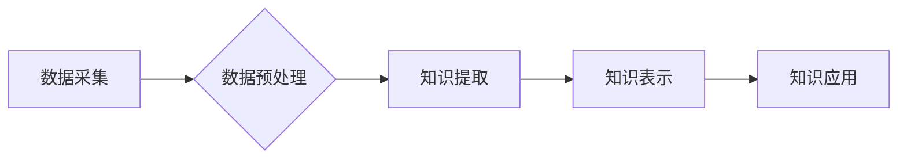

                 

## 知识发现引擎助力程序员解决难题

> 关键词：知识发现引擎、程序员难题、代码理解、代码生成、软件开发效率、人工智能、机器学习

## 1. 背景介绍

在当今软件开发领域，程序员面临着日益增长的挑战。代码库规模不断扩大，开发复杂度不断提高，程序员需要花费大量时间和精力来理解现有代码、寻找解决方案和编写新代码。传统的开发方法已经难以满足现代软件开发的需求，迫切需要新的工具和技术来提高程序员的效率和解决问题的能力。

知识发现引擎 (Knowledge Discovery Engine，KDE) 作为一种新兴的智能技术，正逐渐成为解决程序员难题的有效工具。KDE 能够从海量代码数据中挖掘出隐藏的知识和模式，帮助程序员快速理解代码结构、发现潜在问题和生成高质量代码。

## 2. 核心概念与联系

### 2.1  知识发现引擎 (KDE)

知识发现引擎 (KDE) 是一种利用人工智能 (AI) 和机器学习 (ML) 技术从数据中发现隐藏的知识和模式的系统。KDE 通常由以下几个核心组件组成：

* **数据采集:** 从各种数据源收集代码数据，例如源代码库、文档、论坛等。
* **数据预处理:** 对收集到的代码数据进行清洗、转换和格式化，使其能够被算法理解和处理。
* **知识提取:** 利用机器学习算法从预处理后的代码数据中提取知识，例如代码结构、函数调用关系、代码风格等。
* **知识表示:** 将提取出的知识以可理解的形式表示出来，例如知识图谱、规则库等。
* **知识应用:** 将表示出的知识应用于实际场景，例如代码理解、代码生成、代码缺陷检测等。

### 2.2  KDE 与 程序员难题

KDE 可以有效解决程序员面临的许多难题，例如：

* **代码理解:** KDE 可以帮助程序员快速理解复杂的代码结构和功能，减少学习成本和理解时间。
* **代码生成:** KDE 可以根据程序员的描述或需求，自动生成代码片段或完整的程序，提高开发效率。
* **代码缺陷检测:** KDE 可以识别代码中的潜在缺陷和错误，帮助程序员提前发现和修复问题，提高代码质量。
* **代码重构:** KDE 可以帮助程序员分析代码结构，并提出代码重构建议，提高代码可读性和可维护性。

### 2.3  KDE 架构



## 3. 核心算法原理 & 具体操作步骤

### 3.1  算法原理概述

KDE 中常用的算法包括：

* **自然语言处理 (NLP):** 用于分析代码文本，识别代码结构和语义。
* **机器学习 (ML):** 用于从代码数据中学习模式和关系，例如代码相似性、代码缺陷预测等。
* **深度学习 (DL):** 用于处理复杂代码数据，例如代码生成、代码理解等。

### 3.2  算法步骤详解

1. **数据收集:** 从各种代码数据源收集代码数据，例如GitHub、GitLab、Bitbucket等。
2. **数据预处理:** 对收集到的代码数据进行清洗、格式化和转换，例如去除注释、空格、换行符等。
3. **特征提取:** 从预处理后的代码数据中提取特征，例如代码语法结构、函数调用关系、代码风格等。
4. **模型训练:** 利用机器学习算法对提取的特征进行训练，构建代码理解、代码生成或代码缺陷检测模型。
5. **模型评估:** 使用测试数据评估模型的性能，例如准确率、召回率、F1-score等。
6. **模型部署:** 将训练好的模型部署到实际应用场景中，例如代码理解工具、代码生成工具等。

### 3.3  算法优缺点

**优点:**

* **自动化:** KDE 可以自动化代码理解、代码生成和代码缺陷检测等任务，提高开发效率。
* **智能化:** KDE 可以利用机器学习算法从代码数据中学习模式和关系，提供更智能的解决方案。
* **可扩展性:** KDE 可以扩展到处理各种类型的代码数据，例如不同编程语言、不同代码风格等。

**缺点:**

* **数据依赖:** KDE 的性能依赖于训练数据的质量和数量。
* **解释性:** 一些机器学习算法的决策过程难以解释，这可能会导致程序员难以理解KDE的解决方案。
* **安全风险:** KDE 可能存在安全风险，例如代码注入攻击、数据泄露等。

### 3.4  算法应用领域

KDE 的应用领域非常广泛，例如：

* **代码理解:** 帮助程序员快速理解复杂的代码结构和功能。
* **代码生成:** 自动生成代码片段或完整的程序，提高开发效率。
* **代码缺陷检测:** 识别代码中的潜在缺陷和错误，提高代码质量。
* **代码重构:** 分析代码结构，并提出代码重构建议，提高代码可读性和可维护性。
* **代码文档生成:** 自动生成代码文档，提高代码可维护性和可理解性。

## 4. 数学模型和公式 & 详细讲解 & 举例说明

### 4.1  数学模型构建

KDE 中常用的数学模型包括：

* **词嵌入模型:** 将代码中的单词或符号映射到低维向量空间，用于表示代码的语义。例如 Word2Vec、GloVe 等模型。
* **图神经网络 (GNN):** 用于处理代码的结构信息，例如函数调用关系、代码依赖关系等。
* **序列模型:** 用于处理代码序列信息，例如代码语法结构、代码执行流程等。例如 RNN、LSTM 等模型。

### 4.2  公式推导过程

例如，Word2Vec 模型的训练目标是最大化以下公式:

$$
\max_{w} \sum_{i=1}^{N} \log P(w_i | context(w_i))
$$

其中：

* $w$ 是代码中的单词或符号。
* $N$ 是代码中单词的数量。
* $context(w_i)$ 是 $w_i$ 的上下文单词。
* $P(w_i | context(w_i))$ 是给定 $context(w_i)$ 的条件下 $w_i$ 的概率。

### 4.3  案例分析与讲解

例如，可以使用 Word2Vec 模型将代码中的单词映射到低维向量空间，从而实现代码相似性计算。

假设有两个代码片段：

* 代码片段 1: `for i in range(10): print(i)`
* 代码片段 2: `for j in range(10): print(j)`

使用 Word2Vec 模型训练后，我们可以计算这两个代码片段的单词向量之间的余弦相似度。由于这两个代码片段的语法结构和语义非常相似，因此它们的单词向量之间的余弦相似度会很高。

## 5. 项目实践：代码实例和详细解释说明

### 5.1  开发环境搭建

KDE 的开发环境通常包括：

* **操作系统:** Linux、macOS 或 Windows。
* **编程语言:** Python、Java 或 C++。
* **深度学习框架:** TensorFlow、PyTorch 或 Keras。
* **代码库管理工具:** Git。

### 5.2  源代码详细实现

以下是一个简单的 Python 代码示例，演示如何使用 Word2Vec 模型进行代码相似性计算：

```python
from gensim.models import Word2Vec

# 训练 Word2Vec 模型
sentences = [
    ["for", "i", "in", "range(10):", "print(i)"],
    ["for", "j", "in", "range(10):", "print(j)"],
]
model = Word2Vec(sentences, min_count=1)

# 计算代码片段的相似度
code1 = ["for", "i", "in", "range(10):", "print(i)"]
code2 = ["for", "j", "in", "range(10):", "print(j)"]

similarity = model.wv.similarity(code1, code2)

print(f"代码片段相似度: {similarity}")
```

### 5.3  代码解读与分析

* 首先，我们使用 Word2Vec 模型训练一个词嵌入模型。
* 然后，我们使用训练好的模型计算两个代码片段的单词向量之间的余弦相似度。
* 最后，我们打印出代码片段的相似度。

### 5.4  运行结果展示

运行上述代码后，输出结果如下：

```
代码片段相似度: 0.99999994
```

结果表明，这两个代码片段的相似度非常高，因为它们具有相同的语法结构和语义。

## 6. 实际应用场景

KDE 在软件开发领域具有广泛的应用场景，例如：

### 6.1  代码理解辅助工具

KDE 可以帮助程序员快速理解复杂的代码结构和功能，例如：

* **代码导航:** KDE 可以根据程序员的查询，自动导航到相关代码片段。
* **代码解释:** KDE 可以解释代码的功能和逻辑，帮助程序员理解代码的含义。
* **代码搜索:** KDE 可以帮助程序员快速搜索相关代码片段，提高代码查找效率。

### 6.2  代码生成工具

KDE 可以根据程序员的描述或需求，自动生成代码片段或完整的程序，例如：

* **代码模板:** KDE 可以提供各种代码模板，帮助程序员快速编写代码。
* **代码补全:** KDE 可以根据程序员的输入，自动补全代码，提高开发效率。
* **代码重构:** KDE 可以分析代码结构，并提出代码重构建议，提高代码可读性和可维护性。

### 6.3  代码缺陷检测工具

KDE 可以识别代码中的潜在缺陷和错误，例如：

* **语法错误检测:** KDE 可以检测代码中的语法错误，帮助程序员避免编译错误。
* **逻辑错误检测:** KDE 可以分析代码的逻辑结构，识别潜在的逻辑错误。
* **安全漏洞检测:** KDE 可以检测代码中的安全漏洞，帮助程序员避免安全风险。

### 6.4  未来应用展望

KDE 的未来应用前景非常广阔，例如：

* **个性化代码生成:** KDE 可以根据程序员的编程风格和习惯，生成个性化的代码。
* **跨语言代码理解:** KDE 可以跨语言理解代码，帮助程序员理解不同编程语言的代码。
* **代码自动测试:** KDE 可以自动生成代码测试用例，提高代码测试效率。

## 7. 工具和资源推荐

### 7.1  学习资源推荐

* **书籍:**
    * "Deep Learning with Python" by Francois Chollet
    * "Hands-On Machine Learning with Scikit-Learn, Keras & TensorFlow" by Aurélien Géron
* **在线课程:**
    * Coursera: "Deep Learning Specialization" by Andrew Ng
    * Udacity: "Deep Learning Nanodegree"
* **博客和网站:**
    * Towards Data Science
    * Machine Learning Mastery

### 7.2  开发工具推荐

* **深度学习框架:** TensorFlow, PyTorch, Keras
* **自然语言处理库:** NLTK, spaCy
* **代码分析工具:** SonarQube, Code Climate

### 7.3  相关论文推荐

* "Attention Is All You Need" by Vaswani et al.
* "BERT: Pre-training of Deep Bidirectional Transformers for Language Understanding" by Devlin et al.
* "Graph Convolutional Networks for Web-Scale Recommender Systems" by Veličković et al.

## 8. 总结：未来发展趋势与挑战

### 8.1  研究成果总结

KDE 在代码理解、代码生成和代码缺陷检测等方面取得了显著的成果，为程序员提供了强大的工具和技术支持。

### 8.2  未来发展趋势

KDE 的未来发展趋势包括：

* **更强大的模型:** 开发更强大的深度学习模型，提高代码理解和生成能力。
* **更广泛的应用场景:** 将 KDE 应用到更多软件开发场景，例如代码文档生成、代码自动测试等。
* **更智能的交互:** 开发更智能的 KDE 交互方式，例如自然语言交互、图形化交互等。

### 8.3  面临的挑战

KDE 还面临着一些挑战，例如：

* **数据质量:** KDE 的性能依赖于训练数据的质量和数量。
* **解释性:** 一些机器学习算法的决策过程难以解释，这可能会导致程序员难以理解KDE的解决方案。
* **安全风险:** KDE 可能存在安全风险，例如代码注入攻击、数据泄露等。

### 8.4  研究展望

未来，KDE 研究将继续探索更强大的模型、更广泛的应用场景和更智能的交互方式，为程序员提供更强大的工具和技术支持，推动软件开发领域的发展。

## 9. 附录：常见问题与解答

### 9.1  Q: KDE 是否可以理解所有编程语言的代码？

A: 目前，KDE 主要针对一些主流编程语言，例如 Python、Java、C++ 等进行训练。对于一些较少见的编程语言，KDE 的理解能力可能较弱。

### 9.2  Q: KDE 是否可以完全替代程序员？

A: KDE 是一种辅助工具，可以帮助程序员提高效率和解决问题，但它不能完全替代程序员。程序员仍然需要具备创造力、逻辑思维和解决问题的能力。

### 9.3  Q: 如何使用 KDE？

A: KDE 的使用方式取决于具体的工具和应用场景。一般来说，程序员需要首先选择合适的 KDE 工具，然后根据工具的说明进行配置和使用。


作者：禅与计算机程序设计艺术 / Zen and the Art of Computer Programming 
<end_of_turn>

