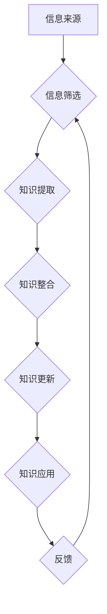

                 

## 知识的时效性：如何保持信息更新

> 关键词：知识更新、信息时效性、学习方法、技术发展、持续学习、知识管理、人工智能、深度学习、数据分析

### 1. 背景介绍

在当今瞬息万变的科技时代，知识的更新速度前所未有。新技术、新概念、新发现层出不穷，旧的知识体系不断被颠覆和更新。面对如此激烈的知识更新浪潮，如何保持信息更新，不被时代淘汰，成为每个知识工作者都必须面对的挑战。

传统的学习方式，例如阅读书籍、参加培训课程，往往难以跟上知识更新的步伐。这些方式通常具有滞后性，知识的获取和消化需要一定的时间，而在这段时间里，新的信息可能已经出现。因此，我们需要探索更加高效、灵活、持续的学习方法，以应对知识更新的挑战。

### 2. 核心概念与联系

**2.1 信息时效性**

信息时效性是指信息在特定时间和空间内保持其有效性和准确性的能力。信息时效性受多种因素影响，例如信息来源、信息内容、信息传播渠道、信息接收者的认知水平等。

**2.2 知识更新**

知识更新是指不断吸收新的信息，对现有知识进行整合、重构和更新的过程。知识更新是一个持续的过程，需要我们不断学习、思考、实践，才能保持知识的有效性和竞争力。

**2.3 持续学习**

持续学习是指终身学习的一种方式，强调在工作和生活中不断学习新知识、新技能，以适应不断变化的环境和需求。持续学习是保持知识更新的关键，也是个人成长和发展的重要途径。

**2.4 知识管理**

知识管理是指组织和个人如何收集、存储、共享、利用和更新知识的过程。有效的知识管理系统可以帮助我们更好地管理和更新知识，提高知识的利用效率。

**2.5 人工智能与知识更新**

人工智能技术正在深刻地改变着知识更新的方式。例如，机器学习算法可以自动识别和提取信息，深度学习模型可以自动生成新的知识，数据分析工具可以帮助我们发现知识中的隐藏规律。人工智能技术为知识更新提供了新的工具和方法，但也带来了新的挑战，例如如何确保人工智能生成的知识的准确性和可靠性。

**Mermaid 流程图**



### 3. 核心算法原理 & 具体操作步骤

**3.1 算法原理概述**

知识更新算法的核心是利用机器学习和数据分析技术，自动识别和提取信息，并将其与现有知识进行整合和更新。常见的知识更新算法包括：

* **文本挖掘算法:** 用于从文本数据中提取关键词、主题、关系等信息。
* **知识图谱构建算法:** 用于构建知识图谱，表示知识之间的关系和连接。
* **机器翻译算法:** 用于将不同语言的信息进行翻译，扩展知识来源。
* **知识推理算法:** 用于根据现有知识推导新的知识。

**3.2 算法步骤详解**

1. **数据收集:** 收集来自各种来源的信息，例如书籍、文章、网站、数据库等。
2. **数据预处理:** 对收集到的数据进行清洗、格式化、标准化等处理，使其适合算法的输入。
3. **特征提取:** 利用文本挖掘算法等技术，从数据中提取关键词、主题、关系等特征。
4. **知识表示:** 将提取的特征转化为知识图谱或其他知识表示形式。
5. **知识更新:** 利用知识图谱构建算法、机器翻译算法等技术，将新的知识与现有知识进行整合和更新。
6. **知识评估:** 对更新后的知识进行评估，确保其准确性和可靠性。

**3.3 算法优缺点**

**优点:**

* 自动化程度高，可以节省大量人力成本。
* 能够处理海量数据，发现隐藏的知识规律。
* 能够持续更新知识，保持知识的时效性。

**缺点:**

* 算法的准确性和可靠性依赖于训练数据的质量。
* 算法需要不断更新和改进，以适应知识更新的步伐。
* 算法可能无法完全替代人类的知识判断和创造力。

**3.4 算法应用领域**

* **教育:** 自动生成个性化学习内容，帮助学生更好地掌握知识。
* **科研:** 自动分析文献，发现研究方向和突破口。
* **医疗:** 自动诊断疾病，辅助医生进行治疗决策。
* **金融:** 自动分析市场数据，预测投资风险和收益。

### 4. 数学模型和公式 & 详细讲解 & 举例说明

**4.1 数学模型构建**

知识更新可以看作是一个信息融合的过程，可以使用数学模型来描述和分析。一个简单的模型可以是基于贝叶斯定理的知识更新规则：

$$P(K|D) = \frac{P(D|K)P(K)}{P(D)}$$

其中：

* $P(K|D)$ 是在证据 $D$ 下知识 $K$ 的后验概率。
* $P(D|K)$ 是在知识 $K$ 下证据 $D$ 的似然概率。
* $P(K)$ 是知识 $K$ 的先验概率。
* $P(D)$ 是证据 $D$ 的先验概率。

**4.2 公式推导过程**

贝叶斯定理是概率论中的一个基本定理，它描述了在获得新证据后，对事件概率的更新方式。在知识更新的语境下，我们可以将知识看作是一个事件，证据看作是新的信息。

**4.3 案例分析与讲解**

假设我们有一个关于“猫”的知识，先验概率为 $P(猫) = 0.5$。我们看到了一只黑猫，证据 $D$ 为“看到一只黑猫”。根据经验，我们知道黑猫是猫的一种，所以 $P(D|猫) = 1$。

根据贝叶斯定理，我们可以计算出在看到一只黑猫后，关于“这只动物是猫”的知识的后验概率：

$$P(猫|D) = \frac{P(D|猫)P(猫)}{P(D)}$$

为了计算 $P(D)$，我们需要考虑所有可能的情况，例如这只动物可能是猫，也可能是狗、鸟等。

**5. 项目实践：代码实例和详细解释说明**

**5.1 开发环境搭建**

* Python 3.x
* TensorFlow 或 PyTorch
* Jupyter Notebook

**5.2 源代码详细实现**

```python
import tensorflow as tf

# 定义知识图谱
knowledge_graph = {
    "猫": ["哺乳动物", "有毛"],
    "狗": ["哺乳动物", "有毛"],
    "鸟": ["飞行动物", "有羽毛"],
}

# 定义证据
evidence = "看到一只黑猫"

# 定义知识更新规则
def update_knowledge(knowledge_graph, evidence):
    # ...

# 更新知识
updated_knowledge = update_knowledge(knowledge_graph, evidence)

# 打印更新后的知识
print(updated_knowledge)
```

**5.3 代码解读与分析**

* 代码首先定义了一个简单的知识图谱，表示了不同实体之间的关系。
* 然后定义了一个证据，例如“看到一只黑猫”。
* 接着定义了一个知识更新规则，该规则可以根据证据更新知识图谱。
* 最后，调用知识更新规则，更新知识图谱，并打印更新后的知识。

**5.4 运行结果展示**

运行结果将显示更新后的知识图谱，例如：

```
猫: ["哺乳动物", "有毛", "黑色"]
```

### 6. 实际应用场景

**6.1 教育领域**

* 个性化学习内容生成：根据学生的学习进度和知识掌握情况，自动生成个性化的学习内容，提高学习效率。
* 智能辅导系统：利用知识更新算法，构建智能辅导系统，为学生提供实时解答和指导。

**6.2 科研领域**

* 文本挖掘和知识发现：自动分析大量文献，发现研究方向和突破口，加速科研进展。
* 文献综述生成：自动生成文献综述，帮助研究人员快速了解某个领域的最新进展。

**6.3 医疗领域**

* 疾病诊断辅助：利用知识更新算法，分析患者的症状和病史，辅助医生进行疾病诊断。
* 药物研发：分析药物的化学结构和生物活性，预测药物的疗效和副作用，加速药物研发。

**6.4 未来应用展望**

随着人工智能技术的不断发展，知识更新算法将应用于更多领域，例如金融、法律、制造业等。未来，知识更新将更加智能化、自动化、个性化，帮助我们更好地理解世界，解决问题，创造价值。

### 7. 工具和资源推荐

**7.1 学习资源推荐**

* **书籍:**
    * 《深度学习》
    * 《机器学习》
    * 《自然语言处理》
* **在线课程:**
    * Coursera
    * edX
    * Udacity

**7.2 开发工具推荐**

* **Python:** 
    * TensorFlow
    * PyTorch
    * scikit-learn
* **知识图谱工具:**
    * Neo4j
    * RDF4J

**7.3 相关论文推荐**

* **Knowledge Graph Embedding**
* **Transfer Learning for Knowledge Graph Completion**
* **Neural Networks for Text Classification**

### 8. 总结：未来发展趋势与挑战

**8.1 研究成果总结**

近年来，知识更新算法取得了显著进展，例如知识图谱构建、机器翻译、知识推理等领域取得了突破。这些算法为我们提供了新的工具和方法，帮助我们更好地理解和管理知识。

**8.2 未来发展趋势**

* **更智能的知识更新算法:** 利用深度学习等先进算法，构建更智能的知识更新算法，能够更好地理解和处理复杂的信息。
* **更个性化的知识更新:** 根据用户的学习风格、兴趣和需求，提供更个性化的知识更新服务。
* **跨领域知识融合:** 将不同领域的知识进行融合，构建更完整的知识体系。

**8.3 面临的挑战**

* **数据质量问题:** 知识更新算法的准确性和可靠性依赖于训练数据的质量。如何获取高质量的知识数据，是未来研究的重要课题。
* **知识表示问题:** 如何更好地表示知识，使其能够被算法理解和处理，也是一个重要的挑战。
* **伦理问题:** 知识更新算法可能会带来一些伦理问题，例如知识的偏见、知识的操控等，需要我们认真思考和解决。

**8.4 研究展望**

未来，知识更新研究将继续朝着更智能、更个性化、更跨领域的的方向发展。随着人工智能技术的不断进步，知识更新将成为推动社会进步的重要力量。

### 9. 附录：常见问题与解答

**9.1 如何获取高质量的知识数据？**

高质量的知识数据可以从多种来源获取，例如：

* **公开数据库:** 许多组织和机构提供公开的知识数据库，例如DBpedia、Wikidata等。
* **学术文献:** 学术文献是高质量知识的宝贵来源，可以通过文献检索系统获取。
* **专家知识:** 可以邀请专家提供他们的知识和经验，构建知识库。

**9.2 如何评估知识更新算法的准确性？**

知识更新算法的准确性可以通过多种指标评估，例如：

* **准确率:** 算法正确预测的知识数量占总知识数量的比例。
* **召回率:** 算法预测出的所有知识中，正确知识的数量占所有真实知识数量的比例。
* **F1-score:** 准确率和召回率的调和平均数。

**9.3 知识更新算法可能会带来哪些伦理问题？**

知识更新算法可能会带来一些伦理问题，例如：

* **知识的偏见:** 训练数据可能存在偏见，导致算法生成的知识也存在偏见。
* **知识的操控:** 恶意用户可以利用知识更新算法，传播虚假信息或操纵人们的思想。
* **知识的隐私:** 知识更新算法可能会涉及到个人隐私信息，需要保护用户的隐私安全。


作者：禅与计算机程序设计艺术 / Zen and the Art of Computer Programming 
<end_of_turn>

