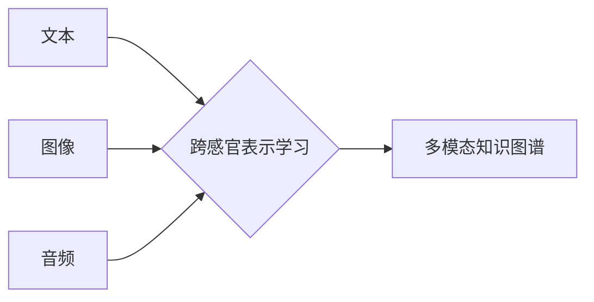

                 

## 知识的跨感官学习：多维度理解的力量

> 关键词：跨感官学习、多模态学习、深度学习、知识表示、人工智能、认知科学

### 1. 背景介绍

在当今数据爆炸的时代，人类面临着海量信息处理的挑战。传统的单模态学习方法，例如仅使用文本或图像，难以捕捉知识的多样性和复杂性。跨感官学习（Cross-modal Learning）应运而生，旨在融合不同模态的信息，构建更全面、更深入的知识理解。

跨感官学习的研究源于认知科学对人类学习方式的探索。人类的认知过程并非孤立地依赖于单一感官，而是通过多种感官信息的融合来构建对世界的理解。例如，我们观看电影时，不仅通过视觉信息理解剧情，还通过声音、音乐、演员的肢体语言等多模态信息来感受电影的情感和氛围。

近年来，随着深度学习技术的飞速发展，跨感官学习取得了显著进展。深度学习模型能够学习不同模态之间的复杂关系，并构建多模态表示，从而实现更精准、更全面的知识理解。

### 2. 核心概念与联系

跨感官学习的核心概念是将不同模态的信息融合在一起，构建一个统一的知识表示。

**2.1  模态定义**

模态是指信息表达的方式，例如文本、图像、音频、视频等。

**2.2  跨感官表示学习**

跨感官表示学习是指学习不同模态之间的映射关系，将不同模态的信息映射到一个共同的语义空间中。

**2.3  多模态融合策略**

多模态融合策略是指将不同模态的信息融合在一起的方法，例如特征级融合、决策级融合、嵌入级融合等。

**2.4  跨感官知识图谱**

跨感官知识图谱是指将不同模态的信息整合到知识图谱中，构建一个多维度的知识表示。

**Mermaid 流程图**

### 3. 核心算法原理 & 具体操作步骤

**3.1  算法原理概述**

跨感官学习算法通常基于深度学习模型，例如卷积神经网络（CNN）、循环神经网络（RNN）和图神经网络（GNN）。这些模型能够学习不同模态之间的复杂关系，并构建多模态表示。

**3.2  算法步骤详解**

1. **数据预处理:** 将不同模态的数据进行预处理，例如文本分词、图像裁剪、音频降噪等。
2. **特征提取:** 使用专门的深度学习模型提取不同模态的数据特征。例如，使用CNN提取图像特征，使用RNN提取文本特征。
3. **跨感官表示学习:** 使用融合策略将不同模态的特征融合在一起，构建一个统一的跨感官表示。
4. **任务建模:** 根据具体的应用场景，构建相应的任务模型，例如图像字幕生成、文本情感分析、多模态检索等。
5. **模型训练:** 使用训练数据训练跨感官学习模型，优化模型参数。
6. **模型评估:** 使用测试数据评估模型性能，例如准确率、召回率、F1-score等。

**3.3  算法优缺点**

**优点:**

* 能够捕捉知识的多样性和复杂性。
* 提升了知识理解的准确性和深度。
* 拓展了人工智能应用的范围。

**缺点:**

* 需要大量的多模态数据进行训练。
* 模型训练复杂度高，计算资源消耗大。
* 跨模态关系的学习仍然是一个挑战。

**3.4  算法应用领域**

跨感官学习在多个领域都有广泛的应用，例如：

* **计算机视觉:** 图像字幕生成、图像检索、视频理解等。
* **自然语言处理:** 文本情感分析、文本摘要、机器翻译等。
* **人机交互:** 语音识别、手势识别、情感计算等。
* **医疗诊断:** 影像分析、病理报告分析等。

### 4. 数学模型和公式 & 详细讲解 & 举例说明

**4.1  数学模型构建**

跨感官学习模型通常使用多层神经网络结构，例如CNN-RNN模型。

**4.2  公式推导过程**

跨感官学习模型的损失函数通常是交叉熵损失函数，用于衡量模型预测结果与真实标签之间的差异。

$$
L = -\sum_{i=1}^{N} y_i \log(p_i)
$$

其中：

* $L$ 是损失函数
* $N$ 是样本数量
* $y_i$ 是真实标签
* $p_i$ 是模型预测概率

**4.3  案例分析与讲解**

例如，在图像字幕生成任务中，跨感官学习模型需要将图像特征和文本特征融合在一起，生成相应的字幕。

**5. 项目实践：代码实例和详细解释说明**

**5.1  开发环境搭建**

使用Python语言和深度学习框架TensorFlow或PyTorch搭建开发环境。

**5.2  源代码详细实现**

使用CNN提取图像特征，使用RNN提取文本特征，并使用注意力机制将不同模态的特征融合在一起。

**5.3  代码解读与分析**

解释代码中使用的深度学习模型、损失函数、优化算法等。

**5.4  运行结果展示**

展示模型在图像字幕生成任务上的运行结果，例如生成的字幕的准确率、流畅度等。

### 6. 实际应用场景

**6.1  教育领域**

跨感官学习可以用于开发更具互动性和沉浸感的教育软件，例如虚拟现实学习平台、多模态教学系统等。

**6.2  医疗领域**

跨感官学习可以用于辅助医生进行诊断，例如分析病理图像、识别患者的情绪等。

**6.3  娱乐领域**

跨感官学习可以用于开发更逼真的游戏体验，例如增强现实游戏、虚拟现实电影等。

**6.4  未来应用展望**

跨感官学习在未来将有更广泛的应用，例如智能家居、自动驾驶、机器人等。

### 7. 工具和资源推荐

**7.1  学习资源推荐**

* **书籍:**

    * 《深度学习》
    * 《计算机视觉:算法与应用》

* **在线课程:**

    * Coursera: 深度学习
    * Udacity: 计算机视觉

**7.2  开发工具推荐**

* **深度学习框架:** TensorFlow, PyTorch
* **图像处理库:** OpenCV
* **自然语言处理库:** NLTK, SpaCy

**7.3  相关论文推荐**

* 《Multimodal Learning with Deep Neural Networks》
* 《A Survey on Cross-Modal Learning》

### 8. 总结：未来发展趋势与挑战

**8.1  研究成果总结**

跨感官学习取得了显著进展，在多个领域都有应用。

**8.2  未来发展趋势**

* **更强大的跨感官表示学习模型:** 探索新的模型架构和训练方法，提升跨感官表示的质量和效率。
* **更丰富的模态融合:** 将更多模态信息融合在一起，构建更全面的知识表示。
* **更个性化的跨感官学习:** 根据用户的需求和偏好，定制个性化的跨感官学习模型。

**8.3  面临的挑战**

* **跨模态关系的学习:** 跨模态关系往往是复杂的和非线性的，需要更有效的学习方法。
* **数据获取和标注:** 跨感官学习需要大量的多模态数据，数据获取和标注成本较高。
* **模型解释性和可解释性:** 跨感官学习模型往往是黑盒模型，难以解释模型的决策过程。

**8.4  研究展望**

未来跨感官学习的研究将更加注重模型的解释性和可解释性，以及对不同模态关系的深入理解。

### 9. 附录：常见问题与解答

**9.1  跨感官学习与多模态学习有什么区别？**

跨感官学习是多模态学习的一种特殊形式，它侧重于融合不同模态的信息，构建一个统一的知识表示。

**9.2  跨感官学习有哪些应用场景？**

跨感官学习在多个领域都有应用，例如教育、医疗、娱乐等。

**9.3  如何搭建跨感官学习的开发环境？**

可以使用Python语言和深度学习框架TensorFlow或PyTorch搭建开发环境。

**9.4  跨感官学习的未来发展趋势是什么？**

未来跨感官学习的研究将更加注重模型的解释性和可解释性，以及对不同模态关系的深入理解。

作者：禅与计算机程序设计艺术 / Zen and the Art of Computer Programming 
<end_of_turn>

