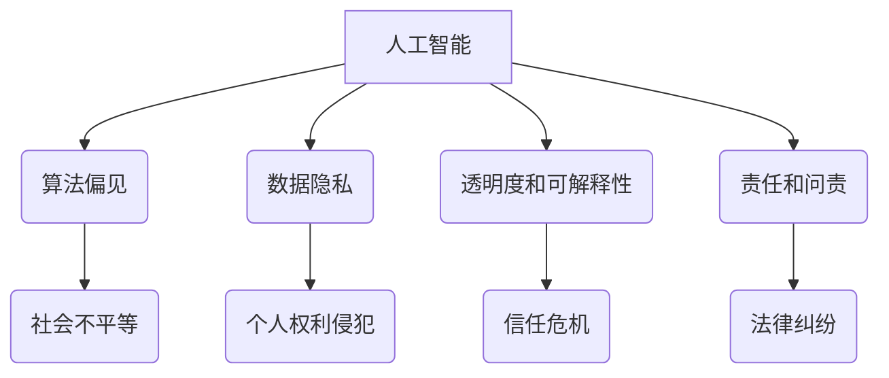

                 

## 硅谷人工智能伦理监管:确保技术良性发展

> 关键词：人工智能、伦理监管、硅谷、算法偏见、数据隐私、透明度、可解释性、公平性

## 1. 背景介绍

人工智能（AI）技术近年来发展迅速，在各个领域展现出巨大的潜力，从医疗保健到金融、交通运输，甚至艺术创作，AI都已渗透到我们的生活。然而，随着AI技术的不断进步，其潜在的风险和伦理问题也日益凸显。

硅谷作为全球人工智能技术发展中心，涌现出众多AI巨头，其产品和服务深刻地影响着人们的生活。然而，硅谷的AI发展也面临着伦理监管的挑战。

**1.1 AI伦理风险**

* **算法偏见:** AI算法的训练数据可能包含社会偏见，导致算法输出结果存在偏见，从而加剧社会不平等。
* **数据隐私:** AI算法需要大量数据进行训练，这可能会侵犯个人隐私。
* **透明度和可解释性:** 许多AI算法过于复杂，其决策过程难以理解，这使得人们难以信任AI系统。
* **责任和问责:** 当AI系统导致负面后果时，如何确定责任和进行问责是一个难题。

**1.2 硅谷AI伦理监管现状**

目前，硅谷对AI伦理监管尚处于探索阶段。一些科技公司开始制定自己的AI伦理准则，并进行内部审查。同时，政府机构也开始出台相关政策法规，例如美国加州的消费者隐私法案。

然而，现有的监管机制仍然存在不足，例如缺乏统一的标准、监管力度不足、执法能力有限等。

## 2. 核心概念与联系

**2.1 核心概念**

* **人工智能 (AI):** 指能够模拟人类智能行为的计算机系统。
* **伦理监管:** 指对人工智能技术及其应用进行道德和社会规范的约束和引导。
* **算法偏见:** 指AI算法在训练数据中学习到的社会偏见，导致算法输出结果存在不公平或歧视性。
* **数据隐私:** 指个人信息在收集、使用、存储和处理过程中受到保护的权利。
* **透明度和可解释性:** 指AI算法的决策过程能够被人类理解和解释的能力。
* **责任和问责:** 指当AI系统导致负面后果时，确定责任主体和进行问责的机制。

**2.2 核心概念联系**



## 3. 核心算法原理 & 具体操作步骤

**3.1 算法原理概述**

AI算法的训练过程本质上是一个参数优化过程。通过不断调整算法参数，使算法在训练数据上表现得越好。常见的AI算法包括：

* **监督学习:** 利用标记数据训练模型，预测未知数据。
* **无监督学习:** 利用未标记数据发现数据中的模式和结构。
* **强化学习:** 通过试错学习，在环境中获得最大奖励。

**3.2 算法步骤详解**

1. **数据收集和预处理:** 收集相关数据，并进行清洗、转换、特征工程等预处理操作。
2. **模型选择:** 根据任务需求选择合适的AI算法模型。
3. **模型训练:** 利用训练数据训练模型，调整模型参数。
4. **模型评估:** 利用测试数据评估模型性能，并进行调参优化。
5. **模型部署:** 将训练好的模型部署到实际应用场景中。

**3.3 算法优缺点**

* **优点:** 能够自动学习数据模式，提高效率和准确性。
* **缺点:** 容易受到训练数据的影响，可能产生算法偏见。

**3.4 算法应用领域**

* **医疗保健:** 疾病诊断、药物研发、个性化治疗。
* **金融:** 风险评估、欺诈检测、投资决策。
* **交通运输:** 自动驾驶、交通流量预测、物流优化。
* **教育:** 个性化学习、智能辅导、自动批改。

## 4. 数学模型和公式 & 详细讲解 & 举例说明

**4.1 数学模型构建**

AI算法的数学模型通常基于概率论和统计学。例如，线性回归模型可以表示为：

$$y = w_0 + w_1x_1 + w_2x_2 + ... + w_nx_n + \epsilon$$

其中：

* $y$ 是预测结果
* $w_0, w_1, ..., w_n$ 是模型参数
* $x_1, x_2, ..., x_n$ 是输入特征
* $\epsilon$ 是误差项

**4.2 公式推导过程**

模型参数的优化通常使用梯度下降算法。梯度下降算法的目标是找到使损失函数最小化的参数值。损失函数衡量模型预测结果与真实结果之间的误差。

**4.3 案例分析与讲解**

假设我们想要预测房价，输入特征包括房屋面积、房间数量、地理位置等。我们可以使用线性回归模型来构建预测模型。通过训练数据，我们可以找到最佳的模型参数，从而预测新的房屋价格。

## 5. 项目实践：代码实例和详细解释说明

**5.1 开发环境搭建**

* Python 3.x
* TensorFlow 或 PyTorch 等深度学习框架
* Jupyter Notebook 或 VS Code 等代码编辑器

**5.2 源代码详细实现**

```python
import tensorflow as tf

# 定义模型
model = tf.keras.models.Sequential([
  tf.keras.layers.Dense(64, activation='relu', input_shape=(4,)),
  tf.keras.layers.Dense(1)
])

# 编译模型
model.compile(optimizer='adam', loss='mse')

# 训练模型
model.fit(X_train, y_train, epochs=10)

# 预测
predictions = model.predict(X_test)
```

**5.3 代码解读与分析**

* 我们使用 TensorFlow 框架构建了一个简单的线性回归模型。
* 模型包含两个全连接层，第一层有 64 个神经元，激活函数为 ReLU，输入特征维度为 4。
* 第二层只有一个神经元，输出预测结果。
* 我们使用 Adam 优化器和均方误差损失函数训练模型。
* 训练完成后，我们可以使用模型预测新的数据。

**5.4 运行结果展示**

训练结果可以展示在 Jupyter Notebook 中，包括训练损失、验证损失等指标。

## 6. 实际应用场景

**6.1 医疗保健**

* **疾病诊断:** AI算法可以分析患者的医疗影像、病历等数据，辅助医生诊断疾病。
* **药物研发:** AI算法可以加速药物研发过程，例如预测药物的活性、副作用等。

**6.2 金融**

* **风险评估:** AI算法可以分析客户的财务数据，评估其贷款风险。
* **欺诈检测:** AI算法可以识别异常交易行为，防止金融欺诈。

**6.3 交通运输**

* **自动驾驶:** AI算法是自动驾驶汽车的核心技术，负责感知环境、规划路径、控制车辆。
* **交通流量预测:** AI算法可以分析交通数据，预测交通流量变化，优化交通管理。

**6.4 未来应用展望**

* **个性化教育:** AI算法可以根据学生的学习情况，提供个性化的学习方案。
* **智能客服:** AI算法可以模拟人类对话，提供智能客服服务。
* **创意设计:** AI算法可以辅助人类进行创意设计，例如生成音乐、绘画等。

## 7. 工具和资源推荐

**7.1 学习资源推荐**

* **在线课程:** Coursera, edX, Udacity 等平台提供丰富的AI课程。
* **书籍:** 《深度学习》、《人工智能：一种现代方法》等书籍。
* **开源项目:** TensorFlow, PyTorch 等开源深度学习框架。

**7.2 开发工具推荐**

* **Python:** AI开发的主要编程语言。
* **Jupyter Notebook:** 用于代码编写、数据分析和可视化。
* **VS Code:** 代码编辑器，支持多种编程语言和插件。

**7.3 相关论文推荐**

* **《ImageNet Classification with Deep Convolutional Neural Networks》**
* **《Attention Is All You Need》**
* **《BERT: Pre-training of Deep Bidirectional Transformers for Language Understanding》**

## 8. 总结：未来发展趋势与挑战

**8.1 研究成果总结**

近年来，AI技术取得了显著进展，在各个领域展现出巨大的潜力。

**8.2 未来发展趋势**

* **模型更加强大:** AI模型将更加强大，能够处理更复杂的任务。
* **应用更加广泛:** AI技术将应用到更多领域，例如医疗保健、教育、金融等。
* **伦理监管更加完善:** 随着AI技术的进步，伦理监管将更加完善，确保AI技术良性发展。

**8.3 面临的挑战**

* **算法偏见:** 算法偏见仍然是一个重要的挑战，需要开发更公平、更鲁棒的算法。
* **数据隐私:** 如何保护个人数据隐私是一个重要的伦理问题。
* **透明度和可解释性:** 提高AI算法的透明度和可解释性，增强人们对AI的信任。

**8.4 研究展望**

未来，AI研究将更加注重伦理、安全和可解释性。


## 9. 附录：常见问题与解答

**9.1 如何避免算法偏见？**

* 使用更加多样化的训练数据。
* 开发更公平、更鲁棒的算法。
* 对算法进行定期评估和监控。

**9.2 如何保护个人数据隐私？**

* 采用数据加密、匿名化等技术保护个人数据。
* 明确数据使用目的和范围，获得用户同意。
* 遵守相关数据隐私法规。

**9.3 如何提高AI算法的透明度和可解释性？**

* 使用可解释的机器学习算法。
* 开发可视化工具，帮助人们理解算法决策过程。
* 建立AI算法的文档和解释体系。


作者：禅与计算机程序设计艺术 / Zen and the Art of Computer Programming 
<end_of_turn>

