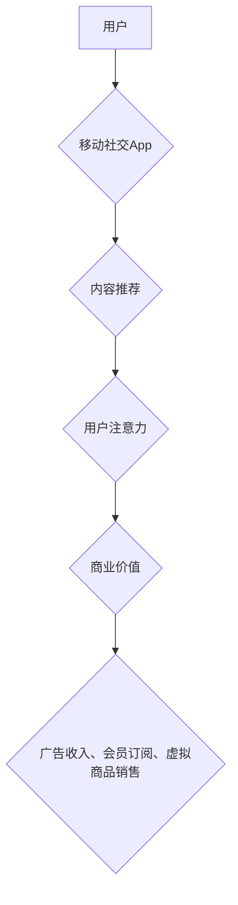

                 

## 移动社交App的注意力经济商业模式

> 关键词：注意力经济、移动社交App、商业模式、用户行为、算法推荐、数据分析、个性化推荐

## 1. 背景介绍

移动互联网时代，智能手机已成为人们生活中不可或缺的一部分，移动社交App作为这一时代的重要组成部分，深刻地改变了人们的沟通、娱乐、信息获取方式。这些App凭借其便捷性、社交属性和个性化推荐等特点，迅速积累了庞大的用户群体。然而，移动社交App的商业模式并非简单地依靠用户数量，而是建立在“注意力经济”的基础之上。

注意力经济是指在信息爆炸的时代，人们对信息的筛选和选择能力有限，而注意力成为了稀缺的资源。移动社交App通过各种手段吸引用户注意力，并将其转化为商业价值。这种商业模式的核心在于理解用户行为，精准地推送内容，并引导用户持续使用App，从而获得广告收入、会员订阅、虚拟商品销售等收益。

## 2. 核心概念与联系

### 2.1 注意力经济

注意力经济的核心概念是将注意力视为一种稀缺资源，并将其作为商业交易的媒介。在信息过载的时代，人们的注意力受到来自各个方向的竞争，而移动社交App通过算法推荐、个性化推送等手段，试图获取用户的注意力，并将其转化为商业价值。

### 2.2 移动社交App

移动社交App是指运行在移动设备上的应用程序，其主要功能是连接用户，促进社交互动，分享信息和内容。这类App通常具有以下特点：

* **社交属性:** 允许用户创建个人资料，与他人建立联系，进行即时通讯和群组聊天。
* **内容分享:** 提供平台供用户分享文字、图片、视频等各种类型的内容。
* **个性化推荐:** 基于用户行为和偏好，推荐相关内容和用户。
* **实时更新:** 内容更新速度快，能够及时反映用户兴趣和热点话题。

### 2.3 商业模式

移动社交App的商业模式主要包括以下几种：

* **广告收入:** 通过展示广告、赞助内容等方式获取收入。
* **会员订阅:** 提供付费会员服务，享受更多功能和权益。
* **虚拟商品销售:** 销售虚拟物品、道具、表情包等，为用户提供个性化定制和社交体验。
* **数据分析:** 收集用户行为数据，进行分析和研究，为企业提供市场洞察和精准营销服务。

**移动社交App的注意力经济商业模式**



## 3. 核心算法原理 & 具体操作步骤

### 3.1 算法原理概述

移动社交App的核心算法原理在于精准地推荐内容，吸引用户注意力，并引导用户持续使用App。这些算法通常基于以下几个方面：

* **用户行为分析:** 分析用户的浏览历史、点赞、评论、分享等行为，了解用户的兴趣偏好和内容消费习惯。
* **内容特征提取:** 对内容进行分析，提取其主题、标签、关键词等特征，以便进行精准匹配和推荐。
* **协同过滤:** 基于用户的行为相似度，推荐其他用户喜欢的或感兴趣的内容。
* **深度学习:** 利用深度神经网络模型，学习用户行为和内容特征之间的复杂关系，进行更精准的推荐。

### 3.2 算法步骤详解

1. **数据收集:** 收集用户的行为数据，包括浏览记录、点赞、评论、分享等信息，以及内容的特征数据，如主题、标签、关键词等。
2. **数据预处理:** 对收集到的数据进行清洗、转换和格式化，以便后续算法的处理。
3. **特征提取:** 对用户行为和内容特征进行提取，构建用户行为向量和内容特征向量。
4. **模型训练:** 利用机器学习算法，训练推荐模型，例如协同过滤算法、深度学习模型等。
5. **内容推荐:** 根据用户的行为向量和模型的预测结果，推荐用户可能感兴趣的内容。
6. **反馈收集:** 收集用户的反馈信息，例如点击、点赞、评论等，并将其反馈到模型训练中，不断优化推荐效果。

### 3.3 算法优缺点

**优点:**

* **精准推荐:** 基于用户行为和内容特征，能够精准地推荐用户感兴趣的内容。
* **个性化体验:** 为每个用户提供个性化的内容推荐，提升用户体验。
* **商业价值:** 通过精准推荐，提高用户粘性，促进广告收入、会员订阅、虚拟商品销售等。

**缺点:**

* **数据依赖:** 需要大量用户行为数据进行训练，否则推荐效果会下降。
* **算法偏差:** 算法可能会存在偏差，导致推荐结果不准确或不公平。
* **用户隐私:** 收集和使用用户行为数据可能会引发用户隐私问题。

### 3.4 算法应用领域

移动社交App的推荐算法广泛应用于以下领域:

* **内容推荐:** 推荐新闻、视频、音乐、书籍等各种类型的内容。
* **商品推荐:** 推荐电商平台上的商品，帮助用户发现感兴趣的产品。
* **社交推荐:** 推荐用户可能认识的朋友或群组，促进社交互动。
* **个性化服务:** 提供个性化的新闻订阅、音乐播放列表、电影推荐等服务。

## 4. 数学模型和公式 & 详细讲解 & 举例说明

### 4.1 数学模型构建

移动社交App的推荐算法通常基于协同过滤或深度学习模型。

**协同过滤模型:**

协同过滤模型基于用户的行为相似度，推荐其他用户喜欢的或感兴趣的内容。

假设用户 $u$ 对物品 $i$ 的评分为 $r_{ui}$，则协同过滤模型的目标是预测用户 $u$ 对物品 $j$ 的评分 $r_{uj}$。

**公式:**

$$r_{uj} = \frac{\sum_{i \in N(u)} r_{ui} \cdot sim(u, v)}{\sum_{i \in N(u)} sim(u, v)}$$

其中:

* $N(u)$ 表示与用户 $u$ 具有相似行为的用户集合。
* $sim(u, v)$ 表示用户 $u$ 和用户 $v$ 之间的相似度。

**深度学习模型:**

深度学习模型利用深度神经网络学习用户行为和内容特征之间的复杂关系，进行更精准的推荐。

常见的深度学习推荐模型包括:

* **神经网络协同过滤:** 将协同过滤模型与神经网络结合，提升推荐效果。
* **深度因子分解机:** 利用深度神经网络学习用户和物品的隐向量表示，进行推荐。
* **图神经网络:** 利用图神经网络学习用户和内容之间的关系，进行推荐。

### 4.2 公式推导过程

深度学习模型的公式推导过程较为复杂，涉及到神经网络的激活函数、损失函数、反向传播算法等多个方面。

### 4.3 案例分析与讲解

例如，在Netflix平台上，深度学习模型被用于推荐电影和电视剧。

Netflix收集了大量用户的观看历史数据，并对电影和电视剧进行了特征提取，例如类型、演员、导演等。

然后，利用深度学习模型学习用户行为和内容特征之间的关系，并预测用户对特定电影或电视剧的评分。

根据预测结果，Netflix会推荐用户可能感兴趣的电影或电视剧。

## 5. 项目实践：代码实例和详细解释说明

### 5.1 开发环境搭建

移动社交App的开发环境通常包括以下软件:

* **Android Studio:** Android App开发工具。
* **Xcode:** iOS App开发工具。
* **Java/Kotlin:** Android App开发语言。
* **Swift/Objective-C:** iOS App开发语言。
* **数据库:** 例如MySQL、MongoDB等。
* **云服务:** 例如AWS、Azure等。

### 5.2 源代码详细实现

由于篇幅限制，这里只提供一个简单的协同过滤推荐算法的代码示例，具体实现细节请参考相关资料。

```python
# 协同过滤推荐算法示例

import numpy as np

# 用户行为矩阵
ratings = np.array([
    [5, 4, 3, 2, 1],
    [4, 5, 2, 1, 3],
    [3, 2, 5, 4, 1],
    [2, 1, 4, 5, 3],
    [1, 3, 1, 3, 5]
])

# 计算用户相似度
def calculate_similarity(user1, user2):
    # 使用余弦相似度计算用户相似度
    return np.dot(ratings[user1], ratings[user2]) / (np.linalg.norm(ratings[user1]) * np.linalg.norm(ratings[user2]))

# 获取用户相似用户
def get_similar_users(user, top_k=3):
    # 计算用户与所有其他用户的相似度
    similarities = [calculate_similarity(user, i) for i in range(ratings.shape[0]) if i != user]
    # 获取相似度最高的k个用户
    sorted_indices = np.argsort(similarities)[::-1]
    return [i for i in sorted_indices[:top_k]]

# 推荐物品
def recommend_items(user, top_k=3):
    # 获取用户相似用户
    similar_users = get_similar_users(user)
    # 计算用户对每个物品的预测评分
    predictions = np.zeros(ratings.shape[1])
    for similar_user in similar_users:
        predictions += ratings[similar_user] * calculate_similarity(user, similar_user)
    # 获取预测评分最高的k个物品
    sorted_indices = np.argsort(predictions)[::-1]
    return [i for i in sorted_indices[:top_k]]

# 示例使用
user = 0
recommended_items = recommend_items(user)
print(f"推荐给用户 {user} 的物品: {recommended_items}")
```

### 5.3 代码解读与分析

这段代码实现了简单的协同过滤推荐算法。

首先，定义了一个用户行为矩阵，表示用户对不同物品的评分。

然后，定义了两个函数：

* `calculate_similarity`: 计算两个用户的相似度。
* `get_similar_users`: 获取用户相似用户的函数。

最后，定义了一个 `recommend_items` 函数，根据用户的评分历史和相似用户的评分历史，预测用户可能感兴趣的物品。

### 5.4 运行结果展示

运行这段代码，会输出用户0可能感兴趣的物品列表。

## 6. 实际应用场景

移动社交App的注意力经济商业模式已广泛应用于各种场景，例如:

* **社交媒体平台:** Facebook、Twitter、Instagram等平台通过精准推荐内容，吸引用户注意力，并将其转化为广告收入。
* **电商平台:** Amazon、淘宝、京东等平台通过推荐商品，引导用户购买，提升销售额。
* **视频平台:** YouTube、抖音、快手等平台通过推荐视频，吸引用户观看，并获取广告收入。
* **音乐平台:** Spotify、Apple Music等平台通过推荐音乐，吸引用户订阅，获取会员收入。

### 6.4 未来应用展望

随着移动互联网的发展，注意力经济商业模式将继续演进，并应用于更多领域。

例如:

* **个性化教育:** 通过推荐个性化的学习内容，提升用户学习效率。
* **医疗健康:** 通过推荐健康资讯和医疗服务，提升用户健康管理水平。
* **金融理财:** 通过推荐理财产品和投资建议，帮助用户理财。

## 7. 工具和资源推荐

### 7.1 学习资源推荐

* **书籍:**
    * 《注意力经济》
    * 《移动互联网商业模式》
    * 《深度学习》
* **在线课程:**
    * Coursera: 数据科学、机器学习、深度学习课程
    * Udacity: 移动开发、数据分析课程
    * edX: 人工智能、数据科学课程

### 7.2 开发工具推荐

* **Android Studio:** Android App开发工具
* **Xcode:** iOS App开发工具
* **TensorFlow:** 深度学习框架
* **PyTorch:** 深度学习框架
* **Scikit-learn:** 机器学习库

### 7.3 相关论文推荐

* **Attention is All You Need:** https://arxiv.org/abs/1706.03762
* **Recurrent Neural Networks for Sequence Learning:** https://www.cs.toronto.edu/~graves/phd.pdf
* **Collaborative Filtering for Implicit Feedback Datasets:** https://www.aclweb.org/anthology/D16-1108.pdf

## 8. 总结：未来发展趋势与挑战

### 8.1 研究成果总结

移动社交App的注意力经济商业模式取得了显著的成功，但也面临着一些挑战。

例如:

* **算法偏差:** 算法可能会存在偏差，导致推荐结果不准确或不公平。
* **用户隐私:** 收集和使用用户行为数据可能会引发用户隐私问题。
* **信息茧房:** 用户只接触到自己感兴趣的信息，可能会导致信息茧房现象。

### 8.2 未来发展趋势

未来，移动社交App的注意力经济商业模式将朝着以下方向发展:

* **更精准的推荐:** 利用更先进的算法和技术，进行更精准的推荐。
* **更个性化的体验:** 提供更个性化的内容和服务，满足用户的个性化需求。
* **更注重用户隐私:** 加强用户隐私保护，构建更加透明和可控的推荐系统。

### 8.3 面临的挑战

移动社交App的注意力经济商业模式面临着以下挑战:

* **算法可解释性:** 提高算法的可解释性，让用户了解推荐结果背后的逻辑。
* **公平性与伦理:** 确保推荐算法公平公正，避免歧视和偏见。
* **用户信任:** 赢得用户的信任，建立长期的用户关系。

### 8.4 研究展望

未来，需要进一步研究以下问题:

* 如何设计更公平、更透明的推荐算法?
* 如何平衡用户隐私和推荐效果?
* 如何应对信息茧房现象?


## 9. 附录：常见问题与解答

**常见问题:**

* **移动社交App的注意力经济商业模式是否会损害用户的健康?**

**解答:**

移动社交App的注意力经济商业模式可能会导致用户沉迷，影响用户的健康。因此，需要采取措施，引导用户健康使用App，避免过度沉迷。

* **移动社交App的注意力经济商业模式是否会侵犯用户的隐私?**

**解答:**

移动社交App的注意力经济商业模式需要收集用户的行为数据，因此可能会侵犯用户的隐私。因此，需要采取措施，保护用户的隐私，确保数据的安全和合规使用。


作者：禅与计算机程序设计艺术 / Zen and the Art of Computer Programming<end_of_turn>

