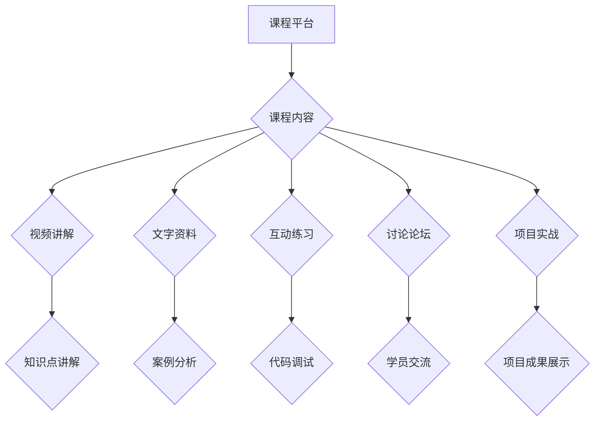

                 

## 程序员知识付费：打造互动式课程

> 关键词：知识付费、程序员、互动式课程、在线教育、技术分享、课程设计、学习平台

### 1. 背景介绍

近年来，随着互联网技术的发展和普及，在线教育平台蓬勃发展，知识付费市场也呈现出爆发式增长。程序员作为高需求的职业群体，其技能和知识也成为知识付费的重要内容。传统的线下培训模式面临着时间、地域、成本等方面的限制，而在线教育平台则能够突破这些限制，为程序员提供更加便捷、灵活、高效的学习方式。

然而，单纯的视频录制和文字讲解模式难以满足程序员对实践和互动性的需求。如何打造更具吸引力和实用性的互动式课程，成为程序员知识付费领域亟待解决的关键问题。

### 2. 核心概念与联系

**2.1 互动式课程的概念**

互动式课程是指通过多种互动方式，例如问答、讨论、练习、游戏等，增强学员参与度和学习体验的在线课程。与传统的单向信息传递模式相比，互动式课程能够更加有效地激发学员的学习兴趣，促进知识的理解和应用。

**2.2 互动式课程的优势**

* **增强学员参与度:** 互动式课程通过多种互动方式，让学员不再是被动接收信息的角色，而是积极参与到学习过程中，提高学习兴趣和主动性。
* **促进知识理解和应用:** 通过实践操作、案例分析等互动环节，学员能够将理论知识与实际应用相结合，加深对知识的理解和掌握。
* **提升学习效果:** 互动式课程能够根据学员的学习进度和情况，提供个性化的学习建议和反馈，提高学习效率和效果。
* **建立学习社区:** 互动式课程能够为学员提供一个交流学习的平台，促进学员之间的互动和协作，形成学习社区。

**2.3 互动式课程的架构**



### 3. 核心算法原理 & 具体操作步骤

**3.1 算法原理概述**

在互动式课程的设计和开发中，需要运用多种算法和技术，例如推荐算法、内容分发算法、用户行为分析算法等。这些算法能够帮助课程平台更好地理解学员的需求，提供个性化的学习体验，并提高课程的整体质量。

**3.2 算法步骤详解**

* **推荐算法:** 根据学员的学习历史、兴趣偏好等信息，推荐相关的课程内容和学习资源。
* **内容分发算法:** 根据学员的学习进度和情况，智能分发课程内容，确保学员能够按需学习。
* **用户行为分析算法:** 分析学员的学习行为，例如观看时长、点击率、完成率等，以便更好地了解学员的学习情况和需求。

**3.3 算法优缺点**

* **优点:** 能够提高课程的个性化、效率和用户体验。
* **缺点:** 需要大量的用户数据进行训练和测试，算法的准确性和可靠性需要不断提升。

**3.4 算法应用领域**

* **课程推荐:** 为学员推荐相关的课程内容和学习资源。
* **学习路径规划:** 根据学员的学习目标和进度，规划个性化的学习路径。
* **学习效果评估:** 分析学员的学习行为，评估学习效果并提供个性化的反馈。

### 4. 数学模型和公式 & 详细讲解 & 举例说明

**4.1 数学模型构建**

在互动式课程的设计中，可以使用数学模型来描述学员的学习行为和课程的学习效果。例如，可以使用贝叶斯网络来建模学员的学习路径，或者使用机器学习算法来预测学员的学习效果。

**4.2 公式推导过程**

例如，可以使用以下公式来计算学员的学习进度：

$$
学习进度 = \frac{已完成学习内容}{总学习内容}
$$

**4.3 案例分析与讲解**

假设一个互动式课程包含10个模块，学员已经完成了5个模块的学习，那么其学习进度为：

$$
学习进度 = \frac{5}{10} = 0.5
$$

表示学员已经完成了课程的50%。

### 5. 项目实践：代码实例和详细解释说明

**5.1 开发环境搭建**

* **操作系统:** Windows/macOS/Linux
* **编程语言:** Python
* **框架:** Django/Flask
* **数据库:** MySQL/PostgreSQL

**5.2 源代码详细实现**

以下是一个简单的互动式课程平台的代码示例，使用Python和Django框架实现：

```python
# views.py
from django.shortcuts import render

def course_detail(request, course_id):
    course = Course.objects.get(id=course_id)
    return render(request, 'course_detail.html', {'course': course})

# models.py
class Course(models.Model):
    title = models.CharField(max_length=255)
    description = models.TextField()
    # ...其他字段

# urls.py
from django.urls import path
from . import views

urlpatterns = [
    path('course/<int:course_id>/', views.course_detail, name='course_detail'),
]
```

**5.3 代码解读与分析**

* views.py 文件定义了课程详情页面的视图函数，用于渲染课程详情页面。
* models.py 文件定义了课程模型，包含课程标题、描述等字段。
* urls.py 文件定义了课程详情页面的URL映射。

**5.4 运行结果展示**

运行上述代码，可以访问课程详情页面，查看课程信息。

### 6. 实际应用场景

互动式课程在程序员知识付费领域有着广泛的应用场景，例如：

* **在线编程课程:** 通过代码练习、调试、项目实战等互动环节，帮助学员掌握编程技能。
* **技术技能培训:** 通过案例分析、讨论论坛、专家答疑等互动方式，帮助学员提升技术技能。
* **行业知识分享:** 通过直播、问答、互动游戏等方式，分享行业经验和知识。

### 7. 工具和资源推荐

**7.1 学习资源推荐**

* **在线学习平台:** Coursera、edX、Udemy、Udacity
* **编程社区:** Stack Overflow、GitHub、Hacker News

**7.2 开发工具推荐**

* **代码编辑器:** VS Code、Sublime Text、Atom
* **版本控制系统:** Git
* **云平台:** AWS、Azure、GCP

**7.3 相关论文推荐**

* **Interactive Learning Environments: A Review**
* **The Impact of Interactivity on Learning**
* **Personalized Learning with Adaptive Educational Technologies**

### 8. 总结：未来发展趋势与挑战

**8.1 研究成果总结**

互动式课程在程序员知识付费领域取得了显著的成果，能够有效提升学员的学习兴趣和效果。

**8.2 未来发展趋势**

* **人工智能驱动的个性化学习:** 利用人工智能技术，为每个学员提供个性化的学习路径和内容推荐。
* **虚拟现实和增强现实技术的应用:** 将虚拟现实和增强现实技术融入到互动式课程中，提供更加沉浸式的学习体验。
* **跨平台和跨设备的学习体验:** 确保互动式课程能够在各种平台和设备上流畅运行，提供更加便捷的学习体验。

**8.3 面临的挑战**

* **内容质量和更新:** 需要不断更新和完善课程内容，以满足学员不断变化的需求。
* **技术平台的稳定性和安全性:** 需要确保课程平台的稳定性和安全性，保护学员的个人信息和学习数据。
* **成本控制和盈利模式:** 需要探索更加可持续的成本控制和盈利模式，以保证课程平台的长期发展。

**8.4 研究展望**

未来，互动式课程将继续朝着更加个性化、智能化、沉浸式的方向发展，为程序员提供更加高效、便捷、优质的学习体验。


### 9. 附录：常见问题与解答

**9.1 如何选择合适的互动式课程？**

* 确定自己的学习目标和需求。
* 阅读课程介绍和学员评价。
* 尝试课程的免费试听或体验版。

**9.2 如何提高互动式课程的学习效果？**

* 积极参与互动环节，例如问答、讨论、练习等。
* 与其他学员交流学习经验。
* 定期复习和巩固学习内容。

**9.3 如何评价互动式课程的质量？**

* 内容的准确性和实用性。
* 互动环节的丰富性和趣味性。
* 学习平台的稳定性和安全性。
* 学员评价和口碑。


作者：禅与计算机程序设计艺术 / Zen and the Art of Computer Programming 
<end_of_turn>

