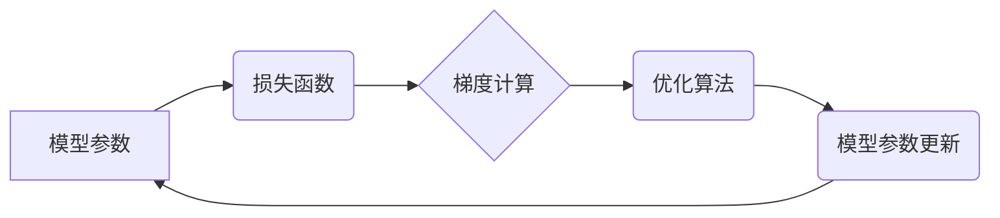

                 

## 第七章：初始化、优化和 AdamW 算法

> 关键词：深度学习、模型训练、优化算法、初始化、AdamW、学习率、梯度下降

### 1. 背景介绍

深度学习的蓬勃发展离不开高效的训练算法。模型训练的核心在于通过调整模型参数，使模型预测结果与真实值之间的误差最小化。而优化算法扮演着至关重要的角色，它负责指导模型参数的更新方向和步伐。

传统的梯度下降算法虽然有效，但存在一些局限性，例如学习率的设置较为困难，容易陷入局部最优解，收敛速度较慢。为了克服这些问题，近年来涌现出许多改进型优化算法，其中AdamW算法凭借其高效性和鲁棒性，在深度学习领域获得了广泛应用。

### 2. 核心概念与联系

#### 2.1 优化算法

优化算法是深度学习训练中不可或缺的一部分，其目标是找到使损失函数最小的模型参数。常见的优化算法包括：

* **梯度下降 (Gradient Descent)**：沿着梯度方向更新参数，朝着损失函数最小值的方向前进。
* **随机梯度下降 (Stochastic Gradient Descent)**：使用单个样本或一小批样本计算梯度，更新参数，相比梯度下降更加高效。
* **动量法 (Momentum)**：引入动量项，加速参数更新，避免震荡，提高收敛速度。
* **RMSprop**：使用指数移动平均来调整学习率，使得参数更新更加稳定。
* **Adam**：结合动量法和RMSprop，具有自适应学习率的特点，能够更快地收敛。

#### 2.2 AdamW 算法

AdamW算法是Adam算法的改进版本，它在Adam算法的基础上引入了权重衰减 (Weight Decay)，能够有效防止模型过拟合。

#### 2.3 初始化

模型参数的初始化方式对训练效果有重要影响。常用的初始化方法包括：

* **Xavier 初始化 (Glorot Initialization)**：将参数初始化到一个范围，使得激活函数的输出方差保持恒定。
* **He 初始化 (He Initialization)**：针对ReLU激活函数，将参数初始化到一个特定的范围，使得模型能够更好地学习。

**Mermaid 流程图**



### 3. 核心算法原理 & 具体操作步骤

#### 3.1 算法原理概述

AdamW算法是一种基于动量和自适应学习率的优化算法，它结合了Adam算法的优点，并引入了权重衰减机制。

#### 3.2 算法步骤详解

1. **计算梯度**: 使用损失函数对模型参数进行求导，得到梯度向量。
2. **更新动量**: 使用动量项来加速参数更新，动量项是前一步梯度向量的指数移动平均。
3. **自适应学习率**: 使用指数移动平均来更新每个参数的学习率，使得学习率能够自适应地调整。
4. **权重衰减**: 对模型参数进行衰减，防止模型过拟合。
5. **更新参数**: 使用更新后的学习率和动量项来更新模型参数。

#### 3.3 算法优缺点

**优点**:

* **高效性**: AdamW算法具有自适应学习率的特点，能够更快地收敛。
* **鲁棒性**: AdamW算法对超参数设置的敏感度较低，能够在多种场景下表现良好。
* **防止过拟合**: 权重衰减机制能够有效防止模型过拟合。

**缺点**:

* **计算复杂度**: AdamW算法的计算复杂度较高，对于大型模型来说，计算成本可能会比较高。

#### 3.4 算法应用领域

AdamW算法广泛应用于各种深度学习任务，例如：

* **图像分类**: 在ImageNet等大型图像数据集上，AdamW算法能够取得优异的性能。
* **目标检测**: 在目标检测任务中，AdamW算法能够提高模型的精度和速度。
* **自然语言处理**: 在文本分类、机器翻译等自然语言处理任务中，AdamW算法也表现出色。

### 4. 数学模型和公式 & 详细讲解 & 举例说明

#### 4.1 数学模型构建

AdamW算法的数学模型可以概括为以下公式：

$$
\theta_{t+1} = \theta_t - \alpha \frac{m_t}{ \sqrt{v_t} + \epsilon} (1 + \beta_2^t)
$$

其中：

* $\theta_t$：第t个时间步的模型参数
* $\alpha$：学习率
* $m_t$：动量项
* $v_t$：自适应学习率项
* $\epsilon$：一个小常数，用于避免分母为零
* $\beta_1$：动量项衰减率
* $\beta_2$：自适应学习率项衰减率

#### 4.2 公式推导过程

AdamW算法的公式推导过程较为复杂，涉及到动量项、自适应学习率项以及权重衰减的结合。

#### 4.3 案例分析与讲解

假设我们有一个简单的线性回归模型，目标是预测房价。我们可以使用AdamW算法来训练这个模型，并观察其收敛过程。

### 5. 项目实践：代码实例和详细解释说明

#### 5.1 开发环境搭建

使用Python3.7+环境，安装必要的库，例如TensorFlow、PyTorch等深度学习框架。

#### 5.2 源代码详细实现

```python
import tensorflow as tf

# 定义模型
model = tf.keras.models.Sequential([
    tf.keras.layers.Dense(64, activation='relu', input_shape=(10,)),
    tf.keras.layers.Dense(1)
])

# 定义损失函数和优化器
optimizer = tf.keras.optimizers.AdamW(learning_rate=0.001, weight_decay=0.01)
loss_fn = tf.keras.losses.MeanSquaredError()

# 训练模型
for epoch in range(10):
    for batch in dataset:
        with tf.GradientTape() as tape:
            predictions = model(batch)
            loss = loss_fn(batch[:, -1], predictions)
        gradients = tape.gradient(loss, model.trainable_variables)
        optimizer.apply_gradients(zip(gradients, model.trainable_variables))
```

#### 5.3 代码解读与分析

* 我们使用TensorFlow框架定义了一个简单的线性回归模型。
* 我们使用AdamW优化器来训练模型，学习率设置为0.001，权重衰减设置为0.01。
* 训练过程中，我们使用梯度下降法来更新模型参数。

#### 5.4 运行结果展示

训练完成后，我们可以使用测试集评估模型的性能，例如计算模型的均方误差 (MSE)。

### 6. 实际应用场景

AdamW算法在深度学习领域有着广泛的应用场景，例如：

* **图像分类**: 在ImageNet等大型图像数据集上，AdamW算法能够取得优异的性能。
* **目标检测**: 在目标检测任务中，AdamW算法能够提高模型的精度和速度。
* **自然语言处理**: 在文本分类、机器翻译等自然语言处理任务中，AdamW算法也表现出色。

#### 6.4 未来应用展望

随着深度学习技术的不断发展，AdamW算法的应用场景将会更加广泛。例如，它可以应用于：

* **强化学习**: 在强化学习任务中，AdamW算法可以帮助代理更快地学习最优策略。
* **生成模型**: 在生成模型中，AdamW算法可以帮助生成更加逼真的图像、文本等数据。

### 7. 工具和资源推荐

#### 7.1 学习资源推荐

* **深度学习书籍**: 《深度学习》 (Ian Goodfellow, Yoshua Bengio, Aaron Courville)
* **在线课程**: Coursera、edX等平台上的深度学习课程
* **博客文章**: 

#### 7.2 开发工具推荐

* **TensorFlow**: 一个开源的机器学习框架
* **PyTorch**: 另一个开源的机器学习框架
* **Keras**: 一个基于TensorFlow或Theano的深度学习框架

#### 7.3 相关论文推荐

* **Adam: A Method for Stochastic Optimization** (Kingma & Ba, 2014)
* **Decoupled Weight Decay Regularization** (Loshchilov & Hutter, 2017)

### 8. 总结：未来发展趋势与挑战

#### 8.1 研究成果总结

AdamW算法是深度学习领域中一个重要的优化算法，它结合了动量法、自适应学习率和权重衰减的优点，能够有效提高模型训练的效率和性能。

#### 8.2 未来发展趋势

未来，AdamW算法的研究方向可能包括：

* **更有效的自适应学习率机制**: 研究更有效的自适应学习率机制，能够更好地适应不同的模型和任务。
* **结合其他优化技术**: 将AdamW算法与其他优化技术结合，例如混合精度训练、分布式训练等，进一步提高训练效率。
* **应用于新的领域**: 将AdamW算法应用于新的领域，例如强化学习、生成模型等。

#### 8.3 面临的挑战

AdamW算法也面临一些挑战，例如：

* **计算复杂度**: AdamW算法的计算复杂度较高，对于大型模型来说，计算成本可能会比较高。
* **超参数设置**: AdamW算法的超参数设置仍然需要一定的经验和技巧。

#### 8.4 研究展望

尽管面临一些挑战，但AdamW算法仍然是一个很有前景的优化算法。随着深度学习技术的不断发展，相信AdamW算法将会在未来发挥更加重要的作用。

### 9. 附录：常见问题与解答

#### 9.1 什么是权重衰减？

权重衰减是一种正则化技术，它通过在损失函数中添加一个惩罚项来防止模型过拟合。惩罚项与模型参数的平方和成正比。

#### 9.2 AdamW算法与Adam算法有什么区别？

AdamW算法是在Adam算法的基础上引入了权重衰减机制的。

#### 9.3 如何设置AdamW算法的超参数？

AdamW算法的超参数包括学习率、权重衰减率、动量项衰减率和自适应学习率项衰减率。这些超参数需要根据具体的模型和任务进行调整。

作者：禅与计算机程序设计艺术 / Zen and the Art of Computer Programming


<end_of_turn>

