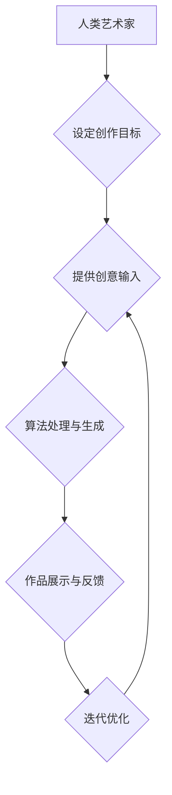

                 

## 艺术与科技的碰撞：人类计算激发创意火花

> 关键词：人工智能、创意计算、人类计算、艺术生成、算法艺术、数字艺术、科技伦理

### 1. 背景介绍

艺术与科技，看似截然不同的领域，却在不断交融，碰撞出令人惊叹的火花。从文艺复兴时期绘画的透视法到现代数字艺术的生成算法，科技始终为艺术创作提供了新的工具和可能性。而随着人工智能技术的飞速发展，艺术与科技的融合进入了全新的阶段。

人类计算，作为一种将人类的创造力和计算能力相结合的全新模式，正在成为推动艺术创新和探索的强大引擎。它打破了传统艺术创作的边界，赋予了算法新的意义，并为艺术家提供了更丰富的表达方式。

### 2. 核心概念与联系

**2.1 人类计算的概念**

人类计算是指利用人类的认知能力、创造力和判断力来辅助或替代传统计算机的计算过程。它强调人类在计算过程中的主导作用，并将其视为一种重要的计算资源。

**2.2 艺术生成与人类计算的结合**

艺术生成是指利用算法和数据来创作艺术作品的过程。传统的艺术生成往往依赖于预先定义的规则和模板，而人类计算则赋予了算法更强的灵活性，使其能够根据人类的意图和反馈进行调整和演化。

**2.3 流程图**



### 3. 核心算法原理 & 具体操作步骤

**3.1 算法原理概述**

人类计算在艺术生成中通常采用以下几种核心算法：

* **生成对抗网络 (GAN):** GAN 由两个神经网络组成：生成器和鉴别器。生成器试图生成逼真的艺术作品，而鉴别器则试图区分真实作品和生成作品。通过不断的对抗训练，生成器能够逐渐生成越来越逼真的艺术作品。
* **变分自编码器 (VAE):** VAE 通过学习数据的潜在表示来生成新的数据。在艺术生成中，VAE 可以学习艺术作品的风格和特征，并根据这些特征生成新的作品。
* **强化学习 (RL):** RL 通过奖励机制来训练算法。在艺术生成中，RL 可以根据人类的反馈来调整算法的生成策略，从而生成更符合人类审美观的艺术作品。

**3.2 算法步骤详解**

以 GAN 为例，其具体操作步骤如下：

1. **初始化生成器和鉴别器网络:** 生成器和鉴别器都是由神经网络组成，需要进行初始化。
2. **训练鉴别器:** 使用真实艺术作品和随机噪声生成的假作品作为输入，训练鉴别器网络，使其能够区分真实作品和假作品。
3. **训练生成器:** 使用鉴别器网络的反馈信息，训练生成器网络，使其能够生成更逼真的艺术作品。
4. **迭代训练:** 重复步骤 2 和 3，直到生成器能够生成与真实作品难以区分的艺术作品。

**3.3 算法优缺点**

* **优点:** 能够生成逼真的艺术作品，并具有较高的灵活性。
* **缺点:** 训练过程复杂，需要大量的计算资源和数据。

**3.4 算法应用领域**

* **数字艺术创作:** 生成逼真的图像、视频、音乐等艺术作品。
* **游戏开发:** 生成游戏场景、角色、道具等。
* **电影特效:** 生成逼真的视觉效果。

### 4. 数学模型和公式 & 详细讲解 & 举例说明

**4.1 数学模型构建**

GAN 的核心数学模型是生成器和鉴别器的对抗训练过程。

**4.2 公式推导过程**

* **鉴别器损失函数:**

$$L_D(D,G) = E_{x \sim p_{data}(x)}[log(D(x))] + E_{z \sim p_z(z)}[log(1 - D(G(z)))]$$

* **生成器损失函数:**

$$L_G(D,G) = E_{z \sim p_z(z)}[log(D(G(z)))]$$

其中：

* $D(x)$ 表示鉴别器对真实样本 $x$ 的预测概率。
* $G(z)$ 表示生成器对噪声 $z$ 的预测结果。
* $p_{data}(x)$ 表示真实样本的分布。
* $p_z(z)$ 表示噪声的分布。

**4.3 案例分析与讲解**

例如，在生成图像时，鉴别器会尝试区分真实图像和生成器生成的图像，而生成器则会试图生成与真实图像相似的图像，以欺骗鉴别器。通过不断的对抗训练，生成器能够逐渐生成越来越逼真的图像。

### 5. 项目实践：代码实例和详细解释说明

**5.1 开发环境搭建**

* Python 3.x
* TensorFlow 或 PyTorch 深度学习框架
* CUDA 和 cuDNN (可选，用于 GPU 加速)

**5.2 源代码详细实现**

```python
# 使用 TensorFlow 实现 GAN 的生成器网络
def generator(z):
  # ... (定义生成器网络结构)
  return output

# 使用 TensorFlow 实现 GAN 的鉴别器网络
def discriminator(x):
  # ... (定义鉴别器网络结构)
  return output

# ... (定义训练循环和损失函数)
```

**5.3 代码解读与分析**

* 生成器网络负责从噪声向量 $z$ 生成图像。
* 鉴别器网络负责判断图像是否为真实图像或生成图像。
* 训练循环中，生成器和鉴别器网络交替训练，直到生成器能够生成与真实图像难以区分的图像。

**5.4 运行结果展示**

运行代码后，可以生成一系列逼真的艺术作品，并可视化展示生成过程。

### 6. 实际应用场景

* **艺术创作:** 艺术家可以使用人类计算来创作新的艺术作品，探索新的艺术风格和表达方式。
* **设计领域:** 设计师可以使用人类计算来生成新的设计方案，例如建筑设计、产品设计等。
* **教育领域:** 人类计算可以用于教育领域，例如生成个性化的学习内容、辅助学生进行创意思考等。

**6.4 未来应用展望**

随着人工智能技术的不断发展，人类计算在艺术领域的应用将更加广泛和深入。未来，我们可以期待看到：

* 更逼真的艺术作品生成
* 更个性化的艺术创作体验
* 人类与人工智能之间的更紧密协作

### 7. 工具和资源推荐

**7.1 学习资源推荐**

* **书籍:**
    * 《深度学习》
    * 《生成对抗网络》
* **在线课程:**
    * Coursera: 深度学习
    * Udacity: 
    * fast.ai: 深度学习课程

**7.2 开发工具推荐**

* **TensorFlow:** 开源深度学习框架
* **PyTorch:** 开源深度学习框架
* **Keras:** 高级深度学习 API

**7.3 相关论文推荐**

* 《Generative Adversarial Networks》
* 《Variational Autoencoders for Generation》
* 《Deep Reinforcement Learning》

### 8. 总结：未来发展趋势与挑战

**8.1 研究成果总结**

人类计算为艺术创作提供了新的可能性，并推动了艺术与科技的融合发展。

**8.2 未来发展趋势**

未来，人类计算将朝着以下方向发展：

* 更智能的算法
* 更丰富的创作工具
* 更广泛的应用场景

**8.3 面临的挑战**

* **伦理问题:** 人工智能生成的艺术作品的版权问题、算法偏见问题等。
* **技术挑战:** 如何开发更智能、更灵活的人类计算算法。
* **社会影响:** 人工智能对艺术创作的影响、对人类创造力的挑战等。

**8.4 研究展望**

未来，我们需要加强对人类计算伦理、社会影响等方面的研究，并探索人类与人工智能之间的更紧密协作模式，以推动艺术与科技的和谐发展。

### 9. 附录：常见问题与解答

* **Q: 人工智能生成的艺术作品是否具有艺术价值？**

* **A:** 这是一个复杂的问题，没有绝对的答案。一些人认为人工智能生成的艺术作品缺乏人类的情感和体验，因此不具有真正的艺术价值。而另一些人则认为，艺术的价值在于其表达力和感染力，而人工智能能够生成具有独特表达力的作品，也具有艺术价值。

* **Q: 人工智能会取代人类艺术家吗？**

* **A:** 

人工智能可以辅助人类艺术家进行创作，但它不会完全取代人类艺术家。人类艺术家拥有独特的创造力和审美判断力，而人工智能只能根据已有的数据和算法进行创作。


作者：禅与计算机程序设计艺术 / Zen and the Art of Computer Programming 
<end_of_turn>

