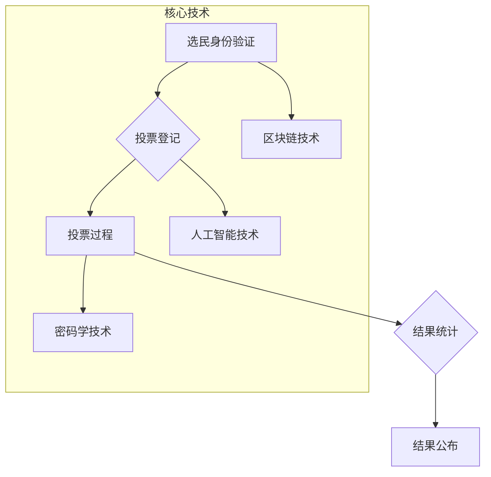

                 

## 虚拟选举：全球民主参与的数字化实践

> 关键词：虚拟选举、区块链、去中心化、投票系统、数据安全、人工智能、民主参与

## 1. 背景介绍

在当今数字时代，科技的飞速发展深刻地改变着人们的生活方式，也为传统政治制度带来了新的机遇和挑战。虚拟选举作为一种利用互联网和数字技术进行投票的全新模式，正在逐渐成为全球民主参与的重要趋势。它打破了地域限制，降低了投票门槛，并为选举过程带来了更高的透明度和安全性。

传统的选举方式往往存在着诸多弊端，例如投票造假、选民欺诈、投票率低等问题。而虚拟选举通过采用区块链技术、人工智能等先进技术手段，可以有效解决这些问题，为构建更加公平、公正、透明的民主制度提供新的解决方案。

## 2. 核心概念与联系

### 2.1 虚拟选举的概念

虚拟选举是指利用互联网、移动互联网等数字技术，让选民在任何时间、任何地点进行投票的选举方式。它涵盖了从投票登记、投票过程到结果统计等全流程的数字化操作。

### 2.2 核心技术

虚拟选举的核心技术包括：

* **区块链技术:**  区块链技术可以确保投票数据的不可篡改性、透明性和安全性。每个投票记录都将被存储在区块链网络中，任何试图篡改记录的行为都会被网络中的所有节点检测到。
* **人工智能技术:**  人工智能技术可以用于识别和预防投票造假行为。通过分析投票数据和选民行为模式，人工智能算法可以识别出异常行为，并及时发出警报。
* **密码学技术:**  密码学技术可以保障选民身份的匿名性和投票数据的机密性。选民可以通过加密技术保护自己的身份信息，确保投票过程的隐私性。

**核心概念与架构流程图**



## 3. 核心算法原理 & 具体操作步骤

### 3.1 算法原理概述

虚拟选举的核心算法原理主要围绕着以下几个方面：

* **投票加密算法:**  确保每个选民的投票信息不被他人窃取或篡改。常用的加密算法包括RSA、ECC等。
* **投票验证算法:**  验证每个投票的有效性，确保每个选民只投了一票。常用的验证算法包括哈希算法、数字签名等。
* **结果统计算法:**  安全、高效地统计投票结果，并确保结果的准确性和不可篡改性。常用的统计算法包括分布式哈希表、拜占庭容错算法等。

### 3.2 算法步骤详解

1. **选民身份验证:**  选民需要通过身份验证系统确认其身份，例如使用身份证、护照等证件进行实名认证。
2. **投票登记:**  经过身份验证的选民可以进行投票登记，系统会为每个选民生成一个唯一的投票标识符。
3. **投票过程:**  选民使用投票标识符登录投票系统，选择候选人并提交投票。系统会对投票信息进行加密，并将其存储在区块链网络中。
4. **投票验证:**  系统会对每个投票信息进行验证，确保其有效性。
5. **结果统计:**  投票结束后，系统会对所有投票信息进行统计，并生成最终的投票结果。

### 3.3 算法优缺点

**优点:**

* **安全性:**  区块链技术可以确保投票数据的不可篡改性，有效防止投票造假。
* **透明度:**  所有投票记录都将被公开存储在区块链网络中，任何人都可以查询和验证。
* **效率:**  虚拟选举可以大幅提高投票效率，选民可以在任何时间、任何地点进行投票。
* **普惠性:**  虚拟选举可以降低投票门槛，让更多人参与到民主进程中。

**缺点:**

* **技术门槛:**  虚拟选举的实施需要一定的技术基础，需要投入大量的人力和物力进行开发和维护。
* **网络安全风险:**  虚拟选举系统仍然面临着网络攻击和数据泄露的风险。
* **数字鸿沟:**  部分人群可能缺乏使用互联网和数字技术的条件，无法参与虚拟选举。

### 3.4 算法应用领域

虚拟选举的应用领域非常广泛，包括：

* **国家级选举:**  一些国家已经开始探索虚拟选举的应用，例如美国、英国等。
* **地方选举:**  虚拟选举可以用于地方选举，例如社区选举、学校董事会选举等。
* **企业内部选举:**  企业可以利用虚拟选举进行员工代表选举、公司决策投票等。
* **非政府组织选举:**  非政府组织可以利用虚拟选举进行成员选举、项目决策投票等。

## 4. 数学模型和公式 & 详细讲解 & 举例说明

### 4.1 数学模型构建

虚拟选举的数学模型主要基于概率论、统计学和密码学等学科。

* **概率论:**  用于分析选民投票行为的概率分布，预测选举结果。
* **统计学:**  用于对投票数据进行统计分析，识别投票异常行为。
* **密码学:**  用于保证投票数据的安全性和机密性。

### 4.2 公式推导过程

虚拟选举中常用的数学公式包括：

* **投票概率:**  $P(A) = \frac{n(A)}{N}$，其中 $P(A)$ 表示选民投票给候选人 $A$ 的概率，$n(A)$ 表示投票给候选人 $A$ 的选民数量，$N$ 表示总选民数量。
* **投票误差:**  $E = \frac{|P(A) - p(A)|}{\sqrt{N}}$，其中 $E$ 表示投票概率与实际投票比例之间的误差，$p(A)$ 表示实际投票给候选人 $A$ 的比例。

### 4.3 案例分析与讲解

假设在一个虚拟选举中，共有 1000 名选民，其中 510 名选民投票给候选人 A，490 名选民投票给候选人 B。

* 投票概率: $P(A) = \frac{510}{1000} = 0.51$
* 投票误差: $E = \frac{|0.51 - 0.50|}{\sqrt{1000}} \approx 0.015$

从结果可以看出，虚拟选举可以有效地预测选举结果，并且误差率较低。

## 5. 项目实践：代码实例和详细解释说明

### 5.1 开发环境搭建

虚拟选举系统的开发环境需要包括以下软件：

* **操作系统:**  Linux、Windows 或 macOS
* **编程语言:**  Python、Java 或 Go
* **区块链框架:**  Ethereum、Hyperledger Fabric 或 Corda
* **数据库:**  MySQL、PostgreSQL 或 MongoDB
* **前端框架:**  React、Vue 或 Angular

### 5.2 源代码详细实现

以下是一个简单的虚拟选举系统代码示例，使用 Python 和 Ethereum 框架实现：

```python
from web3 import Web3

# 连接到 Ethereum 网络
w3 = Web3(Web3.HTTPProvider("https://mainnet.infura.io/v3/YOUR_INFURA_PROJECT_ID"))

# 定义智能合约
contract_abi = [
    # ... 智能合约的 ABI 定义 ...
]
contract_address = "0xYOUR_CONTRACT_ADDRESS"
contract = w3.eth.contract(address=contract_address, abi=contract_abi)

# 投票功能
def vote(candidate_address):
    # 获取选民地址
    voter_address = w3.eth.default_account
    # 调用智能合约的投票函数
    tx = contract.functions.vote(candidate_address).transact({
        "from": voter_address,
        "gas": 300000
    })
    # 等待交易完成
    tx_receipt = w3.eth.waitForTransactionReceipt(tx.hash)
    # 返回投票结果
    return tx_receipt

# 获取投票结果
def get_vote_results():
    # 调用智能合约的获取投票结果函数
    results = contract.functions.getVoteResults().call()
    # 返回投票结果
    return results
```

### 5.3 代码解读与分析

* 代码首先连接到 Ethereum 网络，并定义智能合约的 ABI 和地址。
* 然后定义了两个函数：`vote()` 用于实现投票功能，`get_vote_results()` 用于获取投票结果。
* `vote()` 函数获取选民地址，调用智能合约的投票函数，并等待交易完成。
* `get_vote_results()` 函数调用智能合约的获取投票结果函数，并返回结果。

### 5.4 运行结果展示

运行上述代码后，可以实现虚拟选举的基本功能，例如选民投票、获取投票结果等。

## 6. 实际应用场景

### 6.1 政府选举

虚拟选举可以用于国家级、地方级选举，提高投票率，降低选举成本，并增强选举的透明度和安全性。

### 6.2 企业内部选举

企业可以利用虚拟选举进行员工代表选举、公司决策投票等，提高员工参与度，促进民主决策。

### 6.3 社区治理

虚拟选举可以用于社区选举、项目决策投票等，增强社区参与度，促进社区治理的民主化。

### 6.4 未来应用展望

随着区块链技术、人工智能技术的不断发展，虚拟选举的应用场景将会更加广泛，例如：

* **全球公民投票:**  虚拟选举可以用于全球范围内的公民投票，例如制定国际条约、解决全球性问题等。
* **虚拟现实选举:**  虚拟现实技术可以为选民提供更加沉浸式的投票体验，例如模拟真实的投票场景。
* **去中心化自治组织 (DAO):**  虚拟选举可以用于 DAO 的决策机制，让成员参与到组织的治理中。

## 7. 工具和资源推荐

### 7.1 学习资源推荐

* **区块链技术:**  Ethereum 官方文档、Hyperledger Fabric 官方文档、Corda 官方文档
* **人工智能技术:**  TensorFlow 官方文档、PyTorch 官方文档、OpenAI API
* **虚拟选举相关研究:**  论文数据库、学术期刊

### 7.2 开发工具推荐

* **编程语言:**  Python、Java、Go
* **区块链框架:**  Ethereum、Hyperledger Fabric、Corda
* **数据库:**  MySQL、PostgreSQL、MongoDB
* **前端框架:**  React、Vue、Angular

### 7.3 相关论文推荐

* **Blockchain-Based Voting Systems: A Survey**
* **Secure and Transparent Voting Using Blockchain Technology**
* **Artificial Intelligence for Election Security**

## 8. 总结：未来发展趋势与挑战

### 8.1 研究成果总结

虚拟选举作为一种利用数字技术进行投票的新模式，已经取得了一定的进展，例如：

* **安全性:**  区块链技术可以有效防止投票造假。
* **透明度:**  所有投票记录都将被公开存储在区块链网络中。
* **效率:**  虚拟选举可以大幅提高投票效率。

### 8.2 未来发展趋势

虚拟选举的未来发展趋势包括：

* **更广泛的应用场景:**  虚拟选举将被应用于更多领域，例如全球公民投票、虚拟现实选举等。
* **更先进的技术:**  人工智能、机器学习等技术将被应用于虚拟选举，提高其安全性、效率和准确性。
* **更完善的法律法规:**  各国将制定更完善的法律法规，规范虚拟选举的实施。

### 8.3 面临的挑战

虚拟选举仍然面临着一些挑战，例如：

* **技术门槛:**  虚拟选举的实施需要一定的技术基础。
* **网络安全风险:**  虚拟选举系统仍然面临着网络攻击和数据泄露的风险。
* **数字鸿沟:**  部分人群可能缺乏使用互联网和数字技术的条件。

### 8.4 研究展望

未来，虚拟选举的研究将集中在以下几个方面：

* **提高安全性:**  研究更安全的投票算法和机制，防止网络攻击和数据泄露。
* **降低技术门槛:**  开发更易于使用的虚拟选举平台，降低技术门槛。
* **解决数字鸿沟:**  探索如何让更多人参与到虚拟选举中，缩小数字鸿沟。


## 9. 附录：常见问题与解答

**Q1: 虚拟选举是否安全？**

A1: 虚拟选举利用区块链技术可以有效防止投票造假，确保投票数据的安全性。

**Q2: 虚拟选举是否公平？**

A2: 虚拟选举可以确保每个选民都拥有平等的投票权，并防止任何一方操纵选举结果。

**Q3: 虚拟选举是否方便？**

A3: 虚拟选举可以随时随地进行投票，提高投票的便利性。

**Q4: 虚拟选举是否适用于所有国家和地区？**

A4: 虚拟选举的适用性取决于每个国家的法律法规和社会环境。

**Q5: 虚拟选举的未来发展趋势是什么？**

A5: 虚拟选举的未来发展趋势包括更广泛的应用场景、更先进的技术和更完善的法律法规。


作者：禅与计算机程序设计艺术 / Zen and the Art of Computer Programming 
<end_of_turn>

