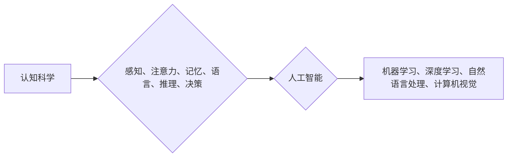

                 

## 认知科学与人工智能：跨学科研究的前沿

> 关键词：认知科学、人工智能、机器学习、深度学习、神经网络、自然语言处理、计算机视觉

### 1. 背景介绍

人工智能（Artificial Intelligence，AI）近年来发展迅速，取得了令人瞩目的成就。从语音识别到图像识别，从自动驾驶到医疗诊断，AI技术正在深刻地改变着我们的生活。然而，尽管AI取得了如此巨大的进步，它仍然面临着许多挑战，例如缺乏真正的“理解”能力、难以处理复杂的情境、以及对数据依赖性强等问题。

认知科学作为研究人类认知过程的学科，为理解和解决这些挑战提供了宝贵的视角。认知科学试图揭示人类思维、学习、记忆、语言和决策等高级认知功能的本质，并将其与神经科学、心理学、语言学等学科相结合。

将认知科学与人工智能相结合，可以帮助我们构建更智能、更接近人类认知的AI系统。

### 2. 核心概念与联系

**2.1 认知科学的核心概念**

* **感知:** 人类通过感官接收外界信息，并将其转化为神经信号。
* **注意力:** 人类在信息洪流中选择性地关注某些信息，而忽略其他信息。
* **记忆:** 人类将信息存储在脑海中，并能够在需要时回忆起来。
* **语言:** 人类使用语言进行交流和表达思想。
* **推理:** 人类从已知信息中推导出新的知识。
* **决策:** 人类在面对选择时，做出判断并采取行动。

**2.2 人工智能的核心概念**

* **机器学习:** 使机器能够从数据中学习，并根据学习到的知识进行预测或决策。
* **深度学习:** 一种基于多层神经网络的机器学习方法，能够学习更复杂的模式和特征。
* **自然语言处理:** 使机器能够理解和处理人类语言。
* **计算机视觉:** 使机器能够“看”图像和视频，并从中提取信息。

**2.3 认知科学与人工智能的联系**

认知科学和人工智能之间存在着密切的联系。认知科学的研究成果可以为人工智能的发展提供启示，而人工智能技术的进步也可以帮助我们更好地理解人类认知过程。

**Mermaid 流程图**



### 3. 核心算法原理 & 具体操作步骤

**3.1 算法原理概述**

深度学习算法是人工智能领域中最为重要的算法之一，它能够学习复杂的数据模式，并实现高精度的人工智能应用。深度学习算法的核心是多层神经网络，它由多个神经元层组成，每个神经元都连接到上一层的神经元，并通过权重进行计算。

**3.2 算法步骤详解**

1. **数据预处理:** 将原始数据转换为深度学习算法可以理解的格式，例如归一化、编码等。
2. **网络结构设计:** 根据任务需求设计神经网络的结构，包括神经元数量、层数、激活函数等。
3. **参数初始化:** 为神经网络中的权重和偏置赋予初始值。
4. **前向传播:** 将输入数据通过神经网络进行计算，得到输出结果。
5. **损失函数计算:** 计算输出结果与真实值的差异，即损失值。
6. **反向传播:** 根据损失值，调整神经网络中的权重和偏置，使损失值最小化。
7. **迭代训练:** 重复前向传播和反向传播的过程，直到损失值达到预设的阈值。

**3.3 算法优缺点**

**优点:**

* 能够学习复杂的数据模式。
* 性能优异，在许多任务中取得了人类水平的性能。
* 可迁移性强，可以应用于不同的任务和领域。

**缺点:**

* 训练数据量大，需要大量的计算资源。
* 训练过程复杂，需要专业的知识和经验。
* 缺乏可解释性，难以理解模型的决策过程。

**3.4 算法应用领域**

* **图像识别:** 人脸识别、物体检测、图像分类等。
* **语音识别:** 语音转文本、语音助手等。
* **自然语言处理:** 机器翻译、文本摘要、情感分析等。
* **医疗诊断:** 疾病预测、影像分析等。
* **自动驾驶:** 路线规划、障碍物检测等。

### 4. 数学模型和公式 & 详细讲解 & 举例说明

**4.1 数学模型构建**

深度学习算法的核心是神经网络，它可以看作是一个复杂的数学模型。神经网络由多个层组成，每个层包含多个神经元。每个神经元接收来自上一层的输入信号，并通过权重进行计算，然后输出一个信号到下一层。

**4.2 公式推导过程**

神经网络的输出可以表示为：

$$
y = f(W x + b)
$$

其中：

* $y$ 是神经网络的输出。
* $x$ 是输入数据。
* $W$ 是权重矩阵。
* $b$ 是偏置向量。
* $f$ 是激活函数。

损失函数用于衡量模型的预测结果与真实值的差异。常用的损失函数包括均方误差（MSE）和交叉熵损失（Cross-Entropy Loss）。

**4.3 案例分析与讲解**

例如，在图像分类任务中，输入数据是图像像素值，输出是类别概率。我们可以使用卷积神经网络（CNN）来实现图像分类。CNN的结构包含多个卷积层、池化层和全连接层。卷积层用于提取图像特征，池化层用于降低特征维度，全连接层用于分类。

### 5. 项目实践：代码实例和详细解释说明

**5.1 开发环境搭建**

* Python 3.x
* TensorFlow 或 PyTorch 深度学习框架
* Jupyter Notebook 或 VS Code 代码编辑器

**5.2 源代码详细实现**

```python
import tensorflow as tf

# 定义模型结构
model = tf.keras.models.Sequential([
    tf.keras.layers.Conv2D(32, (3, 3), activation='relu', input_shape=(28, 28, 1)),
    tf.keras.layers.MaxPooling2D((2, 2)),
    tf.keras.layers.Conv2D(64, (3, 3), activation='relu'),
    tf.keras.layers.MaxPooling2D((2, 2)),
    tf.keras.layers.Flatten(),
    tf.keras.layers.Dense(10, activation='softmax')
])

# 编译模型
model.compile(optimizer='adam',
              loss='sparse_categorical_crossentropy',
              metrics=['accuracy'])

# 训练模型
model.fit(x_train, y_train, epochs=5)

# 评估模型
loss, accuracy = model.evaluate(x_test, y_test)
print('Test loss:', loss)
print('Test accuracy:', accuracy)
```

**5.3 代码解读与分析**

这段代码定义了一个简单的卷积神经网络模型，用于手写数字识别任务。

* `tf.keras.models.Sequential` 创建了一个顺序模型，即层级结构。
* `tf.keras.layers.Conv2D` 定义了一个卷积层，用于提取图像特征。
* `tf.keras.layers.MaxPooling2D` 定义了一个池化层，用于降低特征维度。
* `tf.keras.layers.Flatten` 将多维特征转换为一维向量。
* `tf.keras.layers.Dense` 定义了一个全连接层，用于分类。
* `model.compile` 编译模型，指定优化器、损失函数和评价指标。
* `model.fit` 训练模型，使用训练数据进行训练。
* `model.evaluate` 评估模型，使用测试数据计算损失和准确率。

**5.4 运行结果展示**

训练完成后，模型可以用于预测新的手写数字。

### 6. 实际应用场景

**6.1 医疗诊断**

深度学习算法可以用于分析医学影像，例如X光片、CT扫描和MRI扫描，帮助医生诊断疾病。例如，深度学习算法可以用于检测肺癌、脑肿瘤和心脏病等疾病。

**6.2 自动驾驶**

深度学习算法可以用于自动驾驶汽车的感知和决策。例如，深度学习算法可以用于识别道路标线、交通信号灯和行人，并根据这些信息进行路径规划和决策。

**6.3 自然语言处理**

深度学习算法可以用于自然语言处理任务，例如机器翻译、文本摘要和情感分析。例如，深度学习算法可以用于将英文文本翻译成中文，或将长篇文本总结成简短的摘要。

**6.4 未来应用展望**

随着深度学习算法的不断发展，其应用场景将更加广泛。例如，深度学习算法可以用于个性化教育、精准医疗、智能家居和机器人等领域。

### 7. 工具和资源推荐

**7.1 学习资源推荐**

* **书籍:**
    * 深度学习 (Deep Learning) - Ian Goodfellow, Yoshua Bengio, Aaron Courville
    * 构建深度学习模型 (Hands-On Machine Learning with Scikit-Learn, Keras & TensorFlow) - Aurélien Géron
* **在线课程:**
    * 深度学习 Specialization - Andrew Ng (Coursera)
    * fast.ai - Practical Deep Learning for Coders
* **博客和网站:**
    * TensorFlow Blog
    * PyTorch Blog
    * Towards Data Science

**7.2 开发工具推荐**

* **深度学习框架:** TensorFlow, PyTorch, Keras
* **代码编辑器:** Jupyter Notebook, VS Code, Sublime Text
* **数据可视化工具:** Matplotlib, Seaborn, Plotly

**7.3 相关论文推荐**

* AlexNet: ImageNet Classification with Deep Convolutional Neural Networks (Krizhevsky et al., 2012)
* VGGNet: Very Deep Convolutional Networks for Large-Scale Image Recognition (Simonyan & Zisserman, 2014)
* ResNet: Deep Residual Learning for Image Recognition (He et al., 2015)
* BERT: Pre-training of Deep Bidirectional Transformers for Language Understanding (Devlin et al., 2018)

### 8. 总结：未来发展趋势与挑战

**8.1 研究成果总结**

近年来，认知科学与人工智能的跨学科研究取得了显著进展。深度学习算法在图像识别、语音识别、自然语言处理等领域取得了突破性进展，为构建更智能的AI系统提供了新的思路和方法。

**8.2 未来发展趋势**

* **更强大的模型:** 研究人员将继续开发更强大的深度学习模型，例如Transformer模型和生成对抗网络（GAN）。
* **更广泛的应用:** 深度学习算法将应用于更多领域，例如医疗诊断、自动驾驶、个性化教育等。
* **更强的解释性:** 研究人员将致力于提高深度学习模型的解释性，使其决策过程更加透明和可理解。

**8.3 面临的挑战**

* **数据依赖性:** 深度学习算法对大量数据依赖，数据获取和标注仍然是一个挑战。
* **计算资源:** 训练大型深度学习模型需要大量的计算资源，这对于资源有限的机构和个人来说是一个障碍。
* **伦理问题:** 深度学习算法的应用可能带来一些伦理问题，例如算法偏见、隐私泄露等，需要引起重视和解决。

**8.4 研究展望**

未来，认知科学与人工智能的跨学科研究将继续深入发展，为构建更智能、更安全、更可持续的未来社会做出贡献。

### 9. 附录：常见问题与解答

**9.1 如何选择合适的深度学习框架？**

选择深度学习框架取决于具体任务和个人偏好。TensorFlow和PyTorch是目前最流行的深度学习框架，各有优缺点。

* TensorFlow: 更成熟，支持生产环境部署，但代码编写相对复杂。
* PyTorch: 更灵活，更容易上手，但生产环境部署相对较少。

**9.2 如何处理深度学习模型的过拟合问题？**

过拟合是指模型在训练数据上表现很好，但在测试数据上表现较差。

处理过拟合的方法包括：

* 增加训练数据量
* 使用正则化技术，例如L1正则化和L2正则化
* 使用Dropout技术，随机丢弃一部分神经元
* 使用早停技术，在训练过程中监控模型在验证集上的性能，并在性能下降时停止训练

**9.3 如何评估深度学习模型的性能？**

常用的评估指标包括准确率、召回率、F1-score、AUC等。选择合适的评估指标取决于具体任务。

作者：禅与计算机程序设计艺术 / Zen and the Art of Computer Programming


<end_of_turn>

