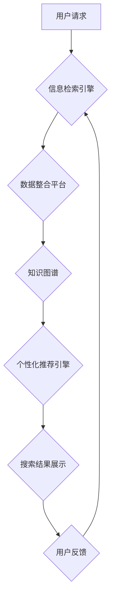

                 

## 跨渠道AI搜索：整合线上线下的全渠道体验

> 关键词：AI搜索、跨渠道、用户体验、信息检索、自然语言处理、机器学习、推荐系统

### 1. 背景介绍

在当今数字时代，用户的信息获取方式日益多元化，他们通过线上平台（搜索引擎、电商网站、社交媒体等）和线下平台（实体店、客服人员等）获取信息和完成交易。传统的搜索引擎主要集中在线上信息检索，无法有效整合线上线下资源，导致用户体验不佳。跨渠道AI搜索应运而生，旨在通过人工智能技术，整合线上线下数据，提供更全面、更精准、更智能的搜索体验。

随着人工智能技术的快速发展，特别是深度学习和自然语言处理领域的突破，跨渠道AI搜索技术取得了显著进展。例如，语音搜索、图像搜索、视频搜索等新兴搜索方式得到了广泛应用，并逐渐成为用户获取信息的主要途径。同时，大数据分析和推荐系统技术的应用，使得跨渠道AI搜索能够更加精准地理解用户需求，并提供个性化的搜索结果。

### 2. 核心概念与联系

跨渠道AI搜索的核心概念包括：

* **信息整合:** 将线上线下数据进行统一整合，构建一个全渠道的知识图谱。
* **用户理解:** 利用自然语言处理技术，理解用户的搜索意图，并将其转化为可执行的搜索指令。
* **个性化推荐:** 基于用户的搜索历史、浏览记录、购买行为等数据，提供个性化的搜索结果和推荐。
* **多模态搜索:** 支持多种搜索方式，例如文本搜索、语音搜索、图像搜索、视频搜索等。
* **实时更新:** 实时更新数据，确保搜索结果的准确性和时效性。

**跨渠道AI搜索架构**



### 3. 核心算法原理 & 具体操作步骤

#### 3.1  算法原理概述

跨渠道AI搜索的核心算法包括：

* **信息检索算法:** 用于从海量数据中检索相关信息，例如TF-IDF、BM25、PageRank等。
* **自然语言处理算法:** 用于理解用户的搜索意图，例如词性标注、依存句法分析、语义角色标注等。
* **机器学习算法:** 用于个性化推荐和搜索结果排序，例如协同过滤、内容过滤、深度学习等。

#### 3.2  算法步骤详解

1. **用户请求接收:** 接收用户的搜索请求，包括文本、语音、图像等多种形式。
2. **预处理:** 对用户请求进行预处理，例如文本清洗、语音识别、图像识别等。
3. **信息检索:** 利用信息检索算法从数据源中检索相关信息。
4. **自然语言理解:** 利用自然语言处理算法理解用户的搜索意图，提取关键词、实体、关系等信息。
5. **个性化推荐:** 利用机器学习算法根据用户的历史数据和搜索意图进行个性化推荐。
6. **结果排序:** 对检索到的结果进行排序，并根据用户的搜索意图进行筛选。
7. **结果展示:** 将排序后的结果以文本、图像、语音等多种形式展示给用户。
8. **用户反馈:** 收集用户的反馈信息，用于算法模型的优化和改进。

#### 3.3  算法优缺点

**优点:**

* **更精准的搜索结果:** 通过整合线上线下数据，跨渠道AI搜索能够提供更全面、更精准的搜索结果。
* **更智能的搜索体验:** 利用人工智能技术，跨渠道AI搜索能够理解用户的搜索意图，并提供个性化的搜索结果和推荐。
* **更丰富的搜索方式:** 支持多种搜索方式，例如文本搜索、语音搜索、图像搜索、视频搜索等，满足用户的多样化需求。

**缺点:**

* **数据整合难度:** 将线上线下数据进行统一整合是一个技术难题，需要解决数据格式、数据标准等问题。
* **算法模型复杂:** 跨渠道AI搜索算法模型比较复杂，需要大量的训练数据和计算资源。
* **隐私安全问题:** 跨渠道AI搜索需要收集和处理用户的个人数据，需要妥善处理隐私安全问题。

#### 3.4  算法应用领域

跨渠道AI搜索技术广泛应用于以下领域：

* **电商:** 提供更精准的商品推荐和搜索结果，提升用户购物体验。
* **旅游:** 提供个性化的旅游路线推荐和酒店预订服务。
* **金融:** 提供更便捷的金融产品查询和理财服务。
* **医疗:** 提供更精准的医疗信息查询和疾病诊断服务。
* **教育:** 提供个性化的学习资源推荐和在线教育服务。

### 4. 数学模型和公式 & 详细讲解 & 举例说明

#### 4.1  数学模型构建

跨渠道AI搜索的数学模型主要包括：

* **信息检索模型:** 例如TF-IDF模型，用于计算文档中关键词的重要性。
* **用户行为模型:** 例如协同过滤模型，用于预测用户对商品的评分或购买意愿。
* **推荐模型:** 例如深度学习模型，用于个性化推荐商品或服务。

#### 4.2  公式推导过程

**TF-IDF模型**

TF-IDF模型用于计算文档中关键词的重要性。

* **TF (Term Frequency):** 词项在文档中出现的频率。
* **IDF (Inverse Document Frequency):** 词项在整个语料库中出现的逆频率。

TF-IDF公式：

$$TF-IDF(t, d) = TF(t, d) \times IDF(t)$$

其中：

* $t$ 是关键词
* $d$ 是文档
* $TF(t, d)$ 是关键词 $t$ 在文档 $d$ 中出现的频率
* $IDF(t)$ 是关键词 $t$ 在整个语料库中出现的逆频率

**协同过滤模型**

协同过滤模型用于预测用户对商品的评分或购买意愿。

* **用户-商品评分矩阵:** 记录用户对商品的评分信息。
* **相似度计算:** 计算用户之间的相似度或商品之间的相似度。
* **预测评分:** 根据用户或商品的相似度，预测用户对未评分商品的评分。

#### 4.3  案例分析与讲解

**案例:** 假设有一个电商平台，用户对商品的评分信息如下：

| 用户 | 商品 A | 商品 B | 商品 C |
|---|---|---|---|
| 用户 1 | 5 | 4 | 3 |
| 用户 2 | 4 | 5 | 2 |
| 用户 3 | 3 | 3 | 5 |

我们可以利用协同过滤模型，计算用户之间的相似度，并预测用户对未评分商品的评分。例如，用户 1 和用户 2 对商品 A 和商品 B 的评分都比较高，因此我们可以认为他们具有相似的口味。我们可以利用用户 1 对商品 C 的评分，预测用户 2 对商品 C 的评分。

### 5. 项目实践：代码实例和详细解释说明

#### 5.1  开发环境搭建

跨渠道AI搜索项目开发环境搭建需要以下软件和工具：

* **操作系统:** Linux 或 Windows
* **编程语言:** Python
* **深度学习框架:** TensorFlow 或 PyTorch
* **数据库:** MySQL 或 MongoDB
* **搜索引擎:** Elasticsearch 或 Solr

#### 5.2  源代码详细实现

以下是一个简单的跨渠道AI搜索代码示例，使用Python和Elasticsearch实现：

```python
from elasticsearch import Elasticsearch

# 连接Elasticsearch
es = Elasticsearch([{'host': 'localhost', 'port': 9200}])

# 创建索引
es.indices.create(index='products', ignore=400)

# 添加文档
es.index(index='products', doc_type='product', body={
    'name': '商品 A',
    'description': '这是一个商品 A 的描述',
    'price': 100
})

# 搜索商品
query = {
    'query': {
        'match': {
            'name': '商品 A'
        }
    }
}
results = es.search(index='products', body=query)

# 打印搜索结果
for hit in results['hits']['hits']:
    print(hit['_source'])
```

#### 5.3  代码解读与分析

* 代码首先连接到Elasticsearch数据库。
* 然后创建了一个名为“products”的索引，用于存储商品信息。
* 添加了一个名为“商品 A”的商品文档到索引中。
* 使用一个查询语句搜索名为“商品 A”的商品。
* 最后打印搜索结果。

#### 5.4  运行结果展示

运行上述代码后，将会打印出“商品 A”的文档信息。

### 6. 实际应用场景

跨渠道AI搜索技术在各个行业都有广泛的应用场景：

#### 6.1  电商

* **商品搜索:** 提供更精准的商品搜索结果，帮助用户快速找到所需商品。
* **个性化推荐:** 根据用户的浏览历史、购买记录等数据，推荐用户可能感兴趣的商品。
* **跨平台购物:** 用户可以在线上平台搜索商品，并在线下门店购买。

#### 6.2  旅游

* **行程规划:** 根据用户的旅行时间、预算、兴趣爱好等信息，推荐个性化的旅行路线。
* **酒店预订:** 提供酒店预订服务，并根据用户的需求推荐合适的酒店。
* **景点推荐:** 根据用户的兴趣爱好，推荐附近的景点。

#### 6.3  金融

* **理财咨询:** 提供个性化的理财咨询服务，帮助用户规划投资策略。
* **金融产品搜索:** 用户可以搜索各种金融产品，例如贷款、信用卡、保险等。
* **风险评估:** 利用AI技术评估用户的风险承受能力，推荐合适的金融产品。

#### 6.4  未来应用展望

随着人工智能技术的不断发展，跨渠道AI搜索技术将会更加智能化、个性化和便捷化。未来，跨渠道AI搜索将会应用于更多领域，例如医疗、教育、政府等，为用户提供更全面的服务。

### 7. 工具和资源推荐

#### 7.1  学习资源推荐

* **书籍:**
    * 《深度学习》
    * 《自然语言处理》
    * 《推荐系统》
* **在线课程:**
    * Coursera
    * edX
    * Udacity

#### 7.2  开发工具推荐

* **Elasticsearch:** 开源搜索引擎
* **Solr:** 开源搜索平台
* **TensorFlow:** 深度学习框架
* **PyTorch:** 深度学习框架

#### 7.3  相关论文推荐

* **BERT: Pre-training of Deep Bidirectional Transformers for Language Understanding**
* **Attention Is All You Need**
* **Recurrent Neural Network for Sequence Learning**

### 8. 总结：未来发展趋势与挑战

#### 8.1  研究成果总结

跨渠道AI搜索技术取得了显著进展，能够提供更精准、更智能、更便捷的搜索体验。

#### 8.2  未来发展趋势

* **更强大的AI模型:** 利用更强大的AI模型，例如Transformer模型，提升搜索结果的准确性和相关性。
* **多模态搜索:** 支持多种搜索方式，例如文本、语音、图像、视频等，满足用户的多样化需求。
* **个性化推荐:** 利用更精准的用户画像和行为分析，提供更个性化的搜索结果和推荐。
* **跨平台融合:** 将线上线下数据进行更深入的融合，提供更全面的搜索体验。

#### 8.3  面临的挑战

* **数据整合难度:** 将线上线下数据进行统一整合是一个技术难题，需要解决数据格式、数据标准等问题。
* **算法模型复杂:** 跨渠道AI搜索算法模型比较复杂，需要大量的训练数据和计算资源。
* **隐私安全问题:** 跨渠道AI搜索需要收集和处理用户的个人数据，需要妥善处理隐私安全问题。

#### 8.4  研究展望

未来，跨渠道AI搜索技术将会继续发展，为用户提供更智能、更便捷、更全面的搜索体验。


### 9. 附录：常见问题与解答

**Q1: 跨渠道AI搜索和传统搜索引擎有什么区别？**

**A1:** 跨渠道AI搜索能够整合线上线下数据，提供更全面、更精准的搜索结果，而传统搜索引擎主要集中在线上信息检索。

**Q2: 跨渠道AI搜索技术有哪些应用场景？**

**A2:** 跨渠道AI搜索技术广泛应用于电商、旅游、金融、医疗、教育等各个行业。

**Q3: 如何搭建跨渠道AI搜索项目开发环境？**

**A3:** 跨渠道AI搜索项目开发环境搭建需要以下软件和工具：操作系统、编程语言、深度学习框架、数据库、搜索引擎等。

**Q4: 跨渠道AI搜索技术面临哪些挑战？**

**A4:** 跨渠道AI搜索技术面临的数据整合难度、算法模型复杂度和隐私安全问题等挑战。


作者：禅与计算机程序设计艺术 / Zen and the Art of Computer Programming 
<end_of_turn>

