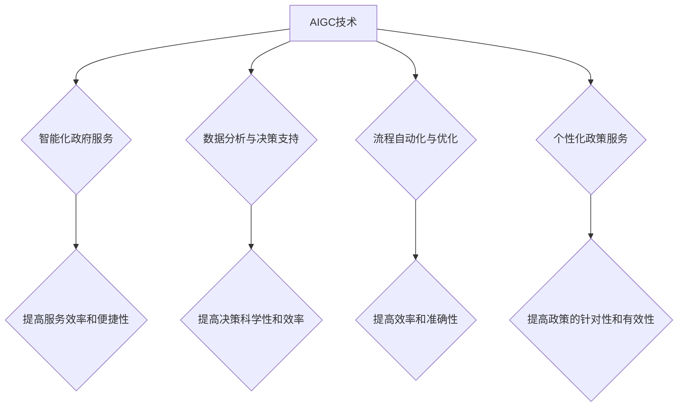

                 

## AIGC推动智慧政务发展

> 关键词：AIGC、智慧政务、人工智能、自然语言处理、机器学习、数据分析、流程自动化、政府服务

## 1. 背景介绍

近年来，随着人工智能（AI）技术的飞速发展，特别是生成式人工智能（AIGC）的兴起，智慧政务建设迎来了新的机遇。AIGC能够理解和生成人类语言，具备强大的文本处理、数据分析和智能决策能力，为政府部门提供更加高效、便捷、智能化的服务。

智慧政务是指利用信息技术和数据分析手段，提升政府服务效率、优化行政流程、增强公众参与度，最终实现政府治理现代化和社会公共服务提升的目标。传统的智慧政务建设主要依赖于规则引擎和流程自动化，而AIGC的加入则能够赋予智慧政务更强的智能化和个性化能力。

## 2. 核心概念与联系

### 2.1  AIGC概述

AIGC是指利用人工智能技术，能够生成文本、图像、音频、视频等各种新内容的系统。它基于深度学习算法，能够学习和理解人类语言的结构和语义，并根据输入的指令或数据生成符合特定格式和风格的新内容。

### 2.2  智慧政务概述

智慧政务是指利用信息技术和数据分析手段，提升政府服务效率、优化行政流程、增强公众参与度，最终实现政府治理现代化和社会公共服务提升的目标。

### 2.3  AIGC与智慧政务的联系

AIGC能够为智慧政务建设提供以下关键支持：

* **智能化政府服务:** AIGC可以构建智能客服系统，为公民提供24小时在线咨询和服务，解答常见问题，处理简单的行政事务，提高服务效率和便捷性。
* **数据分析与决策支持:** AIGC可以对海量政府数据进行分析，提取关键信息，生成可视化报表，为政府决策提供数据支撑，提高决策科学性和效率。
* **流程自动化与优化:** AIGC可以自动识别和理解政府流程，并根据规则生成相应的执行步骤，实现流程自动化，减少人工干预，提高效率和准确性。
* **个性化政策服务:** AIGC可以根据公民的个人信息和需求，定制个性化的政策服务，提高政策的针对性和有效性。

**Mermaid 流程图**



## 3. 核心算法原理 & 具体操作步骤

### 3.1  算法原理概述

AIGC的核心算法主要包括自然语言处理（NLP）和机器学习（ML）。NLP技术用于理解和处理人类语言，包括文本分类、情感分析、机器翻译等。ML技术用于训练模型，使模型能够从数据中学习规律，并生成新的内容。

常见的AIGC算法包括：

* **Transformer模型:** Transformer模型是一种基于深度学习的序列到序列模型，能够处理长距离依赖关系，在文本生成、机器翻译等任务中表现出色。
* **GPT模型:** GPT模型是一种基于Transformer的生成式预训练语言模型，能够生成流畅、连贯的文本，广泛应用于文本摘要、对话系统等领域。
* **BERT模型:** BERT模型是一种基于Transformer的双向编码语言模型，能够理解文本的上下文信息，在文本分类、问答系统等任务中表现优异。

### 3.2  算法步骤详解

AIGC的具体操作步骤可以概括为以下几个阶段：

1. **数据收集和预处理:** 收集大量文本数据，并进行清洗、格式化、标注等预处理工作，为模型训练提供高质量的数据。
2. **模型训练:** 选择合适的AIGC算法模型，并利用训练数据进行模型训练，使模型能够学习语言的规律和生成能力。
3. **模型评估和优化:** 对训练好的模型进行评估，并根据评估结果进行模型调优，提高模型的生成质量和准确性。
4. **模型部署和应用:** 将训练好的模型部署到实际应用场景中，例如构建智能客服系统、生成政策文本等。

### 3.3  算法优缺点

**优点:**

* **生成高质量内容:** AIGC能够生成流畅、连贯、符合语法的文本，并能够根据特定需求定制内容风格和主题。
* **提高效率:** AIGC可以自动化完成文本生成等任务，大幅提高工作效率，释放人力资源。
* **个性化服务:** AIGC可以根据用户需求生成个性化的内容，提供更加精准和有效的服务。

**缺点:**

* **数据依赖:** AIGC模型的性能依赖于训练数据的质量和数量，如果训练数据不足或质量低，模型的生成效果会受到影响。
* **伦理风险:** AIGC生成的文本可能存在偏见、误导或虚假信息，需要加强伦理规范和监管。
* **技术复杂性:** AIGC模型的训练和部署需要专业的技术人员和资源支持。

### 3.4  算法应用领域

AIGC在政府服务、政策制定、数据分析、新闻报道、教育培训等多个领域都有广泛的应用前景。

## 4. 数学模型和公式 & 详细讲解 & 举例说明

### 4.1  数学模型构建

AIGC模型通常基于深度学习框架，例如TensorFlow或PyTorch。模型的结构通常包括编码器和解码器。编码器负责将输入文本转换为向量表示，解码器负责根据编码后的向量生成新的文本。

**举例说明:**

Transformer模型的编码器部分通常由多层Transformer模块组成，每个模块包含自注意力机制和前馈神经网络。自注意力机制能够捕捉文本中的长距离依赖关系，而前馈神经网络能够学习文本的语义特征。

### 4.2  公式推导过程

Transformer模型中的自注意力机制的核心公式是注意力权重计算公式：

$$
\text{Attention}(Q, K, V) = \text{softmax}\left(\frac{QK^T}{\sqrt{d_k}}\right)V
$$

其中：

* $Q$：查询矩阵
* $K$：键矩阵
* $V$：值矩阵
* $d_k$：键向量的维度
* $\text{softmax}$：softmax函数

该公式计算了查询向量与键向量的相似度，并根据相似度分配注意力权重，最终将值向量加权求和，得到注意力输出。

### 4.3  案例分析与讲解

例如，在机器翻译任务中，AIGC模型可以将源语言文本编码为向量表示，然后利用注意力机制将目标语言词汇与源语言向量进行匹配，最终生成目标语言文本。

## 5. 项目实践：代码实例和详细解释说明

### 5.1  开发环境搭建

AIGC项目开发通常需要以下环境：

* **操作系统:** Linux或macOS
* **编程语言:** Python
* **深度学习框架:** TensorFlow或PyTorch
* **GPU:** 加速模型训练

### 5.2  源代码详细实现

以下是一个简单的AIGC文本生成代码示例，使用Python和Transformers库：

```python
from transformers import pipeline

generator = pipeline("text-generation", model="gpt2")

text = "今天天气很好"
output = generator(text, max_length=50, num_return_sequences=3)

for sequence in output:
    print(sequence["generated_text"])
```

**代码解读与分析:**

* 该代码使用Transformers库中的`pipeline`函数构建一个文本生成器。
* `model="gpt2"`指定使用GPT-2模型进行文本生成。
* `text`参数输入需要生成的文本前缀。
* `max_length`参数指定生成的文本最大长度。
* `num_return_sequences`参数指定生成多个文本序列。

### 5.3  运行结果展示

运行该代码后，将输出三个基于输入文本“今天天气很好”生成的文本序列。

## 6. 实际应用场景

### 6.1  智能客服系统

AIGC可以构建智能客服系统，为公民提供24小时在线咨询和服务，解答常见问题，处理简单的行政事务，提高服务效率和便捷性。

### 6.2  政策文本生成

AIGC可以根据法律法规和政策文件，自动生成政策文本，例如法规解读、政策通知、办事指南等，提高政策的普及性和可理解性。

### 6.3  数据分析与决策支持

AIGC可以对政府数据进行分析，提取关键信息，生成可视化报表，为政府决策提供数据支撑，提高决策科学性和效率。

### 6.4  未来应用展望

随着AIGC技术的不断发展，未来将在智慧政务领域发挥更广泛的作用，例如：

* **个性化政策服务:** AIGC可以根据公民的个人信息和需求，定制个性化的政策服务，提高政策的针对性和有效性。
* **自动化的行政审批:** AIGC可以自动识别和理解行政审批流程，并根据规则生成相应的执行步骤，实现流程自动化，减少人工干预，提高审批效率。
* **智慧监管:** AIGC可以对政府监管数据进行分析，识别潜在风险，并生成预警报告，提高监管效率和精准度。

## 7. 工具和资源推荐

### 7.1  学习资源推荐

* **在线课程:** Coursera、edX、Udacity等平台提供人工智能和自然语言处理相关的在线课程。
* **书籍:** 《深度学习》、《自然语言处理》等书籍可以帮助读者深入了解AIGC相关知识。
* **开源社区:** HuggingFace、GitHub等开源社区提供丰富的AIGC模型和代码资源。

### 7.2  开发工具推荐

* **深度学习框架:** TensorFlow、PyTorch、JAX等深度学习框架提供强大的机器学习工具和库。
* **自然语言处理库:** NLTK、spaCy、Gensim等自然语言处理库提供文本处理、分析和生成工具。
* **云计算平台:** AWS、Azure、Google Cloud等云计算平台提供强大的计算资源和服务，可以加速AIGC模型训练和部署。

### 7.3  相关论文推荐

* **Attention Is All You Need:** https://arxiv.org/abs/1706.03762
* **BERT: Pre-training of Deep Bidirectional Transformers for Language Understanding:** https://arxiv.org/abs/1810.04805
* **GPT-3: Language Models are Few-Shot Learners:** https://arxiv.org/abs/2005.14165

## 8. 总结：未来发展趋势与挑战

### 8.1  研究成果总结

AIGC技术在智慧政务领域取得了显著进展，例如智能客服系统、政策文本生成、数据分析等应用场景取得了成功。

### 8.2  未来发展趋势

未来AIGC技术将朝着以下方向发展：

* **模型规模和能力提升:** 模型规模将进一步扩大，模型能力将更加强大，能够处理更复杂的任务。
* **多模态生成:** AIGC将不仅仅局限于文本生成，还将能够生成图像、音频、视频等多模态内容。
* **个性化定制:** AIGC将更加注重个性化定制，能够根据用户的需求生成更加精准和有效的服务。
* **伦理规范和监管:** 随着AIGC技术的应用越来越广泛，伦理规范和监管将更加重要，需要制定相应的法律法规和标准，确保AIGC技术安全、可控、可持续发展。

### 8.3  面临的挑战

AIGC技术在智慧政务领域的应用还面临一些挑战：

* **数据安全和隐私保护:** AIGC模型的训练需要大量数据，如何保证数据安全和隐私保护是需要解决的关键问题。
* **模型解释性和可信度:** AIGC模型的决策过程往往是复杂的，如何提高模型的解释性和可信度，让公众能够理解和信任AIGC技术，是需要进一步研究的问题。
* **技术人才短缺:** AIGC技术需要专业的技术人才，而目前相关人才相对稀缺，需要加强人才培养和引进。

### 8.4  研究展望

未来，我们将继续深入研究AIGC技术在智慧政务领域的应用，探索其在更多领域的潜力，并积极应对相关挑战，推动AIGC技术更好地服务于社会发展。

## 9. 附录：常见问题与解答

**Q1: AIGC技术与传统规则引擎相比有哪些优势？**

**A1:** AIGC技术相比传统规则引擎具有以下优势：

* **更灵活和智能:** AIGC模型能够学习和理解复杂的规则，并根据实际情况进行调整，而规则引擎则需要人工编写规则，难以适应变化的场景。
* **更自动化:** AIGC模型能够自动完成文本生成等任务，而规则引擎则需要人工干预，效率较低。
* **更个性化:** AIGC模型能够根据用户的需求生成个性化的内容，而规则引擎则只能提供标准化的服务。

**Q2: AIGC技术在智慧政务领域的应用有哪些伦理风险？**

**A2:** AIGC技术在智慧政务领域的应用存在以下伦理风险：

* **偏见和歧视:** AIGC模型的训练数据可能存在偏见，导致模型生成的结果存在歧视性。
* **虚假信息和误导:** AIGC模型生成的文本可能存在虚假信息或误导性内容，需要加强模型的可靠性和可信度。
* **隐私泄露:** AIGC模型的训练需要大量数据，需要加强数据安全和隐私保护措施。


作者：禅与计算机程序设计艺术 / Zen and the Art of Computer Programming 
<end_of_turn>

