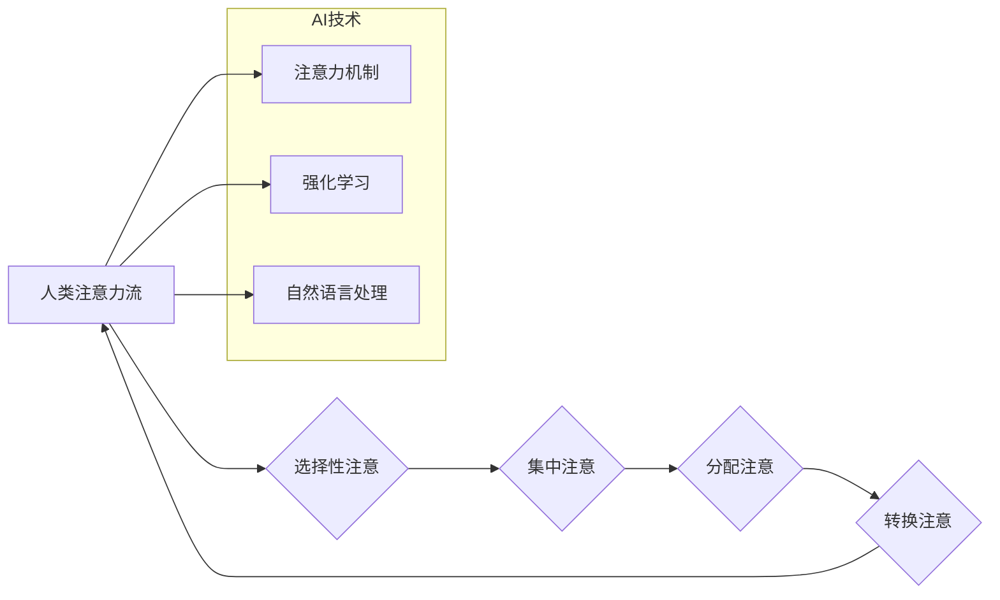

                 

## AI与人类注意力流：未来的工作、技能与注意力流管理

> 关键词：人工智能、注意力流、认知科学、工作模式、技能发展、注意力管理、深度学习、神经网络、未来趋势

## 1. 背景介绍

在信息爆炸的时代，人类的注意力资源面临着前所未有的挑战。来自社交媒体、电子邮件、新闻推送等各种渠道的信息轰炸，使得我们难以集中精力完成任务，效率不断下降。与此同时，人工智能（AI）技术飞速发展，正在深刻地改变着我们的生活和工作方式。AI系统能够自动处理大量信息，识别模式，并提供个性化的服务，这为我们释放注意力，专注于更重要的工作提供了新的可能性。

然而，AI技术的发展也带来了新的问题。例如，AI驱动的个性化推荐算法可能会加剧信息茧房效应，限制我们的认知边界。此外，过度依赖AI可能会导致我们丧失一些重要的认知能力，例如批判性思维和解决问题的能力。因此，我们需要深入思考AI与人类注意力流之间的关系，并探索如何更好地利用AI技术，提升我们的注意力管理能力，从而在未来的工作和生活中取得成功。

## 2. 核心概念与联系

### 2.1 人类注意力流

人类注意力流是指我们对信息进行选择性感知、加工和记忆的过程。它是一个动态的、复杂的系统，受多种因素影响，包括我们的认知能力、情绪状态、环境因素等。

注意力流可以分为以下几个阶段：

* **选择性注意:** 从大量信息中选择关注的特定信息。
* **集中注意:** 将注意力集中在目标信息上，排除干扰。
* **分配注意:** 将注意力分配到多个任务或信息上。
* **转换注意:** 在不同的任务或信息之间快速切换注意力。

### 2.2 人工智能与注意力流

人工智能技术，特别是深度学习和神经网络，在模拟和理解人类注意力流方面取得了显著进展。

* **注意力机制:** 深度学习模型中引入的注意力机制，能够学习到哪些信息对目标任务更重要，并对这些信息给予更多的关注。
* **强化学习:** 强化学习算法可以训练AI系统学习如何有效地分配注意力，以最大化奖励。
* **自然语言处理:** 自然语言处理技术可以帮助AI系统理解人类语言中的注意力线索，例如强调词、疑问词等。

### 2.3 AI与人类注意力流的交互

AI技术可以与人类注意力流进行交互，既可以帮助我们提升注意力，也可以加剧注意力分散。

* **提升注意力:** AI可以过滤掉无关信息，提供个性化的学习和工作环境，帮助我们集中精力完成任务。
* **加剧分散:** AI驱动的个性化推荐算法可能会导致信息茧房效应，限制我们的认知边界，并加剧注意力分散。

**Mermaid 流程图**



## 3. 核心算法原理 & 具体操作步骤

### 3.1 算法原理概述

注意力机制是深度学习模型中的一种重要模块，它能够学习到哪些信息对目标任务更重要，并对这些信息给予更多的关注。注意力机制的灵感来自于人类的注意力机制，它允许模型在处理序列数据时，根据输入序列的不同位置，分配不同的注意力权重。

### 3.2 算法步骤详解

1. **计算注意力权重:** 对于每个输入序列位置，计算与目标位置的注意力权重。注意力权重通常通过一个注意力函数计算，该函数将输入序列和目标序列作为输入，并输出一个注意力分数。
2. **加权求和:** 使用计算出的注意力权重对输入序列进行加权求和，得到一个新的表示向量。
3. **输出:** 将加权求和后的表示向量作为模型的输出。

### 3.3 算法优缺点

**优点:**

* 可以学习到输入序列中哪些信息对目标任务更重要。
* 可以提高模型的表达能力和泛化能力。

**缺点:**

* 计算复杂度较高。
* 需要大量的训练数据。

### 3.4 算法应用领域

注意力机制在自然语言处理、计算机视觉、语音识别等领域都有广泛的应用。例如，在机器翻译中，注意力机制可以帮助模型更好地理解句子结构和语义，从而提高翻译质量。

## 4. 数学模型和公式 & 详细讲解 & 举例说明

### 4.1 数学模型构建

注意力机制的数学模型可以表示为以下公式：

$$
\text{Attention}(Q, K, V) = \text{softmax}\left(\frac{Q K^T}{\sqrt{d_k}}\right) V
$$

其中：

* $Q$：查询向量
* $K$：键向量
* $V$：值向量
* $d_k$：键向量的维度
* $\text{softmax}$：softmax函数，用于将注意力权重归一化到[0, 1]之间。

### 4.2 公式推导过程

注意力机制的核心思想是计算查询向量 $Q$ 与键向量 $K$ 之间的相似度，并根据相似度分配注意力权重。

* **计算相似度:** 使用点积操作计算查询向量 $Q$ 与每个键向量 $K_i$ 之间的相似度：

$$
\text{score}(Q, K_i) = Q K_i^T
$$

* **归一化相似度:** 使用softmax函数将相似度转换为注意力权重：

$$
\text{attention}(Q, K_i) = \frac{\exp(\text{score}(Q, K_i))}{\sum_{j=1}^{n} \exp(\text{score}(Q, K_j))}
$$

其中 $n$ 是键向量的数量。

* **加权求和:** 使用注意力权重对值向量 $V$ 进行加权求和，得到最终的输出：

$$
\text{output} = \sum_{i=1}^{n} \text{attention}(Q, K_i) V_i
$$

### 4.3 案例分析与讲解

例如，在机器翻译中，查询向量 $Q$ 表示目标语言的词，键向量 $K$ 表示源语言的词，值向量 $V$ 表示源语言词的嵌入向量。注意力机制可以帮助模型学习到哪些源语言词对目标语言词更相关，从而提高翻译质量。

## 5. 项目实践：代码实例和详细解释说明

### 5.1 开发环境搭建

* Python 3.6+
* TensorFlow 2.0+
* PyTorch 1.0+

### 5.2 源代码详细实现

```python
import tensorflow as tf

# 定义注意力机制
def attention_layer(query, key, value, mask=None):
    # 计算注意力权重
    scores = tf.matmul(query, key, transpose_b=True) / tf.math.sqrt(tf.cast(key.shape[-1], tf.float32))
    if mask is not None:
        scores += (mask * -1e9)
    attention_weights = tf.nn.softmax(scores, axis=-1)
    # 加权求和
    context_vector = tf.matmul(attention_weights, value)
    return context_vector, attention_weights

# 示例用法
query = tf.random.normal([1, 5, 64])
key = tf.random.normal([1, 10, 64])
value = tf.random.normal([1, 10, 128])

context_vector, attention_weights = attention_layer(query, key, value)
print(context_vector.shape)
print(attention_weights.shape)
```

### 5.3 代码解读与分析

* `attention_layer` 函数定义了注意力机制的计算过程。
* `scores` 计算了查询向量与键向量之间的相似度。
* `attention_weights` 使用 softmax 函数将相似度转换为注意力权重。
* `context_vector` 使用注意力权重对值向量进行加权求和。

### 5.4 运行结果展示

运行代码后，会输出 `context_vector` 和 `attention_weights` 的形状。

## 6. 实际应用场景

### 6.1 机器翻译

注意力机制可以帮助机器翻译模型更好地理解句子结构和语义，从而提高翻译质量。

### 6.2 文本摘要

注意力机制可以帮助文本摘要模型识别出文章中最关键的信息，并生成简洁准确的摘要。

### 6.3 图像识别

注意力机制可以帮助图像识别模型关注图像中最重要的区域，从而提高识别准确率。

### 6.4 聊天机器人

注意力机制可以帮助聊天机器人更好地理解用户输入，并生成更自然、更符合语境的回复。

### 6.5 未来应用展望

随着人工智能技术的不断发展，注意力机制将在更多领域得到应用，例如：

* **个性化教育:** 根据学生的学习进度和兴趣，提供个性化的学习内容和建议。
* **医疗诊断:** 帮助医生更快、更准确地诊断疾病。
* **自动驾驶:** 帮助自动驾驶汽车更好地感知周围环境。

## 7. 工具和资源推荐

### 7.1 学习资源推荐

* **书籍:**
    * 《深度学习》
    * 《Attention Is All You Need》
* **在线课程:**
    * Coursera: 深度学习
    * Udacity: 自然语言处理
* **博客:**
    * Jay Alammar's Blog: https://jalammar.github.io/

### 7.2 开发工具推荐

* **TensorFlow:** https://www.tensorflow.org/
* **PyTorch:** https://pytorch.org/
* **Keras:** https://keras.io/

### 7.3 相关论文推荐

* 《Attention Is All You Need》
* 《BERT: Pre-training of Deep Bidirectional Transformers for Language Understanding》
* 《Transformer-XL: Attentive Language Models Beyond a Fixed-Length Context》

## 8. 总结：未来发展趋势与挑战

### 8.1 研究成果总结

近年来，注意力机制在人工智能领域取得了显著进展，并在许多应用场景中取得了优异的性能。

### 8.2 未来发展趋势

* **更有效的注意力机制:** 研究更有效的注意力机制，例如自注意力机制、多头注意力机制等。
* **注意力机制的泛化能力:** 研究如何提高注意力机制的泛化能力，使其能够应用于更多不同的任务和领域。
* **注意力机制的可解释性:** 研究如何提高注意力机制的可解释性，使其能够更好地理解模型的决策过程。

### 8.3 面临的挑战

* **计算复杂度:** 传统的注意力机制计算复杂度较高，难以应用于大型模型和海量数据。
* **数据依赖性:** 注意力机制需要大量的训练数据才能达到最佳性能。
* **伦理问题:** 注意力机制可能会被用于操纵用户行为，因此需要关注其伦理问题。

### 8.4 研究展望

未来，注意力机制将继续是人工智能领域的重要研究方向。随着技术的不断发展，我们相信注意力机制将发挥更大的作用，帮助我们更好地理解和利用人工智能技术。

## 9. 附录：常见问题与解答

* **什么是注意力机制？**

注意力机制是一种模仿人类注意力机制的计算模型，它能够学习到输入序列中哪些信息对目标任务更重要，并对这些信息给予更多的关注。

* **注意力机制有哪些应用场景？**

注意力机制在机器翻译、文本摘要、图像识别、聊天机器人等领域都有广泛的应用。

* **如何实现注意力机制？**

可以使用 TensorFlow、PyTorch 等深度学习框架实现注意力机制。

* **注意力机制的优缺点是什么？**

注意力机制的优点是能够学习到输入序列中最重要的信息，提高模型的表达能力和泛化能力。缺点是计算复杂度较高，需要大量的训练数据。

* **注意力机制的未来发展趋势是什么？**

未来，注意力机制将更加高效、泛化能力更强，并应用于更多新的领域。


作者：禅与计算机程序设计艺术 / Zen and the Art of Computer Programming 
<end_of_turn>

