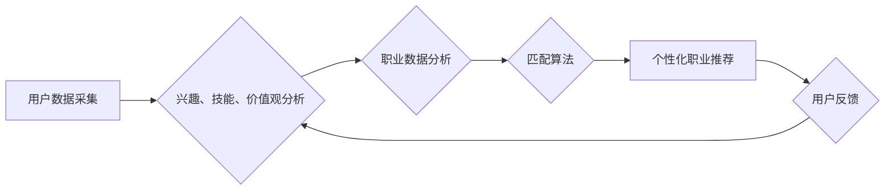

                 

## AI在个性化职业规划中的应用：匹配最佳职业

> 关键词：人工智能、职业规划、个性化推荐、机器学习、数据分析、匹配算法、职业发展

## 1. 背景介绍

在当今瞬息万变的社会，职业选择不再是人生的单一决定，而是需要不断调整和适应的动态过程。传统的职业规划模式往往过于僵化，难以满足个人多元化需求和不断变化的市场环境。人工智能（AI）技术的快速发展为个性化职业规划提供了全新的可能性。

AI驱动的职业规划系统能够通过分析个人的兴趣、技能、价值观、经验等多方面信息，结合大数据分析和机器学习算法，精准匹配最佳职业方向，并提供个性化的职业发展建议。这不仅可以帮助个人做出更明智的职业选择，也能提高职业匹配度，促进个人职业发展和社会进步。

## 2. 核心概念与联系

**2.1 核心概念**

* **个性化职业规划:** 基于个体差异，提供定制化的职业建议和发展路径。
* **AI驱动的匹配算法:** 利用机器学习和数据分析技术，分析个人特征和职业信息，实现精准匹配。
* **大数据分析:** 收集和分析海量职业数据，包括职位描述、薪资水平、行业趋势等，为匹配提供数据支持。
* **机器学习:** 通过训练模型，学习个人特征和职业关系，不断优化匹配结果。

**2.2 架构图**



**2.3 联系**

AI驱动的个性化职业规划系统通过用户数据采集、分析和匹配算法，实现精准的职业推荐。用户数据包括个人兴趣、技能、价值观等信息，职业数据包括职位描述、薪资水平、行业趋势等。匹配算法利用机器学习技术，分析用户数据和职业数据，找到最匹配的职业方向。用户反馈可以不断优化匹配算法，提高推荐精准度。

## 3. 核心算法原理 & 具体操作步骤

**3.1 算法原理概述**

AI驱动的职业匹配算法主要基于以下原理：

* **协同过滤:** 基于用户相似度或物品相似度进行推荐。
* **内容过滤:** 根据用户兴趣和职业特征进行推荐。
* **混合推荐:** 结合协同过滤和内容过滤算法，提高推荐精准度。

**3.2 算法步骤详解**

1. **数据收集:** 收集用户数据和职业数据，包括兴趣、技能、价值观、工作经验、学历、薪资期望等。
2. **数据预处理:** 对收集到的数据进行清洗、转换和标准化，以便于算法训练和使用。
3. **特征提取:** 从用户数据和职业数据中提取关键特征，例如兴趣标签、技能类别、工作经验年限等。
4. **模型训练:** 利用机器学习算法，例如协同过滤算法、内容过滤算法或混合推荐算法，训练匹配模型。
5. **预测匹配度:** 将用户特征输入到训练好的模型中，预测用户与不同职业的匹配度。
6. **排序推荐:** 根据预测的匹配度，对职业进行排序，推荐最匹配的职业方向。

**3.3 算法优缺点**

* **优点:**
    * 精准匹配: 基于数据分析和机器学习，能够精准匹配用户和职业。
    * 个性化推荐: 提供定制化的职业建议，满足个人需求。
    * 数据驱动: 基于大数据分析，提供客观、科学的职业建议。
* **缺点:**
    * 数据依赖: 算法性能依赖于数据质量和数量。
    * 黑盒效应: 部分算法难以解释，难以理解推荐结果背后的逻辑。
    * 算法偏差: 算法可能存在偏差，导致推荐结果不公平。

**3.4 算法应用领域**

* **职业规划平台:** 为个人提供个性化职业建议和发展路径。
* **招聘平台:** 为企业精准匹配人才，提高招聘效率。
* **教育机构:** 为学生提供职业探索和规划服务。
* **政府部门:** 为政策制定提供数据支持，促进职业发展和就业。

## 4. 数学模型和公式 & 详细讲解 & 举例说明

**4.1 数学模型构建**

职业匹配模型可以构建为一个基于用户特征和职业特征的评分模型。

**用户特征向量:**  $u = (u_1, u_2, ..., u_n)$，其中 $u_i$ 表示用户在第 $i$ 个特征上的得分。

**职业特征向量:** $v = (v_1, v_2, ..., v_m)$，其中 $v_j$ 表示职业在第 $j$ 个特征上的得分。

**匹配评分:** $score(u, v) = \sum_{i=1}^{n} \sum_{j=1}^{m} w_{ij} * u_i * v_j$，其中 $w_{ij}$ 是用户特征 $u_i$ 和职业特征 $v_j$ 之间的权重。

**4.2 公式推导过程**

匹配评分公式的推导过程基于以下假设：

* 用户特征和职业特征之间存在线性关系。
* 不同特征的重要性不同，需要赋予不同的权重。

**4.3 案例分析与讲解**

假设我们有一个用户 $u$，其兴趣特征向量为 $(1, 0, 1)$，技能特征向量为 $(0.8, 0.5, 0.7)$，职业 $v$ 的兴趣特征向量为 $(0.5, 1, 0.2)$，技能特征向量为 $(0.6, 0.7, 0.9)$。

我们可以设定权重矩阵 $W$ 为：

```
W = 
[0.3 0.4]
[0.2 0.5]
[0.5 0.1]
```

则用户 $u$ 和职业 $v$ 的匹配评分为：

```
score(u, v) = 0.3 * 1 * 0.5 + 0.4 * 0 * 1 + 0.3 * 1 * 0.2 + 0.4 * 0.8 * 0.6 + 0.5 * 0.5 * 0.7 + 0.1 * 0.7 * 0.9 = 0.62
```

## 5. 项目实践：代码实例和详细解释说明

**5.1 开发环境搭建**

* Python 3.x
* Jupyter Notebook
* scikit-learn
* pandas
* numpy

**5.2 源代码详细实现**

```python
import pandas as pd
from sklearn.metrics.pairwise import cosine_similarity

# 加载用户数据和职业数据
user_data = pd.read_csv('user_data.csv')
job_data = pd.read_csv('job_data.csv')

# 提取用户特征和职业特征
user_features = user_data[['interest1', 'interest2', 'skill1', 'skill2']]
job_features = job_data[['interest1', 'interest2', 'skill1', 'skill2']]

# 计算用户特征和职业特征之间的余弦相似度
similarity_matrix = cosine_similarity(user_features, job_features)

# 获取用户ID和职业ID
user_id = 1
job_id = 1

# 获取用户和职业的匹配评分
score = similarity_matrix[user_id][job_id]

# 打印匹配评分
print(f'用户 {user_id} 和职业 {job_id} 的匹配评分为: {score}')
```

**5.3 代码解读与分析**

* 代码首先加载用户数据和职业数据，并提取用户特征和职业特征。
* 然后，使用 scikit-learn 库中的 cosine_similarity 函数计算用户特征和职业特征之间的余弦相似度，得到一个相似度矩阵。
* 通过指定用户ID和职业ID，可以获取用户和职业的匹配评分。
* 最后，打印匹配评分。

**5.4 运行结果展示**

运行代码后，会输出用户和职业的匹配评分。评分值介于 0 和 1 之间，数值越高表示匹配度越高。

## 6. 实际应用场景

**6.1 职业规划平台**

AI驱动的职业规划平台可以帮助用户探索职业方向，了解不同职业的技能要求、薪资水平、发展前景等信息，并提供个性化的职业建议和发展路径。

**6.2 招聘平台**

AI驱动的招聘平台可以帮助企业精准匹配人才，提高招聘效率。平台可以根据用户的技能、经验、兴趣等信息，推荐匹配的职位，并自动筛选符合条件的候选人。

**6.3 教育机构**

AI驱动的职业规划系统可以帮助教育机构为学生提供职业探索和规划服务。系统可以根据学生的学习成绩、兴趣爱好、性格特点等信息，推荐适合的职业方向和学习路径。

**6.4 未来应用展望**

随着人工智能技术的不断发展，AI驱动的职业规划系统将更加智能化、个性化和精准化。未来，AI系统将能够：

* 更深入地理解用户的需求和目标。
* 提供更个性化的职业建议和发展路径。
* 预测未来职业趋势，帮助用户做出更明智的职业选择。
* 为用户提供持续的职业发展支持和指导。

## 7. 工具和资源推荐

**7.1 学习资源推荐**

* **书籍:**
    * 《人工智能：一种现代方法》
    * 《机器学习》
    * 《深度学习》
* **在线课程:**
    * Coursera: 人工智能课程
    * edX: 机器学习课程
    * Udacity: 深度学习课程

**7.2 开发工具推荐**

* **Python:** 广泛应用于人工智能开发，拥有丰富的库和框架。
* **scikit-learn:** 机器学习库，提供各种算法和工具。
* **TensorFlow:** 深度学习框架，用于构建和训练深度神经网络。
* **PyTorch:** 深度学习框架，灵活易用，适合研究和开发。

**7.3 相关论文推荐**

* **推荐系统综述:**
    * "Recommender Systems: A Survey"
* **机器学习在职业规划中的应用:**
    * "Using Machine Learning for Career Counseling"
* **深度学习在职业匹配中的应用:**
    * "Deep Learning for Career Matching"

## 8. 总结：未来发展趋势与挑战

**8.1 研究成果总结**

AI驱动的个性化职业规划系统已经取得了显著的成果，能够帮助用户更精准地匹配职业方向，提高职业发展效率。

**8.2 未来发展趋势**

* **更深入的用户理解:** 利用自然语言处理和情感分析技术，更深入地理解用户的需求和目标。
* **更精准的职业匹配:** 利用大数据分析和机器学习算法，提高职业匹配的精准度。
* **更个性化的职业发展路径:** 提供个性化的职业发展建议和指导，帮助用户实现职业目标。
* **更智能的交互体验:** 利用人工智能技术，提供更智能、更便捷的交互体验。

**8.3 面临的挑战**

* **数据质量和隐私问题:** 算法性能依赖于数据质量，需要确保数据准确、完整和安全。
* **算法解释性和公平性:** 部分算法难以解释，可能存在偏差，需要提高算法的透明度和公平性。
* **技术可访问性和伦理问题:** 需要确保技术可访问性和公平性，避免技术垄断和伦理问题。

**8.4 研究展望**

未来，AI驱动的职业规划系统将朝着更智能、更个性化、更精准的方向发展，为个人职业发展提供更强大的支持。


## 9. 附录：常见问题与解答

**9.1 如何选择合适的职业规划平台？**

选择职业规划平台时，可以考虑以下因素：

* 平台的算法和技术实力
* 平台的数据质量和覆盖范围
* 平台的个性化定制程度
* 平台的用户体验和服务质量

**9.2 AI驱动的职业规划系统是否会取代人力资源？**

AI驱动的职业规划系统可以辅助人力资源工作，提高效率，但不会完全取代人力资源。人力资源仍然需要负责招聘、培训、绩效管理等工作，需要具备人际交往、沟通协调等能力。

**9.3 AI驱动的职业规划系统是否会带来职业歧视？**

AI驱动的职业规划系统可能会存在算法偏差，导致职业歧视。因此，需要不断改进算法，提高算法的公平性和透明度。


作者：禅与计算机程序设计艺术 / Zen and the Art of Computer Programming 
<end_of_turn>

