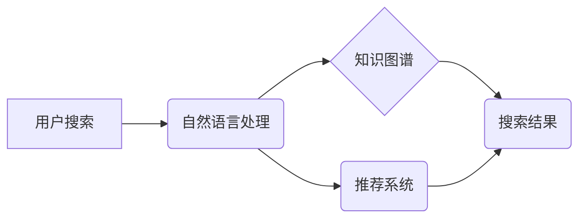

                 

## AI在搜索结果呈现方式上的创新

> 关键词：人工智能、搜索引擎、自然语言处理、推荐系统、知识图谱、个性化搜索、多模态搜索

### 1. 背景介绍

传统的搜索引擎主要依靠关键词匹配来检索信息，但这种方式存在局限性。随着互联网信息爆炸式增长，用户搜索需求日益多样化，单纯依靠关键词匹配难以满足用户对更精准、更智能、更个性化的搜索体验的需求。人工智能技术的快速发展为搜索结果呈现方式的创新提供了新的机遇。

### 2. 核心概念与联系

**2.1 核心概念**

* **自然语言处理 (NLP):**  NLP 旨在使计算机能够理解、理解和生成人类语言。在搜索引擎中，NLP 用于分析用户搜索查询，识别其意图和关键词，并对搜索结果进行语义理解和排序。
* **推荐系统:** 推荐系统通过分析用户行为和偏好，预测用户可能感兴趣的内容，并将其推荐给用户。在搜索引擎中，推荐系统可以用于推荐相关搜索结果、个性化搜索结果和用户可能感兴趣的网站或内容。
* **知识图谱:** 知识图谱是一种结构化的知识表示形式，它将实体和关系组织成一个网络。在搜索引擎中，知识图谱可以用于理解用户搜索查询的语义关系，并提供更丰富、更全面的搜索结果。

**2.2 架构图**



**2.3 联系**

NLP 用于分析用户搜索查询，识别其意图和关键词。知识图谱可以帮助理解用户搜索查询的语义关系，并提供更丰富、更全面的搜索结果。推荐系统可以根据用户行为和偏好，推荐相关搜索结果和个性化搜索结果。最终，这些技术共同作用，为用户提供更精准、更智能、更个性化的搜索体验。

### 3. 核心算法原理 & 具体操作步骤

**3.1 算法原理概述**

在搜索结果呈现方式的创新中，常用的算法包括：

* **BERT (Bidirectional Encoder Representations from Transformers):** BERT 是一种基于 Transformer 架构的深度学习模型，能够理解上下文信息，提高搜索结果的语义匹配度。
* **RankNet:** RankNet 是一种基于机器学习的排序算法，可以根据用户点击行为和搜索历史，对搜索结果进行排序，提高用户体验。
* **Collaborative Filtering:**  协同过滤算法通过分析用户行为数据，推荐与用户兴趣相似的其他用户可能喜欢的搜索结果。

**3.2 算法步骤详解**

以 BERT 算法为例，其具体操作步骤如下：

1. **预训练:** BERT 在大量的文本数据上进行预训练，学习语言的语义表示。
2. **微调:** 将预训练的 BERT 模型微调到特定的搜索任务上，例如关键词匹配、语义搜索等。
3. **输入处理:** 将用户搜索查询和候选搜索结果转换为 BERT 模型可以理解的格式。
4. **编码:** BERT 模型对用户搜索查询和候选搜索结果进行编码，生成其语义表示。
5. **相似度计算:** 计算用户搜索查询和候选搜索结果的语义相似度。
6. **排序:** 根据相似度排序候选搜索结果，并返回给用户。

**3.3 算法优缺点**

* **BERT:**
    * **优点:** 能够理解上下文信息，提高搜索结果的语义匹配度。
    * **缺点:** 计算量大，训练成本高。
* **RankNet:**
    * **优点:** 可以根据用户点击行为和搜索历史，对搜索结果进行排序，提高用户体验。
    * **缺点:** 需要大量的用户行为数据进行训练。
* **Collaborative Filtering:**
    * **优点:** 可以推荐与用户兴趣相似的其他用户可能喜欢的搜索结果。
    * **缺点:** 容易出现冷启动问题，对于新用户或新内容的推荐效果较差。

**3.4 算法应用领域**

* **搜索引擎:** 用于提高搜索结果的准确性和相关性。
* **推荐系统:** 用于推荐用户可能感兴趣的内容。
* **问答系统:** 用于理解用户问题并提供准确的答案。
* **聊天机器人:** 用于理解用户对话并提供自然流畅的回复。

### 4. 数学模型和公式 & 详细讲解 & 举例说明

**4.1 数学模型构建**

BERT 模型使用 Transformer 架构，其核心是 Attention 机制。Attention 机制可以学习到句子中不同词语之间的关系，从而更好地理解上下文信息。

**4.2 公式推导过程**

Attention 机制使用以下公式计算词语之间的注意力权重：

$$
\text{Attention}(Q, K, V) = \text{softmax}\left(\frac{Q K^T}{\sqrt{d_k}}\right) V
$$

其中：

* $Q$ 是查询矩阵，表示当前词语的表示。
* $K$ 是键矩阵，表示所有词语的表示。
* $V$ 是值矩阵，表示所有词语的含义。
* $d_k$ 是键向量的维度。

**4.3 案例分析与讲解**

例如，在句子 "猫喜欢吃鱼" 中，"猫" 和 "鱼" 之间存在语义关系，而 "喜欢" 是连接这两个词语的词语。Attention 机制可以学习到这种关系，并赋予 "猫" 和 "鱼" 之间更高的注意力权重。

### 5. 项目实践：代码实例和详细解释说明

**5.1 开发环境搭建**

* Python 3.6+
* TensorFlow 2.0+
* PyTorch 1.0+

**5.2 源代码详细实现**

```python
# 使用 TensorFlow 实现 BERT 模型的简单示例

import tensorflow as tf

# 定义 BERT 模型的层结构
class BERTModel(tf.keras.Model):
    def __init__(self, vocab_size, embedding_dim, num_heads, num_layers):
        super(BERTModel, self).__init__()
        self.embedding = tf.keras.layers.Embedding(vocab_size, embedding_dim)
        self.transformer_layers = tf.keras.layers.StackedRNNCells([
            tf.keras.layers.MultiHeadAttention(num_heads=num_heads, key_dim=embedding_dim)
            for _ in range(num_layers)
        ])

    def call(self, inputs):
        # 将输入序列转换为词嵌入
        embeddings = self.embedding(inputs)
        # 使用 Transformer 层进行编码
        encoded_outputs = self.transformer_layers(embeddings)
        return encoded_outputs

# 实例化 BERT 模型
model = BERTModel(vocab_size=10000, embedding_dim=128, num_heads=8, num_layers=6)

# 训练模型
# ...

# 使用模型进行预测
# ...
```

**5.3 代码解读与分析**

* 该代码示例使用 TensorFlow 库构建了一个简单的 BERT 模型。
* 模型包含一个词嵌入层和多个 Transformer 层。
* Transformer 层使用 MultiHeadAttention 机制来学习词语之间的关系。
* 模型可以根据输入的文本序列生成其语义表示。

**5.4 运行结果展示**

* 训练完成后，模型可以用于各种自然语言处理任务，例如关键词匹配、语义搜索、文本分类等。
* 运行结果展示可以包括模型在不同任务上的准确率、召回率等指标。

### 6. 实际应用场景

**6.1 搜索引擎优化 (SEO):**

* 使用 BERT 等模型分析用户搜索意图，优化网站内容和关键词，提高搜索排名。

**6.2 个性化推荐:**

* 基于用户搜索历史和行为数据，推荐个性化的搜索结果和相关内容。

**6.3 智能客服:**

* 使用 NLP 和推荐系统，构建智能客服系统，自动回答用户常见问题，提高客户服务效率。

**6.4 内容创作辅助:**

* 提供关键词建议、内容结构优化等功能，帮助用户创作更优质的内容。

**6.5 多模态搜索:**

* 将文本、图像、音频等多种模态信息融合，提供更全面的搜索体验。

**6.4 未来应用展望**

* **更精准的搜索结果:** 随着 AI 技术的不断发展，搜索引擎将能够更精准地理解用户搜索意图，并提供更相关、更满意的搜索结果。
* **更个性化的搜索体验:** 搜索引擎将能够根据用户的兴趣、偏好和行为数据，提供个性化的搜索结果和推荐。
* **更智能的搜索交互:** 用户将能够使用自然语言与搜索引擎进行交互，例如通过语音搜索、对话式搜索等方式。
* **跨模态搜索的普及:** 搜索引擎将能够处理多种模态信息，例如文本、图像、音频等，提供更丰富的搜索体验。

### 7. 工具和资源推荐

**7.1 学习资源推荐**

* **书籍:**
    * 《深度学习》
    * 《自然语言处理》
    * 《Transformer 详解》
* **在线课程:**
    * Coursera: 深度学习
    * edX: 自然语言处理
    * fast.ai: 深度学习课程

**7.2 开发工具推荐**

* **TensorFlow:** 开源深度学习框架
* **PyTorch:** 开源深度学习框架
* **Hugging Face:** 提供预训练模型和工具

**7.3 相关论文推荐**

* BERT: Pre-training of Deep Bidirectional Transformers for Language Understanding
* RankNet: Learning to Rank Using Gradient Descent

### 8. 总结：未来发展趋势与挑战

**8.1 研究成果总结**

AI 技术在搜索结果呈现方式的创新方面取得了显著成果，例如 BERT 等模型能够更好地理解用户搜索意图，推荐系统能够提供更个性化的搜索体验。

**8.2 未来发展趋势**

* **更强大的 AI 模型:** 未来将出现更强大的 AI 模型，能够更好地理解自然语言和用户意图。
* **更个性化的搜索体验:** 搜索引擎将更加注重用户个性化，提供更精准、更相关的搜索结果和推荐。
* **更智能的搜索交互:** 用户将能够使用更自然、更智能的方式与搜索引擎进行交互。
* **跨模态搜索的普及:** 搜索引擎将能够处理多种模态信息，提供更全面的搜索体验。

**8.3 面临的挑战**

* **数据安全和隐私保护:** AI 模型需要大量数据进行训练，如何保证数据安全和用户隐私是一个重要的挑战。
* **算法公平性和可解释性:** AI 模型的决策过程可能存在偏差，如何确保算法公平性和可解释性是一个重要的研究方向。
* **技术伦理问题:** AI 技术的快速发展也带来了新的伦理问题，例如算法滥用、信息操控等，需要社会各界共同探讨和解决。

**8.4 研究展望**

未来，AI 技术将在搜索结果呈现方式上继续发挥重要作用，为用户提供更智能、更便捷、更个性化的搜索体验。


### 9. 附录：常见问题与解答

* **Q: BERT 模型的训练成本很高吗？**

* **A:** BERT 模型的训练成本确实较高，需要大量的计算资源和训练数据。

* **Q: 如何评估 AI 搜索引擎的性能？**

* **A:** 可以使用准确率、召回率、F1-score 等指标来评估 AI 搜索引擎的性能。

* **Q: AI 搜索引擎会取代传统的搜索引擎吗？**

* **A:** AI 搜索引擎将与传统的搜索引擎共同发展，两者各有优缺点。


作者：禅与计算机程序设计艺术 / Zen and the Art of Computer Programming 
<end_of_turn>

