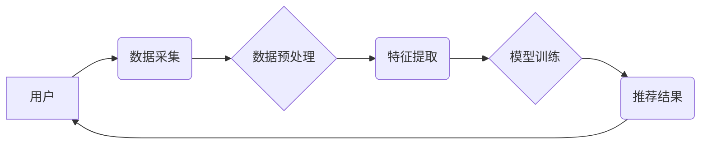

                 

## 关键词：人工智能、时尚电商、推荐系统、个性化定制、虚拟试衣间、风格识别、图像处理、自然语言处理

## 1. 背景介绍

时尚电商行业近年来发展迅速，消费者对个性化、便捷的购物体验需求不断提升。传统电商平台依靠商品分类、标签和用户评分等方式进行商品推荐，难以满足个性化需求。人工智能（AI）技术的快速发展为时尚电商带来了新的机遇，其强大的数据处理、分析和学习能力可以有效解决传统电商平台面临的挑战，提升用户体验和商业价值。

## 2. 核心概念与联系

**2.1 核心概念**

* **人工智能（AI）：** 指计算机模拟人类智能行为的能力，包括学习、推理、决策、语言理解等。
* **时尚电商：** 以服装、配饰、鞋履等时尚商品为主要销售对象的电商平台。
* **推荐系统：** 基于用户历史行为、偏好和商品特征，预测用户可能感兴趣的商品，并将其推荐给用户。

**2.2 架构图**



**2.3 联系**

AI技术在时尚电商领域的应用主要围绕推荐系统展开。通过收集用户数据、提取特征、训练模型，AI可以实现个性化商品推荐、风格识别、虚拟试衣间等功能，提升用户体验和商业价值。

## 3. 核心算法原理 & 具体操作步骤

**3.1 算法原理概述**

常用的AI推荐算法包括：

* **协同过滤：** 基于用户相似度或商品相似度进行推荐。
* **内容过滤：** 基于商品特征和用户偏好进行推荐。
* **混合推荐：** 结合协同过滤和内容过滤算法进行推荐。
* **深度学习推荐：** 利用深度神经网络学习用户和商品的复杂关系进行推荐。

**3.2 算法步骤详解**

以协同过滤算法为例，其具体步骤如下：

1. **数据收集：** 收集用户历史购买记录、浏览记录、评分等数据。
2. **数据预处理：** 处理缺失值、异常值、数据格式等问题。
3. **用户-商品矩阵构建：** 将用户和商品映射到矩阵中，每个元素表示用户对商品的评分或交互行为。
4. **相似度计算：** 计算用户之间的相似度或商品之间的相似度。
5. **推荐生成：** 根据用户相似度或商品相似度，推荐用户可能感兴趣的商品。

**3.3 算法优缺点**

* **优点：** 能够发现用户隐性偏好，推荐个性化商品。
* **缺点：** 数据稀疏性问题、冷启动问题、数据更新问题。

**3.4 算法应用领域**

协同过滤算法广泛应用于电商推荐、音乐推荐、电影推荐等领域。

## 4. 数学模型和公式 & 详细讲解 & 举例说明

**4.1 数学模型构建**

协同过滤算法的核心是计算用户之间的相似度或商品之间的相似度。常用的相似度度量方法包括余弦相似度、皮尔逊相关系数、马氏距离等。

**4.2 公式推导过程**

以余弦相似度为例，其计算公式如下：

$$
\text{相似度}(u_i, u_j) = \frac{\sum_{k=1}^{n} r_{i,k} \cdot r_{j,k}}{\sqrt{\sum_{k=1}^{n} r_{i,k}^2} \cdot \sqrt{\sum_{k=1}^{n} r_{j,k}^2}}
$$

其中：

* $u_i$ 和 $u_j$ 表示两个用户。
* $r_{i,k}$ 和 $r_{j,k}$ 表示用户 $u_i$ 和 $u_j$ 对商品 $k$ 的评分或交互行为。
* $n$ 表示商品总数。

**4.3 案例分析与讲解**

假设有两个用户 $u_1$ 和 $u_2$，他们对 3 个商品的评分如下：

| 商品 | $u_1$ | $u_2$ |
|---|---|---|
| 商品 1 | 5 | 4 |
| 商品 2 | 3 | 2 |
| 商品 3 | 4 | 5 |

则 $u_1$ 和 $u_2$ 的余弦相似度为：

$$
\text{相似度}(u_1, u_2) = \frac{(5 \cdot 4) + (3 \cdot 2) + (4 \cdot 5)}{\sqrt{(5^2 + 3^2 + 4^2)} \cdot \sqrt{(4^2 + 2^2 + 5^2)}} = 0.8
$$

该结果表明 $u_1$ 和 $u_2$ 的兴趣偏好相似度较高。

## 5. 项目实践：代码实例和详细解释说明

**5.1 开发环境搭建**

* Python 3.x
* TensorFlow 或 PyTorch
* Jupyter Notebook

**5.2 源代码详细实现**

```python
import numpy as np
from sklearn.metrics.pairwise import cosine_similarity

# 用户-商品矩阵
user_item_matrix = np.array([
    [5, 3, 4],
    [4, 2, 5],
    [3, 5, 2]
])

# 计算用户相似度
user_similarity = cosine_similarity(user_item_matrix)

# 打印用户相似度矩阵
print(user_similarity)
```

**5.3 代码解读与分析**

* 该代码首先定义了用户-商品矩阵，其中每个元素表示用户对商品的评分。
* 然后使用 `cosine_similarity` 函数计算用户之间的余弦相似度。
* 最后打印用户相似度矩阵，其中每个元素表示两个用户之间的相似度。

**5.4 运行结果展示**

运行该代码后，会输出一个用户相似度矩阵，例如：

```
[[1.         0.8       0.66666667]
 [0.8        1.         0.8660254 ]
 [0.66666667 0.8660254  1.        ]]
```

该矩阵表明用户 1 和用户 2 的相似度最高，其次是用户 1 和用户 3，最后是用户 2 和用户 3。

## 6. 实际应用场景

**6.1 个性化商品推荐**

AI可以根据用户的历史购买记录、浏览记录、评分等数据，推荐用户可能感兴趣的商品。例如，如果用户经常购买运动服饰，AI可以推荐用户新的运动服饰款式。

**6.2 风格识别**

AI可以识别用户的穿着风格，并推荐符合该风格的商品。例如，如果用户穿着简约风格的衣服，AI可以推荐用户简约风格的配饰。

**6.3 虚拟试衣间**

AI可以利用图像处理技术，实现虚拟试衣间功能，让用户在购买前就能看到自己穿着商品的效果。

**6.4 其他应用场景**

* 个性化营销
* 商品分类和标签
* 库存管理
* 欺诈检测

**6.5 未来应用展望**

随着AI技术的不断发展，其在时尚电商领域的应用将更加广泛和深入。例如，AI可以实现更精准的个性化推荐、更智能的虚拟试衣间、更个性化的服装设计等。

## 7. 工具和资源推荐

**7.1 学习资源推荐**

* **书籍:**
    * 《深度学习》
    * 《机器学习实战》
* **在线课程:**
    * Coursera
    * edX
    * Udacity

**7.2 开发工具推荐**

* **Python:**
    * TensorFlow
    * PyTorch
    * scikit-learn
* **云平台:**
    * AWS
    * Azure
    * Google Cloud

**7.3 相关论文推荐**

* **协同过滤算法:**
    * "Collaborative Filtering: A User-Based Approach"
    * "Memory-Based Collaborative Filtering"
* **深度学习推荐:**
    * "Neural Collaborative Filtering"
    * "Deep Learning for Recommender Systems"

## 8. 总结：未来发展趋势与挑战

**8.1 研究成果总结**

AI技术在时尚电商领域的应用取得了显著成果，例如个性化推荐、风格识别、虚拟试衣间等功能得到了广泛应用。

**8.2 未来发展趋势**

* **更精准的个性化推荐:** 利用更丰富的用户数据和更先进的算法，实现更精准的个性化推荐。
* **更智能的虚拟试衣间:** 利用增强现实（AR）和虚拟现实（VR）技术，打造更逼真的虚拟试衣间体验。
* **更个性化的服装设计:** 利用AI技术，实现个性化服装设计，满足用户的独特需求。

**8.3 面临的挑战**

* **数据隐私保护:** AI算法需要大量用户数据进行训练，如何保护用户数据隐私是一个重要挑战。
* **算法解释性:** 许多AI算法是黑盒模型，难以解释其推荐结果，这可能会导致用户信任问题。
* **算法公平性:** AI算法可能会存在偏见，导致推荐结果不公平，需要进行公平性评估和改进。

**8.4 研究展望**

未来，AI技术在时尚电商领域的应用将更加深入和广泛，需要进一步研究更精准、更智能、更公平的AI算法，以及解决数据隐私保护、算法解释性等挑战。

## 9. 附录：常见问题与解答

**9.1 如何提高AI推荐系统的准确性？**

* 收集更丰富、更准确的用户数据。
* 使用更先进的算法模型。
* 进行数据清洗和预处理，减少数据噪声。
* 定期评估和优化推荐系统。

**9.2 如何解决AI推荐系统的数据稀疏性问题？**

* 使用协同过滤算法的改进方法，例如矩阵分解。
* 使用内容过滤算法，结合商品特征进行推荐。
* 利用用户行为数据，例如浏览记录、搜索记录等，进行补充信息。

**9.3 如何保证AI推荐系统的公平性？**

* 在数据收集和算法设计阶段，注意避免偏见。
* 定期评估推荐系统的公平性，并进行调整。
* 采用透明的算法模型，方便用户理解推荐结果。


作者：禅与计算机程序设计艺术 / Zen and the Art of Computer Programming 
<end_of_turn>

