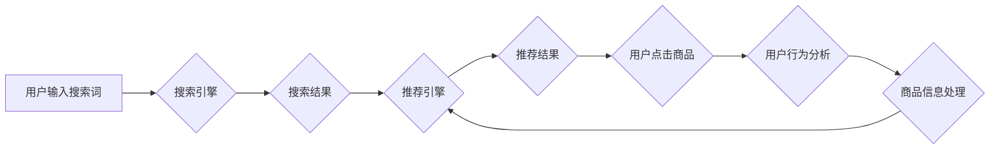

                 

## AI大模型赋能电商搜索推荐的新品发现能力提升

> 关键词：AI大模型、电商搜索、推荐系统、新品发现、用户行为分析、自然语言处理、深度学习

## 1. 背景介绍

在当今数字化时代，电商平台已成为人们获取商品信息和完成购物的主要渠道。搜索和推荐系统作为电商平台的核心功能，直接影响着用户体验和商业转化率。传统的搜索推荐系统主要依赖于商品属性、用户历史行为和商品标签等静态信息，难以捕捉用户潜在需求和挖掘新兴商品趋势。

随着人工智能技术的快速发展，特别是大规模语言模型（LLM）的涌现，为电商搜索推荐带来了新的机遇。AI大模型具备强大的语义理解、文本生成和知识推理能力，能够从海量文本数据中学习用户偏好、商品特征和市场趋势，从而提升新品发现能力。

## 2. 核心概念与联系

### 2.1  电商搜索推荐系统

电商搜索推荐系统旨在帮助用户快速找到所需商品，并推荐符合用户兴趣和需求的商品。它通常由以下几个模块组成：

* **搜索引擎:** 处理用户搜索词，并返回相关商品列表。
* **推荐引擎:** 基于用户历史行为、商品属性和市场趋势，推荐个性化商品列表。
* **商品信息处理:** 收集、清洗和分析商品信息，包括商品标题、描述、属性、价格等。
* **用户行为分析:** 收集和分析用户行为数据，例如浏览记录、购买记录、评价等。

### 2.2  AI大模型

AI大模型是指在海量数据上训练的深度学习模型，具有强大的泛化能力和学习能力。常见的AI大模型包括：

* **Transformer模型:** 擅长处理序列数据，例如文本和语音。
* **生成式对抗网络(GAN):** 能够生成逼真的图像、文本和音频。
* **图神经网络(GNN):** 擅长处理图结构数据，例如社交网络和知识图谱。

### 2.3  AI大模型赋能电商搜索推荐

AI大模型可以应用于电商搜索推荐系统的各个模块，提升其性能和效率。例如：

* **搜索引擎:** 使用BERT等Transformer模型对用户搜索词进行语义理解，提高搜索结果的准确性和相关性。
* **推荐引擎:** 使用协同过滤、内容过滤和深度学习等算法，结合用户行为数据和商品信息，推荐个性化商品列表。
* **商品信息处理:** 使用自然语言处理(NLP)技术对商品描述进行分析，提取商品特征和关键词，提高商品信息的质量和可搜索性。
* **用户行为分析:** 使用机器学习算法对用户行为数据进行分析，挖掘用户兴趣和需求，提供更精准的商品推荐。

**Mermaid 流程图**



## 3. 核心算法原理 & 具体操作步骤

### 3.1  算法原理概述

AI大模型赋能电商搜索推荐的核心算法原理是基于深度学习和自然语言处理技术，通过训练模型学习用户行为、商品特征和市场趋势，从而实现精准的商品推荐和新品发现。

常见的算法包括：

* **协同过滤:** 基于用户历史行为和商品购买记录，推荐与用户兴趣相似的商品。
* **内容过滤:** 基于商品属性和描述，推荐与用户偏好相似的商品。
* **深度学习:** 使用神经网络模型，学习用户行为、商品特征和市场趋势，实现更精准的商品推荐。

### 3.2  算法步骤详解

**协同过滤算法步骤:**

1. **数据收集:** 收集用户历史行为数据和商品购买记录。
2. **用户-商品矩阵构建:** 将用户和商品映射到矩阵中，每个元素表示用户对商品的评分或购买行为。
3. **相似用户/商品计算:** 使用余弦相似度等算法计算用户之间的相似度或商品之间的相似度。
4. **推荐商品:** 根据用户相似度或商品相似度，推荐用户可能感兴趣的商品。

**内容过滤算法步骤:**

1. **商品特征提取:** 从商品描述、属性等信息中提取特征向量。
2. **用户偏好学习:** 使用机器学习算法学习用户的商品偏好。
3. **推荐商品:** 根据用户的偏好和商品特征，推荐用户可能感兴趣的商品。

**深度学习算法步骤:**

1. **数据预处理:** 对用户行为数据和商品信息进行预处理，例如文本清洗、特征提取等。
2. **模型构建:** 使用深度学习框架构建神经网络模型，例如用户-商品交互网络、商品推荐网络等。
3. **模型训练:** 使用训练数据训练模型，优化模型参数。
4. **模型评估:** 使用测试数据评估模型性能，例如准确率、召回率等。
5. **商品推荐:** 使用训练好的模型，对用户进行商品推荐。

### 3.3  算法优缺点

**协同过滤算法:**

* **优点:** 能够发现用户隐性偏好，推荐个性化商品。
* **缺点:** 数据稀疏性问题，新用户和新商品推荐效果较差。

**内容过滤算法:**

* **优点:** 不依赖于用户历史行为数据，能够推荐新商品。
* **缺点:** 难以捕捉用户隐性偏好，推荐结果可能过于单一。

**深度学习算法:**

* **优点:** 能够学习复杂的用户行为模式和商品特征，推荐效果更精准。
* **缺点:** 需要大量数据进行训练，模型训练成本较高。

### 3.4  算法应用领域

* **电商推荐:** 推荐商品、广告、优惠券等。
* **社交媒体推荐:** 推荐好友、内容、活动等。
* **音乐推荐:** 推荐歌曲、专辑、艺术家等。
* **电影推荐:** 推荐电影、电视剧、演员等。

## 4. 数学模型和公式 & 详细讲解 & 举例说明

### 4.1  数学模型构建

协同过滤算法的数学模型通常使用矩阵分解技术，将用户-商品交互矩阵分解成两个低维矩阵，分别表示用户特征和商品特征。

假设用户集合为U，商品集合为I，用户-商品交互矩阵为R，其中R(u,i)表示用户u对商品i的评分或购买行为。

则可以将R分解成两个低维矩阵：

* **用户特征矩阵:** X，其中X(u,:)表示用户u的特征向量。
* **商品特征矩阵:** Y，其中Y(i,:)表示商品i的特征向量。

则有：

$$R(u,i) \approx X(u,:) \cdot Y(i,:)$$

### 4.2  公式推导过程

目标是找到最优的X和Y矩阵，使得R(u,i)与X(u,:) ⋅ Y(i,:)之间的误差最小。

可以使用最小二乘法或梯度下降法等优化算法来求解X和Y矩阵。

### 4.3  案例分析与讲解

例如，假设有一个用户-商品交互矩阵，其中用户集合为{u1, u2, u3}, 商品集合为{i1, i2, i3}, 矩阵R如下：

```
R = [
    [5, 3, 4],
    [4, 5, 2],
    [3, 2, 5]
]
```

可以使用矩阵分解技术将R分解成两个低维矩阵X和Y，例如：

```
X = [
    [0.8, 0.2, 0.5],
    [0.5, 0.7, 0.3],
    [0.3, 0.5, 0.8]
]

Y = [
    [0.6, 0.4, 0.2],
    [0.3, 0.6, 0.7],
    [0.2, 0.5, 0.9]
]
```

通过计算X(u,:) ⋅ Y(i,:), 可以得到用户对商品的评分预测值，例如：

```
R(u1,i1) ≈ 0.8 * 0.6 + 0.2 * 0.3 + 0.5 * 0.2 = 0.62
```

## 5. 项目实践：代码实例和详细解释说明

### 5.1  开发环境搭建

* **操作系统:** Linux/macOS/Windows
* **编程语言:** Python
* **深度学习框架:** TensorFlow/PyTorch
* **数据处理库:** Pandas/NumPy
* **工具:** Git/Jupyter Notebook

### 5.2  源代码详细实现

```python
import tensorflow as tf

# 定义用户-商品交互矩阵
R = tf.constant([
    [5, 3, 4],
    [4, 5, 2],
    [3, 2, 5]
])

# 定义用户特征矩阵和商品特征矩阵
latent_dim = 2  # 隐含维度
X = tf.Variable(tf.random.normal([3, latent_dim]))
Y = tf.Variable(tf.random.normal([3, latent_dim]))

# 计算预测评分
predictions = tf.matmul(X, Y, transpose_b=True)

# 定义损失函数
loss = tf.reduce_mean(tf.square(predictions - R))

# 定义优化器
optimizer = tf.keras.optimizers.Adam()

# 训练模型
for epoch in range(100):
    with tf.GradientTape() as tape:
        loss_value = loss
    gradients = tape.gradient(loss_value, [X, Y])
    optimizer.apply_gradients(zip(gradients, [X, Y]))

    print(f"Epoch {epoch+1}, Loss: {loss_value.numpy()}")

# 打印训练后的用户特征矩阵和商品特征矩阵
print("User Features:")
print(X.numpy())
print("Item Features:")
print(Y.numpy())
```

### 5.3  代码解读与分析

* 代码首先定义了用户-商品交互矩阵R，以及用户特征矩阵X和商品特征矩阵Y。
* 然后计算预测评分，并定义损失函数，用于衡量预测评分与实际评分之间的误差。
* 使用Adam优化器对模型参数进行更新，最小化损失函数。
* 最后打印训练后的用户特征矩阵和商品特征矩阵。

### 5.4  运行结果展示

训练完成后，可以观察到用户特征矩阵和商品特征矩阵的变化，这些变化反映了模型对用户和商品的理解。

## 6. 实际应用场景

### 6.1  新品发现

AI大模型可以分析用户行为数据和市场趋势，挖掘潜在的商品需求，并推荐新兴商品，帮助电商平台发现新品。

### 6.2  个性化推荐

AI大模型可以学习用户的兴趣偏好，提供个性化的商品推荐，提升用户体验和转化率。

### 6.3  搜索结果优化

AI大模型可以对用户搜索词进行语义理解，提高搜索结果的准确性和相关性，提升用户搜索体验。

### 6.4  未来应用展望

* **多模态推荐:** 将文本、图像、视频等多模态数据融合到推荐系统中，提供更丰富的商品信息和推荐体验。
* **实时推荐:** 基于用户实时行为数据，提供更精准的实时商品推荐。
* **跨平台推荐:** 将用户行为数据跨平台整合，提供更全面的用户画像和个性化推荐。

## 7. 工具和资源推荐

### 7.1  学习资源推荐

* **书籍:**
    * Deep Learning by Ian Goodfellow, Yoshua Bengio, and Aaron Courville
    * Natural Language Processing with Python by Steven Bird, Ewan Klein, and Edward Loper
* **在线课程:**
    * Coursera: Deep Learning Specialization
    * Udacity: Machine Learning Engineer Nanodegree
* **博客和论坛:**
    * Towards Data Science
    * Machine Learning Mastery

### 7.2  开发工具推荐

* **深度学习框架:** TensorFlow, PyTorch
* **数据处理库:** Pandas, NumPy
* **云计算平台:** AWS, Azure, Google Cloud

### 7.3  相关论文推荐

* **BERT: Pre-training of Deep Bidirectional Transformers for Language Understanding**
* **Collaborative Filtering for Recommender Systems**
* **Deep Learning for Recommender Systems**

## 8. 总结：未来发展趋势与挑战

### 8.1  研究成果总结

AI大模型赋能电商搜索推荐取得了显著成果，提升了新品发现能力、个性化推荐效果和搜索结果质量。

### 8.2  未来发展趋势

* **模型规模和能力提升:** 训练更大规模的AI大模型，提升其语义理解、知识推理和生成能力。
* **多模态融合:** 将文本、图像、视频等多模态数据融合到推荐系统中，提供更丰富的商品信息和推荐体验。
* **个性化定制:** 基于用户细粒度特征，提供更精准的个性化商品推荐。
* **解释性AI:** 提升AI模型的解释性，帮助用户理解推荐结果背后的逻辑。

### 8.3  面临的挑战

* **数据质量和隐私:** 确保推荐系统训练数据质量和用户隐私安全。
* **模型训练成本:** 训练大型AI模型需要大量的计算资源和时间成本。
* **算法公平性:** 避免推荐算法产生偏见，确保推荐结果公平公正。

### 8.4  研究展望

未来，AI大模型将继续推动电商搜索推荐的创新发展，为用户提供更智能、更个性化的购物体验。


## 9. 附录：常见问题与解答

**Q1: AI大模型训练需要多少数据？**

A1: 训练大型AI模型通常需要海量数据，例如数十亿甚至上百亿条数据。

**Q2: 如何评估AI大模型的推荐效果？**

A2: 可以使用准确率、召回率、点击率、转化率等指标来评估AI大模型的推荐效果。

**Q3: 如何解决AI大模型训练数据稀疏的问题？**

A3: 可以使用数据增强技术、迁移学习等方法来解决数据稀疏问题。


作者：禅与计算机程序设计艺术 / Zen and the Art of Computer Programming<end_of_turn>

