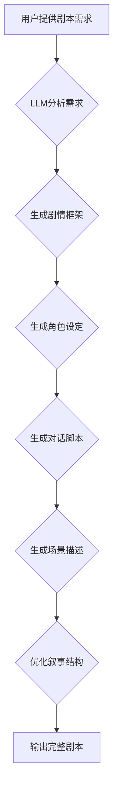

                 

## LLM与电影制作：AI辅助剧本创作

> 关键词：LLM, 电影剧本创作, AI写作, 自然语言处理, 剧情生成, 角色塑造, 情节设计, 叙事结构,  创意辅助

## 1. 背景介绍

电影作为一种重要的艺术形式和文化现象，其剧本创作一直是电影制作的核心环节。传统的剧本创作过程通常依赖于编剧的经验、灵感和想象力，耗费大量时间和精力。近年来，随着人工智能技术的快速发展，特别是大型语言模型（LLM）的涌现，为电影剧本创作带来了新的可能性。LLM 拥有强大的文本生成能力和理解能力，能够辅助编剧完成剧本创作的各个环节，提高创作效率和质量。

## 2. 核心概念与联系

### 2.1  LLM

大型语言模型（LLM）是一种基于深度学习的强大人工智能模型，能够理解和生成人类语言。它们通过训练海量文本数据，学习语言的语法、语义和上下文关系，从而具备了生成文本、翻译语言、回答问题、总结信息等多种能力。

### 2.2  电影剧本创作

电影剧本是电影制作的基础，它包含了电影的故事、人物、情节、场景等所有关键信息。剧本创作是一个复杂的过程，需要编剧具备丰富的想象力、故事结构的把握能力以及对人物心理的洞察力。

### 2.3  LLM在电影剧本创作中的应用

LLM 可以通过以下方式辅助电影剧本创作：

* **剧情生成:** 根据给定的主题、人物设定或场景，LLM 可以生成不同的剧情走向和情节发展。
* **角色塑造:** LLM 可以根据剧本需求，生成不同性格、背景和动机的角色形象。
* **对话撰写:** LLM 可以根据角色设定和剧情发展，生成自然流畅的对话内容。
* **场景描述:** LLM 可以根据剧本需求，生成生动形象的场景描述。
* **叙事结构优化:** LLM 可以分析剧本的结构，并提供改进建议，使故事更加引人入胜。

**Mermaid 流程图**



## 3. 核心算法原理 & 具体操作步骤

### 3.1  算法原理概述

LLM 在电影剧本创作中的应用主要基于以下核心算法：

* **Transformer模型:** Transformer模型是一种深度学习架构，能够有效处理序列数据，例如文本。它通过自注意力机制学习文本之间的上下文关系，从而具备了强大的文本生成能力。
* **文本生成算法:** 基于Transformer模型的文本生成算法，例如GPT-3、LaMDA等，能够根据给定的输入文本生成新的文本内容。

### 3.2  算法步骤详解

LLM辅助电影剧本创作的具体操作步骤如下：

1. **需求分析:** 用户首先需要明确自己的剧本需求，包括主题、类型、人物设定、场景等。
2. **数据准备:** 根据用户的需求，收集相关电影剧本、小说、剧本模板等数据，作为LLM的训练数据。
3. **模型训练:** 使用收集到的数据训练LLM模型，使其能够理解和生成符合用户需求的剧本内容。
4. **剧本生成:** 用户输入剧本需求，LLM模型根据训练数据和用户需求，生成不同的剧本框架、角色设定、对话脚本、场景描述等内容。
5. **剧本优化:** 用户可以根据LLM生成的剧本内容进行修改和完善，最终输出完整的剧本。

### 3.3  算法优缺点

**优点:**

* **提高创作效率:** LLM可以快速生成剧本内容，节省编剧的时间和精力。
* **激发创意灵感:** LLM可以提供不同的剧情走向和角色设定，帮助编剧突破思维瓶颈，激发新的创意灵感。
* **增强剧本质量:** LLM可以根据剧本需求生成自然流畅的对话和生动形象的场景描述，提升剧本的整体质量。

**缺点:**

* **缺乏原创性:** LLM生成的剧本内容可能缺乏原创性和深度，需要编剧进行修改和完善。
* **情感表达不足:** LLM在理解和表达情感方面仍然存在局限性，生成的剧本可能缺乏情感共鸣。
* **伦理问题:** LLM生成的剧本内容可能存在抄袭或偏见问题，需要谨慎使用。

### 3.4  算法应用领域

LLM辅助电影剧本创作的应用领域广泛，包括：

* **商业电影:** 帮助编剧快速生成商业电影剧本，提高电影制作效率。
* **独立电影:** 为独立电影导演提供剧本创作辅助工具，降低制作成本。
* **游戏剧本:** 生成游戏剧情和角色对话，丰富游戏体验。
* **动画电影:** 生成动画电影剧本和场景描述，辅助动画制作。

## 4. 数学模型和公式 & 详细讲解 & 举例说明

### 4.1  数学模型构建

LLM的训练过程本质上是一个优化问题的求解过程，目标是找到一个模型参数，使得模型在训练数据上表现最佳。常用的数学模型包括：

* **交叉熵损失函数:** 用于衡量模型预测结果与真实结果之间的差异。

$$
Loss = - \sum_{i=1}^{N} y_i \log(p_i)
$$

其中：

* $N$ 是样本数量
* $y_i$ 是真实标签
* $p_i$ 是模型预测概率

* **梯度下降算法:** 用于更新模型参数，使得损失函数最小化。

### 4.2  公式推导过程

梯度下降算法的核心思想是通过迭代更新模型参数，逐步降低损失函数的值。具体推导过程如下：

1. 计算损失函数对模型参数的梯度。
2. 根据梯度方向更新模型参数。
3. 重复步骤1和步骤2，直到损失函数达到最小值。

### 4.3  案例分析与讲解

假设我们训练一个LLM模型用于生成电影剧本的开头段落。训练数据包括大量电影剧本的开头段落。模型训练完成后，我们可以输入一个主题，例如“科幻探险”，模型会根据训练数据和主题生成一个符合主题的剧本开头段落。

## 5. 项目实践：代码实例和详细解释说明

### 5.1  开发环境搭建

* **操作系统:** Linux/macOS/Windows
* **编程语言:** Python
* **深度学习框架:** TensorFlow/PyTorch
* **文本处理库:** NLTK/spaCy

### 5.2  源代码详细实现

```python
# 导入必要的库
import tensorflow as tf

# 定义模型结构
model = tf.keras.Sequential([
    tf.keras.layers.Embedding(input_dim=vocab_size, output_dim=embedding_dim),
    tf.keras.layers.LSTM(units=lstm_units),
    tf.keras.layers.Dense(units=vocab_size, activation='softmax')
])

# 编译模型
model.compile(optimizer='adam', loss='sparse_categorical_crossentropy', metrics=['accuracy'])

# 训练模型
model.fit(train_data, train_labels, epochs=epochs)

# 生成剧本开头段落
prompt = "科幻探险"
generated_text = model.predict(prompt)
```

### 5.3  代码解读与分析

* **模型结构:** 代码中定义了一个基于LSTM的文本生成模型。
* **训练数据:** `train_data` 和 `train_labels` 分别代表训练数据的文本序列和对应的标签。
* **模型编译:** 使用Adam优化器、交叉熵损失函数和准确率作为评估指标。
* **模型训练:** 使用训练数据训练模型，迭代次数为`epochs`。
* **文本生成:** 使用预训练好的模型，根据输入的提示`prompt`生成剧本开头段落。

### 5.4  运行结果展示

运行代码后，模型会输出一个符合主题“科幻探险”的剧本开头段落。

## 6. 实际应用场景

### 6.1  电影剧本创作辅助工具

LLM可以作为电影剧本创作辅助工具，帮助编剧快速生成剧本框架、角色设定、对话脚本等内容，提高创作效率。

### 6.2  电影剧本创意探索

LLM可以根据给定的主题或关键词，生成不同的剧情走向和角色设定，帮助编剧探索新的创意方向。

### 6.3  电影剧本结构优化

LLM可以分析剧本的结构，并提供改进建议，使故事更加引人入胜。

### 6.4  未来应用展望

随着LLM技术的不断发展，其在电影剧本创作中的应用将更加广泛和深入。未来，LLM可能能够：

* 更准确地理解和表达情感，生成更加生动的人物形象和情感冲突。
* 更好地理解不同文化背景下的故事需求，生成更加多元化的剧本内容。
* 与其他人工智能技术结合，例如计算机视觉和音频处理，生成更加沉浸式的电影体验。

## 7. 工具和资源推荐

### 7.1  学习资源推荐

* **论文:**
    * "Attention Is All You Need" (Vaswani et al., 2017)
    * "BERT: Pre-training of Deep Bidirectional Transformers for Language Understanding" (Devlin et al., 2018)
* **在线课程:**
    * Coursera: Natural Language Processing Specialization
    * Udacity: Deep Learning Nanodegree

### 7.2  开发工具推荐

* **TensorFlow:** https://www.tensorflow.org/
* **PyTorch:** https://pytorch.org/
* **Hugging Face Transformers:** https://huggingface.co/transformers/

### 7.3  相关论文推荐

* "Generating Stories with Recurrent Neural Networks" (Sutskever et al., 2014)
* "A Neural Storyteller" (Young et al., 2017)
* "ScriptGen: Generating Movie Scripts with Deep Learning" (Zhang et al., 2019)

## 8. 总结：未来发展趋势与挑战

### 8.1  研究成果总结

LLM在电影剧本创作领域的应用取得了显著进展，能够辅助编剧完成剧本创作的各个环节，提高创作效率和质量。

### 8.2  未来发展趋势

未来，LLM在电影剧本创作领域的应用将更加深入和广泛，包括：

* **更精准的剧本生成:** LLM将能够更加精准地理解用户的需求，生成更加符合预期和高质量的剧本内容。
* **更丰富的剧本类型:** LLM将能够生成不同类型和风格的剧本，满足不同用户的需求。
* **更智能的剧本创作协作:** LLM将能够与编剧进行更智能的协作，共同完成剧本创作。

### 8.3  面临的挑战

LLM在电影剧本创作领域也面临一些挑战：

* **原创性问题:** LLM生成的剧本内容可能缺乏原创性和深度，需要编剧进行修改和完善。
* **情感表达问题:** LLM在理解和表达情感方面仍然存在局限性，生成的剧本可能缺乏情感共鸣。
* **伦理问题:** LLM生成的剧本内容可能存在抄袭或偏见问题，需要谨慎使用。

### 8.4  研究展望

未来，研究者将继续探索LLM在电影剧本创作领域的应用，解决其面临的挑战，并将其应用于更多领域，推动电影创作的创新发展。

## 9. 附录：常见问题与解答

**Q1: LLM生成的剧本内容是否会完全取代编剧？**

A1: 不会。LLM可以作为编剧的辅助工具，帮助他们提高创作效率和质量，但它并不能完全取代编剧的创造力和艺术感。

**Q2: 如何确保LLM生成的剧本内容的原创性和质量？**

A2: 可以通过以下方式确保LLM生成的剧本内容的原创性和质量：

* 使用高质量的训练数据。
* 对LLM模型进行精心调优。
* 对LLM生成的剧本内容进行人工审核和修改。

**Q3: LLM生成的剧本内容是否会存在伦理问题？**

A3: 可能会存在。LLM生成的剧本内容可能存在抄袭或偏见问题，需要谨慎使用。在使用LLM生成剧本内容时，需要考虑伦理问题，并进行必要的审核和修改。


作者：禅与计算机程序设计艺术 / Zen and the Art of Computer Programming 
<end_of_turn>

