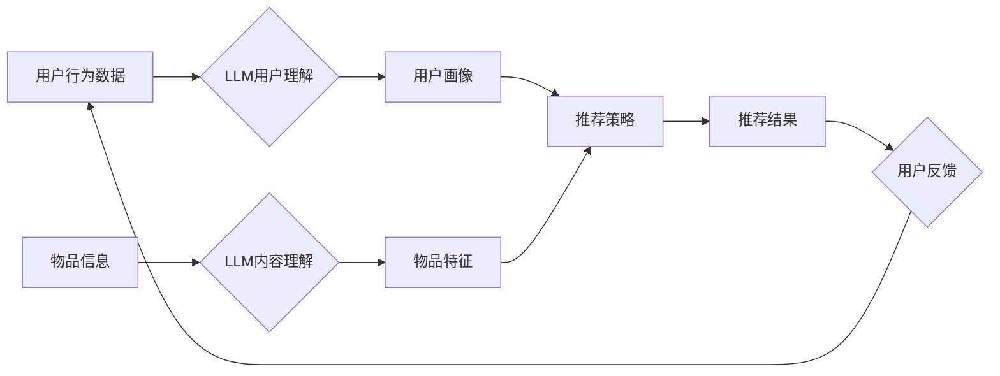

                 

## LLM在推荐系统中的应用探索

> 关键词：大型语言模型 (LLM)、推荐系统、个性化推荐、内容生成、用户理解、自然语言处理 (NLP)、Transformer

## 1. 背景介绍

推荐系统作为信息过滤和个性化内容呈现的关键技术，在电商、社交媒体、视频平台等领域发挥着越来越重要的作用。传统的推荐系统主要依赖于协同过滤、内容过滤和基于知识图谱的方法，但这些方法在处理复杂的用户行为和内容语义方面存在局限性。近年来，大型语言模型 (LLM) 的快速发展为推荐系统带来了新的机遇。LLM 拥有强大的文本理解和生成能力，能够更好地捕捉用户需求和内容特征，从而提升推荐系统的准确性和个性化程度。

## 2. 核心概念与联系

### 2.1  推荐系统概述

推荐系统旨在根据用户的历史行为、偏好和上下文信息，预测用户对特定物品的兴趣，并推荐最相关的物品。推荐系统可以分为以下几类：

* **基于内容的推荐:** 根据物品的特征和用户过去的喜好进行推荐。
* **基于协同过滤的推荐:** 根据与用户兴趣相似的其他用户的行为进行推荐。
* **基于知识图谱的推荐:** 利用知识图谱中的关系和实体进行推荐。
* **混合推荐:** 结合多种推荐方法，以提高推荐效果。

### 2.2  大型语言模型 (LLM)

LLM 是近年来深度学习领域取得的重大突破，其核心是 Transformer 架构，能够处理大量文本数据，并学习复杂的语言模式。LLM 拥有以下特点：

* **强大的文本理解能力:** 可以理解文本的语义、情感和意图。
* **优秀的文本生成能力:** 可以生成流畅、自然的文本内容。
* **泛化能力强:** 可以应用于多种自然语言处理任务，例如文本分类、问答、机器翻译等。

### 2.3  LLM 在推荐系统中的应用

LLM 可以应用于推荐系统的多个环节，例如：

* **用户理解:** 利用 LLM 对用户的历史行为、评论和偏好进行分析，构建更精准的用户画像。
* **内容理解:** 利用 LLM 对物品的描述、评论和相关信息进行分析，提取更丰富的物品特征。
* **推荐策略:** 利用 LLM 生成个性化的推荐策略，根据用户的需求和上下文信息进行推荐。
* **推荐结果解释:** 利用 LLM 对推荐结果进行解释，帮助用户理解推荐的理由。

**Mermaid 流程图**



## 3. 核心算法原理 & 具体操作步骤

### 3.1  算法原理概述

LLM 在推荐系统中的应用主要基于以下核心算法：

* **Transformer 模型:** Transformer 模型是一种强大的深度学习模型，能够处理序列数据，并学习复杂的语言模式。它可以用于用户理解、内容理解和推荐策略生成。
* **自监督学习:** 自监督学习是一种训练 LLM 的方法，通过利用文本本身的结构和语义关系进行训练，无需人工标注数据。
* **微调:** 微调是指在预训练的 LLM 模型上进行进一步训练，以适应特定的推荐任务。

### 3.2  算法步骤详解

1. **数据预处理:** 收集用户行为数据、物品信息和文本评论等数据，并进行清洗、格式化和编码。
2. **LLM 预训练:** 使用 Transformer 模型对大规模文本数据进行预训练，学习语言模型。
3. **LLM 微调:** 将预训练的 LLM 模型微调到特定的推荐任务，例如用户画像生成、物品特征提取、推荐策略生成等。
4. **推荐策略生成:** 利用微调后的 LLM 模型，根据用户的历史行为、偏好和上下文信息，生成个性化的推荐策略。
5. **推荐结果生成:** 根据推荐策略，从物品库中选择最相关的物品，并生成推荐结果。
6. **用户反馈收集:** 收集用户的点击、评分、购买等反馈信息，并将其用于模型的进一步优化。

### 3.3  算法优缺点

**优点:**

* **强大的文本理解能力:** LLM 可以更好地理解用户的需求和物品的语义特征。
* **个性化推荐:** LLM 可以根据用户的个性化偏好生成更精准的推荐结果。
* **内容生成:** LLM 可以生成个性化的推荐文案，提升用户体验。

**缺点:**

* **数据需求量大:** LLM 需要大量的文本数据进行预训练和微调。
* **计算资源消耗高:** LLM 的训练和推理过程需要大量的计算资源。
* **可解释性差:** LLM 的决策过程较为复杂，难以解释推荐结果背后的逻辑。

### 3.4  算法应用领域

LLM 在推荐系统中的应用领域广泛，例如：

* **电商推荐:** 推荐商品、优惠券、促销活动等。
* **社交媒体推荐:** 推荐好友、话题、文章等。
* **视频平台推荐:** 推荐视频、节目、主播等。
* **音乐平台推荐:** 推荐歌曲、专辑、歌手等。

## 4. 数学模型和公式 & 详细讲解 & 举例说明

### 4.1  数学模型构建

LLM 在推荐系统中的应用通常基于以下数学模型：

* **用户-物品交互矩阵:** 用来表示用户对物品的评分或行为，例如点击、购买等。
* **嵌入向量:** 将用户和物品映射到低维向量空间，以便进行相似度计算。
* **损失函数:** 用于衡量模型预测结果与真实值的差异，例如均方误差 (MSE) 或交叉熵损失 (Cross-Entropy Loss)。

### 4.2  公式推导过程

LLM 的训练过程通常使用反向传播算法，通过优化损失函数来更新模型参数。

**损失函数:**

$$
L = \sum_{u,i} (r_{ui} - \hat{r}_{ui})^2
$$

其中:

* $r_{ui}$ 是用户 $u$ 对物品 $i$ 的真实评分。
* $\hat{r}_{ui}$ 是模型预测的用户 $u$ 对物品 $i$ 的评分。

**梯度下降:**

$$
\theta = \theta - \alpha \nabla L(\theta)
$$

其中:

* $\theta$ 是模型参数。
* $\alpha$ 是学习率。
* $\nabla L(\theta)$ 是损失函数对模型参数的梯度。

### 4.3  案例分析与讲解

假设我们有一个电商平台，用户对商品的评分数据如下:

| 用户 | 商品 A | 商品 B | 商品 C |
|---|---|---|---|
| 用户 1 | 5 | 3 | 4 |
| 用户 2 | 4 | 5 | 2 |
| 用户 3 | 3 | 4 | 5 |

我们可以使用 LLM 建立一个用户-物品交互矩阵，并将其作为训练数据，训练一个推荐模型。

## 5. 项目实践：代码实例和详细解释说明

### 5.1  开发环境搭建

推荐系统开发环境通常包括以下软件:

* Python 编程语言
* TensorFlow 或 PyTorch 深度学习框架
* Jupyter Notebook 或 VS Code 代码编辑器
* Git 版本控制系统

### 5.2  源代码详细实现

以下是一个使用 TensorFlow 实现基于 Transformer 模型的推荐系统的代码示例:

```python
import tensorflow as tf

# 定义 Transformer 模型
class TransformerRecommender(tf.keras.Model):
    def __init__(self, embedding_dim, num_heads, num_layers):
        super(TransformerRecommender, self).__init__()
        self.embedding = tf.keras.layers.Embedding(input_dim=vocab_size, output_dim=embedding_dim)
        self.transformer = tf.keras.layers.Transformer(num_heads=num_heads, num_layers=num_layers)
        self.dense = tf.keras.layers.Dense(units=1)

    def call(self, user_ids, item_ids):
        user_embeddings = self.embedding(user_ids)
        item_embeddings = self.embedding(item_ids)
        combined_embeddings = self.transformer([user_embeddings, item_embeddings])
        predictions = self.dense(combined_embeddings)
        return predictions

# 训练模型
model = TransformerRecommender(embedding_dim=64, num_heads=8, num_layers=2)
model.compile(optimizer='adam', loss='mse')
model.fit(user_item_pairs, ratings, epochs=10)

# 生成推荐结果
user_id = 1
item_ids = model.predict(user_id)
top_k_items = tf.argsort(item_ids)[-5:][::-1]
```

### 5.3  代码解读与分析

* **模型定义:** 代码定义了一个名为 `TransformerRecommender` 的 Transformer 模型，包含嵌入层、Transformer 层和全连接层。
* **数据准备:** 需要准备用户-物品交互矩阵和对应的评分数据。
* **模型训练:** 使用 Adam 优化器和均方误差损失函数训练模型。
* **推荐结果生成:** 使用训练好的模型预测用户对物品的评分，并根据评分排序生成推荐结果。

### 5.4  运行结果展示

训练完成后，可以将模型应用于实际场景，并展示推荐结果。例如，可以根据用户的历史行为，生成个性化的商品推荐列表。

## 6. 实际应用场景

### 6.1  电商推荐

LLM 可以用于个性化商品推荐、优惠券推荐、促销活动推荐等。例如，亚马逊使用 LLM 分析用户的浏览历史、购买记录和评论，生成个性化的商品推荐。

### 6.2  社交媒体推荐

LLM 可以用于推荐好友、话题、文章等。例如，Facebook 使用 LLM 分析用户的兴趣爱好和社交关系，推荐潜在的朋友和相关的文章。

### 6.3  视频平台推荐

LLM 可以用于推荐视频、节目、主播等。例如，YouTube 使用 LLM 分析用户的观看历史、点赞记录和评论，推荐相关的视频和频道。

### 6.4  未来应用展望

LLM 在推荐系统领域的应用前景广阔，未来可能在以下方面取得突破:

* **更精准的个性化推荐:** LLM 可以更好地理解用户的复杂需求和偏好，生成更精准的推荐结果。
* **更丰富的推荐内容:** LLM 可以生成个性化的推荐文案和内容，提升用户体验。
* **更智能的推荐策略:** LLM 可以学习用户的行为模式，并根据上下文信息动态调整推荐策略。

## 7. 工具和资源推荐

### 7.1  学习资源推荐

* **书籍:**
    * Deep Learning by Ian Goodfellow, Yoshua Bengio, and Aaron Courville
    * Natural Language Processing with Python by Steven Bird, Ewan Klein, and Edward Loper
* **在线课程:**
    * Stanford CS224N: Natural Language Processing with Deep Learning
    * DeepLearning.AI TensorFlow Specialization

### 7.2  开发工具推荐

* **TensorFlow:** 开源深度学习框架，支持 Transformer 模型训练。
* **PyTorch:** 开源深度学习框架，也支持 Transformer 模型训练。
* **Hugging Face Transformers:** 提供预训练的 Transformer 模型和工具，方便快速应用。

### 7.3  相关论文推荐

* **Attention Is All You Need:** https://arxiv.org/abs/1706.03762
* **BERT: Pre-training of Deep Bidirectional Transformers for Language Understanding:** https://arxiv.org/abs/1810.04805
* **T5: Text-to-Text Transfer Transformer:** https://arxiv.org/abs/1910.10683

## 8. 总结：未来发展趋势与挑战

### 8.1  研究成果总结

LLM 在推荐系统领域的应用取得了显著的成果，能够提升推荐的精准度、个性化程度和内容丰富度。

### 8.2  未来发展趋势

* **更强大的 LLMs:** 未来将出现更强大的 LLMs，拥有更强的文本理解和生成能力，能够更好地服务于推荐系统。
* **多模态推荐:** 将文本、图像、视频等多模态数据融合到推荐系统中，提升推荐的准确性和多样性。
* **联邦学习:** 利用联邦学习技术，在保护用户隐私的前提下，训练更强大的推荐模型。

### 8.3  面临的挑战

* **数据隐私:** LLM 的训练需要大量用户数据，如何保护用户隐私是一个重要的挑战。
* **模型可解释性:** LLM 的决策过程较为复杂，难以解释推荐结果背后的逻辑，这可能会影响用户的信任度。
* **计算资源消耗:** LLM 的训练和推理过程需要大量的计算资源，这可能会限制其在实际应用中的推广。

### 8.4  研究展望

未来研究方向包括:

* 开发更隐私保护的 LLMs。
* 提升 LLMs 的可解释性。
* 探索更有效的训练和推理方法，降低计算资源消耗。


## 9. 附录：常见问题与解答

**Q1: LLM 在推荐系统中的应用有哪些优势？**

**A1:** LLM 在推荐系统中的应用优势在于：

* **强大的文本理解能力:** 可以更好地理解用户的需求和物品的语义特征。
* **个性化推荐:** 可以根据用户的个性化偏好生成更精准的推荐结果。
* **内容生成:** 可以生成个性化的推荐文案，提升用户体验。

**Q2: LLM 在推荐系统中的应用有哪些挑战？**

**A2:** LLM 在推荐系统中的应用面临的挑战包括：

* **数据隐私:** LLM 的训练需要大量用户数据，如何保护用户隐私是一个重要的挑战。
* **模型可解释性:** LLM 的决策过程较为复杂，难以解释推荐结果背后的逻辑，这可能会影响用户的信任度。
* **计算资源消耗:** LLM 的训练和推理过程需要大量的计算资源，这可能会限制其在实际应用中的推广。


作者：禅与计算机程序设计艺术 / Zen and the Art of Computer Programming<end_of_turn>

