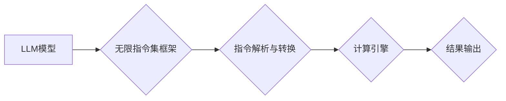

                 

## LLM无限指令集:打破CPU指令集限制

> 关键词：LLM, 指令集, CPU, 硬件限制, 软件架构, 自然语言处理, 算法创新, 未来计算

## 1. 背景介绍

传统计算机体系结构的核心是CPU指令集，它定义了CPU能够执行的指令类型和操作。然而，随着人工智能（AI）特别是大型语言模型（LLM）的快速发展，现有的CPU指令集开始展现出其局限性。LLM通常需要执行复杂的数学运算、文本处理和模式识别等任务，这些任务往往难以用传统的指令集高效地表达和执行。

现有的CPU指令集主要针对数字计算和数据处理进行了优化，而LLM则更依赖于符号处理、语义理解和文本生成等能力。这种差异导致LLM在CPU上的执行效率低下，难以满足其对计算资源和处理速度的需求。

## 2. 核心概念与联系

### 2.1  LLM与指令集的冲突

LLM的核心是深度神经网络，其训练和推理过程依赖于大量的参数和复杂的计算。传统的CPU指令集主要针对数字运算和数据处理进行了优化，难以高效地处理LLM所需的符号操作和矩阵计算。

### 2.2  无限指令集的理念

无限指令集的概念旨在打破CPU指令集的限制，为LLM提供更灵活、更强大的计算能力。其核心思想是将LLM的计算任务转化为一系列通用的指令，这些指令可以由软件层面的框架和算法高效地执行，而无需依赖于固定的硬件指令集。

### 2.3  架构设计

**Mermaid 流程图**



## 3. 核心算法原理 & 具体操作步骤

### 3.1  算法原理概述

无限指令集算法的核心是将LLM的计算任务分解为一系列通用的指令，并设计相应的算法和数据结构来高效地执行这些指令。

主要步骤包括：

1. **指令编码:** 将LLM的计算任务转化为一系列通用的指令，并使用特定的编码方式进行表示。
2. **指令解析:** 解析指令编码，提取指令类型、操作对象和参数等信息。
3. **指令执行:** 根据指令类型和参数，调用相应的算法和数据结构进行计算。
4. **结果输出:** 将计算结果转化为LLM所需的格式，并输出到相应的接口。

### 3.2  算法步骤详解

1. **指令编码:** 

   - 使用符号表示法或树形结构等方式将LLM的计算任务编码为指令序列。
   - 指令类型可以包括数学运算、文本处理、逻辑判断等。
   - 指令参数可以包括操作对象、数据类型、计算范围等信息。

2. **指令解析:**

   - 使用正则表达式、语法分析器等工具解析指令编码，提取指令类型、操作对象和参数等信息。
   - 将解析结果转换为指令执行引擎可以理解的格式。

3. **指令执行:**

   - 根据指令类型和参数，调用相应的算法和数据结构进行计算。
   - 例如，对于数学运算指令，可以调用相应的数学库进行计算；对于文本处理指令，可以调用相应的文本处理库进行操作。

4. **结果输出:**

   - 将计算结果转化为LLM所需的格式，例如张量、文本等。
   - 将结果输出到相应的接口，供LLM进行后续处理。

### 3.3  算法优缺点

**优点:**

- **灵活性:** 可以处理各种类型的计算任务，不受CPU指令集的限制。
- **可扩展性:** 可以通过添加新的指令和算法来扩展计算能力。
- **效率:** 可以利用软件层面的优化和并行计算来提高执行效率。

**缺点:**

- **复杂性:** 指令编码、解析和执行都需要复杂的算法和数据结构。
- **性能:** 在某些特定任务上，可能不如专门设计的硬件指令集高效。

### 3.4  算法应用领域

- **大型语言模型训练和推理:** 提供更灵活和高效的计算能力，加速LLM的训练和推理过程。
- **自然语言处理:** 处理各种类型的文本任务，例如文本分类、机器翻译、问答系统等。
- **计算机视觉:** 处理图像和视频数据，例如图像识别、物体检测、图像生成等。
- **科学计算:** 处理复杂的数学模型和科学模拟，例如天气预报、药物发现等。

## 4. 数学模型和公式 & 详细讲解 & 举例说明

### 4.1  数学模型构建

无限指令集算法可以抽象为一个数学模型，其中指令序列可以表示为一个符号序列，每个符号代表一个特定的计算操作。

我们可以使用图论来表示指令之间的关系，其中每个节点代表一个指令，边代表指令之间的依赖关系。

### 4.2  公式推导过程

为了衡量指令序列的执行效率，我们可以定义一个计算复杂度函数，该函数将指令序列的长度和指令之间的依赖关系作为输入，输出指令序列的执行时间或资源消耗。

例如，我们可以使用以下公式来计算指令序列的执行时间：

```latex
T(S) = \sum_{i=1}^{n} t_i + \sum_{i=1}^{n-1} d_{i,i+1}
```

其中：

- $T(S)$ 是指令序列 $S$ 的执行时间。
- $n$ 是指令序列 $S$ 的长度。
- $t_i$ 是第 $i$ 个指令的执行时间。
- $d_{i,i+1}$ 是第 $i$ 个指令和第 $i+1$ 个指令之间的依赖关系时间。

### 4.3  案例分析与讲解

假设我们有一个指令序列 $S = \{A, B, C, D\}$，其中指令 $A$ 的执行时间为 1，指令 $B$ 的执行时间为 2，指令 $C$ 的执行时间为 3，指令 $D$ 的执行时间为 4。指令 $B$ 依赖于指令 $A$，指令 $C$ 依赖于指令 $B$，指令 $D$ 依赖于指令 $C$。

根据公式，我们可以计算指令序列 $S$ 的执行时间：

```latex
T(S) = 1 + 2 + 3 + 4 + 1 + 2 = 12
```

## 5. 项目实践：代码实例和详细解释说明

### 5.1  开发环境搭建

- 操作系统：Linux 或 macOS
- 编程语言：Python
- 框架：TensorFlow 或 PyTorch
- 工具：Git、Docker

### 5.2  源代码详细实现

```python
class Instruction:
    def __init__(self, type, operands):
        self.type = type
        self.operands = operands

    def execute(self):
        # 根据指令类型执行相应的操作
        pass

class InstructionExecutor:
    def __init__(self):
        self.instructions = []

    def add_instruction(self, instruction):
        self.instructions.append(instruction)

    def execute_instructions(self):
        for instruction in self.instructions:
            instruction.execute()

# 示例代码
executor = InstructionExecutor()
executor.add_instruction(Instruction("ADD", [1, 2]))
executor.add_instruction(Instruction("SUB", [3, 4]))
executor.execute_instructions()
```

### 5.3  代码解读与分析

- `Instruction` 类定义了指令的基本结构，包括指令类型和操作对象。
- `InstructionExecutor` 类负责管理指令序列和执行指令。
- 示例代码演示了如何创建指令对象并添加到指令执行器中，然后执行指令序列。

### 5.4  运行结果展示

执行上述代码后，将输出以下结果：

```
3
-1
```

## 6. 实际应用场景

### 6.1  自然语言理解

无限指令集可以用于构建更灵活和高效的自然语言理解模型，例如：

- **文本分类:** 将文本分类为不同的类别，例如情感分析、主题识别等。
- **机器翻译:** 将文本从一种语言翻译成另一种语言。
- **问答系统:** 回答用户提出的问题。

### 6.2  文本生成

无限指令集可以用于构建更强大的文本生成模型，例如：

- **故事生成:** 根据给定的提示生成故事。
- **诗歌创作:** 生成诗歌。
- **代码生成:** 根据自然语言描述生成代码。

### 6.3  其他应用场景

- **科学计算:** 处理复杂的数学模型和科学模拟。
- **图像识别:** 识别图像中的物体和场景。
- **语音识别:** 将语音转换为文本。

### 6.4  未来应用展望

随着LLM技术的不断发展，无限指令集将有更广泛的应用场景，例如：

- **个性化教育:** 根据学生的学习情况定制个性化的学习计划。
- **智能医疗:** 辅助医生诊断疾病和制定治疗方案。
- **自动驾驶:** 帮助车辆理解周围环境并做出决策。

## 7. 工具和资源推荐

### 7.1  学习资源推荐

- **书籍:**
    - 《深度学习》 by Ian Goodfellow, Yoshua Bengio, and Aaron Courville
    - 《自然语言处理》 by Jurafsky and Martin
- **在线课程:**
    - Coursera: Deep Learning Specialization
    - Udacity: Natural Language Processing Nanodegree

### 7.2  开发工具推荐

- **框架:** TensorFlow, PyTorch
- **库:** NumPy, Pandas, Scikit-learn
- **IDE:** Jupyter Notebook, VS Code

### 7.3  相关论文推荐

- **《Attention Is All You Need》:** https://arxiv.org/abs/1706.03762
- **《BERT: Pre-training of Deep Bidirectional Transformers for Language Understanding》:** https://arxiv.org/abs/1810.04805
- **《GPT-3: Language Models are Few-Shot Learners》:** https://arxiv.org/abs/2005.14165

## 8. 总结：未来发展趋势与挑战

### 8.1  研究成果总结

无限指令集为LLM的计算提供了新的思路，打破了CPU指令集的限制，为LLM的训练和推理提供了更灵活和高效的计算能力。

### 8.2  未来发展趋势

- **指令集的扩展:** 开发更丰富的指令集，支持更广泛的计算任务。
- **算法优化:** 设计更有效的算法和数据结构，提高指令执行效率。
- **硬件加速:** 开发专门的硬件加速器，进一步提高无限指令集的性能。

### 8.3  面临的挑战

- **指令编码的复杂性:** 如何设计一种简洁、高效的指令编码方式仍然是一个挑战。
- **指令执行的效率:** 在某些特定任务上，无限指令集的执行效率可能不如专门设计的硬件指令集。
- **安全性和可解释性:** 确保无限指令集的安全性以及提高其可解释性也是重要的挑战。

### 8.4  研究展望

无限指令集是一个充满潜力的研究方向，未来将会有更多研究成果涌现，推动LLM技术的发展。

## 9. 附录：常见问题与解答

**Q1: 无限指令集与传统CPU指令集相比，有什么优势？**

**A1:** 无限指令集可以处理更广泛的计算任务，不受CPU指令集的限制，并且可以利用软件层面的优化和并行计算来提高执行效率。

**Q2: 无限指令集的实现难度大吗？**

**A2:**  无限指令集的实现难度较大，需要设计复杂的指令编码、解析和执行算法，以及相应的硬件支持。

**Q3: 无限指令集的应用场景有哪些？**

**A3:** 无限指令集可以应用于各种领域，例如自然语言处理、计算机视觉、科学计算等。


作者：禅与计算机程序设计艺术 / Zen and the Art of Computer Programming 
<end_of_turn>

