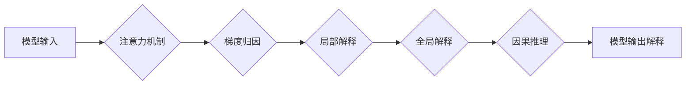

                 

## LLM的可解释性研究新进展

> 关键词：大型语言模型 (LLM)、可解释性、模型解释、注意力机制、梯度归因、局部解释、全局解释、因果推理、伦理问题

## 1. 背景介绍

大型语言模型 (LLM) 近年来取得了令人瞩目的成就，在自然语言处理 (NLP) 领域展现出强大的能力，例如文本生成、翻译、问答和代码生成。然而，LLM 的复杂性和黑盒性质也引发了人们对可解释性的担忧。

可解释性是指能够理解模型的决策过程和预测结果的程度。对于 LLM 而言，可解释性至关重要，因为它可以帮助我们：

* **提高信任度:**  理解模型的决策机制可以增强人们对模型的信任，从而更愿意接受其预测结果。
* **发现偏差:**  可解释性方法可以帮助我们识别模型中的潜在偏差，并采取措施加以纠正。
* **改进模型性能:**  通过分析模型的错误预测，我们可以更好地理解模型的局限性，并针对性地进行改进。
* **促进伦理合规:**  在某些领域，例如医疗保健和金融，模型的可解释性对于确保伦理合规至关重要。

## 2. 核心概念与联系

LLM 的可解释性研究主要围绕着以下核心概念展开：

* **模型解释:**  解释模型的内部结构和工作机制，例如神经网络的权重和激活函数。
* **注意力机制:**  分析模型在处理输入时关注哪些部分，从而理解其决策过程。
* **梯度归因:**  通过计算梯度来量化每个输入特征对模型输出的影响，从而识别重要特征。
* **局部解释:**  解释单个预测结果背后的决策过程，例如解释模型为什么预测某个文本属于特定类别。
* **全局解释:**  解释模型在整个数据集上的行为模式，例如识别模型的偏见或错误预测趋势。
* **因果推理:**  理解模型预测结果背后的因果关系，例如确定哪些因素导致了某个预测结果。

这些概念相互关联，共同构成了 LLM 可解释性研究的框架。

**Mermaid 流程图:**



## 3. 核心算法原理 & 具体操作步骤

### 3.1  算法原理概述

LLM 可解释性研究中常用的算法包括：

* **注意力机制解释:**  分析模型在处理输入时关注哪些部分，例如使用可视化技术展示注意力权重分布。
* **梯度归因方法:**  例如 SHAP (SHapley Additive exPlanations) 和 LIME (Local Interpretable Model-agnostic Explanations)，通过计算梯度来量化每个输入特征对模型输出的影响。
* **局部解释方法:**  例如 LIME 和 Counterfactual Explanations，解释单个预测结果背后的决策过程。
* **全局解释方法:**  例如 Feature Importance 和 Partial Dependence Plots，解释模型在整个数据集上的行为模式。

### 3.2  算法步骤详解

以 SHAP 方法为例，其具体操作步骤如下：

1. **构建基线模型:**  选择一个简单易解释的模型，例如决策树，作为基线模型。
2. **计算特征贡献值:**  对于每个输入样本，计算每个特征对模型输出的贡献值。
3. **生成 SHAP 值:**  将特征贡献值与基线模型的输出进行比较，生成每个特征的 SHAP 值。
4. **可视化 SHAP 值:**  使用热力图或其他可视化技术展示 SHAP 值，从而解释模型的决策过程。

### 3.3  算法优缺点

不同的算法具有不同的优缺点，需要根据具体应用场景选择合适的算法。

* **注意力机制解释:**  优点是直观易懂，缺点是无法量化特征重要性。
* **梯度归因方法:**  优点是能够量化特征重要性，缺点是计算复杂度较高。
* **局部解释方法:**  优点是能够解释单个预测结果，缺点是无法解释模型的全局行为模式。
* **全局解释方法:**  优点是能够解释模型的全局行为模式，缺点是无法解释单个预测结果。

### 3.4  算法应用领域

LLM 可解释性算法已在多个领域得到应用，例如：

* **医疗保健:**  解释医疗诊断模型的决策过程，提高信任度和安全性。
* **金融:**  解释信用评分模型的决策过程，识别潜在的偏见。
* **法律:**  解释法律判决模型的决策过程，提高透明度和公正性。

## 4. 数学模型和公式 & 详细讲解 & 举例说明

### 4.1  数学模型构建

LLM 的可解释性研究中常用的数学模型包括：

* **线性模型:**  用于解释模型的线性关系，例如线性回归模型。
* **决策树:**  用于解释模型的决策规则，例如 CART 决策树。
* **神经网络:**  用于解释模型的非线性关系，例如深度神经网络。

### 4.2  公式推导过程

以 SHAP 方法为例，其核心公式为：

$$
\phi_i(x) = \mathbb{E}_{x_{-i}}[f(x_i, x_{-i})] - f(x)
$$

其中：

* $\phi_i(x)$ 是特征 $x_i$ 的 SHAP 值。
* $f(x)$ 是模型的预测输出。
* $x_i$ 是特征 $x_i$ 的值。
* $x_{-i}$ 是除了特征 $x_i$ 之外的所有特征的值。

### 4.3  案例分析与讲解

假设我们有一个 LLM 用于预测文本的 sentiment (情感倾向)，例如正面、负面或中性。使用 SHAP 方法可以解释模型预测某个文本为负面的原因。

通过计算每个单词的 SHAP 值，我们可以识别哪些单词对模型预测负面情感有更大的影响。例如，如果单词 "terrible" 的 SHAP 值很高，则表明它对模型预测负面情感起到了重要作用。

## 5. 项目实践：代码实例和详细解释说明

### 5.1  开发环境搭建

可使用 Python 语言和相关的库进行 LLM 可解释性研究。

* **Python:**  通用编程语言，广泛用于数据科学和机器学习。
* **TensorFlow/PyTorch:**  深度学习框架，用于训练和部署 LLM 模型。
* **SHAP/LIME:**  可解释性库，用于计算特征贡献值和生成解释结果。

### 5.2  源代码详细实现

以下是一个使用 SHAP 库解释 LLM 预测结果的 Python 代码示例：

```python
import shap
import tensorflow as tf

# 加载预训练的 LLM 模型
model = tf.keras.models.load_model('my_llm_model.h5')

# 准备输入数据
X = ['This movie is amazing!', 'This movie is terrible.']

# 计算 SHAP 值
explainer = shap.TreeExplainer(model)
shap_values = explainer.shap_values(X)

# 可视化 SHAP 值
shap.summary_plot(shap_values, X)
```

### 5.3  代码解读与分析

* **加载预训练模型:**  使用 TensorFlow 的 `load_model` 函数加载预训练的 LLM 模型。
* **准备输入数据:**  准备要解释的文本数据。
* **创建 SHAP 解释器:**  使用 `shap.TreeExplainer` 创建一个 SHAP 解释器，用于解释模型的决策过程。
* **计算 SHAP 值:**  使用 `explainer.shap_values` 函数计算每个文本的 SHAP 值。
* **可视化 SHAP 值:**  使用 `shap.summary_plot` 函数可视化 SHAP 值，展示每个特征对模型预测的影响。

### 5.4  运行结果展示

运行上述代码后，会生成一个可视化图表，展示每个单词的 SHAP 值。

## 6. 实际应用场景

LLM 可解释性技术已在多个实际应用场景中得到应用，例如：

* **医疗诊断:**  解释医疗诊断模型的决策过程，帮助医生更好地理解模型的预测结果。
* **金融风险评估:**  解释信用评分模型的决策过程，识别潜在的偏见和风险因素。
* **法律判决:**  解释法律判决模型的决策过程，提高透明度和公正性。

### 6.4  未来应用展望

随着 LLM 技术的不断发展，可解释性技术将发挥越来越重要的作用。未来，LLM 可解释性技术可能应用于：

* **自动驾驶:**  解释自动驾驶模型的决策过程，提高安全性。
* **个性化教育:**  解释个性化学习模型的决策过程，帮助学生更好地理解学习内容。
* **科学发现:**  解释科学研究模型的决策过程，促进科学发现。

## 7. 工具和资源推荐

### 7.1  学习资源推荐

* **论文:**  
    * "SHAP: A Unified Approach to Interpreting Model Predictions"
    * "LIME: Local Interpretable Model-agnostic Explanations"
* **书籍:**  
    * "Interpretable Machine Learning" by Christoph Molnar
* **在线课程:**  
    * Coursera: "Machine Learning" by Andrew Ng
    * edX: "Artificial Intelligence" by Columbia University

### 7.2  开发工具推荐

* **TensorFlow:**  https://www.tensorflow.org/
* **PyTorch:**  https://pytorch.org/
* **SHAP:**  https://github.com/slundberg/shap
* **LIME:**  https://github.com/marcotcr/lime

### 7.3  相关论文推荐

* **"Towards a Rigorous Science of Interpretable Machine Learning"**
* **"Explainable AI: Interpreting, Explaining and Visualizing Deep Learning"**
* **"Interpretability Beyond Feature Attribution: Quantitative Testing with Concept Activation Vectors (TCAV)"**

## 8. 总结：未来发展趋势与挑战

### 8.1  研究成果总结

LLM 可解释性研究取得了显著进展，开发出多种有效的解释方法，并应用于多个实际领域。

### 8.2  未来发展趋势

* **更强大的解释方法:**  开发更强大的解释方法，能够解释更复杂的 LLM 模型。
* **跨模态解释:**  研究跨模态解释方法，例如解释图像和文本联合处理的 LLM 模型。
* **因果推理:**  加强因果推理研究，能够解释模型预测结果背后的因果关系。

### 8.3  面临的挑战

* **可解释性与准确性之间的权衡:**  提高可解释性可能需要牺牲一定的模型准确性。
* **解释结果的可理解性:**  解释结果需要以易于理解的方式呈现，以便非技术人员也能理解。
* **伦理问题:**  LLM 可解释性技术可能引发伦理问题，例如模型解释结果的误用。

### 8.4  研究展望

LLM 可解释性研究是一个充满挑战和机遇的领域，未来将继续取得突破性进展，推动 LLM 技术的健康发展。

## 9. 附录：常见问题与解答

* **什么是 LLM 可解释性？**

LLM 可解释性是指能够理解 LLM 的决策过程和预测结果的程度。

* **为什么 LLM 可解释性很重要？**

LLM 可解释性可以提高模型的信任度、识别模型中的潜在偏差、改进模型性能和促进伦理合规。

* **有哪些常用的 LLM 可解释性方法？**

常用的 LLM 可解释性方法包括注意力机制解释、梯度归因方法、局部解释方法和全局解释方法。

* **如何选择合适的 LLM 可解释性方法？**

选择合适的 LLM 可解释性方法需要根据具体的应用场景和模型类型进行选择。

* **LLM 可解释性技术有哪些伦理问题？**

LLM 可解释性技术可能引发伦理问题，例如模型解释结果的误用和偏见放大。


作者：禅与计算机程序设计艺术 / Zen and the Art of Computer Programming 
<end_of_turn>

