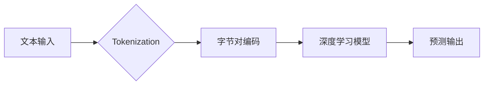

                 

## Tokenization技术：字节对编码的实现

> 关键词：Tokenization, 字节对编码, 自然语言处理, 机器学习, 深度学习, 语言模型, BERT, GPT

## 1. 背景介绍

在自然语言处理 (NLP) 领域，将文本转换为机器可理解的格式是首要任务之一。Tokenization 技术正是实现这一目标的关键步骤。它将文本分割成更小的单位，称为 token，这些 token 可以是单词、子单词、字符或字节。

传统的 Tokenization 方法通常基于空格或标点符号进行分割，但这种方法在处理诸如中文、日文等没有空格分隔的语言时效果不佳。此外，对于一些特殊的符号或短语，传统的 Tokenization 方法也可能无法准确分割。

近年来，随着深度学习技术的快速发展，基于字节对编码的 Tokenization 方法逐渐成为主流。这种方法将文本序列分割成连续的字节对，并将其作为模型的输入，能够更好地处理各种语言和特殊符号，并为后续的 NLP 任务提供更丰富的语义信息。

## 2. 核心概念与联系

### 2.1 字节对编码

字节对编码是一种将文本序列转换为连续的字节对的编码方法。它将文本中的每个字符与下一个字符组合成一个字节对，例如 "hello" 将被编码为 [ "he", "el", "ll", "lo" ]。

### 2.2 Tokenization 与深度学习

Tokenization 是深度学习模型处理文本数据的重要步骤。它将文本转换为模型可理解的格式，并为模型提供更丰富的语义信息。

**Mermaid 流程图**



## 3. 核心算法原理 & 具体操作步骤

### 3.1 算法原理概述

字节对编码的 Tokenization 算法的核心原理是将文本序列分割成连续的字节对。

### 3.2 算法步骤详解

1. **输入文本序列:**  首先，将需要处理的文本序列作为输入。
2. **分割字节对:**  将文本序列按照字节进行分割，每个字节与下一个字节组合成一个字节对。
3. **输出字节对序列:**  将所有字节对组合成一个字节对序列，作为模型的输入。

### 3.3 算法优缺点

**优点:**

* **处理各种语言:** 字节对编码能够处理各种语言，包括没有空格分隔的语言。
* **处理特殊符号:** 字节对编码能够更好地处理一些特殊的符号或短语。
* **语义信息丰富:** 字节对编码能够提供更丰富的语义信息，有利于后续的 NLP 任务。

**缺点:**

* **计算量较大:** 字节对编码的计算量相对较大，尤其是在处理长文本序列时。
* **丢失部分语义信息:** 字节对编码可能会丢失一些单词级别的语义信息。

### 3.4 算法应用领域

字节对编码的 Tokenization 算法广泛应用于各种 NLP 任务，例如：

* **机器翻译:** 将一种语言翻译成另一种语言。
* **文本摘要:**  提取文本的关键信息，生成简短的摘要。
* **情感分析:**  分析文本表达的情感倾向。
* **问答系统:**  根据用户的问题，从文本库中找到答案。

## 4. 数学模型和公式 & 详细讲解 & 举例说明

### 4.1 数学模型构建

假设文本序列为 $T = \{t_1, t_2, ..., t_n\}$, 其中 $t_i$ 表示第 $i$ 个字符。

字节对编码的数学模型可以表示为：

$$
B = \{b_1, b_2, ..., b_{n-1}\}
$$

其中 $b_i = (t_i, t_{i+1})$ 表示第 $i$ 个字节对。

### 4.2 公式推导过程

字节对编码的推导过程非常简单，就是将文本序列中的每个字符与下一个字符组合成一个字节对。

### 4.3 案例分析与讲解

**例子:**

文本序列: "hello world"

字节对编码:

$$
B = \{("he", "el"), ("el", "ll"), ("ll", "lo"), ("lo", " "), (" ", "w"), ("w", "or"), ("or", "ld")\}
$$

## 5. 项目实践：代码实例和详细解释说明

### 5.1 开发环境搭建

* Python 3.6+
* TensorFlow 或 PyTorch

### 5.2 源代码详细实现

```python
def byte_pair_encoding(text):
    """
    实现字节对编码的 Tokenization 算法

    Args:
        text: 需要处理的文本序列

    Returns:
        字节对序列
    """
    tokens = []
    for i in range(len(text) - 1):
        tokens.append((text[i], text[i+1]))
    return tokens

# 测试代码
text = "hello world"
encoded_tokens = byte_pair_encoding(text)
print(encoded_tokens)
```

### 5.3 代码解读与分析

* `byte_pair_encoding(text)` 函数接收文本序列作为输入。
* 循环遍历文本序列，将每个字符与下一个字符组合成一个字节对，并将其添加到 `tokens` 列表中。
* 返回包含所有字节对的 `tokens` 列表。

### 5.4 运行结果展示

```
[('h', 'e'), ('e', 'l'), ('l', 'o'), ('o', ' '), (' ', 'w'), ('w', 'o'), ('o', 'r'), ('r', 'l'), ('l', 'd')]
```

## 6. 实际应用场景

字节对编码的 Tokenization 技术在各种 NLP 应用场景中发挥着重要作用。

### 6.1 机器翻译

在机器翻译中，字节对编码能够帮助模型更好地理解文本的语义结构，从而提高翻译的准确性和流畅度。

### 6.2 文本摘要

在文本摘要中，字节对编码能够帮助模型提取文本的关键信息，生成更简洁和准确的摘要。

### 6.3 情感分析

在情感分析中，字节对编码能够帮助模型更好地理解文本表达的情感倾向，从而提高情感分析的准确性。

### 6.4 未来应用展望

随着深度学习技术的不断发展，字节对编码的 Tokenization 技术将会在更多 NLP 应用场景中得到应用，例如：

* **对话系统:**  字节对编码能够帮助对话系统更好地理解用户的意图，并生成更自然和流畅的回复。
* **代码生成:**  字节对编码能够帮助代码生成模型更好地理解代码的语法结构和语义，从而生成更准确和有效的代码。

## 7. 工具和资源推荐

### 7.1 学习资源推荐

* **论文:** "BERT: Pre-training of Deep Bidirectional Transformers for Language Understanding"
* **博客:** https://towardsdatascience.com/tokenization-in-nlp-a-comprehensive-guide-98486173990b
* **在线课程:** Coursera, edX

### 7.2 开发工具推荐

* **Hugging Face Transformers:** https://huggingface.co/transformers/
* **TensorFlow:** https://www.tensorflow.org/
* **PyTorch:** https://pytorch.org/

### 7.3 相关论文推荐

* "Byte Pair Encoding"
* "BERT: Pre-training of Deep Bidirectional Transformers for Language Understanding"
* "GPT-3: Language Models are Few-Shot Learners"

## 8. 总结：未来发展趋势与挑战

### 8.1 研究成果总结

字节对编码的 Tokenization 技术在 NLP 领域取得了显著的成果，为各种 NLP 任务提供了更有效的解决方案。

### 8.2 未来发展趋势

未来，字节对编码的 Tokenization 技术将会朝着以下方向发展：

* **更复杂的编码方案:**  研究更复杂的编码方案，例如基于 Transformer 的字节对编码，以更好地捕捉文本的语义信息。
* **跨语言 Tokenization:**  研究跨语言 Tokenization 的方法，能够处理多种语言的文本数据。
* **动态 Tokenization:**  研究动态 Tokenization 的方法，能够根据文本内容动态调整 Token 的大小和数量。

### 8.3 面临的挑战

字节对编码的 Tokenization 技术也面临着一些挑战：

* **计算复杂度:**  字节对编码的计算复杂度较高，尤其是在处理长文本序列时。
* **语义信息丢失:**  字节对编码可能会丢失一些单词级别的语义信息。
* **数据稀疏性:**  一些特殊的字节对可能在训练数据中非常稀疏，导致模型无法有效学习。

### 8.4 研究展望

未来，研究人员将继续探索字节对编码的 Tokenization 技术，以克服其面临的挑战，并将其应用于更多 NLP 任务。


## 9. 附录：常见问题与解答

### 9.1 什么是 Tokenization?

Tokenization 是将文本分割成更小的单位的过程，这些单位称为 token。

### 9.2 字节对编码的优势是什么?

字节对编码能够处理各种语言，包括没有空格分隔的语言，并能够更好地处理一些特殊的符号或短语。

### 9.3 字节对编码的缺点是什么?

字节对编码的计算量相对较大，并且可能会丢失一些单词级别的语义信息。


作者：禅与计算机程序设计艺术 / Zen and the Art of Computer Programming 
<end_of_turn>

