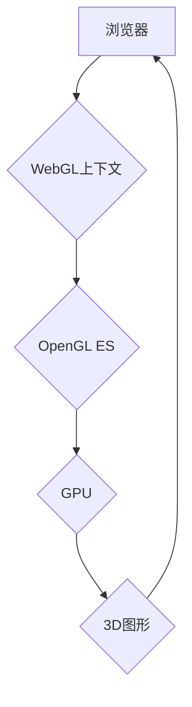

                 

## WebGL：浏览器中的3D图形渲染

> 关键词：WebGL, 3D图形渲染, 浏览器, GPU, shaders, OpenGL ES, web开发

## 1. 背景介绍

随着互联网技术的不断发展，网页不再仅仅局限于静态文本和图片，而是逐渐向更具交互性和沉浸感的体验方向演进。3D图形渲染技术作为一种重要的视觉表现手段，为网页带来了全新的可能性。然而，传统的3D图形渲染引擎通常依赖于独立的应用程序，难以直接嵌入到网页环境中。

WebGL（Web Graphics Library）应运而生，它是一种基于浏览器的3D图形渲染API，允许开发者直接利用浏览器的GPU（图形处理器）进行3D图形渲染，从而将3D图形渲染能力带入网页。WebGL的出现，为网页开发带来了革命性的变化，使得网页可以呈现更加丰富的视觉效果，并支持更复杂的交互体验。

## 2. 核心概念与联系

WebGL的核心概念是将OpenGL ES（OpenGL Embedded Systems）的3D图形渲染功能移植到浏览器环境中。OpenGL ES是一种跨平台的图形渲染API，广泛应用于移动设备和嵌入式系统。WebGL通过JavaScript接口，允许开发者调用OpenGL ES的函数，并控制GPU进行3D图形渲染。

**WebGL架构图**



**核心概念关系：**

* **浏览器:** WebGL运行在浏览器的环境中，提供JavaScript接口和渲染上下文。
* **WebGL上下文:** WebGL上下文是WebGL程序运行的入口，开发者通过上下文对象调用WebGL API进行图形渲染操作。
* **OpenGL ES:** WebGL基于OpenGL ES的渲染机制，开发者可以使用OpenGL ES的函数和语法进行3D图形渲染。
* **GPU:** WebGL程序最终运行在GPU上，GPU负责执行图形渲染指令并生成最终的图像。
* **3D图形:** WebGL允许开发者创建和渲染各种3D图形，包括模型、纹理、灯光和材质等。

## 3. 核心算法原理 & 具体操作步骤

### 3.1  算法原理概述

WebGL的3D图形渲染过程主要基于以下核心算法：

* **顶点着色器:** 对每个顶点进行处理，计算顶点的最终位置、颜色和其他属性。
* **片元着色器:** 对每个像素进行处理，计算像素的颜色和深度。
* **投影变换:** 将3D场景投影到2D屏幕上。
* **裁剪:** 剔除屏幕外不在可见区域的图形。
* **光栅化:** 将三角形等图形转换为像素。

### 3.2  算法步骤详解

1. **顶点数据准备:** 开发者首先需要准备3D模型的顶点数据，包括顶点坐标、法线、纹理坐标等。
2. **顶点着色器:** 将顶点数据传递给顶点着色器，顶点着色器根据模型的变换矩阵和灯光信息计算顶点的最终位置、颜色和其他属性。
3. **片元着色器:** 将顶点着色器处理后的数据传递给片元着色器，片元着色器根据顶点数据计算每个像素的颜色和深度。
4. **投影变换:** 将3D场景投影到2D屏幕上，并根据视口大小进行缩放和裁剪。
5. **裁剪:** 剔除屏幕外不在可见区域的图形。
6. **光栅化:** 将三角形等图形转换为像素，并根据片元着色器计算的像素颜色进行渲染。

### 3.3  算法优缺点

**优点:**

* **跨平台:** WebGL基于标准API，可以在各种浏览器和平台上运行。
* **高性能:** WebGL利用GPU进行图形渲染，性能优于基于CPU的渲染方式。
* **开源免费:** WebGL是开源的，开发者可以免费使用。

**缺点:**

* **学习曲线:** WebGL的学习曲线相对陡峭，需要一定的编程基础和图形渲染知识。
* **浏览器兼容性:** 不同浏览器对WebGL的支持程度可能有所差异。
* **安全性:** WebGL程序需要谨慎编写，避免安全漏洞。

### 3.4  算法应用领域

WebGL的应用领域非常广泛，包括：

* **游戏开发:** WebGL可以用于开发网页游戏，提供流畅的3D游戏体验。
* **3D建模和动画:** WebGL可以用于3D建模和动画制作，并在线展示作品。
* **虚拟现实和增强现实:** WebGL可以用于开发VR和AR应用，提供沉浸式的交互体验。
* **科学可视化:** WebGL可以用于可视化科学数据，例如分子结构、天气预报等。
* **教育和培训:** WebGL可以用于创建交互式的教学内容，例如3D模型、虚拟实验室等。

## 4. 数学模型和公式 & 详细讲解 & 举例说明

### 4.1  数学模型构建

WebGL的3D图形渲染基于一系列数学模型，包括：

* **坐标系:** WebGL使用右手笛卡尔坐标系，其中x轴指向屏幕右侧，y轴指向屏幕底部，z轴指向屏幕前方。
* **矩阵变换:** WebGL使用矩阵变换来实现物体的位置、旋转和缩放。
* **投影变换:** WebGL使用投影矩阵将3D场景投影到2D屏幕上。
* **光照模型:** WebGL使用光照模型计算物体在不同光照条件下的颜色。

### 4.2  公式推导过程

**矩阵变换:**

* **平移:**

$$
T(tx, ty, tz) = \begin{bmatrix}
1 & 0 & 0 & tx \\
0 & 1 & 0 & ty \\
0 & 0 & 1 & tz \\
0 & 0 & 0 & 1
\end{bmatrix}
$$

* **旋转:**

$$
R(ax, ay, az) = \begin{bmatrix}
cos(ax) & -sin(ax) & 0 & 0 \\
sin(ax) & cos(ax) & 0 & 0 \\
0 & 0 & cos(ay) & -sin(ay) \\
0 & 0 & sin(ay) & cos(ay)
\end{bmatrix}
\begin{bmatrix}
cos(az) & -sin(az) & 0 & 0 \\
sin(az) & cos(az) & 0 & 0 \\
0 & 0 & 1 & 0 \\
0 & 0 & 0 & 1
\end{bmatrix}
$$

* **缩放:**

$$
S(sx, sy, sz) = \begin{bmatrix}
sx & 0 & 0 & 0 \\
0 & sy & 0 & 0 \\
0 & 0 & sz & 0 \\
0 & 0 & 0 & 1
\end{bmatrix}
$$

**投影变换:**

$$
P = \begin{bmatrix}
2/w & 0 & 0 & 0 \\
0 & 2/h & 0 & 0 \\
0 & 0 & -2/d & 0 \\
0 & 0 & 0 & 1
\end{bmatrix}
$$

其中：

* w: 屏幕宽度
* h: 屏幕高度
* d: 视景深度

### 4.3  案例分析与讲解

**示例：**

假设有一个立方体，其顶点坐标为：

```
(1, 1, 1), (1, -1, 1), (-1, -1, 1), (-1, 1, 1),
(1, 1, -1), (1, -1, -1), (-1, -1, -1), (-1, 1, -1)
```

我们可以使用矩阵变换将立方体平移、旋转和缩放，并使用投影变换将其投影到屏幕上。

**代码示例:**

```javascript
// 平移矩阵
var translateMatrix = mat4.create();
mat4.translate(translateMatrix, translateMatrix, [2, 1, 0]);

// 旋转矩阵
var rotateMatrix = mat4.create();
mat4.rotate(rotateMatrix, rotateMatrix, Math.PI / 4, [0, 1, 0]);

// 缩放矩阵
var scaleMatrix = mat4.create();
mat4.scale(scaleMatrix, scaleMatrix, [0.5, 0.5, 0.5]);

// 合并变换矩阵
var transformMatrix = mat4.create();
mat4.multiply(transformMatrix, translateMatrix, rotateMatrix);
mat4.multiply(transformMatrix, transformMatrix, scaleMatrix);

// 投影矩阵
var projectionMatrix = mat4.create();
mat4.perspective(projectionMatrix, Math.PI / 4, 1, 0.1, 100);

// 将顶点数据传递给着色器
gl.vertexAttribPointer(a_Position, 3, gl.FLOAT, false, 0, vertices);
```

## 5. 项目实践：代码实例和详细解释说明

### 5.1  开发环境搭建

为了使用WebGL进行开发，需要搭建一个开发环境。

* **浏览器:** 支持WebGL的浏览器，例如Chrome、Firefox、Safari等。
* **代码编辑器:** 用于编写WebGL代码的代码编辑器，例如VS Code、Atom等。
* **WebGL库:** 可以使用一些WebGL库来简化开发过程，例如Three.js、Babylon.js等。

### 5.2  源代码详细实现

以下是一个简单的WebGL代码示例，用于渲染一个三角形：

```html
<!DOCTYPE html>
<html>
<head>
  <title>WebGL三角形</title>
</head>
<body>
  <canvas id="myCanvas"></canvas>
  <script>
    var canvas = document.getElementById("myCanvas");
    var gl = canvas.getContext("webgl");

    // 设置顶点数据
    var vertices = new Float32Array([
      0.0, 0.5, 0.0,
      -0.5, -0.5, 0.0,
      0.5, -0.5, 0.0
    ]);

    // 创建缓冲区对象
    var vertexBuffer = gl.createBuffer();
    gl.bindBuffer(gl.ARRAY_BUFFER, vertexBuffer);
    gl.bufferData(gl.ARRAY_BUFFER, vertices, gl.STATIC_DRAW);

    // 创建着色器程序
    var vertexShader = gl.createShader(gl.VERTEX_SHADER);
    gl.shaderSource(vertexShader, "attribute vec3 a_Position;\nvoid main() {\ngl_Position = vec4(a_Position, 1.0);\n}");
    gl.compileShader(vertexShader);

    var fragmentShader = gl.createShader(gl.FRAGMENT_SHADER);
    gl.shaderSource(fragmentShader, "void main() {\ngl_FragColor = vec4(1.0, 0.0, 0.0, 1.0);\n}");
    gl.compileShader(fragmentShader);

    var shaderProgram = gl.createProgram();
    gl.attachShader(shaderProgram, vertexShader);
    gl.attachShader(shaderProgram, fragmentShader);
    gl.linkProgram(shaderProgram);

    // 使用着色器程序
    gl.useProgram(shaderProgram);

    // 获取顶点属性位置
    var a_Position = gl.getAttribLocation(shaderProgram, "a_Position");
    gl.enableVertexAttribArray(a_Position);

    // 绘制三角形
    gl.drawArrays(gl.TRIANGLES, 0, 3);
  </script>
</body>
</html>
```

### 5.3  代码解读与分析

* **HTML:** 创建一个canvas元素，用于渲染WebGL图形。
* **JavaScript:**
    * 获取WebGL上下文。
    * 设置顶点数据，定义三角形的三个顶点坐标。
    * 创建缓冲区对象，将顶点数据上传到GPU。
    * 创建着色器程序，定义顶点着色器和片元着色器代码。
    * 链接着色器程序，将着色器代码编译并链接到程序中。
    * 使用着色器程序，设置顶点属性位置。
    * 绘制三角形，使用`gl.drawArrays()`函数绘制顶点数据。

### 5.4  运行结果展示

运行上述代码，将在浏览器窗口中渲染一个红色的三角形。

## 6. 实际应用场景

WebGL的应用场景非常广泛，以下是一些具体的应用场景：

### 6.1  游戏开发

WebGL可以用于开发各种类型的网页游戏，例如：

* **2D游戏:** 简单的2D游戏，例如街机游戏、益智游戏等。
* **3D游戏:** 复杂的3D游戏，例如角色扮演游戏、动作游戏等。

### 6.2  3D建模和动画

WebGL可以用于3D建模和动画制作，并在线展示作品。

### 6.3  虚拟现实和增强现实

WebGL可以用于开发VR和AR应用，提供沉浸式的交互体验。

### 6.4  科学可视化

WebGL可以用于可视化科学数据，例如分子结构、天气预报等。

## 7. 工具和资源推荐

### 7.1  学习资源推荐

* **Mozilla Developer Network (MDN):** https://developer.mozilla.org/en-US/docs/Web/API/WebGL_API
* **WebGL Tutorials:** https://webglfundamentals.org/
* **Three.js Documentation:** https://threejs.org/docs/

### 7.2  开发工具推荐

* **Three.js:** https://threejs.org/
* **Babylon.js:** https://www.babylonjs.com/
* **A-Frame:** https://aframe.io/

### 7.3  相关论文推荐

* **WebGL: A 3D Graphics API for the Web:** https://www.researchgate.net/publication/228817574_WebGL_A_3D_Graphics_API_for_the_Web
* **WebGL: A Survey of the State of the Art:** https://arxiv.org/abs/1609.04739

## 8. 总结：未来发展趋势与挑战

### 8.1  研究成果总结

WebGL技术的发展取得了显著的成果，为网页开发带来了强大的3D图形渲染能力。

### 8.2  未来发展趋势

* **更强大的性能:** WebGL的性能将继续提升，支持更复杂的3D图形和动画效果。
* **更丰富的功能:** WebGL将支持更多新的功能，例如物理引擎、人工智能等。
* **更易于使用的API:** WebGL的API将变得更加易于使用，降低开发门槛。

### 8.3  面临的挑战

* **浏览器兼容性:** 不同浏览器对WebGL的支持程度可能有所差异，需要进行跨浏览器兼容性测试。
* **安全问题:** WebGL程序需要谨慎编写，避免安全漏洞。
* **开发者人才短缺:** WebGL开发人才相对稀缺，需要更多的开发者学习和掌握WebGL技术。

### 8.4  研究展望

未来，WebGL技术将继续发展，并应用于更多领域，例如教育、医疗、工业设计等。


## 9. 附录：常见问题与解答

**常见问题:**

* **WebGL是什么？**

WebGL（Web Graphics Library）是一种基于浏览器的3D图形渲染API，允许开发者利用浏览器的GPU进行3D图形渲染。

* **WebGL的优点是什么？**

* 跨平台
* 高性能
* 开源免费

* **WebGL的缺点是什么？**

* 学习曲线相对陡峭
* 浏览器兼容性
* 安全性

* **如何学习WebGL？**

可以参考Mozilla Developer Network (MDN)、WebGL Tutorials等学习资源。

**作者：禅与计算机程序设计艺术 / Zen and the Art of Computer Programming**<end_of_turn>

