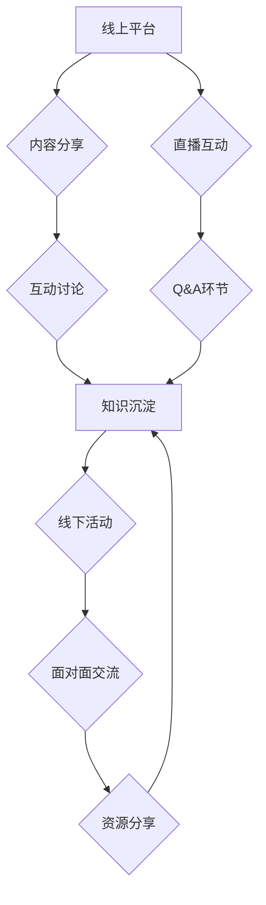

                 

## 举办线上线下工作坊：深度互动提升影响力

> 关键词：线上工作坊、线下工作坊、深度互动、影响力提升、技术分享、社区建设、学习体验

### 1. 背景介绍

在当今数字化时代，知识分享和技术交流日益重要。传统的线下会议虽然能够提供面对面互动，但受限于地域和时间等因素，参与者范围有限。而线上会议则突破了地域限制，方便快捷，但缺乏线下会议的真实感和互动性。

为了弥补线上线下会议的各自不足，举办线上线下混合工作坊应运而生。这种模式将线上平台的便捷性与线下会议的深度互动相结合，为参与者提供更丰富的学习体验和更广阔的交流平台。

### 2. 核心概念与联系

线上线下混合工作坊的核心概念是将线上和线下资源整合，创造一个更加沉浸式和互动式的学习环境。

**工作坊架构**



**核心联系**

* 线上平台为工作坊提供基础设施，包括内容发布、互动讨论、知识沉淀等功能。
* 线下活动提供面对面交流和更深入的互动体验，例如小组讨论、案例分析、实践演练等。
* 线上线下资源相互补充，共同构建一个完整的学习生态系统。

### 3. 核心算法原理 & 具体操作步骤

**3.1 算法原理概述**

线上线下混合工作坊的核心算法原理是基于**内容分发、互动引导和社区建设**。

* **内容分发:** 利用线上平台的优势，将工作坊内容以多种形式（视频、文档、音频等）进行分发，并根据参与者的学习进度和兴趣进行个性化推荐。
* **互动引导:** 通过线上平台的互动功能（问答、投票、评论等），引导参与者积极参与讨论，并利用线下活动提供更深入的互动机会。
* **社区建设:** 鼓励参与者在工作坊前后建立联系，形成学习社区，促进知识共享和持续学习。

**3.2 算法步骤详解**

1. **内容准备:** 确定工作坊主题和目标受众，设计课程内容和学习路径，并将其以多种形式制作成线上资源。
2. **平台搭建:** 选择合适的线上平台，并根据工作坊需求进行配置，例如设置讨论区、直播功能、资源库等。
3. **用户注册:** 参与者通过线上平台注册，并填写个人信息和学习目标。
4. **内容分发:** 根据用户注册信息和学习进度，线上平台自动推荐相关内容。
5. **互动引导:** 线上平台提供互动功能，引导用户参与讨论，并根据用户参与情况进行个性化推荐。
6. **线下活动:** 组织线下活动，例如小组讨论、案例分析、实践演练等，提供更深入的互动体验。
7. **知识沉淀:** 收集线上线下活动中的知识点和经验，并将其整理成文档、视频等形式，供后续学习者参考。
8. **社区建设:** 鼓励参与者在工作坊前后建立联系，形成学习社区，促进知识共享和持续学习。

**3.3 算法优缺点**

**优点:**

* 突破地域限制，扩大参与范围。
* 提供多种学习形式，满足不同学习需求。
* 促进线上线下互动，提升学习体验。
* 形成学习社区，促进知识共享。

**缺点:**

* 需要投入更多时间和精力进行线上线下资源整合。
* 线上平台技术要求较高，需要专业的技术团队维护。
* 线下活动成本较高，需要考虑场地、交通等因素。

**3.4 算法应用领域**

线上线下混合工作坊的应用领域非常广泛，例如：

* 技术培训：软件开发、数据分析、人工智能等领域的技术培训。
* 行业交流：分享行业经验、趋势和最佳实践。
* 知识普及：传播科学知识、文化知识等。
* 社区建设：搭建学习社区，促进知识共享和互动交流。

### 4. 数学模型和公式 & 详细讲解 & 举例说明

**4.1 数学模型构建**

线上线下混合工作坊的参与度和学习效果可以抽象为一个数学模型：

$$
参与度 = f(线上互动, 线下互动, 内容质量, 学习目标)
$$

其中：

* 线上互动：指线上平台的互动功能使用情况，例如问答数量、评论数量、投票参与率等。
* 线下互动：指线下活动参与度，例如小组讨论活跃度、案例分析参与率、实践演练完成率等。
* 内容质量：指工作坊内容的深度、广度、实用性等。
* 学习目标：指参与者学习工作坊的预期目标和期望收获。

**4.2 公式推导过程**

参与度是一个复杂的函数，其具体形式取决于各个因素的权重和相互作用关系。可以通过数据分析和用户反馈来确定各个因素的权重，并不断优化公式，以提高工作坊的参与度和学习效果。

**4.3 案例分析与讲解**

假设一个线上线下混合工作坊，其线上互动率为70%，线下互动率为80%，内容质量为85%，学习目标达成率为90%。根据上述数学模型，我们可以推算出该工作坊的参与度较高。

### 5. 项目实践：代码实例和详细解释说明

**5.1 开发环境搭建**

* 操作系统：Windows/macOS/Linux
* 编程语言：Python
* 开发框架：Flask/Django
* 数据库：MySQL/PostgreSQL
* 云平台：AWS/Azure/GCP

**5.2 源代码详细实现**

```python
# Flask示例代码

from flask import Flask, render_template, request

app = Flask(__name__)

@app.route('/')
def index():
    return render_template('index.html')

@app.route('/discussion', methods=['POST'])
def discussion():
    # 处理用户讨论内容
    return '讨论内容已提交'

if __name__ == '__main__':
    app.run(debug=True)
```

**5.3 代码解读与分析**

* 该代码示例使用Flask框架构建了一个简单的线上工作坊平台。
* `/`路由负责渲染首页，`/discussion`路由负责处理用户讨论内容。
* 该代码仅展示了基本的框架结构，实际开发需要根据工作坊需求添加更多功能，例如用户注册、内容管理、直播功能等。

**5.4 运行结果展示**

运行上述代码后，可以访问`http://127.0.0.1:5000/`，查看工作坊首页。

### 6. 实际应用场景

线上线下混合工作坊已在多个领域得到广泛应用，例如：

* **技术培训:** 许多科技公司利用线上线下混合工作坊进行员工培训，例如软件开发、数据分析、云计算等领域。
* **行业交流:** 行业协会和研究机构经常举办线上线下混合工作坊，分享行业经验、趋势和最佳实践。
* **知识普及:** 非营利组织和教育机构利用线上线下混合工作坊传播科学知识、文化知识等，提高公众的认知水平。

**6.4 未来应用展望**

随着技术的不断发展，线上线下混合工作坊将更加智能化、个性化和互动化。未来，我们可以期待以下应用场景：

* **人工智能辅助:** 利用人工智能技术，为参与者提供个性化学习路径、智能问答和实时翻译等服务。
* **虚拟现实增强:** 利用虚拟现实技术，打造更加沉浸式的学习环境，例如模拟真实场景的案例分析和实践演练。
* **元宇宙融合:** 将线上线下混合工作坊融入元宇宙，创造更加丰富的虚拟社交和学习体验。

### 7. 工具和资源推荐

**7.1 学习资源推荐**

* **线上学习平台:** Coursera、edX、Udemy、Udacity等
* **技术博客:** Hacker News、Medium、Stack Overflow等
* **开源社区:** GitHub、GitLab、Bitbucket等

**7.2 开发工具推荐**

* **线上平台:** Zoom、Google Meet、Microsoft Teams等
* **开发框架:** Flask、Django、React、Vue.js等
* **数据库:** MySQL、PostgreSQL、MongoDB等

**7.3 相关论文推荐**

* **混合学习研究:** "Blended Learning: A Review of the Literature"
* **线上线下互动研究:** "The Impact of Online and Offline Interactions on Learning Outcomes"
* **元宇宙应用研究:** "The Metaverse: Opportunities and Challenges for Education"

### 8. 总结：未来发展趋势与挑战

**8.1 研究成果总结**

线上线下混合工作坊是一种有效的知识分享和技术交流模式，能够突破地域限制、提供多种学习形式、促进线上线下互动、形成学习社区。

**8.2 未来发展趋势**

未来，线上线下混合工作坊将更加智能化、个性化和互动化，并与人工智能、虚拟现实、元宇宙等新技术深度融合。

**8.3 面临的挑战**

线上线下混合工作坊的发展还面临一些挑战，例如：

* **技术难度:** 需要投入更多时间和精力进行线上线下资源整合和技术开发。
* **成本控制:** 线下活动成本较高，需要找到有效的成本控制措施。
* **用户体验:** 需要不断优化用户体验，提高参与者的学习兴趣和积极性。

**8.4 研究展望**

未来，我们需要继续深入研究线上线下混合工作坊的理论模型、技术架构和应用场景，并探索其在教育、培训、科研、文化等领域的更多应用可能性。

### 9. 附录：常见问题与解答

**常见问题:**

* 如何选择合适的线上平台？
* 如何设计线上线下互动环节？
* 如何评估工作坊的参与度和学习效果？

**解答:**

* 选择线上平台时，需要考虑平台的功能、用户体验、价格等因素。
* 线上线下互动环节的设计需要根据工作坊主题和目标受众进行定制，例如小组讨论、案例分析、实践演练等。
* 工作坊的参与度和学习效果可以通过问卷调查、用户反馈、学习成果评估等方式进行评估。


作者：禅与计算机程序设计艺术 / Zen and the Art of Computer Programming 
<end_of_turn>

