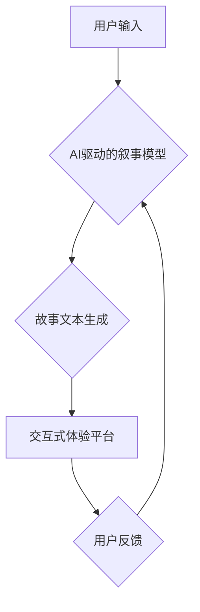

                 

## 体验叙事工作室总监：AI驱动的个人故事创作坊负责人

> 关键词：人工智能、自然语言处理、故事创作、叙事模型、体验设计、创意技术、AI写作

## 1. 背景介绍

在数字时代，故事的力量依然不可忽视。它连接着人们的情感，传递着文化和价值观，并塑造着我们的认知世界。然而，传统的故事创作往往需要丰富的经验、敏锐的洞察力和强大的想象力，这对于许多人来说是一个难以跨越的鸿沟。

近年来，人工智能技术突飞猛进，特别是自然语言处理（NLP）领域取得了令人瞩目的进展。AI模型能够学习和理解人类语言的复杂结构和语义，并生成逼真的文本内容。这为我们打开了全新的创作可能性，让人们能够更轻松地参与到故事创作的旅程中。

基于此背景，我们创立了“体验叙事工作室”，这是一个集AI技术、创意设计和用户体验为一体的个人故事创作坊。我们的目标是利用AI驱动的工具和平台，帮助每个人都能轻松创作出独一无二、充满情感 resonance 的个人故事。

## 2. 核心概念与联系

体验叙事工作室的核心概念是将AI技术融入到故事创作的各个环节，从故事构思、角色塑造、情节编排到文本生成，都能够得到AI的辅助和支持。

**核心概念：**

* **AI驱动的叙事模型:** 基于深度学习算法，能够理解和生成符合人类叙事逻辑的故事文本。
* **个性化故事创作:** 通过用户输入个人经历、情感和意愿，AI模型能够生成符合用户特色的独特故事。
* **交互式体验设计:**  提供多种交互方式，让用户能够参与到故事创作过程中，并根据自己的喜好调整故事走向。
* **情感共鸣:**  通过AI技术分析用户情感，并生成能够引发情感共鸣的故事内容。

**架构图：**



## 3. 核心算法原理 & 具体操作步骤

### 3.1  算法原理概述

体验叙事工作室的核心算法是基于Transformer架构的生成式预训练语言模型（GPT）。这种模型能够学习和理解语言的上下文关系，并生成流畅、连贯的文本内容。

**具体原理：**

* **自回归语言模型:** GPT模型采用自回归的方式生成文本，即根据之前生成的词语预测下一个词语。
* **Transformer架构:** Transformer架构利用注意力机制，能够捕捉文本中长距离依赖关系，生成更准确、更自然的文本。
* **预训练和微调:** GPT模型首先在海量文本数据上进行预训练，学习语言的通用知识，然后根据特定任务进行微调，例如故事创作。

### 3.2  算法步骤详解

1. **用户输入:** 用户通过文本输入框输入自己的故事构思、人物设定、情节梗概等信息。
2. **文本预处理:** 系统对用户输入的文本进行预处理，例如分词、词性标注、去除停用词等。
3. **特征提取:** 利用NLP技术提取用户输入文本中的关键信息，例如人物关系、事件时间、情感倾向等。
4. **模型生成:** 将提取的特征输入到预训练好的GPT模型中，模型根据上下文关系和用户输入的信息生成故事文本。
5. **文本后处理:** 对生成的文本进行语法检查、流畅度调整、情感表达优化等后处理。
6. **故事呈现:** 将最终生成的文本以多种形式呈现给用户，例如文本阅读、语音朗读、动画展示等。

### 3.3  算法优缺点

**优点:**

* **高效便捷:**  AI模型能够快速生成故事文本，节省用户创作时间。
* **个性化定制:**  根据用户输入信息，生成符合用户特色的独特故事。
* **创意激发:**  AI模型能够提供新的故事构思和情节创意，激发用户的创作灵感。

**缺点:**

* **缺乏原创性:**  AI模型生成的文本可能缺乏真正的原创性，容易出现重复或缺乏深度的问题。
* **情感表达有限:**  AI模型在理解和表达情感方面仍然存在局限性，生成的文本可能缺乏真实的情感共鸣。
* **伦理风险:**  AI模型生成的文本可能存在偏见或误导性信息，需要谨慎使用和监管。

### 3.4  算法应用领域

* **个人故事创作:**  帮助个人记录和分享自己的生活经历、情感故事和梦想。
* **教育培训:**  利用AI生成个性化的学习故事，提高学生的学习兴趣和理解能力。
* **游戏开发:**  为游戏角色生成个性化的背景故事和对话，增强游戏沉浸感。
* **文学创作:**  为作家提供故事构思和情节编排的辅助工具，提高创作效率。

## 4. 数学模型和公式 & 详细讲解 & 举例说明

### 4.1  数学模型构建

体验叙事工作室的核心数学模型是基于Transformer架构的语言模型，其核心思想是利用注意力机制捕捉文本中的长距离依赖关系。

**注意力机制:**

注意力机制是一种用于处理序列数据的机制，它能够学习每个词语在句子中的重要程度，并根据重要程度分配不同的权重。

**公式:**

$$
Attention(Q, K, V) = softmax(\frac{QK^T}{\sqrt{d_k}})V
$$

其中：

* $Q$：查询矩阵
* $K$：键矩阵
* $V$：值矩阵
* $d_k$：键向量的维度
* $softmax$：softmax函数

**解释:**

注意力机制首先计算查询矩阵 $Q$ 和键矩阵 $K$ 的点积，然后进行归一化处理，得到每个词语的注意力权重。最后，将注意力权重与值矩阵 $V$ 相乘，得到最终的输出。

### 4.2  公式推导过程

注意力机制的公式推导过程较为复杂，涉及到线性代数、概率论和信息论等多个数学分支。

**简要概述:**

1. 计算查询矩阵 $Q$ 和键矩阵 $K$ 的点积，得到每个词语之间的相似度得分。
2. 对相似度得分进行归一化处理，得到每个词语的注意力权重。
3. 将注意力权重与值矩阵 $V$ 相乘，得到最终的输出。

### 4.3  案例分析与讲解

**举例:**

假设我们有一个句子：“我爱吃苹果”。

* $Q$：查询矩阵
* $K$：键矩阵
* $V$：值矩阵

通过计算 $QK^T$ 和 softmax 函数，我们可以得到每个词语的注意力权重。例如，"我" 的注意力权重可能较高，因为它是句子的主语。

最终的输出将是每个词语的加权平均值，代表了整个句子的语义信息。

## 5. 项目实践：代码实例和详细解释说明

### 5.1  开发环境搭建

体验叙事工作室的开发环境基于Python语言和深度学习框架TensorFlow或PyTorch。

**所需软件:**

* Python 3.x
* TensorFlow或PyTorch
* Jupyter Notebook
* Git

**安装步骤:**

1. 安装Python 3.x
2. 安装TensorFlow或PyTorch
3. 安装Jupyter Notebook
4. 安装Git

### 5.2  源代码详细实现

由于篇幅限制，这里只提供代码框架示例，具体实现细节请参考开源项目或相关文献。

```python
# 导入必要的库
import tensorflow as tf

# 定义Transformer模型
class Transformer(tf.keras.Model):
    def __init__(self, vocab_size, embedding_dim, num_heads, num_layers):
        super(Transformer, self).__init__()
        # ... 模型结构定义 ...

    def call(self, inputs):
        # ... 模型前向传播过程 ...

# 加载预训练模型
model = Transformer(vocab_size=..., embedding_dim=..., num_heads=..., num_layers=...)

# 用户输入文本
user_input = "我爱吃苹果"

# 文本预处理
# ...

# 生成故事文本
generated_text = model.predict(user_input)

# 文本后处理
# ...

# 打印故事文本
print(generated_text)
```

### 5.3  代码解读与分析

* **模型定义:** 代码定义了一个Transformer模型，包含嵌入层、多头注意力层、前馈神经网络层等。
* **模型加载:** 加载预训练好的Transformer模型，并设置模型参数。
* **文本预处理:** 对用户输入的文本进行预处理，例如分词、词性标注、去除停用词等。
* **文本生成:** 将预处理后的文本输入到模型中，模型根据上下文关系和用户输入的信息生成故事文本。
* **文本后处理:** 对生成的文本进行语法检查、流畅度调整、情感表达优化等后处理。

### 5.4  运行结果展示

运行代码后，将输出一个基于用户输入的生成故事文本。

## 6. 实际应用场景

### 6.1  个人故事创作

体验叙事工作室可以帮助个人记录和分享自己的生活经历、情感故事和梦想。用户可以输入自己的回忆、感受和想法，AI模型将帮助他们生成一个独一无二、充满情感 resonance 的个人故事。

### 6.2  教育培训

体验叙事工作室可以为教育培训提供个性化的学习故事，提高学生的学习兴趣和理解能力。例如，老师可以利用AI生成一个关于历史事件的故事，让学生更加生动地了解历史知识。

### 6.3  游戏开发

体验叙事工作室可以为游戏角色生成个性化的背景故事和对话，增强游戏沉浸感。例如，游戏开发者可以利用AI生成一个关于游戏角色的成长故事，让玩家更加了解角色的性格和 motivations。

### 6.4  未来应用展望

随着AI技术的不断发展，体验叙事工作室将拥有更广泛的应用场景，例如：

* **虚拟现实体验:**  将AI生成的文本与虚拟现实技术结合，创造更加沉浸式的体验故事。
* **跨文化交流:**  利用AI翻译和文化理解能力，帮助不同文化背景的人们分享和理解彼此的故事。
* **艺术创作:**  将AI作为艺术创作的工具，生成新的故事形式和艺术作品。

## 7. 工具和资源推荐

### 7.1  学习资源推荐

* **深度学习课程:**  Coursera、edX、Udacity 等平台提供丰富的深度学习课程。
* **NLP教程:**  Hugging Face、Stanford NLP 等网站提供NLP相关的教程和文档。
* **开源项目:**  Transformers、GPT-2 等开源项目可以帮助你学习和实践AI模型的开发。

### 7.2  开发工具推荐

* **Python:**  Python 是深度学习开发的常用语言。
* **TensorFlow:**  TensorFlow 是一个开源的深度学习框架。
* **PyTorch:**  PyTorch 是另一个流行的深度学习框架。
* **Jupyter Notebook:**  Jupyter Notebook 是一个交互式编程环境，方便深度学习开发和调试。

### 7.3  相关论文推荐

* **Attention Is All You Need:**  https://arxiv.org/abs/1706.03762
* **BERT: Pre-training of Deep Bidirectional Transformers for Language Understanding:**  https://arxiv.org/abs/1810.04805
* **GPT-3: Language Models are Few-Shot Learners:**  https://arxiv.org/abs/2005.14165

## 8. 总结：未来发展趋势与挑战

### 8.1  研究成果总结

体验叙事工作室的研发成果表明，AI技术能够有效地辅助人类进行故事创作，并为人们提供更加个性化、沉浸式的体验。

### 8.2  未来发展趋势

未来，体验叙事工作室将朝着以下方向发展：

* **更强大的AI模型:**  开发更强大的AI模型，能够生成更加原创、更加富有情感的文本内容。
* **更丰富的交互方式:**  提供更丰富的交互方式，例如语音交互、手势交互、虚拟现实交互等，增强用户的参与感和体验感。
* **更个性化的定制:**  根据用户的个人喜好、文化背景和情感需求，提供更加个性化的故事创作体验。

### 8.3  面临的挑战

体验叙事工作室的发展也面临着一些挑战：

* **原创性问题:**  如何确保AI生成的文本具有真正的原创性，避免重复或缺乏深度的问题。
* **情感表达问题:**  如何让AI模型更好地理解和表达人类的情感，生成更加真实的情感共鸣。
* **伦理风险问题:**  如何避免AI生成的文本存在偏见或误导性信息，确保其伦理安全和社会责任。

### 8.4  研究展望

我们将继续致力于研究和开发更先进的AI技术，为人们提供更加丰富、更加精彩的体验叙事服务。


## 9. 附录：常见问题与解答

**常见问题:**

* **AI生成的文本是否真实？**

AI生成的文本是基于大量文本数据训练出来的，能够生成流畅、连贯的文本内容，但它并不代表真实存在的故事。

* **如何确保AI生成的文本的原创性？**

我们正在研究新的算法和技术，以提高AI文本的原创性，并避免重复或抄袭的问题。

* **AI生成的文本是否会存在偏见？**

AI模型的训练数据可能包含社会偏见，因此生成的文本也可能存在偏见。我们正在积极研究如何识别和消除AI模型中的偏见。

**作者：禅与计算机程序设计艺术 / Zen and the Art of Computer Programming**<end_of_turn>

