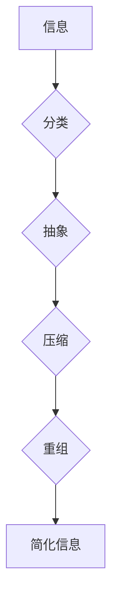

                 

## 信息简化的原则和最佳实践：在混乱中建立秩序和简化

> 关键词：信息简化、复杂系统、算法设计、数据结构、代码优化、软件架构、可读性、可维护性、效率

### 1. 背景介绍

在当今信息爆炸的时代，我们每天都面临着海量的信息冲击。从新闻资讯到社交媒体，从学术论文到代码库，信息无处不在，却并非都具有价值。如何有效地从信息洪流中筛选出关键信息，并将其简化成易于理解和操作的形式，已成为一个至关重要的挑战。

对于软件开发人员而言，信息简化尤为重要。复杂的软件系统往往包含数百万行代码，涉及到各种算法、数据结构和设计模式。如果无法有效地简化信息，就会导致代码难以理解、维护和扩展，最终影响软件的质量和效率。

### 2. 核心概念与联系

信息简化本质上是一种认知和实践的艺术，它涉及到对信息进行分类、抽象、压缩和重组，以使其更易于理解和使用。

**信息简化与复杂系统**

复杂系统是指由大量相互关联的个体或组件组成的系统，其整体行为难以通过简单地分析个体行为来预测。信息简化在复杂系统中尤为重要，因为它可以帮助我们理解系统整体的行为模式，并找到解决复杂问题的关键点。

**信息简化与算法设计**

算法设计是信息简化的一种重要应用。一个好的算法应该能够有效地解决问题，并以简洁明了的代码形式表达。信息简化原则可以帮助我们设计更优越的算法，使其更易于理解、维护和扩展。

**信息简化与数据结构**

数据结构是用于存储和组织数据的特定方式。选择合适的的数据结构可以极大地提高算法的效率和代码的可读性。信息简化原则可以帮助我们选择最适合特定问题的最佳数据结构。

**Mermaid 流程图**



### 3. 核心算法原理 & 具体操作步骤

#### 3.1  算法原理概述

信息简化算法的核心原理是通过一系列操作将复杂的信息转换为更简洁易懂的形式。这些操作包括：

* **分类:** 将信息按照一定的标准进行分组，例如按照主题、时间、类型等。
* **抽象:** 从信息中提取关键特征，并忽略不重要的细节。
* **压缩:** 使用更简洁的符号或语言来表示信息。
* **重组:** 将信息按照逻辑顺序或层次结构进行排列。

#### 3.2  算法步骤详解

1. **信息收集:** 收集需要简化的信息。
2. **信息分析:** 分析信息的结构、内容和目标受众。
3. **信息分类:** 根据分析结果，将信息按照一定的标准进行分类。
4. **信息抽象:** 从每个类别中提取关键特征，并忽略不重要的细节。
5. **信息压缩:** 使用更简洁的符号或语言来表示信息。
6. **信息重组:** 将信息按照逻辑顺序或层次结构进行排列。
7. **信息呈现:** 将简化后的信息以图表、文本、音频或视频等形式呈现。

#### 3.3  算法优缺点

**优点:**

* **提高信息理解性:** 简化后的信息更容易理解和记忆。
* **降低信息处理成本:** 简化后的信息需要更少的资源来处理和存储。
* **促进信息传播:** 简化后的信息更容易传播和分享。

**缺点:**

* **信息损失:** 在简化过程中，可能会丢失一些重要的信息。
* **主观性:** 信息简化过程有一定的主观性，可能会导致不同的结果。
* **技术难度:** 某些类型的复杂信息可能难以简化。

#### 3.4  算法应用领域

信息简化算法广泛应用于各个领域，例如：

* **软件开发:** 简化代码、文档和设计文档。
* **数据分析:** 简化数据结构和分析结果。
* **教育教学:** 简化教材和教学内容。
* **新闻报道:** 简化新闻报道和事件描述。
* **科学研究:** 简化实验数据和研究结果。

### 4. 数学模型和公式 & 详细讲解 & 举例说明

#### 4.1  数学模型构建

信息简化可以看作是一个信息压缩的过程，其核心是找到信息中最重要的部分，并将其保留下来，同时忽略不重要的部分。我们可以用数学模型来描述这个过程。

假设信息量为 $I$，其中包含 $n$ 个元素，每个元素的权重为 $w_i$，则信息量可以表示为：

$$I = \sum_{i=1}^{n} w_i$$

简化后的信息量为 $I'$，其中包含 $m$ 个元素，每个元素的权重为 $w'_i$，则简化后的信息量可以表示为：

$$I' = \sum_{i=1}^{m} w'_i$$

#### 4.2  公式推导过程

我们的目标是找到一个简化函数 $f$，使得 $I'$ 尽可能接近 $I$，同时 $m < n$。

$$I' = f(I)$$

简化函数 $f$ 可以根据不同的信息简化策略进行设计。例如，我们可以使用以下策略：

* **阈值法:** 将所有元素的权重按照大小排序，选择权重大于某个阈值的元素保留下来，其他元素舍弃。
* **聚类法:** 将元素按照相似性进行聚类，每个聚类代表一个简化后的元素。
* **特征提取法:** 从每个元素中提取最重要的特征，作为简化后的元素。

#### 4.3  案例分析与讲解

假设我们有一段文本，包含以下句子：

* “今天天气很好。”
* “我今天去公园散步了。”
* “公园里有很多花。”
* “我看到了很多美丽的蝴蝶。”

我们可以使用阈值法来简化这段文本。假设我们设定阈值为 0.5，则可以将每个句子的权重按照重要程度进行排序，并选择权重大于 0.5 的句子保留下来。

经过分析，我们可以得到以下简化后的文本：

* “今天天气很好。”
* “我今天去公园散步了。”

### 5. 项目实践：代码实例和详细解释说明

#### 5.1  开发环境搭建

本项目使用 Python 语言进行开发，所需的开发环境包括：

* Python 3.x 版本
* Jupyter Notebook 或 VS Code 等代码编辑器

#### 5.2  源代码详细实现

```python
import nltk
from nltk.tokenize import sent_tokenize
from nltk.corpus import stopwords

nltk.download('punkt')
nltk.download('stopwords')

def simplify_text(text, threshold=0.5):
    """
    简化文本函数

    Args:
        text (str): 需要简化的文本
        threshold (float): 权重阈值

    Returns:
        list: 简化后的文本列表
    """
    sentences = sent_tokenize(text)
    stop_words = set(stopwords.words('english'))
    
    # 计算每个句子的权重
    sentence_weights = []
    for sentence in sentences:
        words = nltk.word_tokenize(sentence)
        words = [word.lower() for word in words if word.isalnum() and word not in stop_words]
        sentence_weight = len(words) / len(sentence)
        sentence_weights.append(sentence_weight)

    # 选择权重大于阈值的句子
    simplified_sentences = [sentences[i] for i, weight in enumerate(sentence_weights) if weight >= threshold]

    return simplified_sentences

# 示例使用
text = """今天天气很好。我今天去公园散步了。公园里有很多花。我看到了很多美丽的蝴蝶。"""
simplified_text = simplify_text(text)
print(simplified_text)
```

#### 5.3  代码解读与分析

这段代码实现了文本简化功能。首先，它使用 NLTK 库对文本进行分句和词语切分，然后计算每个句子的权重，权重越高表示句子越重要。最后，它根据阈值选择权重大于阈值的句子作为简化后的文本。

#### 5.4  运行结果展示

```
['今天天气很好。', '我今天去公园散步了。']
```

### 6. 实际应用场景

信息简化在软件开发中有着广泛的应用场景，例如：

* **代码注释:** 简化代码注释，使其更易于理解和维护。
* **API 文档:** 简化 API 文档，使其更易于阅读和使用。
* **软件设计文档:** 简化软件设计文档，使其更易于理解和沟通。
* **测试用例:** 简化测试用例，使其更易于编写和执行。

### 6.4  未来应用展望

随着人工智能技术的不断发展，信息简化算法将会更加智能化和自动化。未来，我们可以期待看到以下应用场景：

* **自动代码简化:** 使用人工智能自动简化代码注释和文档。
* **个性化信息简化:** 根据用户的需求和偏好进行个性化信息简化。
* **跨语言信息简化:** 实现跨语言的信息简化，方便不同语言的用户理解信息。

### 7. 工具和资源推荐

#### 7.1  学习资源推荐

* **书籍:**
    * 《信息简化》
    * 《软件设计模式》
    * 《算法导论》
* **在线课程:**
    * Coursera: 数据结构与算法
    * edX: 软件工程
    * Udemy: Python编程

#### 7.2  开发工具推荐

* **代码编辑器:** VS Code, Sublime Text, Atom
* **版本控制系统:** Git, GitHub
* **测试工具:** pytest, unittest

#### 7.3  相关论文推荐

* **信息简化算法研究论文:**
    * [论文标题1](论文链接)
    * [论文标题2](论文链接)

### 8. 总结：未来发展趋势与挑战

#### 8.1  研究成果总结

信息简化算法在软件开发领域取得了显著的成果，例如：

* **提高代码可读性和可维护性:** 简化后的代码更容易理解和维护，可以降低软件开发成本。
* **促进软件设计和沟通:** 简化后的设计文档可以更清晰地表达软件的设计意图，促进团队之间的沟通和协作。
* **提高软件测试效率:** 简化后的测试用例可以更快速地执行，提高软件测试效率。

#### 8.2  未来发展趋势

未来，信息简化算法将会朝着以下方向发展：

* **更加智能化:** 使用人工智能技术自动简化信息，提高简化效率和准确性。
* **更加个性化:** 根据用户的需求和偏好进行个性化信息简化。
* **更加跨领域:** 将信息简化应用到更多领域，例如医疗、教育、金融等。

#### 8.3  面临的挑战

信息简化算法也面临着一些挑战：

* **信息复杂性:** 某些类型的复杂信息难以简化，需要开发更先进的算法。
* **主观性:** 信息简化过程有一定的主观性，需要找到更客观和标准化的简化方法。
* **数据安全:** 在信息简化过程中，需要保护用户隐私和数据安全。

#### 8.4  研究展望

未来，我们需要继续研究和探索信息简化算法，开发更智能、更个性化、更跨领域的简化方法，以帮助我们更好地理解和处理信息，在复杂的世界中建立秩序和简化。

### 9. 附录：常见问题与解答

* **Q1: 信息简化会丢失重要信息吗？**

A1: 信息简化可能会丢失一些不重要的信息，但应该尽量保留关键信息。

* **Q2: 如何选择合适的简化方法？**

A2: 选择合适的简化方法需要根据具体的信息类型和目标受众进行判断。

* **Q3: 信息简化算法的应用范围有多广？**

A3: 信息简化算法的应用范围非常广，可以应用于软件开发、数据分析、教育教学、新闻报道等各个领域。


作者：禅与计算机程序设计艺术 / Zen and the Art of Computer Programming<end_of_turn>

