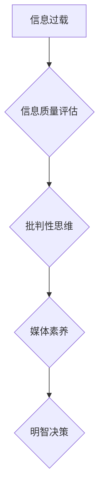

                 

## 信息过载与信息质量评估：批判性消费信息和媒体的指南

> 关键词：信息过载、信息质量、信息评估、批判性思维、媒体素养、算法、深度学习、自然语言处理

### 1. 背景介绍

在当今数字时代，我们被海量信息包围。从社交媒体到新闻网站，从搜索引擎到电子邮件，信息无处不在，以一种前所未有的速度和规模涌入我们的生活。然而，并非所有信息都是同等有价值的。大量低质量、虚假或误导性的信息充斥网络，使得我们难以辨别真伪，难以从中获取有价值的知识和洞察。

信息过载现象带来的挑战是多方面的：

* **认知负担加重:**  处理过多的信息会使我们的大脑疲劳，难以集中注意力，影响决策能力和创造力。
* **信息筛选困难:**  难以有效地筛选出高质量、相关的信息，浪费时间和精力。
* **误导和欺骗风险:**  虚假信息和恶意内容容易传播，可能导致错误的判断和负面的后果。
* **价值观偏差:**  信息茧房效应导致我们只接触到符合自身观点的信息，加剧社会分化和认知偏见。

面对信息过载的挑战，我们需要培养批判性思维，学会有效地评估信息质量，并做出明智的选择。

### 2. 核心概念与联系

**信息质量**是指信息在满足特定需求时，其准确性、完整性、时效性、相关性和可信度等方面的优劣程度。

**信息评估**是指对信息进行系统性的分析和判断，以确定其价值、可靠性和适用性。

**批判性思维**是指能够独立思考、分析和评估信息的能力，不盲目接受，能够识别逻辑谬误、偏见和误导性信息。

**媒体素养**是指理解和运用媒体信息的能力，能够辨别不同类型的媒体内容，识别媒体的潜在偏见和目的，并做出明智的判断。

**信息过载**是指在信息爆炸的时代，人们被过多的信息淹没，难以有效地处理和理解信息，导致认知负担加重，决策困难。

**算法**是指解决特定问题的指令或规则，在信息处理领域，算法被广泛应用于信息检索、推荐系统、内容过滤等方面。

**深度学习**是一种机器学习技术，通过多层神经网络模拟人类大脑的学习过程，能够从海量数据中提取复杂特征，用于信息分类、文本生成、图像识别等任务。

**自然语言处理**是指使计算机能够理解和处理人类语言的技术，包括文本分析、机器翻译、语音识别等。

**Mermaid 流程图**



### 3. 核心算法原理 & 具体操作步骤

#### 3.1 算法原理概述

信息质量评估算法通常基于以下几个核心原理：

* **特征提取:** 从信息中提取关键特征，例如关键词、主题、情感倾向、来源等。
* **权重分配:** 为不同特征赋予不同的权重，根据其对信息质量的影响程度进行排序。
* **评分模型:** 建立一个评分模型，根据特征提取和权重分配的结果，对信息进行综合评分。
* **分类算法:** 使用分类算法，将信息按照其质量等级进行分类，例如高、中、低。

#### 3.2 算法步骤详解

1. **数据收集:** 收集大量信息样本，并标注其质量等级。
2. **特征工程:** 设计和提取信息特征，例如关键词、主题、情感倾向、来源等。
3. **特征选择:** 使用特征选择算法，选择对信息质量评估最具预测力的特征。
4. **模型训练:** 使用机器学习算法，例如支持向量机、决策树、神经网络等，训练一个信息质量评估模型。
5. **模型评估:** 使用测试数据评估模型的性能，例如准确率、召回率、F1-score等。
6. **模型部署:** 将训练好的模型部署到实际应用场景中，用于对新信息进行评估。

#### 3.3 算法优缺点

**优点:**

* **自动化:** 可以自动化地评估大量信息质量，提高效率。
* **客观性:** 基于数据驱动的算法可以减少主观判断的影响，提高评估的客观性。
* **可扩展性:** 可以根据需要扩展特征和算法，提高评估的精度和灵活性。

**缺点:**

* **数据依赖:** 算法的性能取决于训练数据的质量和数量。
* **黑盒问题:** 一些复杂的算法难以解释其决策过程，难以理解其评估结果背后的逻辑。
* **偏差问题:** 训练数据可能存在偏差，导致算法产生偏向的结果。

#### 3.4 算法应用领域

信息质量评估算法广泛应用于以下领域:

* **搜索引擎:** 提高搜索结果的质量和相关性。
* **新闻媒体:** 识别和过滤虚假新闻和谣言。
* **社交媒体:** 识别和删除垃圾信息和恶意内容。
* **电子商务:** 评估商品评论和评价的真实性。
* **医疗保健:** 评估医疗信息的准确性和可靠性。

### 4. 数学模型和公式 & 详细讲解 & 举例说明

#### 4.1 数学模型构建

信息质量评估模型通常采用评分模型，将信息质量映射到一个数值范围。一个简单的评分模型可以定义为：

$$
Score = \sum_{i=1}^{n} w_i * f_i
$$

其中：

* $Score$ 是信息的评分值。
* $w_i$ 是第 $i$ 个特征的权重。
* $f_i$ 是第 $i$ 个特征的值。
* $n$ 是特征的数量。

#### 4.2 公式推导过程

权重分配可以采用多种方法，例如专家评估、数据挖掘、机器学习等。

例如，可以使用机器学习算法训练一个回归模型，将信息特征作为输入，信息质量等级作为输出，然后根据模型的权重系数来分配特征权重。

#### 4.3 案例分析与讲解

假设我们想评估一篇新闻文章的信息质量，并定义以下特征：

* $f_1$: 文章来源的权威性 (例如，知名新闻机构的权重更高)
* $f_2$: 文章内容的客观性 (例如，避免使用情感词语和主观判断)
* $f_3$: 文章内容的完整性 (例如，提供足够的背景信息和细节)

我们可以根据专家评估或机器学习模型训练的结果，分配以下权重：

* $w_1 = 0.4$
* $w_2 = 0.3$
* $w_3 = 0.3$

然后，根据文章的具体特征值，计算其评分值：

$$
Score = 0.4 * f_1 + 0.3 * f_2 + 0.3 * f_3
$$

### 5. 项目实践：代码实例和详细解释说明

#### 5.1 开发环境搭建

* Python 3.x
* scikit-learn
* NLTK
* spaCy

#### 5.2 源代码详细实现

```python
import nltk
from sklearn.feature_extraction.text import TfidfVectorizer
from sklearn.linear_model import LogisticRegression

# 数据预处理
def preprocess_text(text):
    # 这里可以添加文本清洗、分词、词干提取等预处理步骤
    return text

# 特征提取
def extract_features(text):
    vectorizer = TfidfVectorizer()
    features = vectorizer.fit_transform([text])
    return features

# 模型训练
def train_model(X_train, y_train):
    model = LogisticRegression()
    model.fit(X_train, y_train)
    return model

# 模型评估
def evaluate_model(model, X_test, y_test):
    # 使用准确率、召回率、F1-score等指标评估模型性能
    pass

# 实际应用
def evaluate_text(text, model):
    features = extract_features(text)
    prediction = model.predict(features)
    return prediction

# 示例代码
if __name__ == "__main__":
    # 加载训练数据
    # ...

    # 训练模型
    model = train_model(X_train, y_train)

    # 加载测试数据
    # ...

    # 评估模型性能
    evaluate_model(model, X_test, y_test)

    # 评估新文本
    new_text = "这是一个新的文本"
    prediction = evaluate_text(new_text, model)
    print(f"新文本的质量等级为: {prediction}")
```

#### 5.3 代码解读与分析

* 数据预处理：对文本进行清洗、分词、词干提取等预处理步骤，以便于特征提取和模型训练。
* 特征提取：使用TF-IDF向量化技术提取文本的特征，将文本表示为一个词向量的形式。
* 模型训练：使用逻辑回归模型训练一个信息质量评估模型，将文本特征作为输入，信息质量等级作为输出。
* 模型评估：使用准确率、召回率、F1-score等指标评估模型的性能。
* 实际应用：使用训练好的模型对新文本进行评估，预测其质量等级。

#### 5.4 运行结果展示

运行代码后，可以得到模型的训练结果、测试结果以及对新文本的质量等级预测。

### 6. 实际应用场景

#### 6.1 新闻媒体

* 识别和过滤虚假新闻和谣言，提高新闻质量和可信度。
* 为用户提供更精准的新闻推荐，满足个性化需求。
* 帮助媒体机构进行内容审核和管理，减少负面影响。

#### 6.2 搜索引擎

* 提高搜索结果的质量和相关性，为用户提供更精准的信息检索体验。
* 识别和过滤垃圾信息和恶意内容，保护用户免受网络欺诈和信息误导。
* 为用户提供更丰富的搜索结果，例如新闻、图片、视频等多媒体内容。

#### 6.3 社交媒体

* 识别和删除垃圾信息和恶意内容，维护平台的健康生态。
* 为用户提供更精准的个性化推荐，提高用户粘性和参与度。
* 帮助用户识别网络谣言和虚假信息，提高用户辨别能力。

#### 6.4 电子商务

* 评估商品评论和评价的真实性，提高用户购物体验和信任度。
* 为用户提供更精准的商品推荐，提高转化率和销售额。
* 帮助商家进行产品质量控制和改进，提升品牌形象。

#### 6.5 医疗保健

* 评估医疗信息的准确性和可靠性，提高医疗诊断和治疗的质量。
* 为医生提供更精准的患者信息，辅助临床决策。
* 帮助患者获取更准确的医疗信息，提高患者知情权和参与度。

#### 6.4 未来应用展望

随着人工智能技术的不断发展，信息质量评估算法将更加智能化、自动化和个性化。未来，信息质量评估将应用于更广泛的领域，例如教育、金融、法律等，帮助人们更好地理解和利用信息，做出更明智的决策。

### 7. 工具和资源推荐

#### 7.1 学习资源推荐

* **书籍:**
    * "信息检索" by Manning, Raghavan, Schütze
    * "自然语言处理入门" by Bird, Klein, Loper
    * "机器学习" by Tom Mitchell
* **在线课程:**
    * Coursera: Natural Language Processing Specialization
    * edX: Machine Learning
    * Udacity: Artificial Intelligence Nanodegree

#### 7.2 开发工具推荐

* **Python:** 
    * scikit-learn: 机器学习库
    * NLTK: 自然语言处理库
    * spaCy: 自然语言处理库
    * Gensim: 主题模型库
* **其他工具:**
    * Elasticsearch: 搜索引擎
    * Apache Solr: 搜索引擎
    * MongoDB: NoSQL 数据库

#### 7.3 相关论文推荐

* "A Survey on Information Quality Assessment" by Wang, Liu, and Zhang
* "Deep Learning for Information Quality Assessment" by Li, Wang, and Chen
* "Information Quality Assessment Using Natural Language Processing Techniques" by Zhang, Liu, and Wang

### 8. 总结：未来发展趋势与挑战

#### 8.1 研究成果总结

信息质量评估领域取得了显著进展，从传统的规则式方法到基于机器学习的算法，从单一特征到多特征融合，算法的精度和效率不断提高。

#### 8.2 未来发展趋势

* **更深层次的理解:** 利用深度学习技术，更深入地理解文本语义和情感倾向，提高信息质量评估的准确性。
* **跨模态信息融合:** 将文本、图像、音频等多模态信息融合，构建更全面的信息质量评估模型。
* **个性化信息质量评估:** 根据用户的需求和偏好，提供个性化的信息质量评估服务。
* **可解释性增强:** 提高算法的可解释性，帮助用户理解评估结果背后的逻辑，增强用户信任度。

#### 8.3 面临的挑战

* **数据质量问题:** 训练高质量的信息质量评估模型需要大量高质量的数据，而获取高质量数据的难度较大。
* **算法偏差问题:** 算法可能存在偏差，导致评估结果不准确或不公平。
* **解释性问题:** 一些复杂的算法难以解释其决策过程，难以理解其评估结果背后的逻辑。

#### 8.4 研究展望

未来，信息质量评估领域将继续朝着更智能化、自动化和个性化的方向发展，为人们提供更精准、更可靠的信息服务。

### 9. 附录：常见问题与解答

**Q1: 如何评估信息来源的权威性？**

**A1:** 可以参考信息来源的知名度、历史记录、编辑政策、作者背景等因素。

**Q2: 如何识别虚假新闻和谣言？**

**A2:** 可以关注信息来源的可靠性、事实的真实性、情感倾向的过度使用、逻辑谬误等特征。

**Q3: 如何提高信息质量评估的准确性？**

**A3:** 可以使用更丰富的特征、更先进的算法、更大的训练数据集等方法。


作者：禅与计算机程序设计艺术 / Zen and the Art of Computer Programming<end_of_turn>

