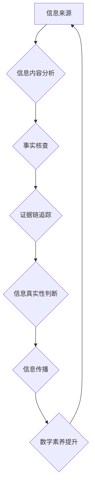

                 

## 信息验证和数字素养：在错误信息时代导航

> 关键词：信息验证、数字素养、错误信息、深度学习、自然语言处理、机器学习、算法、信任、可信度

### 1. 背景介绍

在当今信息爆炸的时代，我们每天都被海量的信息淹没。从社交媒体到新闻网站，从搜索引擎到电子邮件，信息无处不在。然而，信息的真实性和可靠性却面临着前所未有的挑战。随着网络技术的快速发展，虚假信息、谣言和恶意传播的现象日益猖獗，给社会稳定、公共安全和个人决策带来严重威胁。

面对这一严峻形势，信息验证和数字素养成为至关重要的议题。信息验证是指通过多种手段和方法，对信息的真实性、准确性和可靠性进行评估和判断的过程。数字素养则是指在数字环境中获取、理解、评价、创造和传播信息的能力。

### 2. 核心概念与联系

**2.1 信息验证的本质**

信息验证的核心在于识别和过滤虚假信息，确保获取和传播的信息真实可靠。这涉及到多个方面，包括：

* **来源识别:** 评估信息的来源可靠性，判断其是否来自权威机构、专业人士或可信平台。
* **内容分析:**  分析信息的逻辑性和前后文一致性，识别是否存在逻辑谬误、矛盾之处或可疑内容。
* **事实核查:**  通过查阅可靠的资料和数据，验证信息的真实性，确认其与已知事实相符。
* **证据链追踪:**  追溯信息的来源和传播路径，识别信息传播的动机和潜在利益相关者。

**2.2 数字素养的重要性**

数字素养是信息验证的基础。具备良好的数字素养的人能够：

* **批判性思考:**  能够对信息进行独立思考，不盲目相信，并能识别信息中的潜在偏见和误导。
* **信息筛选:**  能够有效地筛选和过滤信息，识别重要信息和可信信息。
* **信息评估:**  能够对信息的价值和可靠性进行评估，并做出明智的判断。
* **信息传播:**  能够负责任地传播信息，避免传播虚假信息和谣言。

**2.3 信息验证与数字素养的联系**

信息验证和数字素养是相互促进、相互依存的关系。良好的数字素养能够帮助人们更好地进行信息验证，而信息验证的结果又能够提升人们的数字素养。两者共同构成了应对错误信息时代的重要保障。

**Mermaid 流程图**



### 3. 核心算法原理 & 具体操作步骤

**3.1 算法原理概述**

信息验证算法通常基于机器学习和自然语言处理技术，通过训练模型识别和过滤虚假信息。常见的算法包括：

* **深度学习:**  利用多层神经网络，学习复杂的特征和模式，识别虚假信息和恶意内容。
* **自然语言处理 (NLP):**  分析文本结构、语义和上下文，识别逻辑谬误、情感倾向和潜在偏见。
* **关联规则挖掘:**  发现信息传播路径和关联关系，识别信息来源和传播动机。

**3.2 算法步骤详解**

1. **数据收集和预处理:**  收集大量真实和虚假信息的样本数据，并进行清洗、格式化和标注。
2. **特征提取:**  从文本数据中提取特征，例如词语、短语、语法结构、情感倾向等。
3. **模型训练:**  利用机器学习算法，训练模型识别虚假信息和恶意内容。
4. **模型评估:**  使用测试数据评估模型的准确率、召回率和F1-score等指标。
5. **模型部署:**  将训练好的模型部署到实际应用场景中，例如社交媒体平台、搜索引擎和新闻网站。

**3.3 算法优缺点**

**优点:**

* **自动化:**  能够自动识别和过滤虚假信息，提高效率和准确性。
* **大规模处理:**  能够处理海量数据，识别隐藏的模式和趋势。
* **持续学习:**  能够不断学习和更新，适应不断变化的虚假信息传播方式。

**缺点:**

* **数据依赖:**  算法的性能取决于训练数据的质量和数量。
* **误判风险:**  算法可能存在误判风险，识别出真实信息为虚假信息，或识别出虚假信息为真实信息。
* **可解释性:**  一些深度学习算法的决策过程难以解释，难以理解其识别虚假信息的依据。

**3.4 算法应用领域**

信息验证算法广泛应用于以下领域:

* **社交媒体平台:**  识别和过滤虚假信息、谣言和恶意内容，维护平台的健康生态。
* **搜索引擎:**  提高搜索结果的准确性和可靠性，避免用户误信虚假信息。
* **新闻网站:**  核实新闻内容的真实性，防止传播虚假新闻。
* **医疗保健:**  识别和过滤医疗虚假信息，保护患者健康安全。
* **金融领域:**  识别和过滤金融欺诈信息，保护用户财产安全。

### 4. 数学模型和公式 & 详细讲解 & 举例说明

**4.1 数学模型构建**

信息验证算法通常基于概率模型，例如贝叶斯网络和隐马尔可夫模型。这些模型可以用来计算信息真实性的概率，并根据概率阈值进行判断。

**4.2 公式推导过程**

例如，使用贝叶斯定理可以计算信息真实性的概率：

$$P(真实|证据) = \frac{P(证据|真实) * P(真实)}{P(证据)}$$

其中：

* $P(真实|证据)$ 是信息真实性的后验概率。
* $P(证据|真实)$ 是给定信息真实的情况下观察到证据的概率。
* $P(真实)$ 是信息真实性的先验概率。
* $P(证据)$ 是观察到证据的概率。

**4.3 案例分析与讲解**

假设我们有一个信息，声称“地球是平的”。我们可以使用贝叶斯定理来计算该信息的真实性概率。

* $P(真实)$ 可以根据科学共识设定为极低的值，例如0.001。
* $P(证据|真实)$ 可以根据现有证据，例如卫星图像和物理实验结果，设定为极低的值，例如0.0001。
* $P(证据)$ 可以根据所有可能的证据类型和频率进行计算。

通过代入这些值，我们可以得到该信息的真实性概率，通常会非常低。

### 5. 项目实践：代码实例和详细解释说明

**5.1 开发环境搭建**

* Python 3.x
* TensorFlow 或 PyTorch
* NLTK 或 spaCy

**5.2 源代码详细实现**

```python
import tensorflow as tf

# 定义模型结构
model = tf.keras.models.Sequential([
    tf.keras.layers.Embedding(input_dim=vocab_size, output_dim=embedding_dim),
    tf.keras.layers.LSTM(units=128),
    tf.keras.layers.Dense(units=1, activation='sigmoid')
])

# 编译模型
model.compile(optimizer='adam', loss='binary_crossentropy', metrics=['accuracy'])

# 训练模型
model.fit(x_train, y_train, epochs=10)

# 评估模型
loss, accuracy = model.evaluate(x_test, y_test)
print('Loss:', loss)
print('Accuracy:', accuracy)
```

**5.3 代码解读与分析**

这段代码展示了一个简单的深度学习模型，用于识别虚假信息。

* 首先，定义了一个包含嵌入层、LSTM层和全连接层的模型结构。
* 然后，使用Adam优化器、二元交叉熵损失函数和准确率指标编译模型。
* 接着，使用训练数据训练模型，并设置训练轮数为10。
* 最后，使用测试数据评估模型的性能，打印损失和准确率。

**5.4 运行结果展示**

运行结果会显示模型的损失值和准确率。

### 6. 实际应用场景

**6.1 社交媒体平台**

社交媒体平台可以利用信息验证算法识别和过滤虚假信息、谣言和恶意内容，维护平台的健康生态。例如，Facebook 和 Twitter 都使用机器学习算法来识别和标记虚假信息。

**6.2 搜索引擎**

搜索引擎可以利用信息验证算法提高搜索结果的准确性和可靠性，避免用户误信虚假信息。例如，Google 使用机器学习算法来识别和降权虚假网站和内容。

**6.3 新闻网站**

新闻网站可以利用信息验证算法核实新闻内容的真实性，防止传播虚假新闻。例如，一些新闻网站使用人工和机器学习算法来核实新闻来源和事实。

**6.4 未来应用展望**

随着人工智能技术的不断发展，信息验证算法将更加智能化、自动化和精准化。未来，信息验证算法可能被应用于更多领域，例如教育、医疗保健、金融等，帮助人们更好地应对信息爆炸时代带来的挑战。

### 7. 工具和资源推荐

**7.1 学习资源推荐**

* **书籍:**

    * 《深度学习》 by Ian Goodfellow, Yoshua Bengio, and Aaron Courville
    * 《自然语言处理》 by Jurafsky and Martin

* **在线课程:**

    * Coursera: Natural Language Processing Specialization
    * edX: Artificial Intelligence

**7.2 开发工具推荐**

* **Python:**  Python 是机器学习和深度学习的常用编程语言。
* **TensorFlow:**  TensorFlow 是一个开源的机器学习框架。
* **PyTorch:**  PyTorch 是另一个流行的机器学习框架。
* **NLTK:**  NLTK 是一个自然语言处理工具包。
* **spaCy:**  spaCy 是一个高效的自然语言处理库。

**7.3 相关论文推荐**

* **BERT: Pre-training of Deep Bidirectional Transformers for Language Understanding**
* **Attention Is All You Need**
* **Deep Learning for Natural Language Processing**

### 8. 总结：未来发展趋势与挑战

**8.1 研究成果总结**

近年来，信息验证领域取得了显著进展，机器学习和深度学习算法在识别和过滤虚假信息方面取得了令人瞩目的成果。

**8.2 未来发展趋势**

未来，信息验证领域将朝着以下方向发展：

* **更精准的算法:**  开发更精准、更可靠的信息验证算法，降低误判风险。
* **更广泛的应用:**  将信息验证算法应用于更多领域，例如教育、医疗保健、金融等。
* **更人性化的交互:**  设计更人性化的信息验证交互方式，帮助用户更好地理解和使用信息验证工具。

**8.3 面临的挑战**

信息验证领域仍然面临着一些挑战：

* **数据偏差:**  训练数据可能存在偏差，导致算法识别出真实信息为虚假信息，或识别出虚假信息为真实信息。
* **对抗性攻击:**  攻击者可能设计对抗性样本，欺骗信息验证算法。
* **伦理问题:**  信息验证算法的应用可能引发一些伦理问题，例如隐私保护和言论自由。

**8.4 研究展望**

未来，需要加强对信息验证算法的安全性、可靠性和伦理性的研究，确保其能够安全、有效地应用于社会各个领域。

### 9. 附录：常见问题与解答

**9.1 如何判断信息真实性？**

* 来源识别:  评估信息的来源可靠性，判断其是否来自权威机构、专业人士或可信平台。
* 内容分析:  分析信息的逻辑性和前后文一致性，识别是否存在逻辑谬误、矛盾之处或可疑内容。
* 事实核查:  通过查阅可靠的资料和数据，验证信息的真实性，确认其与已知事实相符。
* 证据链追踪:  追溯信息的来源和传播路径，识别信息传播的动机和潜在利益相关者。

**9.2 如何避免传播虚假信息？**

* 提高数字素养:  学习如何识别和过滤虚假信息，避免盲目相信和传播。
* 谨慎转发:  在转发信息之前，请务必核实其真实性，避免传播虚假信息。
* 关注可靠来源:  关注权威机构、专业人士和可信平台发布的信息。
* 培养批判性思维:  对信息进行独立思考，不要轻易相信。


作者：禅与计算机程序设计艺术 / Zen and the Art of Computer Programming 
<end_of_turn>

