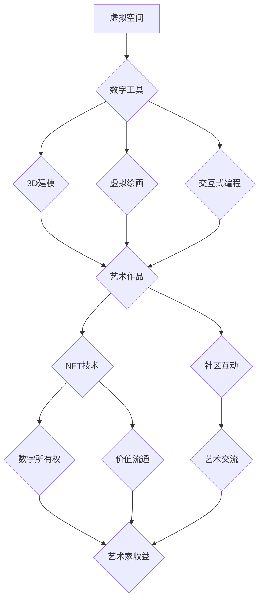

                 

## 元宇宙艺术:突破物理限制的创作平台

> 关键词：元宇宙、数字艺术、NFT、区块链、虚拟现实、增强现实、3D建模、交互式艺术

## 1. 背景介绍

艺术创作一直是人类文明的重要组成部分，从石器时代的壁画到现代的数字艺术，人类不断探索新的表达方式和媒介。随着科技的进步，元宇宙的概念应运而生，它为艺术创作提供了全新的可能性。元宇宙是一个由虚拟现实、增强现实和互联网连接而成的沉浸式数字世界，它打破了物理世界的限制，为艺术家提供了无限的创作空间和表达自由。

数字艺术在元宇宙中得到了蓬勃发展，艺术家们可以利用虚拟空间和数字工具创作出前所未有的艺术作品。NFT（不可替代代币）技术为数字艺术提供了新的价值和流通方式，使艺术家能够直接与收藏家进行交易，并获得作品的版权和收益。

## 2. 核心概念与联系

元宇宙艺术的核心概念包括：

* **虚拟空间:** 元宇宙提供了一个虚拟的3D空间，艺术家可以自由地构建和探索他们的艺术作品。
* **数字工具:** 元宇宙提供了各种数字工具，例如3D建模软件、虚拟绘画软件和交互式编程工具，帮助艺术家创作和展示他们的作品。
* **NFT技术:** NFT技术为数字艺术提供了独特的身份和所有权证明，使艺术家能够将他们的作品数字化并进行交易。
* **社区互动:** 元宇宙是一个社交平台，艺术家可以与其他艺术家和观众互动，分享他们的作品和想法。

**核心概念架构图:**



## 3. 核心算法原理 & 具体操作步骤

### 3.1  算法原理概述

元宇宙艺术的创作过程涉及到多种算法，例如3D建模算法、纹理映射算法、物理模拟算法和人工智能算法等。这些算法共同作用，使艺术家能够创造出逼真的虚拟世界和交互式的艺术作品。

* **3D建模算法:** 用于构建虚拟空间和艺术作品的几何形状。常见的3D建模算法包括多边形建模、NURBS建模和点云建模等。
* **纹理映射算法:** 用于将图像或纹理贴图到3D模型表面，使模型更加逼真。
* **物理模拟算法:** 用于模拟物理现象，例如重力、碰撞和流体运动，使艺术作品更加真实和动态。
* **人工智能算法:** 用于生成艺术作品、辅助创作和个性化体验。例如，可以使用生成对抗网络（GAN）生成新的艺术风格，或者使用机器学习算法分析用户的喜好，推荐个性化的艺术作品。

### 3.2  算法步骤详解

以3D建模为例，详细说明其算法步骤：

1. **建模准备:** 确定模型的类型、尺寸和细节程度。
2. **顶点定义:** 定义模型的顶点坐标，这些顶点将构成模型的骨架。
3. **面片连接:** 将顶点连接起来形成面片，构成模型的表面。
4. **纹理贴图:** 将图像或纹理贴图应用到模型表面，增加模型的细节和逼真度。
5. **材质设置:** 为模型设置材质属性，例如颜色、光泽度和反射率，使模型更加真实。
6. **灯光设置:** 设置模型的灯光环境，使模型更加立体和生动。
7. **渲染输出:** 使用渲染引擎将模型渲染成图像或视频。

### 3.3  算法优缺点

**优点:**

* 能够创建逼真的虚拟世界和艺术作品。
* 提供了无限的创作空间和表达自由。
* 可以与其他技术结合，例如虚拟现实和增强现实，创造更加沉浸式的体验。

**缺点:**

* 算法复杂，需要专业的技术知识和技能。
* 创作过程耗时耗力，需要大量的计算资源。
* 虚拟艺术作品的价值和版权问题尚待解决。

### 3.4  算法应用领域

元宇宙艺术的算法应用领域广泛，包括：

* **数字绘画和雕塑:** 创建虚拟的绘画和雕塑作品。
* **虚拟建筑和景观设计:** 设计虚拟的建筑和景观。
* **游戏和娱乐:** 创建游戏场景、角色和道具。
* **教育和培训:** 创建虚拟的教学环境和模拟场景。
* **医疗和科学研究:** 创建虚拟的人体模型和模拟实验环境。

## 4. 数学模型和公式 & 详细讲解 & 举例说明

### 4.1  数学模型构建

元宇宙艺术的创作过程可以抽象为数学模型，其中包括空间坐标、几何形状、材质属性、灯光参数等。

* **空间坐标:** 使用三维坐标系来描述虚拟空间中的位置和方向。
* **几何形状:** 使用数学公式来定义模型的形状，例如球体、圆柱体、多边形等。
* **材质属性:** 使用数学公式来描述材质的颜色、光泽度、反射率等属性。
* **灯光参数:** 使用数学公式来描述光源的位置、方向、强度等参数。

### 4.2  公式推导过程

以3D模型的纹理映射为例，推导其数学公式：

假设一个3D模型的顶点坐标为 **P**，纹理贴图的坐标为 **T**，纹理映射函数为 **f(P, T)**。

纹理映射公式可以表示为：

$$
\mathbf{T} = f(\mathbf{P})
$$

其中， **T** 是纹理坐标， **P** 是模型顶点坐标， **f** 是纹理映射函数。

纹理映射函数可以根据不同的纹理映射方式进行定义，例如：

* **平铺映射:** 将纹理贴图平铺到模型表面。
* **环绕映射:** 将纹理贴图环绕到模型表面。
* **透视映射:** 根据模型顶点到观察者的距离调整纹理贴图的大小。

### 4.3  案例分析与讲解

在游戏开发中，可以使用纹理映射技术为游戏角色和场景添加细节和逼真度。例如，可以使用纹理贴图来模拟角色的皮肤纹理、衣服图案和场景的草地、树木和建筑物等。

## 5. 项目实践：代码实例和详细解释说明

### 5.1  开发环境搭建

元宇宙艺术的开发环境通常包括：

* **操作系统:** Windows、macOS或Linux。
* **编程语言:** C++、Python、JavaScript等。
* **3D建模软件:** Blender、Maya、3ds Max等。
* **虚拟现实平台:** Oculus、HTC Vive等。

### 5.2  源代码详细实现

以下是一个使用Python和Pygame库实现简单的虚拟艺术作品的代码示例：

```python
import pygame

# 初始化 Pygame
pygame.init()

# 设置窗口大小
width = 800
height = 600
screen = pygame.display.set_mode((width, height))

# 设置标题
pygame.display.set_caption("虚拟艺术作品")

# 设置背景颜色
background_color = (0, 0, 0)

# 创建一个圆形
radius = 100
center_x = width // 2
center_y = height // 2

# 游戏循环
running = True
while running:
    # 处理事件
    for event in pygame.event.get():
        if event.type == pygame.QUIT:
            running = False

    # 清空屏幕
    screen.fill(background_color)

    # 绘制圆形
    pygame.draw.circle(screen, (255, 0, 0), (center_x, center_y), radius)

    # 更新显示
    pygame.display.flip()

# 退出 Pygame
pygame.quit()
```

### 5.3  代码解读与分析

这段代码创建一个简单的虚拟艺术作品，一个红色的圆形在黑色的背景上显示。

* `pygame.init()` 初始化 Pygame 库。
* `pygame.display.set_mode()` 创建一个窗口，并设置其大小。
* `pygame.display.set_caption()` 设置窗口标题。
* `screen.fill()` 清空屏幕，并设置背景颜色。
* `pygame.draw.circle()` 绘制一个圆形。
* `pygame.display.flip()` 更新显示。

### 5.4  运行结果展示

运行这段代码后，将显示一个黑色的窗口，其中有一个红色的圆形。

## 6. 实际应用场景

元宇宙艺术的应用场景非常广泛，例如：

* **数字艺术展览:** 艺术家可以在元宇宙中举办虚拟展览，展示他们的作品，并与观众互动。
* **沉浸式艺术体验:** 艺术家可以使用虚拟现实和增强现实技术，为观众创造更加沉浸式的艺术体验。
* **艺术教育:** 元宇宙可以为艺术教育提供新的平台，让学生们可以虚拟地体验不同的艺术形式和创作过程。
* **数字收藏:** NFT技术为数字艺术提供了新的价值和流通方式，艺术家可以将他们的作品数字化并进行交易，收藏家可以购买和收藏这些独特的数字艺术品。

### 6.4  未来应用展望

元宇宙艺术的未来发展充满无限可能，例如：

* **更逼真的虚拟世界:** 随着技术的进步，元宇宙将更加逼真，艺术家可以创作出更加复杂的和沉浸式的艺术作品。
* **更丰富的交互方式:** 艺术家可以使用更丰富的交互方式，例如手势识别、语音控制和表情识别，与观众进行更深层次的互动。
* **更广泛的应用场景:** 元宇宙艺术将应用于更多领域，例如教育、医疗、商业和娱乐。

## 7. 工具和资源推荐

### 7.1  学习资源推荐

* **书籍:**
    * 《元宇宙：下一代互联网》
    * 《数字艺术：从概念到实践》
* **在线课程:**
    * Coursera: 数字艺术和设计
    * Udemy: 元宇宙开发
* **社区论坛:**
    * Reddit: r/metaverse
    * Discord: 元宇宙社区

### 7.2  开发工具推荐

* **3D建模软件:** Blender, Maya, 3ds Max
* **虚拟现实平台:** Oculus, HTC Vive
* **编程语言:** Python, C++, JavaScript
* **游戏引擎:** Unity, Unreal Engine

### 7.3  相关论文推荐

* **元宇宙的定义和特征**
* **元宇宙艺术的创作方法和技术**
* **元宇宙艺术的商业模式和价值评估**

## 8. 总结：未来发展趋势与挑战

### 8.1  研究成果总结

元宇宙艺术是一个新兴的领域，它为艺术创作提供了全新的可能性和挑战。通过结合虚拟现实、增强现实、数字工具和区块链技术，元宇宙艺术正在打破物理世界的限制，创造出更加沉浸式、互动性和个性化的艺术体验。

### 8.2  未来发展趋势

元宇宙艺术的未来发展趋势包括：

* **更逼真的虚拟世界:** 随着技术的进步，元宇宙将更加逼真，艺术家可以创作出更加复杂的和沉浸式的艺术作品。
* **更丰富的交互方式:** 艺术家可以使用更丰富的交互方式，例如手势识别、语音控制和表情识别，与观众进行更深层次的互动。
* **更广泛的应用场景:** 元宇宙艺术将应用于更多领域，例如教育、医疗、商业和娱乐。

### 8.3  面临的挑战

元宇宙艺术也面临着一些挑战，例如：

* **技术壁垒:** 元宇宙艺术的创作需要掌握多种技术，例如3D建模、虚拟现实和区块链技术。
* **版权问题:** 数字艺术作品的版权问题尚待解决。
* **伦理问题:** 元宇宙艺术的创作和应用可能引发一些伦理问题，例如虚拟身份的真实性、虚拟世界中的道德规范等。

### 8.4  研究展望

未来，我们需要继续研究元宇宙艺术的创作方法、技术和应用场景，并探索其带来的社会影响和伦理问题。同时，也需要推动元宇宙艺术的普及和发展，让更多人能够体验到元宇宙艺术带来的乐趣和价值。

## 9. 附录：常见问题与解答

**Q1: 元宇宙艺术和传统艺术有什么区别？**

**A1:** 元宇宙艺术和传统艺术的主要区别在于媒介和体验。传统艺术通常使用物理材料和工具创作，而元宇宙艺术则使用数字工具和虚拟空间创作。元宇宙艺术可以提供更加沉浸式、互动性和个性化的体验。

**Q2: 如何参与元宇宙艺术创作？**

**A2:** 想要参与元宇宙艺术创作，可以学习相关的技术，例如3D建模、虚拟现实和编程。也可以加入元宇宙艺术社区，与其他艺术家交流学习。

**Q3: 元宇宙艺术的价值如何评估？**

**A3:** 元宇宙艺术的价值评估是一个复杂的问题，需要考虑艺术作品的创作难度、独特性、市场需求和收藏价值等因素。


作者：禅与计算机程序设计艺术 / Zen and the Art of Computer Programming 
<end_of_turn>

