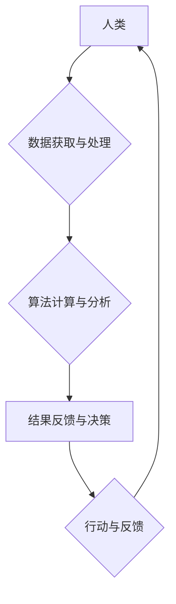

                 

## 创造更美好的明天：人类计算的积极作用

> 关键词：人工智能、人类计算、协同智能、计算模型、未来趋势、伦理挑战

### 1. 背景介绍

人类文明的发展离不开对计算的不断探索和应用。从简单的算盘到复杂的超级计算机，计算一直是推动社会进步的强大引擎。而随着人工智能技术的飞速发展，人类计算的概念逐渐成为一个重要的研究方向。

人类计算是指将人类的智慧和认知能力与计算机技术相结合，共同完成复杂的任务。它不仅仅是简单的将数据输入计算机进行处理，而是更注重人类的参与和决策，充分发挥人类的创造力和解决问题的能力。

近年来，人类计算在各个领域都展现出了巨大的潜力。例如，在医疗领域，人类计算可以帮助医生更快、更准确地诊断疾病；在教育领域，人类计算可以个性化定制学习方案，提高学生的学习效率；在科学研究领域，人类计算可以加速科学发现，推动科技进步。

### 2. 核心概念与联系

**2.1 人类计算的本质**

人类计算的核心在于将人类的智慧和计算机的计算能力相结合，形成一种协同智能的模式。它强调人类的参与和决策，而不是简单的将任务交给计算机自动完成。

**2.2 人类计算的优势**

* **创造力和灵活性:** 人类拥有独特的创造力和灵活性，能够在面对复杂、不确定的问题时灵活应对，并提出创新的解决方案。
* **复杂问题解决能力:** 人类能够理解和处理复杂的社会、文化和伦理问题，而计算机在这些方面往往缺乏能力。
* **情感智能:** 人类拥有情感智能，能够理解和回应他人的情感，这在许多应用场景中至关重要。

**2.3 人类计算的挑战**

* **数据获取和处理:** 人类计算需要大量的数据作为输入，而获取和处理这些数据是一个巨大的挑战。
* **算法设计和优化:** 需要设计和优化专门的人类计算算法，以充分发挥人类的智慧和计算机的计算能力。
* **伦理和社会影响:** 人类计算的应用可能会带来一些伦理和社会问题，需要认真思考和解决。

**2.4 人类计算的架构**



### 3. 核心算法原理 & 具体操作步骤

**3.1 算法原理概述**

人类计算的核心算法通常基于以下几个原则：

* **启发式搜索:** 利用人类的经验和知识，设计启发式算法，引导计算机搜索最优解。
* **群体智能:** 借鉴自然界群体智能的机制，例如蚁群算法、粒子群算法等，模拟人类群体协作解决问题。
* **机器学习:** 利用机器学习算法，从大量数据中学习人类的决策模式，并将其应用于新的问题解决。

**3.2 算法步骤详解**

1. **数据收集和预处理:** 收集与任务相关的各种数据，并进行清洗、转换和预处理，使其适合算法处理。
2. **特征提取:** 从数据中提取关键特征，这些特征能够反映问题的本质和人类的决策因素。
3. **模型构建:** 根据任务需求和算法原理，构建相应的计算模型，例如决策树、神经网络等。
4. **模型训练:** 利用训练数据，训练模型，使其能够准确地预测或决策。
5. **模型评估:** 使用测试数据评估模型的性能，并进行调整和优化。
6. **应用部署:** 将训练好的模型部署到实际应用场景中，并与人类进行交互，共同完成任务。

**3.3 算法优缺点**

* **优点:** 能够解决复杂、不确定的问题，具有创造力和灵活性，能够结合人类的经验和知识。
* **缺点:** 算法设计和优化难度大，需要大量的数据和计算资源，存在伦理和社会风险。

**3.4 算法应用领域**

* **医疗诊断:** 利用人类计算辅助医生诊断疾病，提高诊断准确率。
* **金融风险管理:** 利用人类计算识别金融风险，降低投资损失。
* **科学研究:** 利用人类计算加速科学发现，推动科技进步。
* **教育个性化:** 利用人类计算个性化定制学习方案，提高学生的学习效率。

### 4. 数学模型和公式 & 详细讲解 & 举例说明

**4.1 数学模型构建**

人类计算的数学模型通常基于概率论、统计学和信息论等学科。例如，在机器学习领域，常用的模型包括线性回归、逻辑回归、支持向量机等。这些模型通过数学公式来描述数据之间的关系，并预测或决策。

**4.2 公式推导过程**

例如，线性回归模型的公式如下：

$$y = \beta_0 + \beta_1x_1 + \beta_2x_2 + ... + \beta_nx_n + \epsilon$$

其中：

* $y$ 是预测变量
* $x_1, x_2, ..., x_n$ 是自变量
* $\beta_0, \beta_1, ..., \beta_n$ 是模型参数
* $\epsilon$ 是误差项

通过最小化误差函数，可以求解出模型参数，从而建立线性回归模型。

**4.3 案例分析与讲解**

例如，假设我们想要预测房价，可以使用线性回归模型。我们可以收集房子的面积、位置、房间数等数据，作为自变量，并将房价作为预测变量。通过训练线性回归模型，我们可以得到一个公式，用来预测不同房子的价格。

### 5. 项目实践：代码实例和详细解释说明

**5.1 开发环境搭建**

为了实现人类计算项目，需要搭建相应的开发环境。常用的开发工具包括Python、Java、C++等编程语言，以及机器学习框架如TensorFlow、PyTorch等。

**5.2 源代码详细实现**

以下是一个简单的Python代码示例，演示了如何使用机器学习算法进行人类计算：

```python
import pandas as pd
from sklearn.linear_model import LinearRegression

# 加载数据
data = pd.read_csv("house_data.csv")

# 划分训练集和测试集
X = data[['area', 'location', 'rooms']]
y = data['price']
from sklearn.model_selection import train_test_split
X_train, X_test, y_train, y_test = train_test_split(X, y, test_size=0.2)

# 创建线性回归模型
model = LinearRegression()

# 训练模型
model.fit(X_train, y_train)

# 预测房价
y_pred = model.predict(X_test)

# 评估模型性能
from sklearn.metrics import mean_squared_error
mse = mean_squared_error(y_test, y_pred)
print(f"Mean Squared Error: {mse}")
```

**5.3 代码解读与分析**

这段代码首先加载房价数据，然后将数据划分成训练集和测试集。接着，创建了一个线性回归模型，并使用训练集训练模型。最后，使用测试集预测房价，并评估模型的性能。

**5.4 运行结果展示**

运行这段代码后，会输出模型的平均平方误差（MSE）值，该值可以用来评估模型的预测精度。

### 6. 实际应用场景

**6.1 医疗诊断辅助**

人类计算可以帮助医生更快、更准确地诊断疾病。例如，可以利用机器学习算法分析患者的病历、影像数据和基因信息，辅助医生判断疾病类型和治疗方案。

**6.2 金融风险管理**

人类计算可以帮助金融机构识别和管理风险。例如，可以利用机器学习算法分析市场数据、客户行为和交易记录，预测潜在的金融风险，并采取相应的措施进行风险控制。

**6.3 科学研究加速**

人类计算可以加速科学研究，帮助科学家更快地发现新的知识。例如，可以利用机器学习算法分析海量科研数据，发现隐藏的模式和规律，从而推动科学发现。

**6.4 教育个性化**

人类计算可以提供个性化的教育方案，提高学生的学习效率。例如，可以利用机器学习算法分析学生的学习进度和知识掌握情况，定制个性化的学习计划和教学内容。

**6.5 未来应用展望**

随着人工智能技术的不断发展，人类计算将在更多领域得到应用，例如：

* **自动驾驶:** 人类计算可以帮助自动驾驶系统更好地理解道路环境和交通规则，提高驾驶安全性和效率。
* **机器人协作:** 人类计算可以使机器人能够更好地与人类协作，完成复杂的任务。
* **虚拟现实和增强现实:** 人类计算可以增强虚拟现实和增强现实体验，使虚拟世界更加逼真和交互性强。

### 7. 工具和资源推荐

**7.1 学习资源推荐**

* **书籍:**
    * 《深度学习》
    * 《人工智能：一种现代方法》
    * 《机器学习实战》
* **在线课程:**
    * Coursera 人工智能课程
    * edX 机器学习课程
    * Udacity 深度学习课程

**7.2 开发工具推荐**

* **编程语言:** Python, Java, C++
* **机器学习框架:** TensorFlow, PyTorch, scikit-learn
* **数据处理工具:** Pandas, NumPy

**7.3 相关论文推荐**

* 《Attention Is All You Need》
* 《BERT: Pre-training of Deep Bidirectional Transformers for Language Understanding》
* 《Generative Adversarial Networks》

### 8. 总结：未来发展趋势与挑战

**8.1 研究成果总结**

近年来，人类计算取得了显著的进展，在医疗诊断、金融风险管理、科学研究等领域展现出了巨大的潜力。

**8.2 未来发展趋势**

未来，人类计算将朝着以下几个方向发展：

* **更智能的算法:** 开发更智能、更强大的算法，能够更好地理解和解决复杂问题。
* **更广泛的应用:** 将人类计算应用到更多领域，例如自动驾驶、机器人协作、虚拟现实等。
* **更安全的系统:** 确保人类计算系统的安全性和可靠性，防止算法偏差和数据泄露。

**8.3 面临的挑战**

人类计算也面临着一些挑战：

* **数据获取和隐私保护:** 人类计算需要大量的数据作为输入，如何获取高质量的数据，并保护用户隐私是一个重要问题。
* **算法解释性和可信度:** 人类难以理解复杂的机器学习算法，如何提高算法的解释性和可信度是一个关键挑战。
* **伦理和社会影响:** 人类计算的应用可能会带来一些伦理和社会问题，例如算法偏见、就业替代等，需要认真思考和解决。

**8.4 研究展望**

未来，我们需要继续加强对人类计算的研究，探索更智能、更安全、更可持续的人类计算模式，为创造更美好的明天贡献力量。

### 9. 附录：常见问题与解答

**9.1 如何获取高质量的数据？**

高质量的数据是人类计算的基础，可以从以下几个方面获取：

* **公开数据集:** 许多机构和研究者会发布公开数据集，例如ImageNet、MNIST等。
* **数据标注:** 可以雇佣人工标注数据，提高数据的准确性和可靠性。
* **数据合成:** 可以利用机器学习算法合成新的数据，丰富数据种类和数量。

**9.2 如何解决算法偏见问题？**

算法偏见是人类计算面临的一个重要挑战，可以通过以下方法来解决：

* **数据多样化:** 使用更加多样化的训练数据，减少算法对特定群体的偏好。
* **算法公平性评估:** 开发算法公平性评估指标，及时发现和解决算法偏见问题。
* **算法透明化:** 提高算法的透明度，让用户能够理解算法的决策过程，并提出反馈。


作者：禅与计算机程序设计艺术 / Zen and the Art of Computer Programming 
<end_of_turn>

