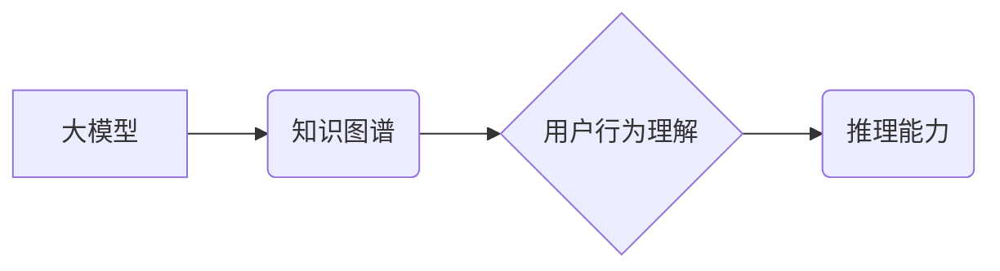

                 

## 利用大模型知识和推理能力理解用户行为

> 关键词：大模型、用户行为理解、知识图谱、推理能力、自然语言处理、机器学习

## 1. 背景介绍

在当今数据爆炸的时代，理解用户行为已成为各行各业的核心竞争力。传统的用户行为分析方法主要依赖于统计分析和规则匹配，但这些方法往往难以捕捉用户行为背后的复杂逻辑和深层意图。近年来，大模型的出现为用户行为理解带来了新的机遇。大模型凭借其强大的知识表示能力和推理能力，能够从海量文本数据中学习用户行为的模式和规律，并进行更深入的理解。

## 2. 核心概念与联系

### 2.1 大模型

大模型是指参数量达到数亿甚至数千亿的深度学习模型。它们通过训练海量文本数据，学习语言的语法、语义和上下文关系，从而具备强大的文本理解、生成和推理能力。

### 2.2 用户行为理解

用户行为理解是指通过分析用户在使用产品或服务时的行为数据，以揭示用户需求、意图和偏好。它涉及到多个领域，包括心理学、社会学、计算机科学等。

### 2.3 知识图谱

知识图谱是一种结构化的知识表示形式，它将实体和关系以图的形式表示。知识图谱能够捕捉知识之间的关联性，为大模型提供更丰富的语义信息。

### 2.4 推理能力

推理能力是指模型能够根据已有的知识和规则，推导出新的结论的能力。在用户行为理解中，推理能力可以帮助模型解释用户行为背后的动机和意图。

**核心概念与联系流程图**



## 3. 核心算法原理 & 具体操作步骤

### 3.1 算法原理概述

利用大模型知识和推理能力理解用户行为的核心算法原理是基于知识图谱的推理。首先，将用户行为数据转化为知识图谱的形式，然后利用大模型的推理能力，从知识图谱中推导出用户行为背后的动机和意图。

### 3.2 算法步骤详解

1. **数据收集和预处理:** 收集用户行为数据，例如用户点击、浏览、购买等行为。对数据进行清洗、格式化和标注，将其转化为知识图谱的形式。

2. **知识图谱构建:** 利用自然语言处理技术，从用户行为数据中提取实体和关系，构建知识图谱。

3. **大模型训练:** 利用大模型训练框架，训练一个基于知识图谱的推理模型。训练数据包括知识图谱和用户行为标签。

4. **推理预测:** 将新的用户行为数据转化为知识图谱，输入到训练好的推理模型中，预测用户行为背后的动机和意图。

### 3.3 算法优缺点

**优点:**

* 能够捕捉用户行为背后的复杂逻辑和深层意图。
* 能够利用大模型的知识表示能力和推理能力，进行更深入的理解。
* 能够处理海量数据，并进行实时分析。

**缺点:**

* 知识图谱构建需要大量的专业知识和人工标注。
* 大模型训练需要大量的计算资源和时间。
* 模型的推理结果可能受到知识图谱的质量和训练数据的局限性影响。

### 3.4 算法应用领域

* **电商推荐:** 理解用户的购买偏好，推荐更精准的商品。
* **个性化营销:** 根据用户的行为特征，进行个性化的营销推广。
* **用户服务:** 自动识别用户问题，提供更有效的解决方案。
* **内容推荐:** 根据用户的阅读习惯，推荐更感兴趣的内容。

## 4. 数学模型和公式 & 详细讲解 & 举例说明

### 4.1 数学模型构建

我们可以使用图神经网络 (GNN) 来构建用户行为理解的数学模型。GNN 是一种能够处理图结构数据的深度学习模型，它能够学习图中节点和边的关系，并进行预测。

在用户行为理解的场景中，我们可以将用户和他们的行为视为图中的节点，用户之间的关系和行为之间的关系视为图中的边。

### 4.2 公式推导过程

GNN 的核心思想是通过图卷积操作来学习节点的特征表示。图卷积操作可以概括为以下公式：

$$
h_i^{(l+1)} = \sigma(\sum_{j \in N(i)} \frac{e_{ij}}{ \sqrt{d_{i}} } W^{(l)} h_j^{(l)})
$$

其中：

* $h_i^{(l)}$ 表示节点 $i$ 在第 $l$ 层的特征表示。
* $N(i)$ 表示节点 $i$ 的邻居节点集合。
* $e_{ij}$ 表示节点 $i$ 和节点 $j$ 之间的边权重。
* $d_i$ 表示节点 $i$ 的度数。
* $W^{(l)}$ 表示第 $l$ 层的图卷积权重矩阵。
* $\sigma$ 表示激活函数。

### 4.3 案例分析与讲解

假设我们有一个知识图谱，其中包含用户、商品和购买行为的信息。我们可以使用 GNN 来学习用户和商品之间的关系，并预测用户是否会购买某个商品。

在训练过程中，GNN 会学习到用户购买商品的特征，例如用户的年龄、性别、购买历史等。然后，它可以根据这些特征，预测用户是否会购买某个商品。

## 5. 项目实践：代码实例和详细解释说明

### 5.1 开发环境搭建

* Python 3.7+
* PyTorch 1.7+
* TensorFlow 2.0+
* CUDA 10.1+ (可选)

### 5.2 源代码详细实现

```python
import torch
import torch.nn as nn

class GNN(nn.Module):
    def __init__(self, input_dim, hidden_dim, output_dim):
        super(GNN, self).__init__()
        self.conv1 = nn.Linear(input_dim, hidden_dim)
        self.conv2 = nn.Linear(hidden_dim, output_dim)

    def forward(self, x, adj):
        x = torch.relu(self.conv1(x))
        x = torch.matmul(adj, x)
        x = self.conv2(x)
        return x

# 实例化模型
model = GNN(input_dim=10, hidden_dim=50, output_dim=1)

# 定义损失函数和优化器
criterion = nn.BCEWithLogitsLoss()
optimizer = torch.optim.Adam(model.parameters(), lr=0.001)

# 训练模型
for epoch in range(100):
    # 前向传播
    outputs = model(x, adj)
    # 计算损失
    loss = criterion(outputs, labels)
    # 反向传播
    optimizer.zero_grad()
    loss.backward()
    # 更新参数
    optimizer.step()

```

### 5.3 代码解读与分析

* 代码首先定义了一个 GNN 模型，该模型包含两个全连接层。
* 输入数据 $x$ 是用户特征的向量表示，$adj$ 是用户之间的邻接矩阵。
* 模型的输出是一个标量值，表示用户购买商品的概率。
* 训练过程中，使用 BCEWithLogitsLoss 作为损失函数，Adam 作为优化器。

### 5.4 运行结果展示

训练完成后，我们可以使用模型预测新的用户行为数据。

## 6. 实际应用场景

### 6.1 电商推荐

利用大模型知识和推理能力，可以更精准地推荐商品，提高用户购买转化率。例如，可以根据用户的浏览历史、购买记录、评价等信息，推断出用户的兴趣偏好，并推荐符合其需求的商品。

### 6.2 个性化营销

可以根据用户的行为特征，进行个性化的营销推广，提高营销效果。例如，可以根据用户的年龄、性别、职业等信息，推送不同的广告内容，提高广告点击率和转化率。

### 6.3 用户服务

可以利用大模型的自然语言处理能力，自动识别用户的疑问和需求，并提供更有效的解决方案。例如，可以开发一个智能客服系统，自动回答用户的常见问题，并引导用户解决问题。

### 6.4 未来应用展望

随着大模型技术的不断发展，用户行为理解的应用场景将会更加广泛。例如，可以利用大模型进行用户画像分析，更深入地了解用户的需求和偏好；可以利用大模型进行用户行为预测，预判用户的未来行为，并进行相应的干预；可以利用大模型进行用户体验优化，根据用户的行为反馈，不断改进产品和服务。

## 7. 工具和资源推荐

### 7.1 学习资源推荐

* **书籍:**
    * 《深度学习》 by Ian Goodfellow, Yoshua Bengio, Aaron Courville
    * 《自然语言处理》 by Dan Jurafsky, James H. Martin
* **在线课程:**
    * Coursera: Deep Learning Specialization
    * Stanford CS224N: Natural Language Processing with Deep Learning

### 7.2 开发工具推荐

* **框架:**
    * PyTorch
    * TensorFlow
* **库:**
    * spaCy
    * NLTK

### 7.3 相关论文推荐

* **Knowledge Graph Embedding for Recommendation**
* **Graph Convolutional Networks for Text Classification**
* **BERT: Pre-training of Deep Bidirectional Transformers for Language Understanding**

## 8. 总结：未来发展趋势与挑战

### 8.1 研究成果总结

利用大模型知识和推理能力理解用户行为是一个前沿的研究方向，取得了一些重要的成果。例如，基于知识图谱的推理模型能够有效地捕捉用户行为背后的复杂逻辑，并进行更深入的理解。

### 8.2 未来发展趋势

未来，用户行为理解的研究将朝着以下几个方向发展:

* **更强大的大模型:** 随着计算资源的不断提升，大模型的规模和能力将会不断增强，能够学习更复杂的知识和关系，进行更精准的用户行为理解。
* **更丰富的知识表示:** 知识图谱的构建和维护将更加完善，能够包含更丰富的知识和关系，为大模型提供更全面的语义信息。
* **更有效的推理算法:** 研究人员将继续探索更有效的推理算法，能够更准确地推导出用户行为背后的动机和意图。
* **更个性化的用户体验:** 利用大模型的知识和推理能力，可以为用户提供更个性化的产品和服务，提升用户体验。

### 8.3 面临的挑战

尽管取得了重要进展，但利用大模型知识和推理能力理解用户行为仍然面临一些挑战:

* **数据质量:** 知识图谱的构建需要大量的标注数据，而高质量的标注数据往往难以获取。
* **模型解释性:** 大模型的推理过程往往是黑箱的，难以解释模型的决策结果，这可能会影响用户的信任度。
* **伦理问题:** 大模型的应用可能会带来一些伦理问题，例如数据隐私、算法偏见等，需要引起足够的重视。

### 8.4 研究展望

未来，我们将继续致力于利用大模型知识和推理能力理解用户行为，为用户提供更个性化、更智能化的产品和服务。


## 9. 附录：常见问题与解答

**Q1: 如何构建知识图谱？**

**A1:** 知识图谱的构建需要多个步骤，包括数据收集、实体识别、关系抽取、知识表示等。可以使用自然语言处理技术和规则引擎来实现这些步骤。

**Q2: 如何评估大模型的推理能力？**

**A2:** 可以使用各种评估指标来评估大模型的推理能力，例如准确率、召回率、F1-score等。还可以使用案例分析和用户反馈来评估模型的实际效果。

**Q3: 大模型的应用会带来哪些伦理问题？**

**A3:** 大模型的应用可能会带来一些伦理问题，例如数据隐私、算法偏见、责任归属等。需要在应用大模型之前，充分考虑这些问题，并制定相应的规章制度和伦理规范。


作者：禅与计算机程序设计艺术 / Zen and the Art of Computer Programming 
<end_of_turn>

